# Architecture & reproducibility

How the CLIFATRON 2.0 federated model-to-data pipeline fits together, its trust boundaries, and how to
reproduce the synthetic result. Everything described here is exercised **data-free** by the test suites
and by `python -m src.eval.reproduce_synthetic`.

## The one-sentence shape

One small ICU foundation model is **frozen and signed by a releaser**, shipped to many hospitals where
each **site** runs it on its own local CLIF tables and returns only signed, disclosure-controlled
aggregate metrics, which a **coordinating-center aggregator** verifies and pools — so raw data, labels,
and gradients never leave a node.

## Components and trust boundaries

```mermaid
flowchart LR
    subgraph Releaser["Releaser (coordinating center)"]
      R1["frozen model + eval bundle"]
      R2["sign manifest — Ed25519 private key"]
      R1 --> R2
    end
    subgraph Site["Site (hospital, local CLIF 2.1 tables)"]
      S1["load_bundle — verify Ed25519 signature\nagainst out-of-band trust root\n(+ revocation, anti-rollback)"]
      S2["zero-shot inference on LOCAL data"]
      S3["build disclosure-controlled report\n(small-cell suppression + cross-release\ndifferencing vs local ledger)"]
      S4["draft → approve (content-hash bound)\nsign report — HMAC"]
      S1 --> S2 --> S3 --> S4
    end
    subgraph Agg["Aggregator (coordinating center)"]
      A1["verify report HMAC + schema\n(reused single trust path)"]
      A2["independent releasable-status gate"]
      A3["cumulative cross-release differencing\nvs the aggregator's OWN ledger"]
      A4["multi-site aggregate panel"]
      A1 --> A2 --> A3 --> A4
    end
    R2 -->|"signed bundle (untrusted channel)"| S1
    R2 -.->|"trust root (out-of-band, authenticated)"| S1
    S4 -->|"signed aggregate report — no PHI"| A1
```



**Two signing directions, deliberately asymmetric:**

- **Releaser → site is asymmetric (Ed25519).** The releaser signs the bundle manifest with a private
  key; every site verifies with the releaser's public key, distributed **out of band** via
  `configs/trust_roles.yaml`. A symmetric secret cannot model a trust root (both sides would hold it),
  so this direction is asymmetric. Implemented in `src/eval/trust.py`; verified inside
  `src/eval/bundle.py::load_bundle`.
- **Site → aggregator is symmetric (HMAC).** The site signs its report with a shared secret the
  aggregator holds per site; the access-log chain is HMAC too. Implemented in
  `src/eval/attestation.py`.

## Fail-closed controls (every gate refuses rather than degrades)

| Control | Where | What it stops |
|---|---|---|
| Ed25519 bundle signature | `trust.py`, `bundle.py::load_bundle` | A re-hashed replacement bundle signed by no trusted key |
| Signed revocation list | `trust.py`, `configs/trust_roles.yaml` | A compromised releaser key or withdrawn bundle |
| Anti-rollback (persisted version floor, atomic) | `trust.py` | A forced downgrade to a superseded bundle |
| Approval-by-content-hash | `clif_validate.py` | An `--approved` release carrying a payload other than the reviewed draft |
| Small-cell suppression | `schema.py`, `clif_validate.py` | Re-identification via tiny cells |
| Cross-release differencing (cumulative ledger) | `attestation.py` | A cell suppressed in one release exposed by differencing a later one |
| Report authentication (HMAC) | `attestation.py`, `aggregator.py` | An unattributed or altered site report entering the aggregate |
| Independent releasable-status gate | `aggregator.py` | A validly-signed but un-reviewed (draft) report entering the aggregate |

The site enforces disclosure and its own differencing; the **aggregator re-enforces everything
independently** against its own cumulative ledger, so it never has to trust that a site kept its local
ledger honestly.

## Code map

| Path | Role |
|---|---|
| `src/eval/synthetic_bundle.py` | Releaser: builds + signs a synthetic bundle (test fixtures) |
| `src/eval/trust.py` | Ed25519 sign/verify, revocation, anti-rollback |
| `src/eval/bundle.py` | Bundle load + signature verification (site) |
| `src/eval/clif_validate.py` | Site CLI: validate → infer → draft → approve → signed report |
| `src/eval/attestation.py` | HMAC report signing, cumulative disclosure ledger, differencing |
| `src/eval/aggregator.py` | Coordinating-center aggregator (verify + pool + independent gates) |
| `src/eval/reproduce_synthetic.py` | One-command synthetic reproduction of the whole loop |
| `clif-validate/` | The distributable, offline site package (vendored closure of the above) |

## Reproduce the synthetic result

```bash
uv sync --group dev
python -m src.eval.reproduce_synthetic
```

This builds synthetic fixtures + a signed bundle, runs two synthetic sites through the **real** governed
site CLI (draft → approve), aggregates their signed reports, and prints the disclosure-controlled
two-site panel. It composes the landed pieces unchanged — no new trusted code path — and never touches
real data or real paths.

## Run the tests

```bash
uv run --frozen --group dev pytest tests/ -q
uv run --frozen --group dev pytest clif-validate/tests/ -q
```

Both suites are data-free and run in CI (`.github/workflows/ci.yml`) on every push and pull request
across Python 3.11 and 3.13, installed from the committed `uv.lock` with `--frozen`.

## Scope

What is proven here is the **infrastructure**, exercised on synthetic data. Real-data training, GPU
qualification, and real-site federation are pending hardware, data, and governance — see the
"Proven vs pending" section of [`MODEL_CARD.md`](../MODEL_CARD.md).
