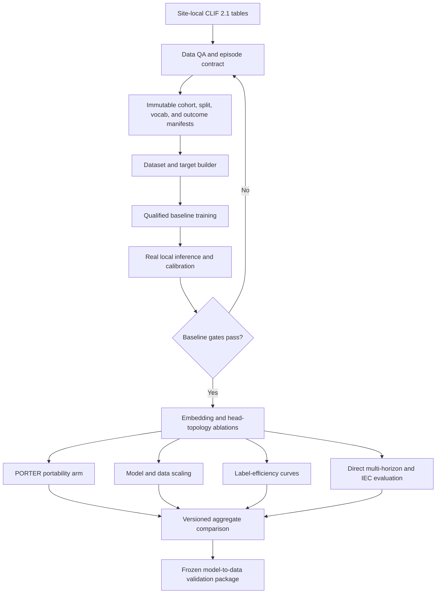
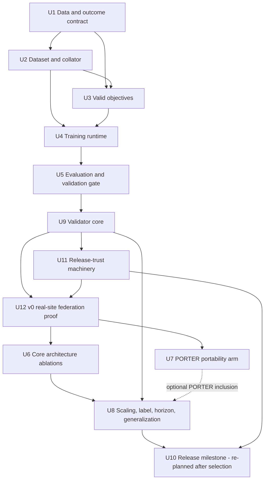

# feat: Establish evidence-ready CLIFATRON model experiments

## Summary

Establish a leakage-safe, resumable training and evaluation baseline, then use one shared experiment harness to test focused hypotheses from ICareFM, SurvivEHR, PORTER, and MOTOR. Clin-JEPA informs the decision to defer latent rollout co-training until direct multi-horizon evidence justifies it. Preserve CLIFATRON 2.0's model-to-data privacy contract.

---

## Execution Status

Updated 2026-08-29 against `main` at `53e3c2c` (merge of PR #4). Working tree clean. U1-U5 and
the value-statistics follow-up have landed. Progress is derived from git, not stored here — this
section is orientation, not state.

**Standing non-code action, still the longest lead item:** the governance question gating U12 —
*may a pre-selection v0 bundle run at an external site?* — remains unasked. A "no" reshapes the
sequencing (U12 gates U6/U7). Ask before U9 completes, not after.

| Unit | Status | Evidence |
|---|---|---|
| U1. Cohort, anchor, splits, artifact policy | Landed | `configs/cohort.yaml`, `configs/artifact_policy.yaml`, `src/data/cohort.py`, `src/data/splits.py`, `src/eval/clif_auto_labeler.py` |
| U2. Dataset, targets, collator, document isolation | Landed | `src/data/dataset.py`, `src/data/collate.py`, `src/data/targets.py`, packed-dataset changes under `external/clifatron/AR/qwen2/` |
| U3. Objective semantics | Landed | `src/model/heads.py`, `tests/test_cr_invariants.py` |
| U4. Training engine, checkpoints, manifest | Landed | `src/train/engine.py`, `src/train/checkpoint.py`, `src/train/manifest.py`, `src/train/pretrain.py` |
| Value-statistics follow-up | Landed | `src/data/value_stats.py`, `tests/test_value_stats.py` |
| **U14. Resume-equivalence + DDP coverage** (was "U4 follow-up") | **Implemented — CPU-qualified; blocks U6** | PR #7: `tests/test_checkpoint.py`, the resume-*equivalence* tests (including the production `train(..., resume_ckpt=)` path), and the two-process gloo DDP sample-coverage test all landed and green data-free — the software half of P5-P7. The 2xL40 hardware report stays a pending real-hardware run. |
| **U13. Varlen/document-isolated attention** (was "U2 follow-up") | **Implemented — CPU-qualified; GPU/U8 pending; blocks U8** | Model-consumption path, per-document CPU fallback, anchor gather, and tests landed (PR #6). CPU isolation + equivalence proven data-free. The FA2 GPU path is architecture-gated (Qwen2/Qwen3) and stays unqualified until U8's L40 run; the multi-doc training reject is intentionally NOT lifted (see approach). |
| U5. Evaluation, calibration, validation gate | Landed | PR #4 / `53e3c2c`; suite 266 passed, 3 skipped. Grew well beyond plan: `src/eval/schema.py`, `attestation.py`, `log_sanitizer.py` |
| U9. Validator core | **Next** | `clif-validate/` does not exist; deepened 2026-08-29 with U5's execution-taught packaging facts |
| U11. Release-trust machinery | Blocked on U9 | Split out of the original U9 on 2026-08-28 |
| U12. v0 real-site federation proof | Blocked on U9, U11 | Added 2026-08-28; also blocked on external-site onboarding |
| U6, U7, U8 | Blocked on U9, U12 | See per-unit entry gates; U7 additionally conditional on U12's coverage findings |
| U10. Release milestone | Gated milestone | Moved out of Implementation Units 2026-08-28; re-planned after selection |

Verification at U5 merge: `uv run --with pytest pytest tests/ -q` passes with `266 passed,
3 skipped` on `main` at `53e3c2c` (122 at the branch point).

Two caveats carried forward from the handoff, both still open:

- Real site data still needs `ce-data-qa` before any outcome prevalence, unit mapping, storetime
  field, or follow-up assumption can be relied on.
- Block-diagonal/varlen attention for Qwen2/Qwen3 training is not implemented. Multi-document
  packed rows are deliberately rejected in dense training paths until it is. **Chartered as U13**
  (deepened 2026-08-29); the data side already emits the varlen view, so U13 is the model path.
- **"Landed" means code merged, not verification complete.** U4 is the case that separates them:
  its own Verification calls for a 2 x L40 qualification report, one-batch overfit, resume
  equivalence, and DDP coverage, and none of those have run. `tests/test_checkpoint.py` does not
  exist, and `tests/test_train_engine.py`'s only resume test asserts that ledger counters advanced
  rather than equivalence to an uninterrupted run. Those obligations reappear below as blocking
  preconditions P5-P7 with no unit chartered to satisfy them, which is why the follow-up rows above
  are called out as unowned.

What U5's execution taught, absorbed into U9/U11 below (full history: git `d9d2d92..4a57a59`,
eight external review rounds — Greptile PR, greploop CLI, CodeRabbit — plus a whole-file
coherence pass):

- Three principles now govern `src/eval/attestation.py` and are stated at its top: **write-ahead
  everything; confirmation follows visibility; verification precedes extension.** U9 packages
  these behaviors; it does not reinvent them.
- Deliberate limitations recorded in code, each assigned an owner: real inference is unwired
  (`predict_fn` raises; the bundle-pinned vocabulary is **U9's**); approval-by-content-hash of a
  reviewed draft is **U11's**; access-log chain-key custody/rotation is **U11's**; advisory
  `flock` does not cover cross-host ledgers on network filesystems (recorded limitation); sticky
  suppression deliberately over-blocks never-published suppressed intents (escape = the
  disclosure-review exception, not a code path).
- New operational surface every downstream doc and the U9 wheel CLI must mirror: `--release-id`
  (required, replay-rejected), `--signing-key-file`, `--access-log-key-file`
  (`CLIF_ACCESS_LOG_KEY_FILE`, fail-closed, no fallback), the `--approved` draft/release
  two-step, `published_release_ids` crash reconciliation, and policy-aligned default paths
  under `output/final_no_phi` and `output/intermediate_phi`.

---
## Problem Frame

The repository already contains tokenizers, model heads, ablation configurations, and evaluation scaffolds, but the principal training entry points stop before loading data or updating the model. Labels needed by the TTE heads are synthesized in tests rather than built from an eligibility and censoring contract. The external validator can emit production-shaped metrics from random predictions, and the current competing-risk parameterization can produce invalid event-free probabilities when cause-specific sigmoid hazards sum above one.

Consequently, tied versus untied embeddings, joint versus separate TTE objectives, PORTER-style representations, scaling curves, label efficiency, and multi-step forecasting cannot yet yield interpretable comparisons. The work must first make time zero, observation windows, target eligibility, treatment masking, data splits, calibration splits, checkpoint provenance, and failure states executable and testable.

No inspectable patient dataset is committed to the repository. Real-data column profiling and outcome prevalence checks are prerequisites before model training; paths and values in this plan remain conceptual where they depend on governed site data.

---

## Requirements

**Cohort and data integrity**

- R1. Define one versioned ICU episode, anchor, observation-window, prediction-window, eligibility, censoring, and outcome contract before constructing training examples.
- R2. Calculate event time from ICU admission, restrict model features to the observation window, and prevent patients or linked encounters from crossing train, validation, calibration, and test partitions.
- R3. Preserve treatment events as context while masking them from all prediction targets; use physiologic states rather than treatment initiation as outcomes.
- R4. Preserve positive, negative, censored, prevalent, not-ascertainable, and unsupported-at-site states instead of converting missing labels to negatives.
- R5. Build vocabulary and numeric edges from the reference training partition only, then apply immutable vocabulary, edge, target-map, and outcome-spec manifests at every site.

**Training and model validity**

- R6. Provide deterministic map-style datasets and collators for CLIFATRON packed sequences and the decile-token ablation path, including real CR, threshold, value, NTP, mask, anchor, and censoring targets.
- R7. Replace the invalid independent-sigmoid competing-risk distribution with a cause-plus-no-event parameterization whose event-free probability and CIF values are nonnegative, monotone, and normalized.
- R8. Run single-device and DDP training with bf16, gradient accumulation, clipping, scheduling, validation, atomic checkpoints, exact epoch-boundary resume, and provenance manifests.
- R9. Keep experiment factors orthogonal and config-driven so tying, head topology, representation, model size, data volume/diversity, label budget, and forecast horizon can be changed without silently changing the cohort or evaluation contract.

**Evaluation and evidence**

- R10. Fit model parameters, model selection, and probability calibration on separate declared partitions; final test and external-site labels must never fit any artifact used for their own evaluation.
- R11. Fail closed when model, head, vocabulary, bins, target map, outcome specification, or CLIF version is missing or mismatched; never emit benchmark-shaped metrics from placeholder predictions.
- R12. Report discrimination, calibration, clinical utility, competing-risk calibration, uncertainty intervals, subgroup results with small-cell suppression, and experiment provenance using one stable result schema.
- R13. Evaluate label efficiency with repeated patient-level samples and fixed test sets, and evaluate multi-step forecasts separately from calibrated one-step risk estimates.
- R14. Keep all patient-level rows, labels, predictions, and identifiers local to each site; only allow-listed, disclosure-controlled aggregate artifacts may leave a site.
- R15. Assign each site one site role and each within-site partition one partition role; allow final test or untouched confirmation results to be opened only after the experiment matrix, model-selection rule, calibration method, and analysis code are frozen.
- R16. Keep checkpoint-pinned CLIFATRON tokenizer artifacts distinct from training-partition-derived experimental vocabularies; incompatible model/representation combinations must fail closed.
- R17. Qualify data loading, packed attention, memory, throughput, checkpoint overhead, and DDP efficiency on 2 x L40 before launching the experiment matrix.

---

## Assumptions

- The prediction anchor is hour 24 after the first eligible ICU admission, all incident outcomes occur strictly in `(anchor, anchor + horizon]`, and the estimand applies to patients alive and under observation at hour 24 rather than to all ICU admissions.
- The hard rule that treatments are inputs, never targets, applies to both supervised outcomes and next-event pretraining. Existing treatment-initiation tasks are removed or renamed only after a physiologic-state definition is approved.
- Development sites do not centrally pool patient-level data. Site-local models may be evaluated independently, but cross-site weight transfer, ensembling, and true multi-site training require a separately approved derived-artifact exchange protocol.
- MIMIC, Rush, and UChicago are reusable development sites whose patient-level partitions remain local; they are not called external sites. Other consortium sites are sealed external confirmation sites and cannot drive model selection for the experiment family.
- Exact outcome definitions, source columns, units, follow-up rules, and prevalence thresholds remain provisional until `ce-data-qa` profiles each governed dataset.
- Inter-Event Concordance follows SurvivEHR's risk-ranking definition for one-step and teacher-forced future-event evaluation. Recursive rollout remains explicitly exploratory and is not reported as calibrated TTE risk.

---

## Scope Boundaries

- Do not replace the CLIFATRON Qwen2 backbone with Mamba, xLSTM, RWKV, or an 8B-scale JEPA encoder.
- Do not pool raw site data, labels, patient-level predictions, identifiers, gradients, or model updates.
- Do not add note modality work to these experiments; notes require a separate leakage and availability-time contract.
- Do not treat external validation sites as iterative development sets.
- Do not claim PORTER-style open-vocabulary output generation; the proposed arm evaluates portable input representations.
- **Do not make a first-mover claim (retired 2026-08-28).** The CLIF v3.0 multimodal window this plan's framing depended on has passed. The contribution rests on CLIF-native execution, openly released validation tooling, and real-federation deployment — none of which requires being first. `AGENTS.md` and `MEMORY.md` still carry the first-mover language and need updating to match.
- Do not claim an institutional training-diversity effect from independently trained site models or ensembles; under the current privacy boundary that estimand is not identifiable.

### Gated Milestones

**U10. Qualify and release the selected model bundle.** Moved out of Implementation Units on
2026-08-28: it carried Files, Test scenarios, and Verification blocks while its own prose said the
file list was not a task list. Its subject — the selected model family — is an output of U6/U7/U8
that does not exist, so it has entry criteria rather than steps. It keeps its U-ID and its node in
the dependency diagram, and is **re-planned as its own document once selection completes.**

Entry criteria:

- U8 and U11 complete, and a model family has actually been *selected* under U5's frozen selection
  rule. Until that selection exists, U10 has no subject.
- Governance sign-off: technical, privacy, clinical/statistical, and site governance.
- Memorization, membership-inference, and extraction-risk tests re-run against the finally selected
  bundle and passing approved thresholds (first run happens at U6/U12, not here).
- Cumulative disclosure ledger current — maintained continuously from U5 onward, verified here.

Release contract the eventual bundle must satisfy:

- Replace the synthetic bundle with the selected frozen model, trained heads, exact representation
  family, and frozen analysis/outcome manifests, without altering U11's qualified runtime contract.
- Minimize exported artifacts; require governance/reviewer sign-off.
- Sign the complete release manifest; authenticate site-generated reports.
- Predeclare terminal pass/fail actions. A revised model reusing a prior confirmation site is
  labeled transport evaluation and requires a genuinely unused site or prospective cohort for a new
  confirmation claim.
- Untouched confirmation results cannot be opened until the signed bundle and analysis version are
  final.

### Deferred to Follow-Up Work

- Federated optimization, secure aggregation, and gradient/update exchange: separate governance and threat-model project after site-local scaling establishes a material need.
- Cross-site ensembles and site-diversity scaling: optional follow-up after derived-model export is approved; current work may report independent site-local transport results only.
- Clin-JEPA-style latent rollout co-training: separate architecture study after direct multi-horizon objectives establish whether rollout adds value at this model scale.
- Prospective or silent deployment: requires a frozen model, operational monitoring, and institutional approval beyond this repository plan.

---

## Context & Research

### Relevant Code and Patterns

Rewritten 2026-08-28 to describe the post-U1-U4 codebase rather than the pre-implementation one.

**Landed contracts to build on (do not re-derive):**

- `src/data/cohort.py` and `src/data/splits.py` own the ICU hour-24 anchor, pre-anchor feature
  windows, the seven outcome states, and patient/grouped splits that keep linked encounters
  together. U5's partition roles read from these artifacts.
- `src/data/value_stats.py` is the reference implementation of fail-closed artifact verification:
  value-stats bind to an exact vocabulary hash, schema-2 artifacts with `vocab_hash: null` are
  rejected, and legacy bare maps are accepted only when no expected hash is supplied. U5's
  checkpoint/target-map/outcome-spec compatibility checks should mirror this shape.
- `src/data/collate.py` emits `document_ids`, `segment_map`, FlashAttention-compatible cumulative
  lengths, and per-anchor labels; dense `CLIFEncoder` training fails closed on multi-document
  packed rows rather than leaking across documents.
- `src/model/heads.py` carries the normalized `(K causes + no event)` competing-risk head, masked
  `next_event_loss()`, `ValueRegressionHead.loss_aligned()`, and `ThresholdHazardHead.loss()` with
  observed-window censoring. `NextEventHead.tie_weights` remains the mechanism for U6's tying
  ablation — do not add parallel head classes.
- `src/train/engine.py` counts explicit optimizer updates (not epochs), honors `max_updates`,
  scales partial final gradient-accumulation steps, and carries ledger counters across resume.
- `src/train/pretrain.py` fails closed without value stats or supervised TTE outcomes; `--dry-run`
  normalizes tokenizer rows for plumbing checks only.

**Surfaces U5 must repair (verified defects catalogued in U5's table):**

- `src/eval/clif_validate.py` still supplies `np.random.random` predictions at two call sites,
  loads checkpoints with `strict=False`, and writes the site's local path into the exported JSON.
- `src/eval/metrics.py` fits temperature on evaluated labels by default in `full_panel`, and
  `subgroup_panel` silently drops `n < 30` cells with no status and no complementary suppression.
  Its NaN handling and CR calibration functions are current, correct behavior to preserve.
- `src/eval/method3.py` fits probes/XGBoost per site on unsplit arrays, scores the `tr == te`
  diagonal on its own fit rows, fits LPE on the labels it scores, and ships a cross-site ensemble
  row that presupposes an unapproved derived-model exchange.
- `src/eval/clif_forest_plot.py` loads site JSON with no schema check and promotes every
  unrecognized key to an outcome.
- No small-cell suppression exists anywhere in `src/` or `tests/` — `grep` for
  `suppress|small_cell|min_n|MIN_CELL` returns nothing.

**Downstream surfaces for U6-U8:**

- `src/model/head_adapter.py` is the CLIFATRON checkpoint integration seam; `src/model/encoder.py`
  remains the from-scratch path. `src/train/run_arm.py` and `src/train/run_tokenization_ablation.py`
  exist as arm runners.
- `src/data/tokenize_textcode.py` and `configs/tokenization_ablation.yaml` already exist, so U7
  modifies rather than creates them; `src/model/event_embeddings.py` does not exist yet.
- `configs/architecture_ablation.yaml` (U6) and `configs/experiment_matrix.yaml` (U8) do not exist.
- `clif-validate/` does not exist; U9 is greenfield.
- Upstream sequence packing lives in `external/clifatron/AR/qwen2/data/packed_dataset.py` and
  `external/clifatron/AR/qwen2/scripts/pack_sequences.py`.
### Institutional Learnings

- `MEMORY.md` and `notes/NEXT_STEPS.md` are authoritative over the pre-pivot architecture in `notes/RESEARCH.md`.
- The primary product remains a methods layer on CLIFATRON, not a parallel foundation-model stack.
- Frozen mCIDE, reference-site bins, local-only PHI processing, pre-anchor feature availability, DDP on 2 x L40, and aggregate-only external reporting are hard constraints.
- The documented 30M-neighborhood shape is a baseline to test, not permission to change parameter count and data volume simultaneously.

### External References

- SurvivEHR: joint next-event type/time pretraining, IEC, explicit multi-step degradation, and stronger low-label fine-tuning; https://doi.org/10.1038/s41746-026-02709-z
- PORTER: frozen description embeddings plus a dedicated numeric pathway for cross-vocabulary input portability; https://arxiv.org/abs/2606.24102
- Clin-JEPA: evidence that stable latent rollout requires a specialized multi-phase curriculum, supporting deferral rather than a small add-on; https://arxiv.org/abs/2605.10840
- MOTOR: TTE pretraining, censoring-aware adaptation, cross-site transfer, and label-efficiency evaluation; https://arxiv.org/abs/2301.03150
- ICareFM workshop precursor: heterogeneous critical-care harmonization and cross-hospital transfer motivation; https://arxiv.org/abs/2411.16346
- PyTorch data, DDP, AMP, serialization, and reproducibility guidance: https://docs.pytorch.org/docs/stable/data.html, https://docs.pytorch.org/docs/stable/generated/torch.nn.parallel.DistributedDataParallel.html, https://docs.pytorch.org/docs/stable/notes/amp_examples.html, and https://docs.pytorch.org/docs/stable/notes/randomness.html

---

## Key Technical Decisions

- **Validity before breadth:** Build and qualify one end-to-end baseline before adding experiment axes. Otherwise ablation effects are confounded by synthetic labels, leakage, invalid probabilities, or non-resumable training.
- **One canonical episode artifact:** Tokenization, target construction, training, Method 3, and external validation consume the same versioned episode/split/outcome contract rather than independently deriving anchors and labels.
- **Two compatible representation families:** CLIFATRON-checkpoint runs use the checkpoint-pinned tokenizer, vocabulary, and packing schema. Experimental decile/TextCode runs use training-partition-derived artifacts and a compatible retrained or explicitly adapted model; cross-family combinations are invalid.
- **Cause-plus-no-event competing risks:** Use a conditional per-time-bin distribution over causes plus no modeled event, with event mass equal to event-free probability through prior bins times the current cause probability. Censoring contributes event-free probability through the last observed interval.
- **Treatments remain context only:** Apply a target-eligibility mask to NTP/value/TTE construction and exclude treatment-initiation endpoints. This resolves the current contradiction between documented hard rules and configured tasks.
- **Separate site and partition roles:** Training, model-selection validation, calibration, internal test, development-site transport, and untouched external confirmation are distinct roles. Final test and confirmation results are opened once after the analysis is frozen and cannot drive later choices for the same model version.
- **Config axes, not bespoke scripts:** Extend the existing arm runners around a resolved experiment manifest. Shared cohort, split, seeds, token budget, optimizer updates, and evaluation schema are held constant unless they are the named factor.
- **Hybrid PORTER arm:** Compare learned ID, frozen text, and residual/gated ID-plus-text inputs while keeping numeric magnitude on a dedicated pathway. Retain frozen mCIDE as the shipping default until cross-vocabulary tests justify a change.
- **Separate scaling estimands:** Fixed-data exposure isolates capacity while allowing compute to vary; fixed-compute comparisons estimate performance under a resource budget while allowing token exposure to vary. Site-local ensemble benefit is separate and is not interpreted as institutional training diversity.
- **Direct horizons before recursive rollout training:** Add direct multi-horizon supervision and IEC evaluation first. Recursive generation is reported as trajectory plausibility because SurvivEHR explicitly does not treat later rollouts as calibrated risk.
- **Model-to-data remains the federation contract:** Federated optimization is not an incremental extension; exchanging gradients or updates changes governance, privacy, orchestration, and failure handling.
- **Calibration is opt-in, not default:** `full_panel`'s `recalibrate=True` default is the mechanism
  by which every calibration and utility number gets fitted on its own test labels. Fitting must
  become a two-partition call a caller names explicitly. A safe default beats a documented caveat.
- **Suppression is a status, not a filter:** a cell below threshold is reported as
  `small_cell_suppressed`, never silently omitted. Silent omission is what makes complementary
  differencing possible, and it also hides the difference between "too small" and "not evaluated".
- **Selection precedes packaging:** U10 is a gated milestone with entry criteria rather than a task
  list, because its subject — the selected model family — is an output of U6/U7/U8. Planning it in
  file-level detail today would encode a choice the evidence has not made.

---

## High-Level Technical Design

> *This illustrates the intended approach and is directional guidance for review, not implementation specification. The implementing agent should treat it as context, not code to reproduce.*

---

## Implementation Units

### U1. Version the cohort, anchor, split, and outcome contract

**Goal:** Create the single source of truth for episode eligibility, time zero, windows, censoring, outcome states, treatment exclusions, and immutable patient-grouped splits.

**Requirements:** R1, R2, R3, R4, R5, R10, R14, R15, R16

**Dependencies:** Governed site data and a `ce-data-qa` column profile for each development site.

**Status:** Landed via PR #2 / PR #3 as of `main` @ `0d3eae0`. The file list below records work already done, not work to do.

**Files:**
- Create: `configs/cohort.yaml`
- Create: `configs/artifact_policy.yaml`
- Create: `src/data/cohort.py`
- Create: `src/data/splits.py`
- Create: `tests/test_cohort.py`
- Create: `tests/test_splits.py`
- Create: `tests/test_artifact_policy.py`
- Modify: `configs/data.yaml`
- Modify: `configs/train.yaml`
- Modify: `src/data/tokenize.py`
- Modify: `src/eval/clif_auto_labeler.py`
- Test: `tests/test_data_config.py`
- Test: `tests/test_clif_validate.py`

**Approach:**
- Define the first eligible ICU episode, hour-24 anchor, observation and post-anchor prediction intervals, linked-encounter grouping, required follow-up, and terminal states in configuration rather than outcome-specific implicit SQL.
- Define the canonical unit as one prespecified ICU episode and state exactly how hospitalizations, ICU transfers, ICU readmissions, and linked encounters map to or are excluded from that unit.
- Restrict eligibility decisions to information available by the anchor, define the target population as hour-24 survivors under observation, and produce an exclusion waterfall so early death/discharge selection is visible.
- Classify death, discharge, transfer, and end-of-record separately as modeled competing events, follow-up continuation, or censoring; record independent-censoring assumptions and sensitivity analyses.
- Derive admission-relative time from the canonical ICU admission record and reject events outside the allowed feature window.
- Return explicit outcome status and event/censor time. Missing tables, baseline measurements, or follow-up produce unsupported/not-ascertainable/censored states, not zero labels.
- Define outcome-specific ascertainment schedules and minimum observation criteria; report measurement-density diagnostics and sensitivity analyses before treating an unmeasured interval as event-free.
- Replace treatment-initiation tasks with approved physiologic-state outcomes and expose a reusable treatment-token target mask.
- Generate splits and vocabulary/bin edges from patient-grouped training records only; write content hashes and source provenance without identifiers.
- Define a role matrix for training, model-selection validation, calibration, internal test, transport evaluation, and untouched external confirmation, including which role may fit which artifacts and an access log for sealed results.
- Write separate compatibility manifests for checkpoint-pinned CLIFATRON artifacts and experimental representation artifacts.
- Define approved storage, encryption, least-privilege access, backup, retention, deletion, logging, and export controls for raw tables, episode shards, labels, predictions, caches, checkpoints, weights, and aggregate reports before real-data artifacts are written.

**Execution note:** Add leakage and censoring characterization tests before changing existing label behavior.

**Patterns to follow:**
- Site-local Parquet handling and single-hospital guard in `src/data/tokenize.py`.
- Existing outcome-specific CLIF queries in `src/eval/clif_auto_labeler.py`, after centralizing their shared episode/window semantics.

**Test scenarios:**
- Happy path: an ICU stay with pre-anchor observations and a post-anchor physiologic event receives admission-relative positions, a valid event time, and the expected split.
- Edge case: an event exactly at the anchor is available as input but is not counted as a post-anchor incident outcome.
- Edge case: a patient with linked hospitalizations is assigned wholly to one partition.
- Edge case: discharge or transfer before the horizon is represented according to the declared censoring rule rather than as a negative event.
- Edge case: death before a nonfatal outcome follows its declared competing-event rule, and early-discharge sensitivity analysis does not silently change the estimand.
- Error path: missing required source tables, invalid units, ambiguous ICU admission, or a multi-hospital input produces an explicit qualification failure.
- Error path: a prevalent event or treatment-initiation target is rejected from incident physiologic supervision.
- Error path: a required partition with zero eligible episodes, or an enabled objective with zero eligible targets in training, fails preflight rather than producing an empty successful run.
- Integration: vocabulary/bin fitting sees only the reference training partition, and validation/test-only extremes do not alter its hashes.

**Verification:**
- A site-local cohort report records row/column counts, keys, timestamp assumptions, null/duplicate rates, outcome-state counts, prevalence, follow-up, split balance, and immutable artifact hashes.
- No feature timestamp exceeds the anchor and no patient identifier occurs in more than one partition.
- A prerequisite register names the owner, completion artifact, phase gate, status, and escalation path for data QA, checkpoint acquisition, clinical/statistical approval, governance approval, and environment qualification.

### U2. Build the real dataset, target builder, and collator

**Goal:** Convert canonical episode artifacts and CLIFATRON packed sequences into deterministic model batches with masks and supervision derived from real future events.

**Requirements:** R2, R3, R4, R5, R6, R9, R16

**Dependencies:** U1

**Status:** Landed via PR #2 / PR #3 as of `main` @ `0d3eae0`. The file list below records work already done, not work to do.

**Files:**
- Create: `src/data/dataset.py`
- Create: `src/data/collate.py`
- Create: `src/data/targets.py`
- Create: `tests/test_dataset.py`
- Create: `tests/test_collate.py`
- Create: `tests/test_targets.py`
- Modify: `src/data/__init__.py`
- Modify: `external/clifatron/AR/qwen2/data/packed_dataset.py`
- Modify: `external/clifatron/AR/qwen2/scripts/pack_sequences.py`
- Modify: `external/clifatron/AR/qwen2/train_sft.py`
- Modify: `tests/test_smoke_arms.py`

**Approach:**
- Version the packed schema so each segment retains a site-local opaque episode key, source span, and continuation metadata even when one episode crosses packed rows.
- Implement one map-style sample contract that adapts both upstream CLIFATRON packed records and decile-token ablation shards while retaining stay/document boundaries.
- Represent packed supervision as one anchor state and label row per eligible document, not per packed tensor. Gather hidden states at document anchors into `[documents, hidden]`; continuation segments emit supervision only when they contain the declared anchor, while token-level NTP remains document-isolated.
- Construct NTP eligibility, normalized value targets, competing-risk cause/time/censor targets, and deterministic threshold queries from the episode contract.
- Define the self-supervised target process explicitly as a next-eligible-physiologic-event subsequence with recomputed inter-event times, or as masked recorded-event transitions; name IEC and likelihood outputs accordingly so they are not misrepresented as ordinary next-event prediction.
- Emit threshold at-risk and censor-time fields that distinguish observed non-crossing through horizon, right censoring before horizon, not ascertainable, unsupported target, and prevalence at the anchor.
- Pad sequences and soft assignments, emit explicit attention/target masks and anchor indices, and seed threshold sampling from sample ID, epoch, and run seed.
- Keep workers CPU-only and make the collator top-level/picklable; device transfer remains the trainer's responsibility.
- Use a variable-length FlashAttention-compatible causal path driven by cumulative document lengths for Qwen2/GPT2 adapters; prohibit dense `[batch, heads, length, length]` isolation masks and require a tested fallback that preserves isolation for data-free CPU checks. **Deferred out of U2's landed scope — chartered as U13 (deepened 2026-08-29).** U2 shipped the fail-closed rejection of multi-document packed rows and the collator's varlen view; U13 builds the model-consumption path and lifts the rejection. U8's entry gate depends on qualifying it.

**Patterns to follow:**
- Packed dataset and sequence assembly in `external/clifatron/AR/qwen2/data/packed_dataset.py` and `external/clifatron/AR/qwen2/scripts/pack_sequences.py`.
- Batch field names consumed by `src/model/head_adapter.py` and `src/train/run_arm.py`.

**Test scenarios:**
- Happy path: mixed-length stays produce correctly padded tensors, anchor indices, event/value masks, and valid TTE labels.
- Edge case: a packed record containing multiple documents cannot use one stay's future event as another stay's target.
- Edge case: an episode split across packed rows retains target joins and continuation semantics without duplicating or dropping loss-bearing events.
- Edge case: a censored stay emits a no-event/censor target without inventing a cause.
- Edge case: a threshold query censored before its requested horizon contributes only observed at-risk time and is not treated as a full-horizon non-crossing.
- Edge case: no eligible NTP targets or no numeric values yields a finite masked loss denominator.
- Edge case: `physiology -> treatment -> physiology` follows the declared target process and never shifts event time or IEC semantics implicitly.
- Error path: out-of-range token, target, time-bin, mismatched manifest hash, or post-anchor feature fails before model execution.
- Integration: the same synthetic episode yields semantically equivalent targets through the CLIFATRON and decile adapters.
- Integration: changing tokens in one packed document cannot change another document's hidden states or losses.

**Verification:**
- Existing smoke tests use target-builder output rather than random labels.
- Repeated loading with the same seed and epoch yields identical sample order and threshold queries.

### U3. Make objective probabilities and masks valid

**Goal:** Correct competing-risk probability semantics and make every objective honor censoring, padding, eligibility, and treatment-target masks.

**Requirements:** R3, R4, R7, R9

**Dependencies:** U1, U2

**Status:** Landed via PR #2 / PR #3 as of `main` @ `0d3eae0`. The file list below records work already done, not work to do.

**Files:**
- Modify: `src/model/heads.py`
- Modify: `src/model/head_adapter.py`
- Modify: `src/train/run_arm.py`
- Test: `tests/test_model_heads.py`
- Create: `tests/test_objective_masks.py`

**Approach:**
- Parameterize each CR time bin conditionally over all modeled causes plus no modeled event. Use one interval convention consistently; event mass is prior-bin event-free probability times current-bin cause probability, the event-free probability recurs through no-event probabilities, and censoring contributes through the final observed interval.
- Define whether modeled causes are exhaustive; otherwise include an `other` cause so unmodeled future events are not mislabeled as remaining event-free.
- Pass explicit masks into NTP and value losses; treatment and unsupported tokens remain visible in context but contribute no target loss.
- Apply the same at-risk/censor contract to threshold hazards so incomplete follow-up is not learned as a negative crossing.
- Keep threshold and CR heads separately queryable. The later topology ablation may share representations or likelihood components, but cannot compare against an invalid baseline.
- Correct curriculum freezing so NTP warmup trains the intended backbone/next-event parameters without wrapping the trainable backbone in `no_grad`.

**Execution note:** Implement probability-invariant and gradient-flow tests before changing the loss used by runners.

**Patterns to follow:**
- Small head modules and colocated loss behavior in `src/model/heads.py`.
- Explicit tied/untied construction in `NextEventHead`.

**Test scenarios:**
- Happy path: an observed cause at a known bin has finite likelihood and propagates gradients to the head and trainable backbone.
- Happy path: a censored sample contributes event-free likelihood through its censor bin.
- Edge case: for every horizon, event-free probability plus the sum of cause CIFs equals one within tolerance; CIFs are nonnegative and monotone.
- Edge case: synthetic data generated from known hazards recovers the expected likelihood ordering and CIF, proving more than normalization alone.
- Edge case: all-masked NTP/value batches return finite zero contributions without suppressing valid TTE losses.
- Error path: invalid cause index, censor bin, threshold direction, or incompatible mask shape raises a clear validation error.
- Integration: during NTP warmup, backbone and next-event parameters receive gradients while TTE heads do not; all intended components receive gradients after transition.

**Verification:**
- Property-style synthetic tests cannot produce negative event-free probability or total event probability above one.
- Treatment-token perturbations affect context states but never create direct NTP/value target terms.

### U4. Implement the resumable training runtime

**Goal:** Turn the existing runners into executable, deterministic single-device and DDP training programs with validation, checkpointing, and run provenance.

**Requirements:** R6, R8, R9, R17

**Dependencies:** U2, U3

**Status:** Landed via PR #2 / PR #3 as of `main` @ `0d3eae0`. The file list below records work already done, not work to do.

**Files:**
- Create: `src/train/engine.py`
- Create: `src/train/checkpoint.py`
- Create: `src/train/manifest.py`
- Create: `tests/test_train_engine.py`
- Create: `tests/test_checkpoint.py`
- Modify: `src/train/joint_pretrain.py`
- Modify: `src/train/pretrain.py`
- Modify: `src/train/run_arm.py`
- Modify: `src/train/run_tokenization_ablation.py`
- Modify: `configs/train.yaml`

**Approach:**
- Centralize loader creation, optimizer-update-based accumulation, CUDA bf16 autocast, one-time gradient clipping, scheduler cadence, validation, and rank-aware logging.
- Use a distributed sampler and call its epoch transition explicitly; keep sequence order deterministic under a recorded seed.
- Stream bounded, rank-owned shards rather than materializing the corpus in every worker; publish shard checksums, occupancy, event-retention, and resident-memory statistics.
- Qualify packed attention without materializing dense document masks, and benchmark representative sequence lengths rather than assuming the configured 8192-token maximum can use the inherited batch size.
- Publish resumable checkpoint generations only at epoch boundaries, with model, optimizer, scheduler, counters, sampler/generator state, per-rank RNG state, resolved config, and provenance hashes. Define writer ownership, all-rank state gathering, barriers, a completion marker, partial-generation cleanup, and recovery after rank failure.
- Define epoch-boundary resume as the guaranteed contract. Mid-epoch exact resume is not claimed unless a stateful sampler is later added.
- Record effective global batch size, software/hardware versions, source checkpoint, dataset/split/vocabulary hashes, Git revision/dirty state, precision, compile settings, and run lineage.
- Record a compute ledger containing patients/episodes, raw/non-padding/loss-bearing tokens, eligible and positive targets, optimizer updates, measured FLOPs, GPU-hours, peak memory, loader latency, storage throughput, and failures.

**Patterns to follow:**
- Existing DDP initialization and optimizer grouping in `src/train/joint_pretrain.py` and `src/train/run_arm.py`.
- `MetricsLog` fields in `src/train/run_arm.py`, promoted into a shared run-result contract.

**Test scenarios:**
- Happy path: a tiny synthetic dataset overfits on one device and decreases each enabled objective without NaNs.
- Happy path: an interrupted epoch-boundary run resumes to the same next sample order, optimizer step, scheduler state, and deterministic CPU result as an uninterrupted run.
- Edge case: final partial accumulation performs one correctly normalized optimizer update or follows the documented drop policy.
- Error path: resume rejects changed dataset hash, world size, batch size, accumulation factor, or incompatible checkpoint schema.
- Integration: a two-process CPU/GPU smoke test shards samples without overlap and produces parameter updates equivalent to the declared effective batch semantics.
- Integration: a multi-rank process killed during epoch-boundary checkpoint publication resumes only from the last completed generation with all-rank RNG and sample order restored.
- Integration: every existing arm reaches training and writes a manifest rather than stopping at a DataLoader TODO.

**Verification:**
- One-batch overfit, resume equivalence, and DDP sample-coverage checks pass before any L40 experiment is scheduled.
- Checkpoints can be loaded on CPU and do not depend on untrusted or undocumented pickle contents.
- A 2 x L40 qualification report establishes microbatch/accumulation choices by token load, DDP scaling efficiency, GPU idle time, peak memory, checkpoint overhead, and projected matrix cost; single-GPU execution remains allowed when no-NVLink DDP is slower.
- Infrastructure qualification must confirm healthy driver/NVML telemetry, two-rank NCCL allocation, bf16 execution, and monitoring before long runs.

### U5. Repair evaluation, calibration, and model-to-data validation

**Goal:** Ensure every reported metric comes from real predictions, isolated partitions, valid TTE quantities, and disclosure-controlled aggregate output.

**Requirements:** R4, R10, R11, R12, R13, R14, R15, R16

**Dependencies:** U1, U2, U3, U4 — all landed. U5 is the immediate next coding target; do not begin U6-U10 until U5 passes review.

**Status:** Landed via PR #4 as of `main` @ `53e3c2c` (2026-08-29). The defect table and file
list below record work done, not work to do — and the unit grew well beyond them: review rounds
added `src/eval/attestation.py` (report signing, write-ahead disclosure ledger with two-phase
intent→publish→confirm, HMAC access chain with a durable head anchor, `flock`-serialized writes),
`src/eval/log_sanitizer.py` (fail-closed record and traceback redaction), and the draft/`--approved`
release workflow in `clif_validate.py`. See Execution Status for the learned constraints U9/U11
absorb.

#### Confirmed defects

Verified by reading `main` at `0d3eae0` on 2026-08-28. These are the concrete targets — U5 is done when each is closed and covered by a test that fails against the current code. D1-D9 were catalogued in the deepening pass; D10-D11 were found during document review and verified the same way.

| # | Location | Defect | Req |
|---|---|---|---|
| D1 | `src/eval/clif_validate.py:120,126` | `np.random.random(...)` supplies predictions, and `full_panel` then emits benchmark-shaped AUROC/ECE/Brier from noise. Two call sites, not one. | R11 |
| D2 | `src/eval/clif_validate.py:53` | Checkpoint loads with `strict=False`; missing or partial head weights pass silently into a success-shaped report. | R11 |
| D3 | `src/eval/clif_validate.py:114` | `results["site"] = str(data_path)` writes the site's local filesystem path into the exported aggregate JSON. | R14 |
| D4 | `src/eval/metrics.py:231-232` | `full_panel(..., recalibrate=True)` fits `temperature_scale(logits, y)` on the same `y` it then scores, so calibration slope, ECE, ICI, Brier and DCA are all fitted on their own test labels. The leak is the **default** argument, not an unusual call. | R10 |
| D5 | `src/eval/metrics.py:264` | `subgroup_panel` silently drops cells with `n < 30` — no status emitted, and no complementary suppression, so a dropped cell is recoverable by differencing its siblings against the reported total. The threshold also disagrees with the `n < 10` baseline rule with no documented reason. | R12, R14 |
| D6 | `src/eval/method3.py:116,120-124` | `transportability_matrix` fits one predictor per site on `states[s], labels[s]`, then scores `matrix[tr][te]` **including the `tr == te` diagonal** — fit and evaluation on identical rows. `full_panel(recalibrate=True)` re-fits temperature on `labels[te]` on top of that. | R10 |
| D7 | `src/eval/method3.py:132-133` | `local_patient_equivalence` is fit on `states[te], labels[te]` — the same test labels it is scoring against. | R10 |
| D8 | `src/eval/method3.py:138-145` | The `matrix["ensemble"]` row averages site-local model predictions across sites, presupposing a cross-site derived-model exchange that Scope Boundaries and `AGENTS.md` both list as unapproved. | R14, Scope |
| D9 | `src/eval/clif_forest_plot.py:24-28,33-37` | `load_site_results` is a bare `json.loads` with no schema check, and `build_forest_table` treats every key except three literals as an outcome. This is an accept-anything loader where an allow-list is required. | R12, R14 |
| D10 | `src/eval/clif_validate.py:103` | `auto_label(data_path, outcome_names)` is called against U1's landed signature `auto_label(data_dir, episode_artifact, outcomes=None, ...)`, so the outcome-name list is consumed as the `episode_artifact` path and the validator raises before it ever reaches inference. No test exercises `evaluate_site`, so the suite does not catch it. Closing it requires an `--episode-artifact` CLI argument threaded through `evaluate_site`. | R11 |
| D11 | `src/eval/matrix.py:26` | `ensemble_mean()` is a **second**, independent cross-site ensembling entry point. Gating or deleting only `method3`'s `matrix["ensemble"]` row (D8) leaves the unapproved exchange shipped and callable. `matrix.py` also re-exports `full_panel` as "the stable import surface", so D4's split breaks every consumer of that surface unless it is updated in the same change. | R14, Scope |

**Do not regress:** `full_panel`'s NaN handling (`nan_policy`, `n_dropped_nan`, saturated-logit clamping — landed in `79684c5`) and the existing `cr_d_calibration` / `aj_k_calibration` implementations. Both are current behavior U5 builds on, not behavior it replaces.

**Files:**
- Create: `src/eval/schema.py`
- Create: `tests/test_eval_splits.py`
- Create: `tests/test_eval_metrics.py`
- Modify: `src/eval/metrics.py`
- Modify: `src/eval/method3.py`
- Modify: `src/eval/clif_validate.py`
- Modify: `src/eval/clif_forest_plot.py`
- Modify: `src/eval/matrix.py` (re-export surface breaks on the D4 split; owns the second ensemble entry point, D11)
- Modify: `src/eval/clif_auto_labeler.py` (read-side surface for D10's episode-artifact threading)
- Modify: `tests/test_clif_validate.py`
- Modify: `tests/test_smoke_arms.py` (third `full_panel` caller; breaks on the D4 split)
- Create: `tests/test_report_authentication.py`

**Approach:**
- Require explicit fit, validation/model-selection, calibration, and final-test partitions for probes, XGBoost, temperature fitting, LPE, and model evaluation. Partition role comes from the U1 split artifact rather than being inferred from array shape.
- Invert the calibration default (D4). Split `full_panel` into an uncalibrated scorer and an explicit two-argument calibration API that fits on calibration logits/labels and applies to disjoint test logits. Keep a single-array helper for synthetic tests, but make fitting-on-evaluated-labels something a caller must name, not something it gets by default.
  - Reference shape: scikit-learn's own prefit-calibration pattern is `CalibratedClassifierCV(FrozenEstimator(base))` fitted on the calibration split, and its documentation states the invariant explicitly — *"The user has to take care manually that data for model fitting and calibration are disjoint."* Disjointness is the caller's responsibility, which is exactly why it must be a named argument here rather than a default. Mirror that shape even where the hand-rolled LBFGS `temperature_scale` is retained.
  - Version note: `CalibratedClassifierCV(method="temperature")` exists only from scikit-learn 1.8, and `FrozenEstimator` from 1.6. `pyproject.toml` pins `scikit-learn>=1.5`. Adopting the library-native path requires raising that floor; keeping the hand-rolled implementation does not. Decide which, and record it — do not silently depend on a version the pin does not guarantee.
- Close the `method3` leaks together (D6, D7): the diagonal is a fit-on-self cell and must either consume a within-site held-out partition or return `insufficient_partitions`. LPE needs its own fit partition.
- Treat D8 as a governance decision, not a code cleanup: either gate the ensemble row behind an explicit approved-exchange flag that defaults off, or remove it. It cannot stay on by default while cross-site derived-model exchange is unapproved. **Apply the same disposition to `matrix.ensemble_mean` (D11)** — closing one entry point and leaving the other is not a fix.
- Add real batch inference and strict artifact compatibility checks; missing or partial heads, placeholders, and hash mismatches terminate without writing a success-shaped report. `strict=False` loading is permitted only when the report is explicitly marked non-evaluable.
  - Assemble inference from the surfaces that already exist rather than inventing an integration: `src/data/tokenize.py::tokenize_site` output loaded through `src/data/dataset.py::ModelDataset` / `make_dataloader`, fed to the already-written but never-called `clif_validate.zero_shot_predictions`. `method3.load_site` gains a required `partition_col` sourced from the U1 split artifact, since `--site NAME=PATH` parquets do not carry one today.
  - Exercise this on synthetic fixtures only. U5 stays data-free and exempt from the real-training preconditions; wiring the path is in scope, running it on governed site data is not.
- Define an allow-listed result schema in `src/eval/schema.py` carrying model bundle identifiers, vocabulary hash, outcome-spec hash, CLIF version, site role, partition role, metric version, outcome status, and disclosure status. Statuses must distinguish `evaluable`, `unsupported_at_site`, `single_class`, `insufficient_n`, `small_cell_suppressed`, `artifact_mismatch`, and `runtime_failure`.
- **Carry per-outcome label-validity diagnostics in that same schema.** The allow-list closes the disclosure hole (D9) but, as first drafted, closed the validity channel with it: every enumerated field is a model or provenance identifier, so a site whose auto-derived labels are wrong — a mis-mapped unit, a differently-coded mCIDE concept, an outcome ascertained on a systematically different subset — returns a plausible AUROC that nothing in the payload can contradict. Require, per outcome and subject to the same suppression rules: outcome-definition id and version, per-status counts across the seven outcome states, evaluable-denominator fraction, and a post-anchor measurement-density summary. A report missing this block is rejected as non-evaluable rather than accepted. This is TRIPOD+AI's participants/outcome/missing-data reporting applied to the federated case (Collins et al., *BMJ* 2024;385:e078378, doi:10.1136/bmj-2023-078378).
- Validate at the **writer**, not only the reader. The forest-plot allow-list (D9) runs at load time, but MIMIC, Rush, and UChicago export through the in-repo `clif_validate.py` path rather than the U9 wheel — so the sites holding real PHI currently pass through only a named-field deny-list. Run every exported artifact through `src/eval/schema.py` before it is written and fail closed on any unrecognized key; keep the deny-list as an additional check.
- Make suppression a status rather than a silent drop (D5), apply the landed `minimum_cell_size: 10`, and suppress complementary cells where a hidden value is recoverable by differencing.
- Suppress on the **numerator too, not only the denominator**. Every panel currently emits exact `n` and `prevalence` at full precision (`src/eval/metrics.py::score`), so `n x prevalence` recovers the exact positive count — a cell of n=12 at prevalence 0.0833 identifies one outcome-positive patient while clearing every size threshold. Apply the same threshold to positive and negative counts, and round exported `prevalence` to a precision that cannot reconstruct an exact event count.
- Bound the **resolution** of released continuous outputs, not just cell size. A reported small cell still discloses through its own curves: `net_benefit` returns 50 threshold points where NB(pt) = TP/N - (FP/N)(pt/(1-pt)), so with N and prevalence also released those 50 equations recover exact TP/FP counts at 50 cut-points. Declare a curve-release minimum materially larger than 10, below which a cell reports scalar summaries only and its DCA curve, per-bin calibration histogram, and CR D-calibration bins are suppressed entirely.
- Strip local paths from exported artifacts (D3) and replace the free-form forest-plot loader with the allow-listed schema (D9).
- Complete the shared panel with recalibrated and unrecalibrated discrimination/calibration, DCA/net benefit, CR-specific scores/plots, confidence intervals, and well-defined IEC.
- Predeclare each DCA outcome's decision-maker, decision time, candidate action, comparator policy, and clinically defensible threshold range; otherwise label net benefit exploratory rather than demonstrated utility.
- Replace current CR calibration stand-ins with implementations validated against the selected method's censoring assumptions and simulated known distributions.
- Bootstrap or interval estimates run locally and return only aggregate intervals; too-few-samples or single-class outcomes report non-evaluable rather than fabricating intervals.
- **Create the cumulative disclosure ledger here, not at U10.** U10's entry gate requires a ledger "current across all prior aggregate releases", but the first release boundary opens in U5 and U6/U7/U8 emit repeated releases over the same cohorts at the same sites — a ledger reconstructed afterward from surviving artifacts is precisely the failure the risk row names. The aggregate writer appends every released artifact (site, model version, outcome, cell definitions, reported n, suppression statuses, release timestamp) to an append-only ledger, and the cross-release differencing check reads it. U6, U7, and U8 record a ledger entry as part of their Verification; U10 then *verifies* a ledger that has been maintained rather than assuming one exists.
- **Mechanize log and exception sanitization.** Stripping `results["site"]` (D3) does not stop the leak: `src/eval/clif_validate.py:101` prints the data path and line 130 prints per-outcome n and prevalence to stdout, so a returned console log carries what the JSON no longer does. The landed `configs/artifact_policy.yaml` `operational_logs.prohibited_content` list is referenced by nothing in `src/` or `tests/`. Enforce it on every site-side stdout/stderr and log sink, replace the path-printing statements, and test that an injected identifier or local path never reaches a log record or traceback. Note also that `clif_validate.py:159` prints "No raw data, labels, or gradients have left the node." unconditionally — including on runs that failed or wrote a path-bearing artifact.
- Run each site locally and combine only approved result artifacts; do not load all site-level rows into one central process.
- Define external estimands as site-specific and meta-analytic, including weighting, heterogeneity, and suppression-induced missingness. Do not describe averages of local AUPRC, calibration, or DCA as pooled patient-level metrics.
- Define paired patient-level resampling, seed aggregation, site-level synthesis, multiplicity handling, and the minimum site count for heterogeneity claims.
- Enforce sealed-result access: analysis code and selection rules are frozen before final internal test or external confirmation artifacts are opened, and accesses are logged by model version.
- Freeze what is knowable before any arm runs: primary endpoints, clinical-utility gates, seed count, selection rule, calibration method, failure handling, analysis code, and resource/futility rules. Freeze the *rule* that derives the cell budget (power/precision target, minimum evaluable n per cell, futility criterion) rather than a number — U5 is data-free and no pilot has run, so a "pilot-derived cell budget" frozen here would be invented and then quietly relaxed, which is the retroactive protocol change the freeze exists to prevent. Matrix contents and cell counts are instantiated at the U6 exit review under this frozen rule and logged as a protocol amendment before the first comparison arm.
- **Freeze both branches of the selection rule, not one.** U6 declares cross-site transport metrics as co-primary, but the derived-model transfer approval that legalizes transport evaluation is only pursued later. If it is denied, the frozen rule becomes unexecutable and the team is forced into the exact post-hoc change this freeze forbids. Declare a transport-primary rule conditional on the approval being in hand at freeze time, and a same-site-primary rule with transport reported as descriptive if it is not.
- **Own the site-to-aggregator direction of the trust model (decided 2026-08-28).** U5 builds the aggregate writer, so report authentication and the tamper-evident access log belong here: site-operator and aggregator roles, signing of site-generated reports, and unsealing access logged by model version. Add `tests/test_report_authentication.py` asserting that an unsigned or altered site report is rejected. The releaser-to-site direction — release signing, trust root, revocation, anti-rollback, key custody — is **U11's**. Splitting by direction is what closes the gap where site reports were unauthenticated until U10.

**Decisions this unit must settle:**
- **Suppression threshold — already settled, apply it.** `configs/artifact_policy.yaml:36` landed in U1 with `minimum_cell_size: 10`, asserted by `tests/test_artifact_policy.py:53`. That is the repo-wide rule; `subgroup_panel`'s hard-coded `30` is the outlier and is replaced. Source the value from the landed policy as a single constant rather than re-deciding it — two thresholds in one codebase is how a suppression rule silently stops applying.
- **Ensemble row disposition.** Gate-off-by-default or delete (D8). Leaving it enabled ships an unapproved exchange.

**Execution note:** Characterize current metric outputs first, then write the failure tests, then replace placeholder behavior. Every defect in the table above should have a test that fails against `0d3eae0` before its fix lands — that is the proof the fix is real rather than cosmetic.

**Patterns to follow:**
- Probability-in/scalar-out metric functions in `src/eval/metrics.py`.
- Fail-closed artifact verification already established in `src/data/value_stats.py` (vocab-hash binding, schema-2 rejection) — the same shape of check applies to checkpoint, target-map, and outcome-spec compatibility here.
- Aggregate result and plotting surfaces in `src/eval/clif_validate.py` and `src/eval/clif_forest_plot.py`.

**Test scenarios:**
- Happy path: held-out predictions generate discrimination, calibration, DCA, uncertainty intervals, and provenance without patient-level fields.
- Happy path: temperature fitted on the calibration partition and applied to a disjoint test partition changes calibration outputs while leaving test-set discrimination ordering unchanged.
- Edge case: a single-class or too-small outcome returns an explicit non-evaluable/suppressed status instead of a fabricated AUROC/AUPRC.
- Edge case: a suppressed subgroup cell cannot be recovered by differencing its sibling cells against the reported total.
- Edge case: calibration fitted on its dedicated partition cannot change the fixed test labels or discrimination ordering.
- Error path: production validator path cannot produce a random prediction — the `np.random` call sites are gone and a test asserts no RNG-sourced prediction provider is reachable.
- Error path: absent head weights, `strict=False` load in a production path, wrong vocabulary/target hash, unsupported CLIF version, or missing outcome definition fails closed.
- Error path: aggregate output containing `patient_id`, `hospitalization_id`, `hosp_id`, `sequence`, `token`, `pos_min`, local data paths, row-level predictions, labels, or timestamps is rejected.
- Error path: `method3` refuses unsplit site arrays for fit/evaluate workflows, and the `tr == te` diagonal cannot fit and score on the same rows.
- Error path: the forest-plot loader rejects a site JSON carrying an unrecognized field rather than promoting it to an outcome.
- Error path: an exported artifact carrying an unrecognized field is rejected at **write** time, not only at load time.
- Error path: no ensemble cell is produced by default — neither `method3`'s `matrix["ensemble"]` row nor `matrix.ensemble_mean` — unless an explicit approved-exchange flag is set (D8, D11).
- Error path: `evaluate_site` runs end-to-end on synthetic CLIF fixtures with an explicit episode artifact; the pre-fix signature mismatch raises (D10).
- Edge case: a cell that clears the size threshold but whose positive count falls below it is suppressed, and exported `prevalence` precision cannot reconstruct an exact event count.
- Edge case: a cell below the curve-release minimum reports scalar summaries only — its DCA curve, calibration histogram, and CR D-calibration bins are absent and cannot be inverted to per-patient TP/FP counts.
- Error path: a site report missing the per-outcome label-validity block is rejected as non-evaluable.
- Error path: an injected identifier or local path never reaches a log record, stdout line, or traceback.
- Integration: every released artifact appends a cumulative-disclosure-ledger entry, and a second release that would disclose a suppressed cell by differencing against the first is blocked.
- Integration: a synthetic normalized CR distribution passes known IEC/calibration cases, while deliberately miscalibrated distributions are detected.
- Integration: a clean site process produces an aggregate artifact that a separate aggregator consumes without access to site rows.

**Verification:**
- No production path in `src/eval/clif_validate.py` reaches a random prediction generator.
- A clean site process can produce an aggregate artifact that a separate aggregator consumes without access to site rows.
- Every defect D1-D11 has a test that fails against `0d3eae0` and passes after the fix.
- Plus the shared per-unit review gates.
### U6. Add the tied/untied and separate/joint objective ablations

**Goal:** Run the two lowest-cost architecture tests under one fixed cohort, compute, and evaluation contract.

**Requirements:** R7, R9, R10, R12

**Dependencies:** U5, U9, U12

**Entry gate — do not start until all hold:**
- U5 merged with no residual P0/P1 review findings; every U5 defect D1-D9 closed.
- U9 validator core qualified on a synthetic bundle, and **U12's v0 real-site proof complete** — the federation evidence lands before the expensive method arms, not after them.
- U5's frozen protocol is in effect: primary endpoints, selection rule, calibration method, seed
  count, analysis code, and the cell-budget derivation rule all frozen before the first arm runs.
  Matrix contents and cell counts are instantiated at this unit's exit review under that rule and
  logged as a protocol amendment.
- **The derived-model transfer approval defined in U9 is obtained and recorded.** U6 declares
  cross-site transport metrics as co-primary, and that approval is what legalizes moving
  PHI-derived weights between MIMIC, Rush, and UChicago. Without it, U6 runs as a same-site study
  and transport performance is reported as descriptive only — it cannot enter the selection rule.
  This gate is the enforcement point; the requirement is currently stated only in a U9 Approach
  bullet and is not a U9 exit criterion.
- **Memorization, membership-inference, and extraction-risk thresholds are approved and the first
  test run has passed on the U6 baseline checkpoint.** These are currently U10 entry criteria, but
  U6 is where PHI-derived weights first cross an institutional boundary, and testing after the
  transfer gives governance no way to undo an exposure it then discovers. U10 re-runs them against
  the finally selected bundle.
- The **real-training preconditions** below are satisfied — this is the first unit that triggers a
  real run.

**Files:**
- Create: `configs/architecture_ablation.yaml`
- Create: `tests/test_architecture_ablation.py`
- Modify: `src/model/heads.py`
- Modify: `src/model/head_adapter.py`
- Modify: `src/train/run_arm.py`
- Modify: `src/eval/ablation_compare.py`

**Approach:**
- **Name the representation/backbone family on every arm.** Each arm is either checkpoint-attached Qwen2 or from-scratch ~30M, and the distinction is load-bearing: output-embedding tying and model size are undefined on a pinned checkpoint whose embeddings and width are fixed, so those factors are only meaningful on the from-scratch family. Without the column, U6 and U8 silently require from-scratch pretraining runs the plan never names, sizes, or budgets — and the two families' compute costs differ by orders of magnitude on 2 x L40. Note that this plan's System-Wide Impact calls the CLIFATRON backbone an "unchanged invariant" while `MEMORY.md` locks the from-scratch Qwen3 decoder as the primary-paper headline; reconcile the two before the matrix is frozen.
- Compare tied and untied output embeddings at fixed data, tokens, updates, seeds, and base architecture; add a parameter-matched tied control so extra capacity is not mistaken for untying benefit. **Kept at full strength deliberately (decided 2026-08-28):** untied is a locked project default, and scoping this to a single confirmatory arm was considered and rejected — the locked-decisions rule is to measure rather than assert, and a default that is asserted rather than measured is exactly what this arm exists to prevent. The L40 cost on the path to U8 is accepted.
- Compare separate threshold/CR heads with a joint event-time representation that retains valid normalized CR likelihood and the threshold query interface.
- Use identical model-selection rules and at least repeated seeds; record failed runs rather than silently replacing them.
- Declare reusable development-site transport AUPRC, calibration, and net benefit at prespecified thresholds as co-primary comparison dimensions, with NTP loss, CR proper scores, parameter count, runtime, and memory as secondary dimensions. Untouched confirmation sites cannot drive selection.

**Patterns to follow:**
- Existing `NextEventHead.tie_weights` switch and config-driven arm definitions in `configs/ablation.yaml`.
- Existing aggregate comparison surface in `src/eval/ablation_compare.py`.

**Test scenarios:**
- Happy path: each factor combination resolves to the intended weight sharing and head topology while consuming the same dataset/split hashes.
- Edge case: parameter-matched controls report actual rather than nominal parameter count and reject tolerance violations.
- Error path: an arm that changes an undeclared factor, omits required seeds, or lacks a completed baseline manifest cannot enter the comparison.
- Integration: the comparison table includes effect estimates and uncertainty for every completed seed/site/outcome without selecting favorable subsets.

**Verification:**
- Arm manifests differ only on declared experimental factors and derived resource usage.
- No architecture default changes until a predeclared criterion is met across discrimination and calibration.

### U7. Complete the PORTER-style portability arm

**Goal:** Test whether language-grounded event inputs improve controlled vocabulary transfer without weakening in-domain calibration or violating the frozen-vocabulary deployment contract.

**Requirements:** R5, R9, R10, R12

**Dependencies:** U5, U9, U12; may proceed in parallel with U6.

**Entry gate — do not start until all hold:**
- Same U5 / U9 / U12 / frozen-protocol gates as U6, plus the real-training preconditions below, plus the same derived-model transfer approval and pre-transfer memorization/extraction-risk gates U6 carries.
- **U12's v0 run has surfaced actual cross-site vocabulary coverage loss (decided 2026-08-28).** U7
  is deferred behind the v0 real-site result rather than run on principle. The federation contract
  applies one frozen mCIDE vocabulary identically at every site, so the mismatch U7 tests may not
  arise in the deployment being validated — and frozen mCIDE ships either way. If v0 shows real
  coverage loss, U7 has a concrete decision to inform and proceeds. If it does not, record that and
  drop the arm rather than running it because the literature invites it. This also defers the
  long-lead mCIDE description licensing dependency until it is known to be needed.
- An authoritative mCIDE description release is acquired, checksummed, and approved for
  redistribution, **or** a checked-in synthetic fixture is clearly marked non-study. Synthetic
  descriptions must be replaced before any evidence-producing run — a synthetic-fixture run is a
  plumbing check, never a result.

**Files:**
- Create: `src/model/event_embeddings.py`
- Create: `tests/test_event_embeddings.py`
- Modify: `src/data/tokenize_textcode.py`
- Modify: `src/train/run_tokenization_ablation.py`
- Modify: `configs/tokenization_ablation.yaml`
- Test: `tests/test_tokenization_ablation.py`

**Approach:**
- Replace synthetic descriptions with a versioned, complete, unit-aware mCIDE description source and record text encoder, tokenizer, description, and cache hashes.
- Require an approved authoritative description release, acquisition and redistribution rights, checksum, concept-plus-unit mapping, and coverage threshold before enabling the arm.
- Cache frozen text representations once and compare learned-ID, frozen-text, and residual/gated hybrid inputs with a separate numeric-value pathway.
- Match patient timelines first and report token counts, truncation, event/target retention, FLOPs, parameter count, and inference cost. Include parameter/compute-matched controls.
- Evaluate controlled description renaming on identical timelines and a genuine concept/site holdout before real cross-site vocabulary mismatch; report coverage-stratified results and symmetric unknown handling explicitly.
- Keep finite output targets for NTP and avoid claiming language-grounded inputs solve unseen-event generation.

**Patterns to follow:**
- Existing cache/projection scaffold in `src/data/tokenize_textcode.py`.
- Existing tokenization-arm contract in `configs/tokenization_ablation.yaml`.

**Test scenarios:**
- Happy path: authoritative descriptions produce a deterministic cache and projected event embeddings with the expected shape.
- Edge case: units and numeric magnitudes alter the numeric pathway without changing concept identity.
- Edge case: controlled synonymous descriptions retain representation geometry and predictions within the predeclared tolerance.
- Error path: missing description coverage, duplicate concept mapping, encoder revision drift, or cache hash mismatch fails before training.
- Error path: any arm excludes unsupported events or patients not excluded identically from comparator arms, unless the coverage-stratified analysis declares that difference.
- Integration: every representation arm uses identical cohort/split/evaluation hashes and reports in-domain plus held-out-vocabulary performance and calibration.

**Verification:**
- The TextCode arm contains no synthetic fallback descriptions in evidence-producing runs.
- Portability reports distinguish event coverage, input transfer, and finite output-vocabulary limitations.

### U13. Build and qualify the variable-length, document-isolated attention path

**Goal:** Let multiple episode-documents share one packed row without attending across document boundaries, then lift the fail-closed multi-document rejection — so packed training/inference stops wasting a row per document and U8's packed-attention entry gate is satisfied.

**Requirements:** R6 (leakage-safe: no cross-document attention), R9, R16; completes U2's deferred varlen bullet and U4/R17's "packed attention" L40 qualification line.

**Dependencies:** U2 (the data side is already built — see below). Unblocks U8.

**Status:** Chartered and deepened 2026-08-29 (was the "U2 follow-up: block-diagonal/varlen attention" row). This is the highest-value unblocked unit; independent of the U9/U11/U12 validator/governance chain, so it proceeds off `main` in parallel.

**Verified current state (re-verify cheaply at execution):**
- **Data side is DONE.** `src/data/collate.py::collate_model_samples` already emits the flattened varlen view: `flash_input_ids`, `flash_position_ids` (per-document position ids that reset to 0 at each document start), `cu_seqlens` (int32 cumulative document lengths), `max_seqlen`, `document_ids` (`-1`-padded per-token doc id), `segment_map` (`[row, start, end]` per document), and `flash_anchor_idx` (each document's anchor offset into the flattened stream). Confirm the shapes before consuming them.
- **Model side (was NOT built at charter time; now IMPLEMENTED in PR #6).** `src/model/varlen_attention.py` consumes `flash_input_ids` / `cu_seqlens` / `flash_anchor_idx`; `CLIFATRONHeads.anchor_states_from_pack` returns per-document anchors. The row-wise `anchor_state`/`hidden_states` dense path is unchanged for the non-packed case.
- **Training fails closed on multi-doc rows — kept fail-closed on purpose (implementation status).** `external/clifatron/AR/qwen2/train_sft.py` still rejects multi-document packs; the reject was NOT lifted, because wiring the SFT training forward to the isolation core is GPU work qualified under U8 (removing the guard without it re-introduces the leak). The dead pass-through code below the raise was removed.

**Approach:**
- **One contract, two execution modes** over the fields `collate.py` already emits. The batch's flattened varlen view is authoritative; both modes must produce the same document-isolated hidden states and the same per-document anchor gather.
  - **(a) GPU FlashAttention-2 path (Qwen2/Qwen3 ONLY).** Per Hugging Face's packing-with-FA2 guidance (see Sources), isolating packed documents under FA2 is "limited to providing the `position_ids`" — FA2 reads per-document-resetting position ids to derive boundaries internally, no dense mask. **Architecture-gated (as implemented):** only backbones that isolate from position ids alone (`config.model_type` in {`qwen2`, `qwen3`}) may take this path. Architectures needing explicit boundary arguments — notably **Qwen3-Next** (`cu_seq_lens_q` / `seq_idx`) — are excluded and fall back, or the position-ids-only path would leak across documents for them. The path also requires the model's parameters actually on CUDA and `flash-attn` importable, and derives 0-based per-document position ids from `cu_seqlens` (NOT the collator's admission-minute `flash_position_ids`).
  - **(b) CPU fallback (the real path for GPT2, the test backbone) — structural per-document forwards.** As implemented, isolation is realized by running **one backbone forward per non-empty `cu_seqlens[start:end]` span**, concatenating the outputs at their flattened offsets. This is isolated by construction — cross-document attention is impossible — and no dense `[batch, heads, length, length]` mask is ever materialized (a single eager/SDPA call over the concatenated stream would require one, which is prohibited).
- **Per-document anchor gather.** Select each document's anchor hidden state via `flash_anchor_idx` into the flattened stream, returning `[documents, hidden]`. **Cardinality contract:** the collator emits exactly one non-sentinel anchor per *eligible* document (a segment with `anchor_offset`), in the same order as `document_labels`; the gather asserts the anchors' documents are strictly increasing, and a caller holding `document_labels` must require equal lengths before gathering so an anchor/label misalignment fails closed rather than scoring the wrong document. Both modes return identical anchors for the same input.
- **Sequence, isolation last.** Lift `train_sft.py`'s multi-document rejection and relax `dataset.py`'s single-document enforcement **only after** the isolation test passes on real multi-document packs. Until then the stopgap stays fail-closed.
- **Data-free by default.** Tests use a tiny GPT2 backbone, synthetic packed rows, CPU. The FA2/GPU path is exercised behind a `torch.cuda.is_available()` + `flash-attn`-importable guard and is never required for the suite to pass; when the guard is unmet, that path's test skips (not passes silently).

**Patterns to follow:**
- Field names and shapes emitted by `src/data/collate.py::collate_model_samples` (the varlen view) and consumed by `src/model/head_adapter.py` / `src/train/run_arm.py`.
- The fail-closed-then-lift discipline U9 used for its deferred seams: keep the guard until the qualifying test is green, then remove it in the same change that adds the test.

**Files:**
- Modify: `src/model/head_adapter.py` (varlen-aware `hidden_states` dispatch + per-document anchor gather)
- Create: `src/model/varlen_attention.py` (block-diagonal bias builder from `cu_seqlens`/`document_ids`; mode dispatch)
- Modify: `src/data/collate.py` (only if a shape/contract gap surfaces; the fields already exist)
- Modify: `external/clifatron/AR/qwen2/train_sft.py` (wire the FA2 path; lift the multi-doc rejection last)
- Modify: `src/data/dataset.py` (relax single-document enforcement once qualified)
- Create: `tests/test_varlen_attention.py`
- Modify: `tests/test_collate.py` (assert the varlen fields the model consumes)

**Execution note:** Test-first on the isolation invariant — write the failing "changing document A's tokens must not move document B's hidden states/anchor" test against the block-diagonal fallback before wiring the model path, and keep the multi-doc rejection fail-closed until it is green.

**Test scenarios:**
- Happy path: a packed row of two synthetic documents produces `[documents, hidden]` anchors via `flash_anchor_idx`, each anchor equal to that document's last-real-token hidden state.
- Isolation (load-bearing): mutating the tokens of document A leaves document B's hidden states, anchor state, and loss bit-identical under the block-diagonal fallback. `Covers` the U2 test scenario "changing tokens in one packed document cannot change another document's hidden states or losses".
- Equivalence: for a single-document packed row, the varlen path and the existing dense `attention_mask` path produce numerically equivalent hidden states and anchor state (proving the new path is a faithful generalization, not a behavior change).
- Edge case: a document of length 1 and a document spanning the full row both gather the correct anchor; `cu_seqlens` boundaries are respected with no off-by-one at document starts.
- Edge case: causality holds within a document — a token cannot attend to later tokens in its own document (the block is causal, not full).
- Error path: a `flash_anchor_idx` outside its document's `[cu_seqlens[i], cu_seqlens[i+1])` range, or a `document_ids` / `cu_seqlens` disagreement, fails closed before model execution.
- Guarded integration: when CUDA + `flash-attn` are present, the FA2 path and the CPU fallback agree on per-document anchors for the same pack (skipped otherwise, never passed silently).
- Sequencing: with the multi-doc rejection still in place, a multi-document pack is refused; after U13 lands, the same pack is accepted and isolated.

**Verification:**
- The isolation and equivalence tests pass on CPU with a tiny GPT2 and synthetic packs; the suite stays data-free and green without a GPU.
- The multi-document rejection in `train_sft.py` is lifted only in the change that also adds the passing isolation test; no dense `[batch, heads, length, length]` production mask is introduced.
- U8's entry-gate "packed attention" line (R17) can now be qualified on real hardware.

---

### U8. Run scaling, label-efficiency, and multi-horizon studies

**Goal:** Quantify where capacity, local data volume, labeled sample size, and forecast distance help or fail under the qualified baseline.

**Requirements:** R9, R10, R12, R13, R14, R15, R17

**Dependencies:** U5, U6, U9, U13 (packed attention); U7 for inclusion of the PORTER arm.

**Entry gate — do not start until all hold:**
- U5 and U6 complete; U7 complete only if the PORTER arm is being included.
- U13 complete: the varlen/document-isolated attention path is built and its isolation test is
  green, so "packed attention" is a real capability rather than a rejected one.
- Real-training preconditions below satisfied, plus U4's L40 qualification (R17): data loading,
  packed attention (U13), memory, throughput, checkpoint overhead, and DDP efficiency measured on
  2 x L40 before the matrix launches.

> **Gated content.** The three substudies (capacity/data scaling, label efficiency, multi-horizon)
> are independently stoppable and are specified here at protocol level. Concrete cell counts, model
> sizes, and token budgets are **not knowable until U6 reports** — they are set from U6's measured
> resource envelope and the pilot-derived cell budget frozen in U5, not chosen now. Treat the file
> list below as the orchestration surface; treat the matrix contents as a decision deferred to the
> U6 exit review.

**Files:**
- Create: `configs/experiment_matrix.yaml`
- Create: `src/train/run_experiment_matrix.py`
- Create: `src/eval/label_efficiency.py`
- Create: `src/eval/multistep.py`
- Create: `src/eval/generalization.py` (held-out thresholds and alternate anchors)
- Create: `tests/test_generalization.py`
- Create: `tests/test_experiment_matrix.py`
- Create: `tests/test_label_efficiency.py`
- Create: `tests/test_multistep.py`
- Modify: `configs/train.yaml`
- Modify: `src/eval/metrics.py`
- Modify: `src/eval/ablation_compare.py`

**Approach:**
- Keep `src/train/run_experiment_matrix.py` as orchestration only: resolve and validate configurations, assign run IDs, and delegate training/evaluation to the U4/U5 shared engines rather than creating a second runtime.
- Separate fixed-data capacity and fixed-compute performance estimands. Cross at least two model sizes with nested patient-grouped data volumes, with repeated seeds at anchor cells, rather than an uncontrolled 37M-to-200M sweep.
- Treat institutional training diversity and cross-site ensemble benefit as out of scope under the present exchange rules.
- Build label-efficiency curves from paired, nested patient-grouped samples shared across methods, fixed temporal/external test sets, and both total-label and positive-label axes. Count labels used for fitting, model selection, hyperparameter choice, and calibration.
- Evaluate direct horizons and teacher-forced event steps separately from recursive rollouts. Report IEC for ranking, plus event-set, timing, calibration, and trajectory-distribution measures appropriate to each mode.
- Use physiologic event targets only. Calibrated anchor-time risk uses no post-anchor context; teacher-forced analyses that condition on future treatments are labeled conditional trajectory analyses and never scored as calibrated baseline risk.
- **Add a threshold-and-anchor generalization substudy (decided 2026-08-28).** The objective's selling point is threshold-conditioned, any-time risk, but all evaluation happens at hour 24 against the three thresholds hard-coded into `configs/cohort.yaml` and therefore into the training labels — so every current success criterion can pass while the central claim stays unevidenced. Evaluate the frozen model at **held-out query thresholds not among those three** and at **at least one additional anchor time**, reported as a separate estimand from the primary hour-24 panel. This substudy is not independently stoppable: it carries the evidence the threshold-conditioned novelty claim rests on, so it stops last, not first.
- Execute capacity/data scaling, label efficiency, and multi-horizon forecasting as independently stoppable substudies over the shared frozen protocol; one study's delay does not block completed studies.

**Patterns to follow:**
- Existing arm metadata and report sections in `configs/ablation.yaml` and `configs/tokenization_ablation.yaml`.
- Existing LPE implementation in `src/eval/metrics.py`, expanded into full repeated curves rather than a single crossing value.

**Test scenarios:**
- Happy path: the matrix expands only valid combinations and assigns deterministic run IDs from resolved factors and artifact hashes.
- Edge case: iso-FLOP size arms report measured budget compliance and nested data-volume subsets remain paired across model sizes and seeds.
- Edge case: fixed-data and fixed-compute comparisons are labeled as different estimands and cannot be merged into one capacity effect.
- Edge case: rare outcomes retain positive examples in each repeated label-budget sample or are marked infeasible.
- Edge case: one-step IEC agrees with a hand-ranked example; later teacher-forced steps and recursive rollouts are labeled distinctly.
- Error path: duplicate run IDs, test-set-driven model selection, unsupported factor combinations, missing seed results, or treatment targets block aggregation.
- Integration: aggregate curves include uncertainty across seeds/samples and preserve site-local disclosure controls.

**Verification:**
- Every result row traces to model, data, split, vocabulary, outcome, source checkpoint, code, environment, and seed manifests.
- Conclusions distinguish fixed-data capacity, fixed-compute performance, data-volume scaling, label efficiency, and forecast-depth degradation; institutional training-diversity and cross-site ensemble effects remain explicitly unidentified.

### U9. Build and qualify the standalone validator core

**Goal:** Prove schema-shared, offline, disclosure-controlled synthetic execution — the part U6/U7 actually depend on — without waiting on the release-trust machinery.

**Requirements:** R5, R11, R12, R14, R16

**Dependencies:** U5 (landed, `53e3c2c`)

**Status:** Next. Deepened 2026-08-29 against the landed U5 code — the packaging facts below are
read from the actual modules, not assumed.

**Entry gate — do not start until all hold:**
- U5 merged with no residual P0/P1 findings — **satisfied** (PR #4, 266 tests).
- No real-training preconditions apply — U9 is synthetic-bundle-only and packages no trained weights.

> **Split from the original U9 (decided 2026-08-28).** Release-trust machinery — wheelhouse, SBOM,
> signing, out-of-band trust root, revocation, anti-rollback, platform qualification — moved to
> **U11**, which gates only U10. U9 keeps what U6/U7 genuinely consume, so an approval delay on a
> distribution package no longer stalls the experimental program.

**Files:**
- Create: `clif-validate/pyproject.toml` (deps mirror the vendored set's real needs — see torch note)
- Create: `clif-validate/src/clif_validate/__init__.py`
- Create: `clif-validate/src/clif_validate/_vendor/` (synced copies of `src/eval/{schema,metrics,attestation,log_sanitizer}.py`)
- Create: `clif-validate/scripts/sync_vendor.py` (the checked-in sync step: copy + import rewrite + manifest of source hashes)
- Create: `clif-validate/src/clif_validate/bundle.py` (manifest parse, compatibility hashes, bundle-carried policy/vocab/edges loading)
- Create: `clif-validate/src/clif_validate/inference.py` (offline CPU scoring; wires the `predict_fn` seam)
- Create: `clif-validate/src/clif_validate/report.py` (allow-listed schema emission via vendored `schema.validate_export`)
- Create: `clif-validate/src/clif_validate/cli.py` (mirrors the U5 operational surface — see Approach)
- Create: `clif-validate/tests/test_bundle_compatibility.py` (includes the vendor-hash assertion)
- Create: `clif-validate/tests/test_disclosure.py`
- Create: `clif-validate/tests/test_ceremony_parity.py` (release-id replay, draft/approved, key fail-closed, reconciliation)
- Create: `clif-validate/tests/fixtures/` (synthetic bundle: manifest, vocab, edges, policy, episode artifact, tiny checkpoint)
- Modify: `website/docs/federated-validation.md`

**Approach:**
- Assemble a synthetic versioned bundle with checkpoint-pinned representation artifacts, outcome specification, target map, and compatibility hashes.
- **State the sharing mechanism, or the fork happens anyway.** The vendored set is now FOUR modules — `src/eval/{schema,metrics,attestation,log_sanitizer}.py` — because U5's execution moved the ledger, signing, and redaction contracts into the last two, and a validator that reimplements any of them forks the very behavior the entry gate exists to protect. `scripts/sync_vendor.py` copies them into `clif_validate/_vendor/`, rewrites the `from src.eval ...` absolute imports (read from the code: `metrics`→`schema`, `attestation`→`schema`, `schema`→`log_sanitizer` — the rewrite is mechanical because the graph is small and acyclic), and records source hashes that `test_bundle_compatibility.py` asserts against the repo — so drift fails a test on either side rather than shipping.
- **The artifact policy travels in the BUNDLE, not the package.** `schema.DEFAULT_ARTIFACT_POLICY` is a repo-relative path (`parents[2]/configs/artifact_policy.yaml`) that dangles inside a wheel, and `min_cell_size()` caches its read. The wheel never uses the default: `bundle.py` loads the policy from the bundle and threads it through `load_min_cell_size(policy_path=...)` explicitly. This is also the disclosure-correct choice — the suppression threshold is pinned per release, hash-covered by the bundle manifest, not whatever the package happened to ship.
- **Specify the bundle format U5's code already demands.** `verify_bundle_compatibility` requires `bundle_manifest.json` (model_bundle_id, model_version, vocab_hash, outcome_spec_hash, clif_version) plus `head_weights.pt`; wiring `predict_fn` (the seam `clif_validate.main` deliberately leaves raising) additionally needs the bundle-pinned vocabulary and numeric edges, the resolved data config, and the artifact policy — exactly the four things its docstring names. U9's bundle format enumerates all of these with per-file hashes in the manifest, and `inference.py` assembles `tokenize_site -> ModelDataset -> zero_shot_predictions` from them. The synthetic fixture bundle exercises this end to end with a tiny checkpoint.
- **CPU torch ships in the wheel — decided, not discovered later.** Inference needs `torch` and `transformers` (backbone forward pass), calibration's LBFGS needs torch, and the metric panel needs numpy/scikit-learn. The earlier deferred question ("does the wheelhouse need CPU torch?") is answered yes by the code as it exists; U11 owns pinning the CPU wheelhouse, U9's `pyproject.toml` owns declaring the floor versions (match the repo pins: `torch>=2.4`, `scikit-learn>=1.5`). `attestation.py` imports `fcntl`, so the core is POSIX-only — consistent with the Linux x86_64 / py3.11 first-platform decision already recorded.
- **The wheel CLI mirrors the U5 ceremony, not just its metrics.** `cli.py` carries the full operational surface U5 landed: `--release-id` (required, replay-rejected), `--signing-key-file`, `--access-log-key-file` (fail-closed, no fallback), the `--approved` draft/release two-step, and `published_release_ids` reconciliation after a crash. The three attestation principles (write-ahead; confirm-after-visibility; verify-before-extend) arrive via the vendored module — the wheel adds no new ledger or log semantics of its own.
- **Open release is a deliverable, not a side effect (decided 2026-08-28).** The package, its source, and its bundle-compatibility contract are published publicly with **no DUA and no per-site approval required to obtain them**. Trained-weight bundles remain governed and signed (U11/U10). This is the split that makes the differentiator against DUA-gated ICareFM real: anyone can inspect and run the validation tooling, which is a claim the project can actually keep. Reconcile U11's trust-root and revocation design against public availability of the package itself.
- Classify raw inputs, episode artifacts, labels, predictions, caches, logs, checkpoints, weights, and aggregate outputs by storage, access, retention, exportability, and deletion requirements.
- **Define and obtain the derived-model transfer approval** for reusable development-site transport evaluation. This is a **U9 exit criterion**, not an Approach aspiration — U6 and U7 gate on it. If it is absent, U6/U7 run as same-site studies and transport performance cannot enter the selection rule.
- Produce qualification and failure reports in the allow-listed schema without source paths, identifiers, or recoverable small cells.

**Patterns to follow:**
- Site-local execution and aggregate output intent in `src/eval/clif_validate.py`.
- Fail-closed artifact verification in `src/data/value_stats.py`.

**Test scenarios:**
- Happy path: a clean CPU-only environment installs the package and, from the synthetic fixture bundle, completes the full ceremony — draft, `--approved` release, signed report, ledger intent/confirm, access record — and emits a schema-valid aggregate report.
- Happy path: `sync_vendor.py` is idempotent, and `test_bundle_compatibility.py` fails RED when any vendored source hash drifts from `src/eval/` (prove the guard guards: mutate a byte, watch it fail).
- Edge case: an unsupported outcome or small subgroup is represented by a non-evaluable/suppressed status without complementary disclosure — through the VENDORED schema, proving the wheel enforces suppression at its own boundary.
- Error path: missing `head_weights.pt`, absent/null manifest hashes, vocab or policy hash mismatch, prohibited network access, or an unexpected output field fails closed (mirror `tests/test_clif_validate.py`'s fail-closed suite against the vendored modules).
- Error path (ceremony parity): a replayed `--release-id` is rejected; a run without `--access-log-key-file`/env fails closed before publishing anything; a draft cannot be released; unclassified crash residue blocks until `published_release_ids` classifies it.
- Integration: the external package and in-repo evaluator produce byte-equivalent aggregate payloads (pre-signature) for the same synthetic fixture and frozen bundle — one implementation, two environments.
- Integration: `inference.py` produces a deterministic prediction matrix from the fixture bundle's tiny checkpoint, and `evaluate_site` consumes it through the same `predict_fn` seam the repo CLI exposes.

**Verification:**
- A clean-machine run requires no development-site assets, network access, training dependencies, or patient-level export.
- `python -m src.eval.clif_validate` with the fixture bundle's artifacts completes end to end via the now-wired `predict_fn` — the deliberate D1 seam closes here, with the bundle-pinned vocabulary the docstring promised.
- The derived-model transfer approval is obtained and recorded, or its absence is recorded and U6/U7's same-site branch is the one that runs.
- The package and bundle contract are publicly obtainable.
- Plus the shared per-unit review gates.

### U11. Qualify the release-trust and distribution machinery

**Goal:** Make signed, revocable, offline distribution auditable before any real bundle ships — without gating the experiments on it.

**Requirements:** R5, R14, R15, R16

**Dependencies:** U9

**Entry gate — do not start until all hold:**
- U9 validator core qualified on a synthetic bundle.
- Workflow approval obtained before distributing even a synthetic bundle.
- No real-training preconditions apply; U11 packages no trained weights.

**Files:**
- Create: `clif-validate/src/clif_validate/trust.py` (signature verification, trust root, revocation, anti-rollback state)
- Create: `clif-validate/tests/test_clean_install.py`
- Create: `clif-validate/uv.lock`
- Create: `clif-validate/SBOM.json`
- Create: `configs/trust_roles.yaml`
- Modify: `website/docs/federated-validation.md`
- Modify: `README.md`

**Approach:**
- Produce a validator wheel, pinned CPU dependency lock, supported-platform wheelhouse, SBOM, and signed release manifest for offline, no-telemetry execution. Verify signatures against an out-of-band trust root and define revocation/anti-rollback behavior.
- **Own the releaser-to-site direction of the trust model (decided 2026-08-28).** Releaser, transfer-channel, and execution-host roles; release signing key custody, rotation, and revocation; unsealing authorization; separation of duties; compromise handling. The site-to-aggregator direction — report authentication and the tamper-evident access log — stays in U5, which builds the aggregate writer. Splitting by direction is what closes the gap where site reports were unauthenticated until U10.
- Target Linux x86_64 with Python 3.11 as the initial offline platform. Carry signed minimum-version and revocation metadata through the same controlled offline channel and persist the trusted release state locally; other platforms require separate qualification.
- Reconcile the signed, revocable distribution channel with U9's public package release: the *package* is open, the *bundles* are signed and governed.
- **Approval-by-content-hash (inherited from U5, recorded in its `--approved` help text).** The draft/release two-step currently assumes a deterministic pipeline between review and release; U11 closes that honestly: approval names the hash of the reviewed draft, and release verifies the recomputed payload against it before stamping `reviewed_approved`.
- **Access-log chain-key custody (inherited from U5).** `CLIF_ACCESS_LOG_KEY_FILE` fails closed with no fallback — U5 enforced presence; U11 owns provisioning: where each site's chain key and report-signing secret live, who may read them, rotation cadence, and compromise handling, alongside the release trust root in `configs/trust_roles.yaml`.

**Test scenarios:**
- Happy path: a clean CPU-only environment installs the package offline from the wheelhouse and validates a signed synthetic bundle.
- Error path: invalid signature, revoked or rolled-back version, or an untrusted release root fails closed.
- Error path: any network or telemetry attempt during validation fails closed.

**Verification:**
- Governance reviewers can audit a complete artifact lifecycle and bundle manifest before site distribution.
- Release-signing key custody, rotation, and revocation are documented and testable.

### U12. Run the v0 real-site federation proof

**Goal:** Produce the project's central evidence — that one small model travels to another hospital and returns disclosure-controlled aggregate metrics — before the expensive method arms, not after them.

**Requirements:** R11, R12, R14, R15

**Dependencies:** U9; U11 for the signed channel.

**Entry gate — do not start until all hold:**
- U9 and U11 complete.
- One external CLIF consortium site recruited, DUA/IRB executed, and a site operator identified
  (see the onboarding workstream in Dependencies).
- **Governance approval for a pre-selection bundle.** This is the open risk: nobody has yet asked
  whether site governance will accept a v0 bundle built on the U5-qualified baseline rather than a
  post-selection release. Ask early — the answer determines whether this unit is possible at all.
- Memorization, membership-inference, and extraction-risk thresholds approved and first test run
  passed, since this is the first time PHI-derived weights leave an institution.

> **Added 2026-08-28.** Without this unit, nine of ten units could complete with zero evidence for
> "one small model, many hospitals," and a U8 futility stop would kill the federation result as
> collateral. Freezing the U5-qualified baseline as bundle v0 converts the thesis from a promise
> into an early result and makes U10 a rehearsed repeat rather than a first attempt.

**Approach:**
- Freeze the U5-qualified baseline as **bundle v0** — a real but explicitly non-final model, versioned and signed through U11's channel. v0 is a workflow and transportability probe, not a selection input: its results cannot drive U6/U7/U8 model selection, and saying so in the frozen protocol is what keeps the confirmation sites sealed.
- Run end-to-end at the external site under existing disclosure controls: site operator installs, validates bundle compatibility, executes locally, returns only allow-listed aggregate artifacts, and appends to the cumulative disclosure ledger.
- Report what the run proves and what it does not: install and governance workflow, artifact compatibility, disclosure control, and one site's transport performance for a non-final model. It is not a confirmation result.
- Feed the coverage findings forward: if v0 surfaces real cross-site vocabulary coverage loss, U7 has a concrete decision to inform; if it does not, U7's premise is weakened (see U7's entry gate).

**Test scenarios:**
- Happy path: the external site returns a schema-valid aggregate artifact with no patient-level fields, no local paths, and a ledger entry.
- Error path: a bundle/vocabulary/outcome-spec mismatch at the external site fails closed rather than producing metrics.
- Edge case: outcomes unsupported at that site return explicit non-evaluable statuses rather than being silently omitted.

**Verification:**
- A site operator who is not a project member completes the run from published documentation alone.
- The returned artifact passes the same disclosure tests as the synthetic case.
- v0 results are recorded as workflow evidence and are excluded from every selection rule.

---

### U14. Qualify resume-equivalence and DDP sample coverage (U4 follow-up)

**Goal:** Turn U4's landed-but-unverified training claims — exact epoch-boundary resume and non-overlapping DDP sharding — into passing, data-free tests, so "U4 landed" stops meaning "code merged, verification pending" for the parts that do not need real hardware.

**Requirements:** R8 (exact epoch-boundary resume — verified for SINGLE-DEVICE here; DDP resume equivalence needs a two-rank run and is part of the L40 qualification, not this unit — this unit verifies DDP *sample coverage* only), R17 (partial — the software half of the L40 qualification; the 2xL40 hardware report itself is out of scope here).

**Dependencies:** U4 (landed). Blocks U6 (its entry gate cites P5-P7, satisfied in part by this unit).

**Status:** Chartered 2026-08-29 (was the "U4 follow-up: hardware + resume verification" row). Independent of U9/U11/U12 and U13; branches off main.

**Verified current state (re-verify cheaply):**
- `src/train/engine.py::train` already captures RNG state on checkpoint (`torch.get_rng_state`, `_all_gather`, saved via `rng_states=`) and restores it on resume (`_restore_rng_states`), loads model/opt/scheduler, and resumes at the saved epoch/step. `src/train/checkpoint.py::save_checkpoint` is atomic (tmp file then rename).
- `tests/test_train_engine.py` already covers one-batch overfit, checkpoint roundtrip, grad-accumulation normalization, and that resume carries forward the manifest ledger counters — but NOT that resumed training produces the SAME final parameters as training straight through, and NOT DDP sample coverage. `tests/test_checkpoint.py` does not exist.

**Approach:**
- **Resume-equivalence (the load-bearing test).** With a tiny model and a synthetic dataset on CPU under a fixed seed, train E epochs straight through to final parameters W_straight. Separately, train E1 epochs, checkpoint AT the epoch boundary, construct a fresh model/optimizer/scheduler, resume from that checkpoint, and train the remaining E-E1 epochs to W_resumed. Assert W_straight == W_resumed **bit-identically** (`torch.equal`, not a tolerance — an unspecified tolerance can hide an RNG or optimizer-state divergence). This exercises the RNG-capture/restore + optimizer/scheduler-state round-trip end to end. Resume is only claimed exact at an epoch boundary (the DataLoader iterator state mid-epoch is not checkpointed), so the test checkpoints on the boundary — matching the claim, not overreaching it.
- **Dedicated `tests/test_checkpoint.py`.** Atomic-write behaviour (a partial/interrupted save never leaves a half-written file in place of a good one); RNG-state round-trips through save/load unchanged; the manifest and epoch/step survive; a corrupt/absent checkpoint fails closed with a clear error rather than silently starting fresh.
- **DDP sample-coverage smoke test.** Spawn two processes with the gloo backend on CPU (`torch.multiprocessing.spawn`, `init_process_group("gloo")`), each with a `DistributedSampler` over the same synthetic dataset; gather the sample indices each rank consumes in one epoch and assert their union is the whole dataset with NO overlap (each index seen exactly once), and that `set_epoch` reshuffles deterministically across epochs. This proves the "shards samples without overlap" claim without a GPU. Guard the whole test to skip cleanly if process spawning is unavailable in the sandbox, but never pass silently.
- **Out of scope (hardware, not code):** the 2xL40 qualification REPORT (microbatch/accumulation by token load, DDP scaling efficiency, GPU idle time, peak memory, checkpoint overhead, projected matrix cost). Record it as a pending hardware run, exactly like the governance items — this unit closes the software-testable half of P5-P7.

**Patterns to follow:**
- `tests/test_train_engine.py` — TinyModel + synthetic Dataset fixtures, `TrainConfig` construction, and the existing checkpoint/resume test shape.
- `src/train/checkpoint.py` (atomic save) and `src/train/engine.py::train` (resume path, RNG capture/restore) as the code under test.

**Files:**
- Create: `tests/test_checkpoint.py`
- Modify: `tests/test_train_engine.py` (add the resume-equivalence and DDP sample-coverage tests, or a new `tests/test_ddp_coverage.py` if the spawn harness is cleaner isolated)
- Modify (only if a real defect surfaces): `src/train/engine.py`, `src/train/checkpoint.py`

**Execution note:** Characterization-plus-equivalence, not pure test-first — the engine already exists and is claimed correct. Write the resume-equivalence test to PROVE the claim; if it fails, the failure is a real resume bug to fix in engine.py/checkpoint.py, not a test to weaken.

**Test scenarios:**
- Resume-equivalence: straight-through E-epoch training and checkpoint-at-boundary-then-resume produce **bit-identical** (`torch.equal`) final parameters, optimizer state, and scheduler state — driven through the production `train()` path, not only a hand-rolled loop.
- Checkpoint atomicity: an interrupted/failed write does not replace an existing good checkpoint (the tmp-then-rename contract).
- RNG round-trip: `torch.get_rng_state()` after resume matches the straight-through run at the same step, so stochastic ops (dropout, sampling) continue identically.
- Corrupt/absent checkpoint: `load_checkpoint` on a missing or truncated file fails closed with an actionable error, never a silent fresh start.
- DDP sample coverage: two gloo ranks over N samples see a partition of [0, N) with no overlap and full coverage in one epoch; `set_epoch(e)` changes the shuffle deterministically between epochs.
- Edge: a dataset size not divisible by world size is handled per the sampler's documented padding behaviour — `DistributedSampler(drop_last=False)` pads to an even length, so one sample is duplicated across ranks; the coverage test asserts this reality (full coverage, exactly one duplicate) rather than assuming a clean partition. **Deferred to the L40 qualification (needs a real 2-rank training run, not just the sampler):** verifying the two-rank per-update sample count equals the declared effective batch (world_size x microbatch x grad_accum) and that padded indices are not counted as real updates — this unit tests sample-coverage/partitioning only.

**Verification:**
- `uv run --with pytest pytest tests/test_checkpoint.py tests/test_train_engine.py tests/test_ddp_coverage.py -q` passes; the resume-equivalence and DDP-coverage tests are green on CPU with no GPU and no real data.
- The 2xL40 qualification report is recorded as a pending hardware run (not produced by this unit); U6's entry gate can cite this unit for the software-verifiable half of P5-P7.

---

## Decisions Resolved 2026-08-28

Ten questions raised by document review, settled in session. Recorded so the reasoning survives and
so a later reader can tell what was chosen from what was merely inherited.

| # | Question | Decision |
|---|---|---|
| 1 | Is real-site proof correctly placed behind U8? | **No.** New **U12** freezes the U5-qualified baseline as bundle v0 and runs it end-to-end at one real external site, before U6/U7. Open risk: governance has not been asked whether it will accept a pre-selection bundle. |
| 2 | Should U9 gate U6/U7? | **Split U9.** U9 keeps the validator core (schema, synthetic execution, disclosure tests, transfer approval) and gates U6/U7/U12. New **U11** holds release-trust machinery and gates only U10. |
| 3 | Does U10 belong in Implementation Units? | **No.** Moved to **Gated Milestones** under Scope Boundaries with entry criteria and a release contract; re-planned as its own document once selection completes. Keeps its U-ID and diagram node. |
| 4 | Is the first-mover claim still live? | **No — retired.** The CLIF v3.0 window has passed. The contribution rests on CLIF-native execution, open tooling, and real-federation deployment. **Requires edits to `AGENTS.md` and `MEMORY.md`, which are outside this plan.** |
| 5 | Who onboards external sites? | **A prerequisite workstream starting in parallel with U5** — see Dependencies. Owner still unnamed; that is the first thing to fix. |
| 6 | Is `clif-validate` actually released openly? | **Open package, governed weights.** Package, source, and bundle-compatibility contract are public with no DUA or per-site approval; trained-weight bundles stay signed and governed. This is the differentiator the project can actually keep. |
| 7 | Should U6 still test tied vs. untied? | **Yes, at full strength.** Scoping to a single confirmatory arm was considered and rejected: the locked-decisions rule is to measure rather than assert. L40 cost accepted. |
| 8 | What decision does U7 change? | **Deferred behind U12's v0 result.** If v0 surfaces real cross-site coverage loss, U7 proceeds with a concrete decision to inform; if not, record that and drop the arm. Defers the mCIDE licensing dependency too. |
| 9 | Can a single-anchor evaluation evidence the threshold-conditioned claim? | **No.** U8 gains a threshold-and-anchor generalization substudy at held-out thresholds and a second anchor, reported as a separate estimand — and it is the one substudy that is *not* independently stoppable. |
| 10 | Where do the trust roles live? | **Split by direction.** Site→aggregator report authentication in U5 (which builds the writer); releaser→site distribution trust in U11. Closes the gap where site reports were unauthenticated until U10. |

Still unanswered, and worth chasing early: whether site governance accepts a pre-selection v0 bundle
(gates U12, and therefore U6/U7); who owns site onboarding; where release-signing keys live and who
may invoke them; whether "transport" moves weights to data or data to weights; who operates the
aggregator; and whether the disclosure ledger is per-site or global — a per-site ledger cannot
detect cross-site differencing.

---

## Success Metrics

- A real, governed CLIF sample can proceed from episode qualification through one optimizer update, validation, checkpoint, resume, and held-out inference with no synthetic target fields.
- Leakage tests prove that post-anchor events, linked-patient split overlap, and test-derived vocabulary/bin/calibration artifacts are rejected.
- Competing-risk outputs satisfy probability invariants and known synthetic calibration cases.
- Every training runner completes a tiny deterministic run and produces a compatible checkpoint plus provenance manifest.
- External validation refuses incomplete artifacts and emits only allow-listed, disclosure-controlled aggregate results.
- Each experiment comparison demonstrates that all non-target factors are held fixed or explicitly reports the mismatch.
- Final reports include uncertainty and all predeclared outcomes/seeds, including failed or non-evaluable runs.
- The `clif-validate` package, its source, and its bundle-compatibility contract are publicly obtainable with no DUA and no per-site approval. This is the stated differentiator against DUA-gated comparators; if it does not ship openly, the differentiator does not exist.
- The v0 real-site federation proof (U12) completes at one external site before U6 launches, returning a schema-valid, disclosure-controlled aggregate artifact — and its results appear in no selection rule.
- The threshold-and-anchor generalization substudy reports discrimination and calibration at held-out query thresholds and at least one non-hour-24 anchor. The threshold-conditioned novelty claim is gated on this result, not on hour-24 discrimination.
- The operational prototype is exercised by an external-site operator on synthetic data before model selection. **Final confirmation covers at least two prespecified physiologic outcomes at one untouched external site — that is the minimum for a confirmation claim. A "multi-hospital" claim additionally requires at least two independent external sites, and the plan currently funds one; treat the multi-hospital claim as unfunded until a second confirmation site is onboarded.**
- The selected model stays within the measured 2 x L40 training envelope and requires no local model fitting at confirmation sites.

---

## Phased Delivery

### Phase 1: Evidence-safe baseline

Complete U1 through U5, the U9 validator core, U11's release-trust machinery, and the **U12 v0 real-site federation proof**. Do not launch expensive architecture or scaling runs until reference-site data QA, leakage/censoring tests, probability invariants, one-batch overfit, resume equivalence, real held-out inference, synthetic external-operator qualification, and the v0 run all pass. The thesis evidence lands in this phase, not the last one.

### Phase 2: Focused architecture and portability tests

Run U6 from the same frozen cohort and evaluation contract. U7 runs only if U12's v0 result surfaced real cross-site vocabulary coverage loss. Use these results to select, not retroactively justify, a default representation and head topology; U5's frozen protocol governs both.

### Phase 3: Scaling and forecasting evidence

Run U8 only for configurations governed by U5's pre-experiment frozen protocol; matrix contents are instantiated at the U6 exit review and logged as a protocol amendment. The threshold-and-anchor generalization substudy stops last. After selection, lock the model and bundle versions without changing that protocol, then re-plan and complete the U10 release milestone before opening sealed external-confirmation results.

---

## System-Wide Impact

- **Interaction graph:** CLIF schema qualification feeds episode/outcome manifests, which feed tokenization and target building, training, checkpoint packaging, local inference, calibration, and aggregate reporting. A hash mismatch at any boundary invalidates downstream work.
- **Error propagation:** Unsupported schemas, outcomes, artifacts, or cells become explicit terminal statuses. They cannot degrade into empty batches, negative labels, random predictions, partial weight loading, or omitted result rows.
- **State lifecycle risks:** Dataset, split, vocabulary, outcome, checkpoint, and calibration artifacts must be immutable and version-linked. Resume is rejected when a stateful input changes.
- **Artifact lifecycle:** Raw inputs, episode shards, labels, predictions, caches, logs, checkpoints, trained weights, and aggregate outputs have explicit classification, storage, retention, export, and deletion rules; logs and crash reports may not capture identifiers or rows.
- **API surface parity:** Both CLIFATRON-checkpoint and from-scratch paths consume one logical batch contract; both internal Method 3 and external validation consume one evaluation schema.
- **Integration coverage:** Synthetic end-to-end fixtures prove cross-layer semantics; governed real-data qualification confirms actual CLIF columns, units, missingness, prevalence, and follow-up before training.
- **Unchanged invariants:** The CLIFATRON backbone remains primary, mCIDE remains the deployment vocabulary, site data remains local, and DDP remains the default distributed strategy.

---

## Dependencies / Prerequisites

- Obtain and hash the actual CLIFATRON checkpoint, tokenizer/vocabulary, packed-sequence schema, and source training-site declaration.
- Approve physiologic outcome definitions, censoring rules, first-episode policy, and small-cell disclosure threshold with clinical/statistical and site-governance reviewers.
- Reserve immutable calibration, internal test, and untouched external confirmation partitions before exploratory comparisons.
- Pin the tested PyTorch/CUDA environment from `uv.lock`; record any divergence between the declared `torch>=2.4` floor and the resolved training environment.
- Acquire and approve the authoritative mCIDE description release, redistribution terms, mapping contract, and checksum before U7.

### External-site onboarding workstream (starts in parallel with U5)

Decided 2026-08-28. The longest-lead item on the critical path, and until now owned by nobody. It
costs no GPU time and gates U12, so it starts now rather than being discovered at release time.

| Item | Completion artifact | Gates |
|---|---|---|
| Consortium site recruitment | At least one external CLIF site committed for the v0 run; a second identified for confirmation | U12 |
| Per-site DUA / IRB execution | Executed agreement per site | U12 |
| Site-operator identification | A named non-project person who will run the validator | U12, and U9's "operator completes the run from published documentation alone" verification |
| Pre-selection bundle governance ruling | Written answer on whether a v0 (non-final) bundle may run at an external site | U12 entry gate — **ask first; a "no" changes the plan's shape** |
| Derived-model transfer approval | Approval or recorded denial | U6, U7 |

**Owner: unassigned.** Naming one is the first action item out of this plan; every row above is a
calendar-time dependency that no amount of engineering throughput can compress.

### Real-training preconditions (blocking)

Referenced by the entry gates on U6, U7, and U8. **No real training run starts until every item
holds.** These are blocking gates, not a checklist to work around — each one corresponds to a way a
run can look successful while optimizing the wrong task.

| # | Precondition | Why it blocks |
|---|---|---|
| P1 | `ce-data-qa` has profiled the site data — exact columns/types, episode grain, keys, timestamps/timezones, missingness, duplicates, ranges, units, prevalence, follow-up, provenance. Each additional development or confirmation site is gated on its own profile rather than blocking the baseline globally | Outcome prevalence, unit mapping, storetime field, and follow-up assumptions are unverified until it runs; every downstream label depends on them |
| P2 | Value statistics generated and bound to the exact vocabulary hash | `src/train/pretrain.py` already fails closed without them; an unbound artifact silently mis-scales the value head |
| P3 | Outcome artifacts exist and contain supervised TTE labels | Absent supervision makes TTE losses a no-op or false-negative signal rather than an error |
| P4 | L40 driver/NVML status healthy — `nvidia-smi`, two-rank NCCL, bf16, telemetry verified | A driver mismatch surfaces as a silent throughput or precision problem mid-run |
| P5 | One-batch overfit passes on the L40 box | Proves the loss actually drives the parameters it claims to |
| P6 | Checkpoint/resume equivalence passes | Proves the ledger, RNG, and sampler state contracts from U4 hold in practice |
| P7 | DDP smoke test passes | Proves the distributed path matches the single-device path before spending the matrix budget |

U5 and U9 are exempt: U5 is data-free evaluation repair, and U9 is synthetic-bundle-only. Neither
may produce real-data output during tests. U10 packages an already-trained selected model and
starts no new training run, so P1-P7 do not re-apply to it; its own governance and privacy-threshold
gates apply instead.

### Per-unit review gates

Every unit carries the same exit criteria, applied before it is considered done:

- Focused unit tests pass.
- Full data-free suite passes.
- `git diff --check` passes.
- Code review leaves no residual P0/P1 findings.
- No real-data output is produced during tests.

---

## Risk Analysis & Mitigation

| Risk | Likelihood | Impact | Mitigation |
|---|---|---|---|
| Outcome leakage from overlapping windows or unavailable timestamps | High | High | Canonical episode contract, post-anchor-only outcomes, availability-time filtering, and adversarial leakage fixtures |
| Invalid or misinterpreted competing-risk likelihood | High | High | Normalized cause-plus-no-event distribution, censoring tests, probability invariants, and known-distribution simulation |
| Missingness treated as absence | High | High | Explicit outcome states and eligibility denominators; prohibit blanket null-to-zero conversion |
| Calibration or model selection uses test labels | High | High | Immutable fit/validation/calibration/test manifests and evaluator checks |
| Ablations confounded by capacity, data, or compute | Medium | High | Parameter-matched controls, iso-token/iso-FLOP reports, shared seeds and artifacts |
| PORTER descriptions or encoder revisions drift | Medium | Medium | Authoritative descriptions, complete coverage checks, pinned revisions, and cache hashes |
| DDP interruption cannot be reproduced | Medium | High | Epoch-boundary checkpoint contract with optimizer/scheduler/RNG/sampler provenance and resume-equivalence tests |
| Hour-24 eligibility creates survivorship or immortal-time misinterpretation | High | High | Define the hour-24 survivor estimand, use anchor-available eligibility only, publish the exclusion waterfall, and limit claims accordingly |
| Informative discharge, transfer, or death biases CIF estimates | High | High | Preclassify terminal events, state censoring assumptions, and run sensitivity analyses |
| External report leaks small cells or local metadata | Medium | High | Allow-listed schema, primary/complementary suppression, no local paths, and automated disclosure tests |
| Repeated external inspection biases model development | Medium | High | Freeze model/protocol before distribution and reserve untouched confirmation sites for new versions |
| Larger models exceed 2 x L40 budget without benefit | Medium | Medium | Qualify sizes with short iso-FLOP runs and stop configurations that fail resource or transfer gates |
| Federated optimization creates an unapproved data-exchange boundary | Low in this plan | High | Keep it out of scope and require separate governance, privacy, and threat-model approval |
| Site-trained weights expose governed derived information | Medium | High | Treat weights as governed artifacts; prohibit cross-site export or ensembling without explicit review and approval |
| Informative measurement makes unobserved physiology look event-free | High | High | Outcome-specific ascertainment rules, measurement-density diagnostics, and sensitivity analyses |
| Repeated aggregate releases defeat small-cell suppression | Medium | High | Stable cohort rules, cumulative disclosure ledger, and cross-release differencing checks |
| Logs or crash reports capture identifiers or rows | Medium | High | Allow-listed structured logging, sanitized exceptions, protected sinks, retention controls, and PHI-injection tests |
| Calibration re-leaks after U5 because fitting on evaluated labels stays the default | Medium | High | Make the two-partition calibration call the only non-test path; add a test that fails if a production caller fits on its own test labels |
| Silent cell dropping is mistaken for suppression, enabling complementary differencing | High | High | Report `small_cell_suppressed` as an explicit status and test that siblings plus total cannot recover a hidden cell |
| U10 is executed as a task list before a model family is actually selected | Medium | High | Keep U10 a gated milestone; re-plan it only after U6/U7/U8 selection completes under the frozen rule |
| Synthetic mCIDE descriptions leak into an evidence-producing U7 run | Medium | High | Mark fixture descriptions non-study, and gate the arm on an authoritative checksummed release |
| A reported cell discloses through `n x prevalence` or its own DCA/calibration curves despite clearing the size threshold | High | High | Suppress on numerator as well as denominator, round exported prevalence, and set a curve-release minimum above the cell threshold |
| A site's auto-derived labels are wrong and nothing in the aggregate payload can reveal it | High | High | Per-outcome label-validity block in the result schema (TRIPOD+AI participants/outcome/missing-data reporting); reject reports that omit it |
| P5-P7 and the varlen path gate U6/U8 but no unit is chartered to build them | High | High | Named U2/U4 follow-up rows in Execution Status with explicit completion artifacts |
| Weights cross an institutional boundary in U6 before memorization/extraction risk is measured | Medium | High | Move first memorization/MIA/extraction test and threshold approval to U6's entry gate; U10 re-runs against the selected bundle |
| The frozen selection rule becomes unexecutable because the transfer approval is denied after the freeze | Medium | High | Freeze both branches (transport-primary conditional on approval, same-site-primary otherwise) |

---

## Documentation / Operational Notes

- Update `README.md`, `MEMORY.md`, `notes/NEXT_STEPS.md`, and the relevant `website/docs/` pages only after executable behavior is verified; remove stale claims and clearly distinguish planned, synthetic-tested, and real-data-validated capabilities.
- Publish a data-free synthetic fixture and schema contract so contributors can test the full pipeline without PHI.
- Store patient-level artifacts only under ignored site-local paths. Result manifests must contain hashes and aggregate counts, never identifiers or source paths.
- Record deviations from the predeclared experiment matrix and preserve failed-run metadata for transparent reporting.

---

## Sources & References

- `README.md`
- `MEMORY.md`
- `notes/NEXT_STEPS.md`
- `notes/INTEGRATION.md`
- `notes/RESEARCH.md`
- `website/docs/architecture.md`
- `website/docs/objectives-training.md`
- `website/docs/federated-validation.md`
- `website/docs/ablations.md`
- TRIPOD+AI (Collins GS, Moons KGM, Dhiman P, et al.), *BMJ* 2024;385:e078378 — https://doi.org/10.1136/bmj-2023-078378 (PMID 38626948). The 27-item checklist behind the label-validity reporting block required in U5's result schema.
- scikit-learn probability calibration — https://scikit-learn.org/stable/modules/generated/sklearn.calibration.CalibratedClassifierCV.html. Source of U5's prefit-calibration reference shape (`FrozenEstimator` wrapping, `method="temperature"` from 1.8) and of the explicit caveat that keeping fitting and calibration data disjoint is the caller's responsibility.
- SurvivEHR: https://doi.org/10.1038/s41746-026-02709-z
- PORTER: https://arxiv.org/abs/2606.24102
- Clin-JEPA: https://arxiv.org/abs/2605.10840
- MOTOR: https://arxiv.org/abs/2301.03150
- Towards Foundation Models for Critical Care Time Series: https://arxiv.org/abs/2411.16346
- PyTorch data loading: https://docs.pytorch.org/docs/stable/data.html
- PyTorch DistributedDataParallel: https://docs.pytorch.org/docs/stable/generated/torch.nn.parallel.DistributedDataParallel.html
- PyTorch AMP examples: https://docs.pytorch.org/docs/stable/notes/amp_examples.html
- Hugging Face Transformers — "Improving Hugging Face Training Efficiency Through Packing with Flash Attention" (packing-with-FA2), https://huggingface.co/blog/packing-with-FA2. Grounds U13: packing under Flash Attention 2 without cross-document contamination is "limited to providing the `position_ids`" (per-document reset); Qwen2 is on the supported-models list. Retrieved 2026-08-29 via Context7.
- PyTorch reproducibility: https://docs.pytorch.org/docs/stable/notes/randomness.html
