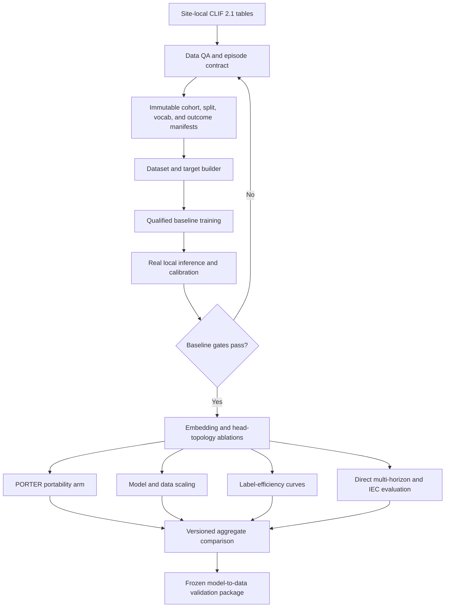
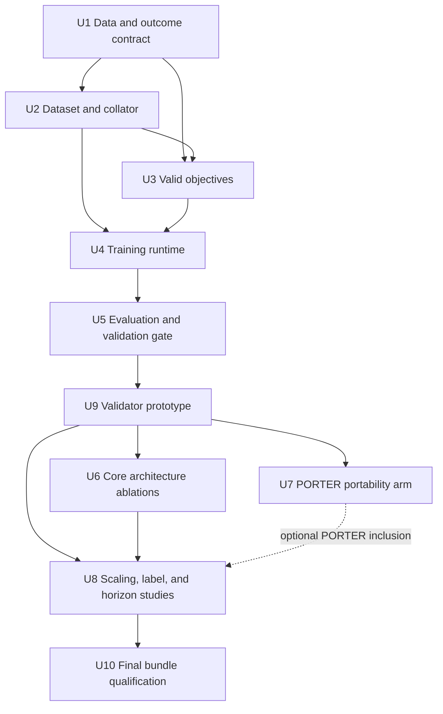

# feat: Establish evidence-ready CLIFATRON model experiments

## Summary

Establish a leakage-safe, resumable training and evaluation baseline, then use one shared experiment harness to test focused hypotheses from ICareFM, SurvivEHR, PORTER, and MOTOR. Clin-JEPA informs the decision to defer latent rollout co-training until direct multi-horizon evidence justifies it. Preserve CLIFATRON 2.0's model-to-data privacy contract.

---

## Problem Frame

The repository already contains tokenizers, model heads, ablation configurations, and evaluation scaffolds, but the principal training entry points stop before loading data or updating the model. Labels needed by the TTE heads are synthesized in tests rather than built from an eligibility and censoring contract. The external validator can emit production-shaped metrics from random predictions, and the current competing-risk parameterization can produce invalid event-free probabilities when cause-specific sigmoid hazards sum above one.

Consequently, tied versus untied embeddings, joint versus separate TTE objectives, PORTER-style representations, scaling curves, label efficiency, and multi-step forecasting cannot yet yield interpretable comparisons. The work must first make time zero, observation windows, target eligibility, treatment masking, data splits, calibration splits, checkpoint provenance, and failure states executable and testable.

No inspectable patient dataset is committed to the repository. Real-data column profiling and outcome prevalence checks are prerequisites before model training; paths and values in this plan remain conceptual where they depend on governed site data.

---

## Requirements

**Cohort and data integrity**

- R1. Define one versioned ICU episode, anchor, observation-window, prediction-window, eligibility, censoring, and outcome contract before constructing training examples.
- R2. Calculate event time from ICU admission, restrict model features to the observation window, and prevent patients or linked encounters from crossing train, validation, calibration, and test partitions.
- R3. Preserve treatment events as context while masking them from all prediction targets; use physiologic states rather than treatment initiation as outcomes.
- R4. Preserve positive, negative, censored, prevalent, not-ascertainable, and unsupported-at-site states instead of converting missing labels to negatives.
- R5. Build vocabulary and numeric edges from the reference training partition only, then apply immutable vocabulary, edge, target-map, and outcome-spec manifests at every site.

**Training and model validity**

- R6. Provide deterministic map-style datasets and collators for CLIFATRON packed sequences and the decile-token ablation path, including real CR, threshold, value, NTP, mask, anchor, and censoring targets.
- R7. Replace the invalid independent-sigmoid competing-risk distribution with a cause-plus-no-event parameterization whose event-free probability and CIF values are nonnegative, monotone, and normalized.
- R8. Run single-device and DDP training with bf16, gradient accumulation, clipping, scheduling, validation, atomic checkpoints, exact epoch-boundary resume, and provenance manifests.
- R9. Keep experiment factors orthogonal and config-driven so tying, head topology, representation, model size, data volume/diversity, label budget, and forecast horizon can be changed without silently changing the cohort or evaluation contract.

**Evaluation and evidence**

- R10. Fit model parameters, model selection, and probability calibration on separate declared partitions; final test and external-site labels must never fit any artifact used for their own evaluation.
- R11. Fail closed when model, head, vocabulary, bins, target map, outcome specification, or CLIF version is missing or mismatched; never emit benchmark-shaped metrics from placeholder predictions.
- R12. Report discrimination, calibration, clinical utility, competing-risk calibration, uncertainty intervals, subgroup results with small-cell suppression, and experiment provenance using one stable result schema.
- R13. Evaluate label efficiency with repeated patient-level samples and fixed test sets, and evaluate multi-step forecasts separately from calibrated one-step risk estimates.
- R14. Keep all patient-level rows, labels, predictions, and identifiers local to each site; only allow-listed, disclosure-controlled aggregate artifacts may leave a site.
- R15. Assign each site one site role and each within-site partition one partition role; allow final test or untouched confirmation results to be opened only after the experiment matrix, model-selection rule, calibration method, and analysis code are frozen.
- R16. Keep checkpoint-pinned CLIFATRON tokenizer artifacts distinct from training-partition-derived experimental vocabularies; incompatible model/representation combinations must fail closed.
- R17. Qualify data loading, packed attention, memory, throughput, checkpoint overhead, and DDP efficiency on 2 x L40 before launching the experiment matrix.

---

## Assumptions

- The prediction anchor is hour 24 after the first eligible ICU admission, all incident outcomes occur strictly in `(anchor, anchor + horizon]`, and the estimand applies to patients alive and under observation at hour 24 rather than to all ICU admissions.
- The hard rule that treatments are inputs, never targets, applies to both supervised outcomes and next-event pretraining. Existing treatment-initiation tasks are removed or renamed only after a physiologic-state definition is approved.
- Development sites do not centrally pool patient-level data. Site-local models may be evaluated independently, but cross-site weight transfer, ensembling, and true multi-site training require a separately approved derived-artifact exchange protocol.
- MIMIC, Rush, and UChicago are reusable development sites whose patient-level partitions remain local; they are not called external sites. Other consortium sites are sealed external confirmation sites and cannot drive model selection for the experiment family.
- Exact outcome definitions, source columns, units, follow-up rules, and prevalence thresholds remain provisional until `ce-data-qa` profiles each governed dataset.
- Inter-Event Concordance follows SurvivEHR's risk-ranking definition for one-step and teacher-forced future-event evaluation. Recursive rollout remains explicitly exploratory and is not reported as calibrated TTE risk.

---

## Scope Boundaries

- Do not replace the CLIFATRON Qwen2 backbone with Mamba, xLSTM, RWKV, or an 8B-scale JEPA encoder.
- Do not pool raw site data, labels, patient-level predictions, identifiers, gradients, or model updates.
- Do not add note modality work to these experiments; notes require a separate leakage and availability-time contract.
- Do not treat external validation sites as iterative development sets.
- Do not claim PORTER-style open-vocabulary output generation; the proposed arm evaluates portable input representations.
- Do not claim an institutional training-diversity effect from independently trained site models or ensembles; under the current privacy boundary that estimand is not identifiable.

### Deferred to Follow-Up Work

- Federated optimization, secure aggregation, and gradient/update exchange: separate governance and threat-model project after site-local scaling establishes a material need.
- Cross-site ensembles and site-diversity scaling: optional follow-up after derived-model export is approved; current work may report independent site-local transport results only.
- Clin-JEPA-style latent rollout co-training: separate architecture study after direct multi-horizon objectives establish whether rollout adds value at this model scale.
- Prospective or silent deployment: requires a frozen model, operational monitoring, and institutional approval beyond this repository plan.

---

## Context & Research

### Relevant Code and Patterns

- `src/data/tokenize.py` produces patient-level event shards but currently measures `pos_min` from the first observed event and does not construct observation/future windows or model targets.
- `src/train/joint_pretrain.py`, `src/train/run_arm.py`, `src/train/pretrain.py`, and `src/train/run_tokenization_ablation.py` construct models and optimizers but stop before a real data or update loop.
- `src/model/head_adapter.py` is the primary integration seam for CLIFATRON checkpoints; `src/model/encoder.py` remains the from-scratch ablation path.
- `src/model/heads.py` already exposes tied and untied next-event projections, threshold hazards, value regression, and competing risks, making config-driven comparisons preferable to parallel implementations.
- `tests/test_smoke_arms.py` demonstrates expected batch fields but manufactures CR and threshold labels; it is a useful shape test, not evidence that supervision is correct.
- `src/eval/method3.py` and `src/eval/metrics.py` establish the comparison and metric surfaces, but currently fit/evaluate on unsplit site arrays and recalibrate on evaluated labels.
- `src/eval/clif_validate.py` and `src/eval/clif_auto_labeler.py` establish the model-to-data boundary but currently permit missing head weights, random predictions, overlapping outcome windows, and null-to-negative labels.
- Upstream sequence packing patterns live in `external/clifatron/AR/qwen2/data/packed_dataset.py` and `external/clifatron/AR/qwen2/scripts/pack_sequences.py`; patient/document boundaries must be preserved for TTE targets.

### Institutional Learnings

- `MEMORY.md` and `notes/NEXT_STEPS.md` are authoritative over the pre-pivot architecture in `notes/RESEARCH.md`.
- The primary product remains a methods layer on CLIFATRON, not a parallel foundation-model stack.
- Frozen mCIDE, reference-site bins, local-only PHI processing, pre-anchor feature availability, DDP on 2 x L40, and aggregate-only external reporting are hard constraints.
- The documented 30M-neighborhood shape is a baseline to test, not permission to change parameter count and data volume simultaneously.

### External References

- SurvivEHR: joint next-event type/time pretraining, IEC, explicit multi-step degradation, and stronger low-label fine-tuning; https://doi.org/10.1038/s41746-026-02709-z
- PORTER: frozen description embeddings plus a dedicated numeric pathway for cross-vocabulary input portability; https://arxiv.org/abs/2606.24102
- Clin-JEPA: evidence that stable latent rollout requires a specialized multi-phase curriculum, supporting deferral rather than a small add-on; https://arxiv.org/abs/2605.10840
- MOTOR: TTE pretraining, censoring-aware adaptation, cross-site transfer, and label-efficiency evaluation; https://arxiv.org/abs/2301.03150
- ICareFM workshop precursor: heterogeneous critical-care harmonization and cross-hospital transfer motivation; https://arxiv.org/abs/2411.16346
- PyTorch data, DDP, AMP, serialization, and reproducibility guidance: https://docs.pytorch.org/docs/stable/data.html, https://docs.pytorch.org/docs/stable/generated/torch.nn.parallel.DistributedDataParallel.html, https://docs.pytorch.org/docs/stable/notes/amp_examples.html, and https://docs.pytorch.org/docs/stable/notes/randomness.html

---

## Key Technical Decisions

- **Validity before breadth:** Build and qualify one end-to-end baseline before adding experiment axes. Otherwise ablation effects are confounded by synthetic labels, leakage, invalid probabilities, or non-resumable training.
- **One canonical episode artifact:** Tokenization, target construction, training, Method 3, and external validation consume the same versioned episode/split/outcome contract rather than independently deriving anchors and labels.
- **Two compatible representation families:** CLIFATRON-checkpoint runs use the checkpoint-pinned tokenizer, vocabulary, and packing schema. Experimental decile/TextCode runs use training-partition-derived artifacts and a compatible retrained or explicitly adapted model; cross-family combinations are invalid.
- **Cause-plus-no-event competing risks:** Use a conditional per-time-bin distribution over causes plus no modeled event, with event mass equal to event-free probability through prior bins times the current cause probability. Censoring contributes event-free probability through the last observed interval.
- **Treatments remain context only:** Apply a target-eligibility mask to NTP/value/TTE construction and exclude treatment-initiation endpoints. This resolves the current contradiction between documented hard rules and configured tasks.
- **Separate site and partition roles:** Training, model-selection validation, calibration, internal test, development-site transport, and untouched external confirmation are distinct roles. Final test and confirmation results are opened once after the analysis is frozen and cannot drive later choices for the same model version.
- **Config axes, not bespoke scripts:** Extend the existing arm runners around a resolved experiment manifest. Shared cohort, split, seeds, token budget, optimizer updates, and evaluation schema are held constant unless they are the named factor.
- **Hybrid PORTER arm:** Compare learned ID, frozen text, and residual/gated ID-plus-text inputs while keeping numeric magnitude on a dedicated pathway. Retain frozen mCIDE as the shipping default until cross-vocabulary tests justify a change.
- **Separate scaling estimands:** Fixed-data exposure isolates capacity while allowing compute to vary; fixed-compute comparisons estimate performance under a resource budget while allowing token exposure to vary. Site-local ensemble benefit is separate and is not interpreted as institutional training diversity.
- **Direct horizons before recursive rollout training:** Add direct multi-horizon supervision and IEC evaluation first. Recursive generation is reported as trajectory plausibility because SurvivEHR explicitly does not treat later rollouts as calibrated risk.
- **Model-to-data remains the federation contract:** Federated optimization is not an incremental extension; exchanging gradients or updates changes governance, privacy, orchestration, and failure handling.

---

## High-Level Technical Design

> *This illustrates the intended approach and is directional guidance for review, not implementation specification. The implementing agent should treat it as context, not code to reproduce.*

---

## Implementation Units

### U1. Version the cohort, anchor, split, and outcome contract

**Goal:** Create the single source of truth for episode eligibility, time zero, windows, censoring, outcome states, treatment exclusions, and immutable patient-grouped splits.

**Requirements:** R1, R2, R3, R4, R5, R10, R14, R15, R16

**Dependencies:** Governed site data and a `ce-data-qa` column profile for each development site.

**Files:**
- Create: `configs/cohort.yaml`
- Create: `configs/artifact_policy.yaml`
- Create: `src/data/cohort.py`
- Create: `src/data/splits.py`
- Create: `tests/test_cohort.py`
- Create: `tests/test_splits.py`
- Create: `tests/test_artifact_policy.py`
- Modify: `configs/data.yaml`
- Modify: `configs/train.yaml`
- Modify: `src/data/tokenize.py`
- Modify: `src/eval/clif_auto_labeler.py`
- Test: `tests/test_data_config.py`
- Test: `tests/test_clif_validate.py`

**Approach:**
- Define the first eligible ICU episode, hour-24 anchor, observation and post-anchor prediction intervals, linked-encounter grouping, required follow-up, and terminal states in configuration rather than outcome-specific implicit SQL.
- Define the canonical unit as one prespecified ICU episode and state exactly how hospitalizations, ICU transfers, ICU readmissions, and linked encounters map to or are excluded from that unit.
- Restrict eligibility decisions to information available by the anchor, define the target population as hour-24 survivors under observation, and produce an exclusion waterfall so early death/discharge selection is visible.
- Classify death, discharge, transfer, and end-of-record separately as modeled competing events, follow-up continuation, or censoring; record independent-censoring assumptions and sensitivity analyses.
- Derive admission-relative time from the canonical ICU admission record and reject events outside the allowed feature window.
- Return explicit outcome status and event/censor time. Missing tables, baseline measurements, or follow-up produce unsupported/not-ascertainable/censored states, not zero labels.
- Define outcome-specific ascertainment schedules and minimum observation criteria; report measurement-density diagnostics and sensitivity analyses before treating an unmeasured interval as event-free.
- Replace treatment-initiation tasks with approved physiologic-state outcomes and expose a reusable treatment-token target mask.
- Generate splits and vocabulary/bin edges from patient-grouped training records only; write content hashes and source provenance without identifiers.
- Define a role matrix for training, model-selection validation, calibration, internal test, transport evaluation, and untouched external confirmation, including which role may fit which artifacts and an access log for sealed results.
- Write separate compatibility manifests for checkpoint-pinned CLIFATRON artifacts and experimental representation artifacts.
- Define approved storage, encryption, least-privilege access, backup, retention, deletion, logging, and export controls for raw tables, episode shards, labels, predictions, caches, checkpoints, weights, and aggregate reports before real-data artifacts are written.

**Execution note:** Add leakage and censoring characterization tests before changing existing label behavior.

**Patterns to follow:**
- Site-local Parquet handling and single-hospital guard in `src/data/tokenize.py`.
- Existing outcome-specific CLIF queries in `src/eval/clif_auto_labeler.py`, after centralizing their shared episode/window semantics.

**Test scenarios:**
- Happy path: an ICU stay with pre-anchor observations and a post-anchor physiologic event receives admission-relative positions, a valid event time, and the expected split.
- Edge case: an event exactly at the anchor is available as input but is not counted as a post-anchor incident outcome.
- Edge case: a patient with linked hospitalizations is assigned wholly to one partition.
- Edge case: discharge or transfer before the horizon is represented according to the declared censoring rule rather than as a negative event.
- Edge case: death before a nonfatal outcome follows its declared competing-event rule, and early-discharge sensitivity analysis does not silently change the estimand.
- Error path: missing required source tables, invalid units, ambiguous ICU admission, or a multi-hospital input produces an explicit qualification failure.
- Error path: a prevalent event or treatment-initiation target is rejected from incident physiologic supervision.
- Error path: a required partition with zero eligible episodes, or an enabled objective with zero eligible targets in training, fails preflight rather than producing an empty successful run.
- Integration: vocabulary/bin fitting sees only the reference training partition, and validation/test-only extremes do not alter its hashes.

**Verification:**
- A site-local cohort report records row/column counts, keys, timestamp assumptions, null/duplicate rates, outcome-state counts, prevalence, follow-up, split balance, and immutable artifact hashes.
- No feature timestamp exceeds the anchor and no patient identifier occurs in more than one partition.
- A prerequisite register names the owner, completion artifact, phase gate, status, and escalation path for data QA, checkpoint acquisition, clinical/statistical approval, governance approval, and environment qualification.

### U2. Build the real dataset, target builder, and collator

**Goal:** Convert canonical episode artifacts and CLIFATRON packed sequences into deterministic model batches with masks and supervision derived from real future events.

**Requirements:** R2, R3, R4, R5, R6, R9, R16

**Dependencies:** U1

**Files:**
- Create: `src/data/dataset.py`
- Create: `src/data/collate.py`
- Create: `src/data/targets.py`
- Create: `tests/test_dataset.py`
- Create: `tests/test_collate.py`
- Create: `tests/test_targets.py`
- Modify: `src/data/__init__.py`
- Modify: `external/clifatron/AR/qwen2/data/packed_dataset.py`
- Modify: `external/clifatron/AR/qwen2/scripts/pack_sequences.py`
- Modify: `external/clifatron/AR/qwen2/train_sft.py`
- Modify: `tests/test_smoke_arms.py`

**Approach:**
- Version the packed schema so each segment retains a site-local opaque episode key, source span, and continuation metadata even when one episode crosses packed rows.
- Implement one map-style sample contract that adapts both upstream CLIFATRON packed records and decile-token ablation shards while retaining stay/document boundaries.
- Represent packed supervision as one anchor state and label row per eligible document, not per packed tensor. Gather hidden states at document anchors into `[documents, hidden]`; continuation segments emit supervision only when they contain the declared anchor, while token-level NTP remains document-isolated.
- Construct NTP eligibility, normalized value targets, competing-risk cause/time/censor targets, and deterministic threshold queries from the episode contract.
- Define the self-supervised target process explicitly as a next-eligible-physiologic-event subsequence with recomputed inter-event times, or as masked recorded-event transitions; name IEC and likelihood outputs accordingly so they are not misrepresented as ordinary next-event prediction.
- Emit threshold at-risk and censor-time fields that distinguish observed non-crossing through horizon, right censoring before horizon, not ascertainable, unsupported target, and prevalence at the anchor.
- Pad sequences and soft assignments, emit explicit attention/target masks and anchor indices, and seed threshold sampling from sample ID, epoch, and run seed.
- Keep workers CPU-only and make the collator top-level/picklable; device transfer remains the trainer's responsibility.
- Use a variable-length FlashAttention-compatible causal path driven by cumulative document lengths for Qwen2/GPT2 adapters; prohibit dense `[batch, heads, length, length]` isolation masks and require a tested fallback that preserves isolation for data-free CPU checks.

**Patterns to follow:**
- Packed dataset and sequence assembly in `external/clifatron/AR/qwen2/data/packed_dataset.py` and `external/clifatron/AR/qwen2/scripts/pack_sequences.py`.
- Batch field names consumed by `src/model/head_adapter.py` and `src/train/run_arm.py`.

**Test scenarios:**
- Happy path: mixed-length stays produce correctly padded tensors, anchor indices, event/value masks, and valid TTE labels.
- Edge case: a packed record containing multiple documents cannot use one stay's future event as another stay's target.
- Edge case: an episode split across packed rows retains target joins and continuation semantics without duplicating or dropping loss-bearing events.
- Edge case: a censored stay emits a no-event/censor target without inventing a cause.
- Edge case: a threshold query censored before its requested horizon contributes only observed at-risk time and is not treated as a full-horizon non-crossing.
- Edge case: no eligible NTP targets or no numeric values yields a finite masked loss denominator.
- Edge case: `physiology -> treatment -> physiology` follows the declared target process and never shifts event time or IEC semantics implicitly.
- Error path: out-of-range token, target, time-bin, mismatched manifest hash, or post-anchor feature fails before model execution.
- Integration: the same synthetic episode yields semantically equivalent targets through the CLIFATRON and decile adapters.
- Integration: changing tokens in one packed document cannot change another document's hidden states or losses.

**Verification:**
- Existing smoke tests use target-builder output rather than random labels.
- Repeated loading with the same seed and epoch yields identical sample order and threshold queries.

### U3. Make objective probabilities and masks valid

**Goal:** Correct competing-risk probability semantics and make every objective honor censoring, padding, eligibility, and treatment-target masks.

**Requirements:** R3, R4, R7, R9

**Dependencies:** U1, U2

**Files:**
- Modify: `src/model/heads.py`
- Modify: `src/model/head_adapter.py`
- Modify: `src/train/run_arm.py`
- Test: `tests/test_model_heads.py`
- Create: `tests/test_objective_masks.py`

**Approach:**
- Parameterize each CR time bin conditionally over all modeled causes plus no modeled event. Use one interval convention consistently; event mass is prior-bin event-free probability times current-bin cause probability, the event-free probability recurs through no-event probabilities, and censoring contributes through the final observed interval.
- Define whether modeled causes are exhaustive; otherwise include an `other` cause so unmodeled future events are not mislabeled as remaining event-free.
- Pass explicit masks into NTP and value losses; treatment and unsupported tokens remain visible in context but contribute no target loss.
- Apply the same at-risk/censor contract to threshold hazards so incomplete follow-up is not learned as a negative crossing.
- Keep threshold and CR heads separately queryable. The later topology ablation may share representations or likelihood components, but cannot compare against an invalid baseline.
- Correct curriculum freezing so NTP warmup trains the intended backbone/next-event parameters without wrapping the trainable backbone in `no_grad`.

**Execution note:** Implement probability-invariant and gradient-flow tests before changing the loss used by runners.

**Patterns to follow:**
- Small head modules and colocated loss behavior in `src/model/heads.py`.
- Explicit tied/untied construction in `NextEventHead`.

**Test scenarios:**
- Happy path: an observed cause at a known bin has finite likelihood and propagates gradients to the head and trainable backbone.
- Happy path: a censored sample contributes event-free likelihood through its censor bin.
- Edge case: for every horizon, event-free probability plus the sum of cause CIFs equals one within tolerance; CIFs are nonnegative and monotone.
- Edge case: synthetic data generated from known hazards recovers the expected likelihood ordering and CIF, proving more than normalization alone.
- Edge case: all-masked NTP/value batches return finite zero contributions without suppressing valid TTE losses.
- Error path: invalid cause index, censor bin, threshold direction, or incompatible mask shape raises a clear validation error.
- Integration: during NTP warmup, backbone and next-event parameters receive gradients while TTE heads do not; all intended components receive gradients after transition.

**Verification:**
- Property-style synthetic tests cannot produce negative event-free probability or total event probability above one.
- Treatment-token perturbations affect context states but never create direct NTP/value target terms.

### U4. Implement the resumable training runtime

**Goal:** Turn the existing runners into executable, deterministic single-device and DDP training programs with validation, checkpointing, and run provenance.

**Requirements:** R6, R8, R9, R17

**Dependencies:** U2, U3

**Files:**
- Create: `src/train/engine.py`
- Create: `src/train/checkpoint.py`
- Create: `src/train/manifest.py`
- Create: `tests/test_train_engine.py`
- Create: `tests/test_checkpoint.py`
- Modify: `src/train/joint_pretrain.py`
- Modify: `src/train/pretrain.py`
- Modify: `src/train/run_arm.py`
- Modify: `src/train/run_tokenization_ablation.py`
- Modify: `configs/train.yaml`

**Approach:**
- Centralize loader creation, optimizer-update-based accumulation, CUDA bf16 autocast, one-time gradient clipping, scheduler cadence, validation, and rank-aware logging.
- Use a distributed sampler and call its epoch transition explicitly; keep sequence order deterministic under a recorded seed.
- Stream bounded, rank-owned shards rather than materializing the corpus in every worker; publish shard checksums, occupancy, event-retention, and resident-memory statistics.
- Qualify packed attention without materializing dense document masks, and benchmark representative sequence lengths rather than assuming the configured 8192-token maximum can use the inherited batch size.
- Publish resumable checkpoint generations only at epoch boundaries, with model, optimizer, scheduler, counters, sampler/generator state, per-rank RNG state, resolved config, and provenance hashes. Define writer ownership, all-rank state gathering, barriers, a completion marker, partial-generation cleanup, and recovery after rank failure.
- Define epoch-boundary resume as the guaranteed contract. Mid-epoch exact resume is not claimed unless a stateful sampler is later added.
- Record effective global batch size, software/hardware versions, source checkpoint, dataset/split/vocabulary hashes, Git revision/dirty state, precision, compile settings, and run lineage.
- Record a compute ledger containing patients/episodes, raw/non-padding/loss-bearing tokens, eligible and positive targets, optimizer updates, measured FLOPs, GPU-hours, peak memory, loader latency, storage throughput, and failures.

**Patterns to follow:**
- Existing DDP initialization and optimizer grouping in `src/train/joint_pretrain.py` and `src/train/run_arm.py`.
- `MetricsLog` fields in `src/train/run_arm.py`, promoted into a shared run-result contract.

**Test scenarios:**
- Happy path: a tiny synthetic dataset overfits on one device and decreases each enabled objective without NaNs.
- Happy path: an interrupted epoch-boundary run resumes to the same next sample order, optimizer step, scheduler state, and deterministic CPU result as an uninterrupted run.
- Edge case: final partial accumulation performs one correctly normalized optimizer update or follows the documented drop policy.
- Error path: resume rejects changed dataset hash, world size, batch size, accumulation factor, or incompatible checkpoint schema.
- Integration: a two-process CPU/GPU smoke test shards samples without overlap and produces parameter updates equivalent to the declared effective batch semantics.
- Integration: a multi-rank process killed during epoch-boundary checkpoint publication resumes only from the last completed generation with all-rank RNG and sample order restored.
- Integration: every existing arm reaches training and writes a manifest rather than stopping at a DataLoader TODO.

**Verification:**
- One-batch overfit, resume equivalence, and DDP sample-coverage checks pass before any L40 experiment is scheduled.
- Checkpoints can be loaded on CPU and do not depend on untrusted or undocumented pickle contents.
- A 2 x L40 qualification report establishes microbatch/accumulation choices by token load, DDP scaling efficiency, GPU idle time, peak memory, checkpoint overhead, and projected matrix cost; single-GPU execution remains allowed when no-NVLink DDP is slower.
- Infrastructure qualification must confirm healthy driver/NVML telemetry, two-rank NCCL allocation, bf16 execution, and monitoring before long runs.

### U5. Repair evaluation, calibration, and model-to-data validation

**Goal:** Ensure every reported metric comes from real predictions, isolated partitions, valid TTE quantities, and disclosure-controlled aggregate output.

**Requirements:** R4, R10, R11, R12, R13, R14, R15, R16

**Dependencies:** U1, U2, U3, U4

**Files:**
- Create: `src/eval/schema.py`
- Create: `tests/test_eval_splits.py`
- Create: `tests/test_eval_metrics.py`
- Modify: `src/eval/metrics.py`
- Modify: `src/eval/method3.py`
- Modify: `src/eval/clif_validate.py`
- Modify: `src/eval/clif_forest_plot.py`
- Modify: `tests/test_clif_validate.py`

**Approach:**
- Require explicit fit, validation/model-selection, calibration, and final-test partitions for probes, XGBoost, temperature fitting, LPE, and model evaluation.
- Enforce sealed-result access: analysis code and selection rules are frozen before final internal test or external confirmation artifacts are opened, and accesses are logged by model version.
- Add real batch inference and strict artifact compatibility checks; missing or partial heads, placeholders, and hash mismatches terminate without writing a success-shaped report.
- Complete the shared panel with recalibrated and unrecalibrated discrimination/calibration, DCA/net benefit, CR-specific scores/plots, confidence intervals, and well-defined IEC.
- Predeclare each DCA outcome's decision-maker, decision time, candidate action, comparator policy, and clinically defensible threshold range; otherwise label net benefit exploratory rather than demonstrated utility.
- Replace current CR calibration stand-ins with implementations validated against the selected method's censoring assumptions and simulated known distributions.
- Define an allow-listed result schema, suppress small and complementary cells, remove local paths, and report unsupported outcomes as statuses rather than fabricated metrics.
- Run each site locally and combine only approved result artifacts; do not load all site-level rows into one central process.
- Define external estimands as site-specific and meta-analytic, including weighting, heterogeneity, and suppression-induced missingness. Do not describe averages of local AUPRC, calibration, or DCA as pooled patient-level metrics.
- Define paired patient-level resampling, seed aggregation, site-level synthesis, multiplicity handling, and the minimum site count for heterogeneity claims.
- Freeze the experiment matrix, primary endpoints, clinical-utility gates, seed count, selection rule, calibration method, failure handling, analysis code, pilot-derived cell budget, and resource/futility rules before U6/U7/U8.
- Define releaser, site operator, execution-host, transfer-channel, and aggregator trust roles, including report authentication, unsealing authorization, separation of duties, revocation, tamper-evident access logs, and compromise handling.

**Execution note:** Characterize current metric outputs, then add failure tests before replacing placeholder behavior.

**Patterns to follow:**
- Probability-in/scalar-out metric functions in `src/eval/metrics.py`.
- Aggregate result and plotting surfaces in `src/eval/clif_validate.py` and `src/eval/clif_forest_plot.py`.

**Test scenarios:**
- Happy path: held-out predictions generate discrimination, calibration, DCA, uncertainty intervals, and provenance without patient-level fields.
- Edge case: a single-class or too-small outcome returns an explicit non-evaluable/suppressed status.
- Edge case: calibration fitted on its dedicated partition changes calibration outputs but cannot change the fixed test labels or discrimination ordering.
- Error path: absent head weights, wrong vocabulary/target hash, random/placeholder prediction provider, unsupported CLIF version, or missing outcome definition fails closed.
- Error path: aggregate output containing identifiers, local paths, patient-level predictions, or recoverable small cells is rejected.
- Integration: a synthetic normalized CR distribution passes known IEC/calibration cases, while deliberately miscalibrated distributions are detected.

**Verification:**
- No production path in `src/eval/clif_validate.py` calls a random prediction generator.
- A clean site process can produce an aggregate artifact that a separate aggregator consumes without access to site rows.

### U6. Add the tied/untied and separate/joint objective ablations

**Goal:** Run the two lowest-cost architecture tests under one fixed cohort, compute, and evaluation contract.

**Requirements:** R7, R9, R10, R12

**Dependencies:** U5, U9

**Files:**
- Create: `configs/architecture_ablation.yaml`
- Create: `tests/test_architecture_ablation.py`
- Modify: `src/model/heads.py`
- Modify: `src/model/head_adapter.py`
- Modify: `src/train/run_arm.py`
- Modify: `src/eval/ablation_compare.py`

**Approach:**
- Compare tied and untied output embeddings at fixed data, tokens, updates, seeds, and base architecture; add a parameter-matched tied control so extra capacity is not mistaken for untying benefit.
- Compare separate threshold/CR heads with a joint event-time representation that retains valid normalized CR likelihood and the threshold query interface.
- Use identical model-selection rules and at least repeated seeds; record failed runs rather than silently replacing them.
- Declare reusable development-site transport AUPRC, calibration, and net benefit at prespecified thresholds as co-primary comparison dimensions, with NTP loss, CR proper scores, parameter count, runtime, and memory as secondary dimensions. Untouched confirmation sites cannot drive selection.

**Patterns to follow:**
- Existing `NextEventHead.tie_weights` switch and config-driven arm definitions in `configs/ablation.yaml`.
- Existing aggregate comparison surface in `src/eval/ablation_compare.py`.

**Test scenarios:**
- Happy path: each factor combination resolves to the intended weight sharing and head topology while consuming the same dataset/split hashes.
- Edge case: parameter-matched controls report actual rather than nominal parameter count and reject tolerance violations.
- Error path: an arm that changes an undeclared factor, omits required seeds, or lacks a completed baseline manifest cannot enter the comparison.
- Integration: the comparison table includes effect estimates and uncertainty for every completed seed/site/outcome without selecting favorable subsets.

**Verification:**
- Arm manifests differ only on declared experimental factors and derived resource usage.
- No architecture default changes until a predeclared criterion is met across discrimination and calibration.

### U7. Complete the PORTER-style portability arm

**Goal:** Test whether language-grounded event inputs improve controlled vocabulary transfer without weakening in-domain calibration or violating the frozen-vocabulary deployment contract.

**Requirements:** R5, R9, R10, R12

**Dependencies:** U5, U9; may proceed in parallel with U6.

**Files:**
- Create: `src/model/event_embeddings.py`
- Create: `tests/test_event_embeddings.py`
- Modify: `src/data/tokenize_textcode.py`
- Modify: `src/train/run_tokenization_ablation.py`
- Modify: `configs/tokenization_ablation.yaml`
- Test: `tests/test_tokenization_ablation.py`

**Approach:**
- Replace synthetic descriptions with a versioned, complete, unit-aware mCIDE description source and record text encoder, tokenizer, description, and cache hashes.
- Require an approved authoritative description release, acquisition and redistribution rights, checksum, concept-plus-unit mapping, and coverage threshold before enabling the arm.
- Cache frozen text representations once and compare learned-ID, frozen-text, and residual/gated hybrid inputs with a separate numeric-value pathway.
- Match patient timelines first and report token counts, truncation, event/target retention, FLOPs, parameter count, and inference cost. Include parameter/compute-matched controls.
- Evaluate controlled description renaming on identical timelines and a genuine concept/site holdout before real cross-site vocabulary mismatch; report coverage-stratified results and symmetric unknown handling explicitly.
- Keep finite output targets for NTP and avoid claiming language-grounded inputs solve unseen-event generation.

**Patterns to follow:**
- Existing cache/projection scaffold in `src/data/tokenize_textcode.py`.
- Existing tokenization-arm contract in `configs/tokenization_ablation.yaml`.

**Test scenarios:**
- Happy path: authoritative descriptions produce a deterministic cache and projected event embeddings with the expected shape.
- Edge case: units and numeric magnitudes alter the numeric pathway without changing concept identity.
- Edge case: controlled synonymous descriptions retain representation geometry and predictions within the predeclared tolerance.
- Error path: missing description coverage, duplicate concept mapping, encoder revision drift, or cache hash mismatch fails before training.
- Error path: any arm excludes unsupported events or patients not excluded identically from comparator arms, unless the coverage-stratified analysis declares that difference.
- Integration: every representation arm uses identical cohort/split/evaluation hashes and reports in-domain plus held-out-vocabulary performance and calibration.

**Verification:**
- The TextCode arm contains no synthetic fallback descriptions in evidence-producing runs.
- Portability reports distinguish event coverage, input transfer, and finite output-vocabulary limitations.

### U8. Run scaling, label-efficiency, and multi-horizon studies

**Goal:** Quantify where capacity, local data volume, labeled sample size, and forecast distance help or fail under the qualified baseline.

**Requirements:** R9, R10, R12, R13, R14, R15, R17

**Dependencies:** U5, U6; U7 for inclusion of the PORTER arm.

**Files:**
- Create: `configs/experiment_matrix.yaml`
- Create: `src/train/run_experiment_matrix.py`
- Create: `src/eval/label_efficiency.py`
- Create: `src/eval/multistep.py`
- Create: `tests/test_experiment_matrix.py`
- Create: `tests/test_label_efficiency.py`
- Create: `tests/test_multistep.py`
- Modify: `configs/train.yaml`
- Modify: `src/eval/metrics.py`
- Modify: `src/eval/ablation_compare.py`

**Approach:**
- Keep `src/train/run_experiment_matrix.py` as orchestration only: resolve and validate configurations, assign run IDs, and delegate training/evaluation to the U4/U5 shared engines rather than creating a second runtime.
- Separate fixed-data capacity and fixed-compute performance estimands. Cross at least two model sizes with nested patient-grouped data volumes, with repeated seeds at anchor cells, rather than an uncontrolled 37M-to-200M sweep.
- Treat institutional training diversity and cross-site ensemble benefit as out of scope under the present exchange rules.
- Build label-efficiency curves from paired, nested patient-grouped samples shared across methods, fixed temporal/external test sets, and both total-label and positive-label axes. Count labels used for fitting, model selection, hyperparameter choice, and calibration.
- Evaluate direct horizons and teacher-forced event steps separately from recursive rollouts. Report IEC for ranking, plus event-set, timing, calibration, and trajectory-distribution measures appropriate to each mode.
- Use physiologic event targets only. Calibrated anchor-time risk uses no post-anchor context; teacher-forced analyses that condition on future treatments are labeled conditional trajectory analyses and never scored as calibrated baseline risk.
- Execute capacity/data scaling, label efficiency, and multi-horizon forecasting as independently stoppable substudies over the shared frozen protocol; one study's delay does not block completed studies.

**Patterns to follow:**
- Existing arm metadata and report sections in `configs/ablation.yaml` and `configs/tokenization_ablation.yaml`.
- Existing LPE implementation in `src/eval/metrics.py`, expanded into full repeated curves rather than a single crossing value.

**Test scenarios:**
- Happy path: the matrix expands only valid combinations and assigns deterministic run IDs from resolved factors and artifact hashes.
- Edge case: iso-FLOP size arms report measured budget compliance and nested data-volume subsets remain paired across model sizes and seeds.
- Edge case: fixed-data and fixed-compute comparisons are labeled as different estimands and cannot be merged into one capacity effect.
- Edge case: rare outcomes retain positive examples in each repeated label-budget sample or are marked infeasible.
- Edge case: one-step IEC agrees with a hand-ranked example; later teacher-forced steps and recursive rollouts are labeled distinctly.
- Error path: duplicate run IDs, test-set-driven model selection, unsupported factor combinations, missing seed results, or treatment targets block aggregation.
- Integration: aggregate curves include uncertainty across seeds/samples and preserve site-local disclosure controls.

**Verification:**
- Every result row traces to model, data, split, vocabulary, outcome, source checkpoint, code, environment, and seed manifests.
- Conclusions distinguish fixed-data capacity, fixed-compute performance, data-volume scaling, label efficiency, and forecast-depth degradation; institutional training-diversity and cross-site ensemble effects remain explicitly unidentified.

### U9. Prototype and qualify the standalone site validator

**Goal:** Prove the install, governance, trust, and synthetic execution workflow before cross-site experiments depend on it.

**Requirements:** R5, R11, R12, R14, R15, R16

**Dependencies:** U5

**Files:**
- Create: `clif-validate/pyproject.toml`
- Create: `clif-validate/src/clif_validate/`
- Create: `clif-validate/tests/test_clean_install.py`
- Create: `clif-validate/tests/test_bundle_compatibility.py`
- Create: `clif-validate/tests/test_disclosure.py`
- Create: `clif-validate/uv.lock`
- Create: `clif-validate/SBOM.json`
- Modify: `website/docs/federated-validation.md`
- Modify: `README.md`

**Approach:**
- Assemble a synthetic versioned bundle with checkpoint-pinned representation artifacts, outcome specification, target map, and compatibility hashes.
- Produce a validator wheel, pinned CPU dependency lock, supported-platform wheelhouse, SBOM, and signed release manifest for offline, no-telemetry execution. Verify signatures against an out-of-band trust root and define revocation/anti-rollback behavior.
- Classify raw inputs, episode artifacts, labels, predictions, caches, logs, checkpoints, weights, and aggregate outputs by storage, access, retention, exportability, and deletion requirements.
- Obtain workflow approval before distributing a synthetic bundle; no trained-weight, model-update, or ensemble exchange is implied by prototype qualification.
- Define and obtain a separate derived-model transfer approval for reusable development-site transport evaluation before U6/U7. If approval is absent, those units remain same-site studies and cannot use transport performance for selection.
- Target Linux x86_64 with Python 3.11 as the initial offline platform. Carry signed minimum-version and revocation metadata through the same controlled offline channel and persist the trusted release state locally; other platforms require separate qualification.
- Produce qualification and failure reports in the allow-listed schema without source paths, identifiers, or recoverable small cells.

**Patterns to follow:**
- Site-local execution and aggregate output intent in `src/eval/clif_validate.py`.
- Package/dependency conventions in `pyproject.toml`, narrowed for the standalone artifact.

**Test scenarios:**
- Happy path: a clean CPU-only environment installs the package offline, validates a compatible bundle, and emits an aggregate report from synthetic CLIF fixtures.
- Edge case: an unsupported outcome or small subgroup is represented by a non-evaluable/suppressed status without complementary disclosure.
- Error path: missing weights, incompatible artifact family, invalid signature, revoked/rolled-back version, hash mismatch, prohibited network access, or unexpected output field fails closed.
- Integration: the external package and in-repo evaluator produce equivalent aggregate results for the same synthetic fixture and frozen bundle.

**Verification:**
- A clean-machine qualification run requires no development-site assets, network access, training dependencies, or patient-level export.
- Governance reviewers can audit a complete artifact lifecycle and bundle manifest before site distribution.

### U10. Qualify and release the selected model bundle

**Goal:** Package the selected frozen model only after experiment completion and pass the derived-artifact release gate before untouched external confirmation.

**Requirements:** R5, R11, R12, R14, R15, R16

**Dependencies:** U8, U9; adopted outputs from U6/U7.

**Files:**
- Create: `clif-validate/tests/test_release_bundle.py`
- Modify: `clif-validate/src/clif_validate/`
- Modify: `website/docs/federated-validation.md`
- Modify: `README.md`

**Approach:**
- Replace the synthetic bundle with the selected frozen model, trained heads, exact representation family, and frozen analysis/outcome manifests without altering the qualified runtime contract.
- Run memorization, membership-inference, and extraction-risk tests with approved quantitative thresholds; minimize exported artifacts and require governance/reviewer sign-off.
- Sign the complete release manifest and authenticate site-generated reports; maintain a cumulative disclosure ledger across model versions and aggregate releases.
- Predeclare terminal pass/fail actions. A revised model reusing a prior confirmation site is labeled transport evaluation and requires a genuinely unused site or prospective cohort for a new confirmation claim.

**Patterns to follow:**
- Qualified packaging, compatibility, disclosure, and trust controls from U9.

**Test scenarios:**
- Happy path: the selected bundle reproduces in-repo synthetic results in a clean offline environment and emits an authenticated aggregate report.
- Edge case: a new report is safe alone but would disclose a suppressed cell by differencing against prior releases, so cumulative disclosure review blocks it.
- Error path: privacy-test threshold failure, absent governance signature, stale/revoked bundle, or altered analysis manifest blocks release.

**Verification:**
- External distribution occurs only after technical, privacy, clinical/statistical, and governance sign-off against the frozen model family and protocol.
- Untouched confirmation results cannot be opened until the signed bundle and analysis version are final.

---

## Success Metrics

- A real, governed CLIF sample can proceed from episode qualification through one optimizer update, validation, checkpoint, resume, and held-out inference with no synthetic target fields.
- Leakage tests prove that post-anchor events, linked-patient split overlap, and test-derived vocabulary/bin/calibration artifacts are rejected.
- Competing-risk outputs satisfy probability invariants and known synthetic calibration cases.
- Every training runner completes a tiny deterministic run and produces a compatible checkpoint plus provenance manifest.
- External validation refuses incomplete artifacts and emits only allow-listed, disclosure-controlled aggregate results.
- Each experiment comparison demonstrates that all non-target factors are held fixed or explicitly reports the mismatch.
- Final reports include uncertainty and all predeclared outcomes/seeds, including failed or non-evaluable runs.
- The operational prototype is exercised by an external-site operator on synthetic data before model selection; final confirmation covers at least two prespecified physiologic outcomes at one untouched external site, and any "multi-hospital" claim requires at least two independent external sites.
- The selected model stays within the measured 2 x L40 training envelope and requires no local model fitting at confirmation sites.

---

## Phased Delivery

### Phase 1: Evidence-safe baseline

Complete U1 through U5 and the U9 validator prototype. Do not launch expensive architecture or scaling runs until reference-site data QA, leakage/censoring tests, probability invariants, one-batch overfit, resume equivalence, real held-out inference, and synthetic external-operator qualification pass.

### Phase 2: Focused architecture and portability tests

Run U6 and U7 from the same frozen cohort and evaluation contract. Use these results to select, not retroactively justify, a default representation and head topology; U5's frozen protocol governs both.

### Phase 3: Scaling and forecasting evidence

Run U8 only for configurations governed by U5's pre-experiment frozen protocol. After selection, lock the model and bundle versions without changing that protocol, then complete U10 before opening sealed external-confirmation results.

---

## System-Wide Impact

- **Interaction graph:** CLIF schema qualification feeds episode/outcome manifests, which feed tokenization and target building, training, checkpoint packaging, local inference, calibration, and aggregate reporting. A hash mismatch at any boundary invalidates downstream work.
- **Error propagation:** Unsupported schemas, outcomes, artifacts, or cells become explicit terminal statuses. They cannot degrade into empty batches, negative labels, random predictions, partial weight loading, or omitted result rows.
- **State lifecycle risks:** Dataset, split, vocabulary, outcome, checkpoint, and calibration artifacts must be immutable and version-linked. Resume is rejected when a stateful input changes.
- **Artifact lifecycle:** Raw inputs, episode shards, labels, predictions, caches, logs, checkpoints, trained weights, and aggregate outputs have explicit classification, storage, retention, export, and deletion rules; logs and crash reports may not capture identifiers or rows.
- **API surface parity:** Both CLIFATRON-checkpoint and from-scratch paths consume one logical batch contract; both internal Method 3 and external validation consume one evaluation schema.
- **Integration coverage:** Synthetic end-to-end fixtures prove cross-layer semantics; governed real-data qualification confirms actual CLIF columns, units, missingness, prevalence, and follow-up before training.
- **Unchanged invariants:** The CLIFATRON backbone remains primary, mCIDE remains the deployment vocabulary, site data remains local, and DDP remains the default distributed strategy.

---

## Dependencies / Prerequisites

- Run `ce-data-qa` at the designated reference site before U1-U5 or model training. Gate each additional development or confirmation site's use on its own QA profile rather than blocking the baseline globally. Capture exact columns/types, episode grain, keys, timestamps/timezones, missingness, duplicates, ranges, units, prevalence, follow-up, and provenance.
- Obtain and hash the actual CLIFATRON checkpoint, tokenizer/vocabulary, packed-sequence schema, and source training-site declaration.
- Approve physiologic outcome definitions, censoring rules, first-episode policy, and small-cell disclosure threshold with clinical/statistical and site-governance reviewers.
- Reserve immutable calibration, internal test, and untouched external confirmation partitions before exploratory comparisons.
- Pin the tested PyTorch/CUDA environment from `uv.lock`; record any divergence between the declared `torch>=2.4` floor and the resolved training environment.
- Acquire and approve the authoritative mCIDE description release, redistribution terms, mapping contract, and checksum before U7.
- Resolve any GPU driver/NVML mismatch and verify `nvidia-smi`, two-rank NCCL, bf16, and telemetry before U4's L40 qualification.

---

## Risk Analysis & Mitigation

| Risk | Likelihood | Impact | Mitigation |
|---|---|---|---|
| Outcome leakage from overlapping windows or unavailable timestamps | High | High | Canonical episode contract, post-anchor-only outcomes, availability-time filtering, and adversarial leakage fixtures |
| Invalid or misinterpreted competing-risk likelihood | High | High | Normalized cause-plus-no-event distribution, censoring tests, probability invariants, and known-distribution simulation |
| Missingness treated as absence | High | High | Explicit outcome states and eligibility denominators; prohibit blanket null-to-zero conversion |
| Calibration or model selection uses test labels | High | High | Immutable fit/validation/calibration/test manifests and evaluator checks |
| Ablations confounded by capacity, data, or compute | Medium | High | Parameter-matched controls, iso-token/iso-FLOP reports, shared seeds and artifacts |
| PORTER descriptions or encoder revisions drift | Medium | Medium | Authoritative descriptions, complete coverage checks, pinned revisions, and cache hashes |
| DDP interruption cannot be reproduced | Medium | High | Epoch-boundary checkpoint contract with optimizer/scheduler/RNG/sampler provenance and resume-equivalence tests |
| Hour-24 eligibility creates survivorship or immortal-time misinterpretation | High | High | Define the hour-24 survivor estimand, use anchor-available eligibility only, publish the exclusion waterfall, and limit claims accordingly |
| Informative discharge, transfer, or death biases CIF estimates | High | High | Preclassify terminal events, state censoring assumptions, and run sensitivity analyses |
| External report leaks small cells or local metadata | Medium | High | Allow-listed schema, primary/complementary suppression, no local paths, and automated disclosure tests |
| Repeated external inspection biases model development | Medium | High | Freeze model/protocol before distribution and reserve untouched confirmation sites for new versions |
| Larger models exceed 2 x L40 budget without benefit | Medium | Medium | Qualify sizes with short iso-FLOP runs and stop configurations that fail resource or transfer gates |
| Federated optimization creates an unapproved data-exchange boundary | Low in this plan | High | Keep it out of scope and require separate governance, privacy, and threat-model approval |
| Site-trained weights expose governed derived information | Medium | High | Treat weights as governed artifacts; prohibit cross-site export or ensembling without explicit review and approval |
| Informative measurement makes unobserved physiology look event-free | High | High | Outcome-specific ascertainment rules, measurement-density diagnostics, and sensitivity analyses |
| Repeated aggregate releases defeat small-cell suppression | Medium | High | Stable cohort rules, cumulative disclosure ledger, and cross-release differencing checks |
| Logs or crash reports capture identifiers or rows | Medium | High | Allow-listed structured logging, sanitized exceptions, protected sinks, retention controls, and PHI-injection tests |

---

## Documentation / Operational Notes

- Update `README.md`, `MEMORY.md`, `notes/NEXT_STEPS.md`, and the relevant `website/docs/` pages only after executable behavior is verified; remove stale claims and clearly distinguish planned, synthetic-tested, and real-data-validated capabilities.
- Publish a data-free synthetic fixture and schema contract so contributors can test the full pipeline without PHI.
- Store patient-level artifacts only under ignored site-local paths. Result manifests must contain hashes and aggregate counts, never identifiers or source paths.
- Record deviations from the predeclared experiment matrix and preserve failed-run metadata for transparent reporting.

---

## Sources & References

- `README.md`
- `MEMORY.md`
- `notes/NEXT_STEPS.md`
- `notes/INTEGRATION.md`
- `notes/RESEARCH.md`
- `website/docs/architecture.md`
- `website/docs/objectives-training.md`
- `website/docs/federated-validation.md`
- `website/docs/ablations.md`
- SurvivEHR: https://doi.org/10.1038/s41746-026-02709-z
- PORTER: https://arxiv.org/abs/2606.24102
- Clin-JEPA: https://arxiv.org/abs/2605.10840
- MOTOR: https://arxiv.org/abs/2301.03150
- Towards Foundation Models for Critical Care Time Series: https://arxiv.org/abs/2411.16346
- PyTorch data loading: https://docs.pytorch.org/docs/stable/data.html
- PyTorch DistributedDataParallel: https://docs.pytorch.org/docs/stable/generated/torch.nn.parallel.DistributedDataParallel.html
- PyTorch AMP examples: https://docs.pytorch.org/docs/stable/notes/amp_examples.html
- PyTorch reproducibility: https://docs.pytorch.org/docs/stable/notes/randomness.html
