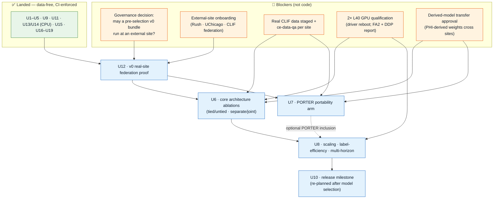

# feat: CLIFATRON 2.0 completion roadmap

## Purpose

A single sequenced view of **what is left to finish the project** and exactly **what unblocks each
piece**. This is a *roadmap*, not a re-charter: every remaining unit is already specified in deep
per-unit detail (entry gates, approach, test scenarios, verification) in the canonical active plan
`docs/plans/2026-08-27-001-feat-evidence-ready-model-experiments-plan.md`. This document does **not**
duplicate that detail — it synthesizes the remaining work into one critical path so an operator can
see the whole finish line at once. Where the two disagree, the canonical plan and `MEMORY.md` win.

**Last synced:** `main` @ `e7c35b7` (PR #12 merged). Both data-free suites green under CI.

---

## Where the project stands

**Every data-free, unblocked unit has landed.** The codebase is a complete, tested, CI-enforced,
reproducible methods artifact. What remains is **not code-blocked** — it is blocked on **real data,
GPU hardware, and one governance decision**.

| Landed (done) | Remaining (gated) |
|---|---|
| U1 cohort/anchor/splits/artifact-policy · U2 dataset/targets/collator/isolation · U3 objective semantics · U4 training engine/checkpoints · value-stats normalization · U5 eval/calibration/validation-gate · U9 validator core · U11 release-trust · U13 varlen attention (CPU) · U14 resume+DDP (CPU) · U15 synthetic federation harness · U16–U19 CI/lock/model-card/repro | **U12** v0 real-site federation · **U6** core architecture ablations · **U7** PORTER portability arm · **U8** scaling/label/horizon studies · **U10** release milestone · GPU qualification reports (U13-FA2, U14) · governance/ops exit criteria |

---

## The critical path to done

---

## Remaining units — what each needs, in order

Detail lives in the canonical plan; this is the finish-line synopsis and unblock condition.

### Phase A — Federation proof (U12)
**U12 · v0 real-site federation proof.** Freeze the U5-qualified baseline as a signed **bundle v0**
(explicitly non-final — a workflow/transportability probe, *not* a selection input), ship it through
the U11 channel to a real external site, and return only disclosure-controlled aggregates.
- **Unblocks on:** the governance decision (G1) **and** external-site onboarding (G2). U9 + U11 code is done.
- **Feeds forward:** if v0 surfaces real cross-site vocabulary coverage loss, U7 has a concrete decision
  to inform; if not, U7's premise weakens (see U7 entry gate).
- **Why first:** the federation evidence lands *before* the expensive method arms, not after — a U8
  futility stop must not be able to kill the "one model, many hospitals" result.

### Phase B — Method experiments (U6, U7 — parallel)
**U6 · core architecture ablations** (tied vs untied embeddings; separate vs joint objective), naming
the representation/backbone family (checkpoint-attached Qwen2 vs from-scratch ~30M Qwen3) on every arm.
**U7 · PORTER portability arm** (language-grounded TextCode vs frozen mCIDE, the cross-site
transfer-robustness test).
- **Unblock on:** U12 complete · real CLIF data staged + `ce-data-qa` (G3) · 2× L40 qualification (G4) ·
  derived-model transfer approval (G5). Without G5, both run as *same-site* studies (transport reported
  descriptively, not as a selection input).
- **Freeze before running:** endpoints, clinical-utility gates, seed count, selection rule (both
  branches — transport-primary *and* same-site-primary), calibration method, cell-budget-deriving rule.

### Phase C — Scaling studies (U8)
**U8 · scaling · label-efficiency · multi-horizon · generalization.** The experiment matrix whose cell
counts, model sizes, and token budgets are **set from U6's measured results at the U6 exit review** —
not knowable before. Requires the U13-FA2 packed-attention path and U14 report qualified on the 2× L40.

### Phase D — Release (U10)
**U10 · release milestone**, re-planned after a model family is actually selected under U5's frozen
rule. Software half (cumulative disclosure ledger + aggregator) already proven by U15; U10 *verifies*
a ledger maintained across U6/U7/U8 releases rather than reconstructing one.

---

## The blockers, concretely (own these, not the code)

| Gate | What it is | Owner action |
|---|---|---|
| **G1 — pre-selection governance** | May a non-final v0 bundle run at an external site? A "no" reshapes sequencing (U12 would gate differently). **Longest-lead item; still unasked.** | Ask the consortium/IRB **now**. |
| **G2 — site onboarding** | Rush + UChicago + wider CLIF federation running the turnkey `clif-validate` package on their local tables. | Coordinate site enrollment + DUAs. |
| **G3 — real data + QA** | Real CLIF tables staged per site + a `ce-data-qa` column profile. MIMIC is on the L40 box (546,028 stays / ~134M events); Rush + UChicago are not. | Stage data; run `ce-data-qa`; note MIMIC dirty-ADT gaps already surfaced. |
| **G4 — GPU qualification** | 2× L40 report: FA2 packed-attention path, DDP scaling, microbatch/accumulation by token load, peak memory, matrix cost. **`nvidia-smi` driver mismatch — reboot first.** | Reboot box; run the U13-FA2 + U14 qualification. |
| **G5 — derived-model transfer approval** | Written approval to reuse PHI-derived weights for transport evaluation across MIMIC/Rush/UChicago. A U9 exit criterion. | Obtain + record; else U6/U7 run same-site only. |
| **Ops exit criteria** | Private-signing-key custody (HSM/sealed), out-of-band trust-root distribution, synthetic-bundle distribution approval. | Record closure in `configs/trust_roles.yaml` `pending_governance`. |

---

## Definition of done (project-level)

The project is complete when: U12's v0 federation proof has run at ≥1 real external CLIF site returning
disclosure-controlled aggregates; U6/U7 have produced the frozen-protocol method evidence (tied/untied,
separate/joint, PORTER transport); U8 has run the U6-derived scaling/label/horizon matrix on qualified
2× L40 hardware; a model family is selected under U5's frozen rule; U10 has released it with a
maintained cumulative disclosure ledger; and every governance/ops exit criterion is recorded closed. No
step weakens a fail-closed gate or lets raw data leave a node.

---

## Sources & references

- Canonical per-unit charter: `docs/plans/2026-08-27-001-feat-evidence-ready-model-experiments-plan.md`
  (Execution Status + U6–U12 entry gates, deepened 2026-08-29).
- Infrastructure plan (landed): `docs/plans/2026-08-29-001-feat-nature-paper-infrastructure-plan.md`.
- Locked design decisions + novelty framing: `MEMORY.md`, `AGENTS.md`.
- Governance schema: `configs/trust_roles.yaml` (`pending_governance`).
