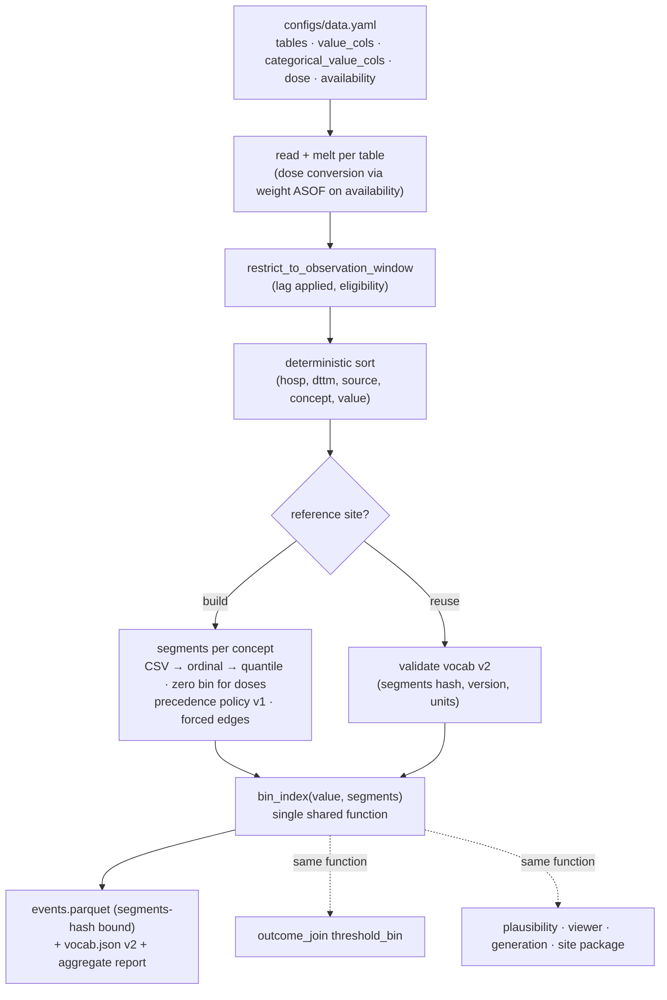

# Tokenizer Fixes - Bins for Everything - Plan

## Goal Capsule

- **Objective:** Before the first real training run, the model sees the value of every numeric clinical measurement, dose, setting and score it is given. Physician-designed bins are used wherever they exist. The same stay produces the same token stream on every run, in every consumer, and at every site.
- **Means:** a segment-based binning core that follows the CSV interval flags (KTD1, KTD2), bins for every numeric concept with zero-aware dose bins (KTD3), new value-bearing event sources (KTD5), a deterministic order (KTD6), and consumers and artifacts kept in lockstep (KTD7).
- **Authority:** MEMORY.md, then AGENTS.md, then this plan. The hard rules (treatments are inputs only, frozen vocab, availability ordering, no data leaves its node) are never relaxed.
- **Execution profile:** sequential.
  1. Core: U1, U2, U3.
  2. U4 then U5, in sequence. They share `tokenize.py`, `bundle.py`, `configs/data.yaml` and the vendored manifest.
  3. U6 after U5.
  4. U7.

  Test-first for every behavior change.
- **Stop conditions:**
  - Stop if a change would make a treatment source target-eligible.
  - Stop if a change would let raw rows leave the node.
  - Stop if the vendored `clif-validate` copy cannot be kept byte-identical through `sync_vendor.py`.
- **Tail ownership:** the calling pipeline owns review, PR, and CI.

---

## Product Contract

### Summary

Every numeric value the tokenizer emits gets a value bin. Measurements with physician CSV segments use those segments. Every other numeric concept gets frozen bins built from the reference site's training partition: labs and meds missing from the CSV, CRRT and ECMO/MCS settings, and ordinal assessment scores such as GCS, RASS and Braden. Every dose concept has a dedicated zero bin, so a stopped infusion never looks like a running one. Value-bearing categorical findings that have no numeric value become fused `concept=value` tokens: CAM-ICU and SBT results, ventilator mode, device, tracheostomy, and CRRT mode.

Infusion and intermittent doses, ventilator settings, and bedside assessments enter the stream. The bin rule follows the CSV's interval flags, and gaps, overlaps and ties resolve under one published precedence policy. Event order is fully specified. Stale artifacts and checkpoints are rejected, and the tokenization ablation becomes runnable.

Any model trained on the old token stream must be retrained. Today that is only the 6k-step local test checkpoint. The L40 run has not started.

### Problem Frame

The 2026-10-02 audit found the tokenizer drops most of the information the physicians designed bins for. Only 10 of 92 CSV measurements are binned, so potassium, sodium, pH and the others arrive as bare tokens with no magnitude. Doses, ventilator settings and assessments are absent or bare: a norepinephrine stop and start emit the same token. Same-timestamp events have no defined order. The user's direction: the model "doesn't look right", and "we need to have bins for everything".

The evidence supports binning every value as a fused token. Guo et al. 2026 found that adding value attributes to fused code tokens improved EHR foundation models across 74 tasks. ETHOS (arXiv 2502.06124) bins every lab and score into deciles. Sites differ in weight-based vs flat vasopressor dosing (Selby et al. 2023, PMID 36835880). Norepinephrine salt-vs-base reporting shifts mortality prediction substantially in MIMIC-IV (Morales et al. 2024, PMID 38961499). Per-kg normalization and per-site formulation auditing therefore matter for transport.

### Requirements

**Binning core**
- R1. Bins are ordered segments with explicit lower and upper closure, so CSV `(a,b]`, `[a,b]`, `(a,b)` and exact point rows are represented exactly.
- R2. A value maps to the segment the CSV's interval flags assign. At forced clinical-threshold edges, closure follows the outcome direction, so the threshold value lands on the non-event side. Values in a gap map to the nearest segment, and values beyond the floor or ceiling clamp to the end segment. No numeric event is dropped for being out of range.
- R3. Overlaps, near-duplicate boundaries, exact-boundary ties, equidistant gaps and forced-edge splits resolve by one published precedence policy. The policy is versioned in the vocabulary artifact, and the result is a strict partition.

**Coverage**
- R4. Every numeric concept present in the reference-site training partition gets bins.
  - CSV segments are used when the CSV defines the concept.
  - Integer-valued ordinal scales with at most 25 distinct values get one bin per value.
  - Every other numeric concept gets frozen quantile bins (decile target) with forced edges pinned.
- R5. Categorical findings that carry a value but no numeric value emit a fused `concept=value` token. An assessment row with a numeric value emits only its binned numeric token, never a second descriptor token. Pure presence events keep a bare token.

**New event sources (all treatment sources stay input-only)**
- R6. Continuous infusion doses are tokenized per medication.
  - Doses are converted to the CSV's preferred unit. Per-kg units use the most recent `weight_kg` whose availability time is at or before the dose's.
  - Doses that cannot be converted are binned in their native unit under a `category_unit` concept. Those fallback concepts are always fitted on the reference site, so they exist in the frozen vocabulary even where the reference site converted every row.
  - Every dose concept has a dedicated zero bin, so a stop is always distinct from a running dose.
- R7. Intermittent medication doses are converted to one canonical mass or units unit per medication. Only non-convertible units (`dose`, `mL`) fall back to `category_unit`. Each concept gets frozen bins with a zero bin.
- R8. Respiratory-support settings and observations (the 17 CSV numeric columns) become per-setting events, plus fused tokens for device, mode, and tracheostomy.
- R9. Patient assessments enter the stream: numeric scales binned per R4 and non-numeric results fused per R5. Assessments are target-eligible measurements, not treatments.
- R10. CRRT and ECMO/MCS numeric settings are tokenized as input-only events. ECMO/MCS metrics are qualified by device group, so an ECMO pump speed and a VAD pump speed are different concepts.

**Order and availability**
- R11. Event order within a stay is fully specified by availability time, then a stable tiebreak (source, concept, value). The sort is applied after the observation-window join.
- R12. Every table declares its availability semantics: `result` or `recorded`, plus `missing_storetime` where CLIF has no store time. Each table also declares an optional conservative lag (default 0). The tokenization report states the availability semantics per table, and the real-data gate fails if any table lacks a declaration.

**Consistency and compatibility**
- R13. Threshold queries (`threshold_bin`), plausibility checks, the sequence viewer, generation and its evaluation groups, and the site package bin values with the same function and the same frozen segments as the tokenizer.
- R14. The vocabulary artifact records the segments, closure, precedence-policy version, per-concept binning source, and reference unit or device metric, plus a tokenizer version. Tokenized shards, value statistics, bundles and checkpoints are bound to the tokenizer version and segments hash. Anything built by the previous tokenizer is rejected with a re-tokenize message, never silently reused.

**Ablation and verification**
- R15. Every tokenization-ablation arm runs end to end with masked losses and config-driven weights, on synthetic shards and on the real verification sample. The arms produce arm-specific inputs, and the continuous-fused and TextCode arms have real implementations, not stubs.
- R16. A tokenization run writes an aggregate-only report. It contains no row-level data. Contents:
  - Events and stays by source.
  - Binned vs bare counts.
  - Single-bin concepts.
  - Unconverted doses by reason.
  - Gap and clamp counts.
  - Unit or metric mismatches.
  - `<unk>` rate on non-fit partitions.
  - Events per stay (mean and p99).
  - Availability semantics per table.

### Key Decisions

- **All gaps T1–T7 are in scope, and every numeric value gets bins.** (session-settled: user-directed — chosen over "T3 + T1 only, defer the rest" and over CSV-only binning: user said "fix this all" and "we need to have bins for everything.") Governs R4, R5, R6, R7, R8, R9, R10, R15.
- **Bin closure follows the physician CSV's interval flags.** (session-settled: user-approved — chosen over keeping the uniform `[a,b)` rule: it matches the physician bin design and CLIFATRON v1.) Governs R1, R2, R3.

### Scope Boundaries

- Demographics, Elixhauser comorbidities, and other static context tokens are excluded.
- New outcome definitions are excluded. Outcomes stay `configs/cohort.yaml` as-is.
- Changes to the hazard-head target set are excluded.
- The full 546k-stay retokenization and any retraining are excluded. Those are the user's L40 run. This plan verifies on a bounded sample of eligible ICU episodes, and that sample's vocabulary is smoke-only (KTD9).

### Deferred to Follow-Up Work

- Static context tokens (demographics, comorbidities) as a sequence prefix.
- A derived norepinephrine-equivalent (NEE) shock-severity event (Kotani et al. 2023, PMID 36670410). It requires concurrent-infusion state tracking.
- Clinician review of the data-driven bins for non-CSV concepts. Physician segments added to the CSV would replace them.
- Fixing the `angiotension` spelling upstream in the consortium CSV. This plan aliases it locally.
- Per-site norepinephrine formulation (salt vs base) harmonization. The report flags it as a site-audit question, because the data alone cannot detect it.

---

## Planning Contract

### Key Technical Decisions

- KTD1. **Segments, not edge lists.** Each binned concept stores an ordered list of segments `{lo, hi, lo_closed, hi_closed}`; point bins have `lo == hi`. The vocab uses one token per segment index (`concept=k`). A single function `bin_index(value, segments)` is the only binning code path. The tokenizer, `outcome_join`, plausibility, the viewer, generation and the site package all use it. (session-settled: user-approved — chosen over keeping the uniform `[a,b)` rule: it matches the physician bin design and CLIFATRON v1.) Governs R1, R2, R13.
  - **Conflict call-out:** honoring the CSV flags literally puts MAP 65 (`(61,65]`) and SpO₂ 88 (`[49.9,88]`) on the abnormal side. That contradicts the strict outcome labels (`value < thr` in `src/data/cohort.py`) for 2.3% and 0.35% of those readings. Resolution within the settled decision: forced threshold edges take outcome-direction closure, and every other boundary follows the CSV. This is suboptimal-but-workable, not invalidating.
- KTD2. **Precedence policy v1, stored in the vocab.** Steps are applied in order:
  1. Boundaries within 1e-6 relative are merged. This fixes temp_c 37.499/37.5.
  2. An overlap keeps the earlier segment's upper endpoint and its closure. The later segment starts there with the complementary closure. All four closure combinations are tested.
  3. Forced edges split the containing segment, with closure set by the target's direction (KTD1). Non-target forced edges use `[`.
  4. Exact point rows become point segments and win over any interval containing the same value.
  5. A value in a gap goes to the nearest segment; an equidistant value goes to the lower segment.
  6. Out-of-range values clamp to the end segment.
  7. CSV `angiotension_*` is aliased to CLIF `angiotensin`.
- KTD3. **Bins for every numeric concept, with zero-aware doses.** Source priority:
  1. CSV segments.
  2. Ordinal one-bin-per-value when the training values are integer-valued with at most 25 distinct values (GCS and components, RASS, Braden).
  3. Frozen quantile segments (target 10, deduplicated, `[a,b)` closure, forced edges pinned).

  Every dose concept (continuous and intermittent, CSV or not) gets a `[0,0]` point segment, and its quantiles are fit on strictly positive values. Fitting uses the reference site's train partition only. Concepts with fewer than 20 training values get a single bin; they are reported, never silently bare. Governs R4, R6, R7.
- KTD4. **Fused categorical values.** `concept=value` uses the CLIF `*_category` value or the assessment `categorical_value`, normalized (lowercase, spaces become `_`). It is emitted only when the row has no numeric value. Unseen values map to `<unk>`, and the report counts them by concept. Governs R5, R9.
- KTD5. **New sources are config-declared.** `configs/data.yaml` gains:
  - `value_cols` for wide tables (resp, CRRT, ECMO).
  - `categorical_value_cols`.
  - `availability` and `availability_lag_minutes` per table.
  - A `dose` block: dose and unit columns, a unit table, and `weight_source: vitals.weight_kg`.

  Weight is joined by DuckDB ASOF on availability time at or before the dose. Conversion is re-implemented in DuckDB SQL, not clifpy, which is not a dependency.

  Native-unit fallback concepts for per-kg drugs are fit on the reference site's pre-conversion doses. Every dose row at Site 1 has a prior weight, so fallback concepts would otherwise never be fit and would become `<unk>` at sites without weights.

  ECMO/MCS concepts are `{mcs_group}_{column}`. Every new SQL-interpolated config field is added to the identifier validator in `src/eval/bundle.py`. Governs R6, R7, R8, R9, R10, R12.
- KTD6. **Sort after the join.** Order is `(hosp_id, dttm, source, concept, value)` with `maintain_order=True`, after `restrict_to_observation_window`, with the per-table lag applied before windowing. Governs R11, R12.
- KTD7. **Lockstep consumers and a hard compatibility break.**
  - `vocab.json` v2 carries: `segments`, `binning_sources`, `reference_units`, `precedence_policy`, and `tokenizer_version: 2`. `numeric_edges` hashes the segments.
  - `validate_vocabulary_artifact` rejects version-1 artifacts.
  - Shard records carry the segments hash, and `ModelDataset` checks it.
  - `value_stats` binds to the segments hash.
  - Checkpoints record the vocab and segments hashes. `generate`, the viewer, `clif_validate.load_checkpoint` and training resume reject a mismatch.
  - The threshold head's `n_value_bins` is derived from the vocab, as max bins + 1, in training and in the site package's checkpoint loader. That fixes the latent out-of-range index.
  - `bundle_inference` passes validated segments into `tokenize_site`.
  - `generative._group_of` classifies tokens by source and binning source instead of by whether they contain `=`.
  - `validate_units` extends to every binned concept, using the vocab's reference units.
  - Every touched vendored module is re-synced, and new helper modules are added to `VENDOR_FILES`.

  Governs R13, R14.
- KTD8. **Ablation reuses the pretrain path.**
  - `pretrain.py` setup is factored into `build_loaders()`.
  - Each arm takes its own events and vocab path.
  - Losses are masked, with config weights.
  - `freeze_trunk` applies only with an init checkpoint.
  - The continuous-fused arm uses edgeless input tokens plus a normalized current-value field and mask from `value_stats`. Its `threshold_bin` and `n_value_bins` come from the primary clinical segments via `bin_index`.
  - TextCode embeds a generated description (concept, source table, bin interval, unit) for every fused vocab id. The mCIDE descriptions are not in the repo. It uses the frozen BioClinical-ModernBERT-base encoder from `data.yaml` plus a trainable projection.
  - Per-arm acceptance requires arm-specific inputs that differ between arms on the same fixture, nonzero masked-loss counts, and finite loss.

  Governs R15.
- KTD9. **Verification sample.**
  - The sample is N eligible ICU episodes drawn deterministically from the episode artifact, not the first N hospitalization ids.
  - `<unk>` is measured on non-fit partitions.
  - The sample's vocabulary is marked `sample: true` in provenance, and training refuses a sample-built vocabulary.
  - The production vocabulary comes from the full train partition in the L40 retokenization.

  Governs R15, R16.

### High-Level Technical Design

### Assumptions

- Ordinal detection (integer values, at most 25 distinct) identifies GCS, RASS and Braden, and no continuous lab qualifies. The report lists every concept's binning source, so a misclassification is visible.
- Mean sequence length roughly doubles or triples from 271 events per stay, and the p99 stays under the 8192 context. U7 measures both.
- At Site 1, every continuous-dose row has a prior weight. The native-unit fallback mainly protects external sites.

### Risks & Dependencies

| Risk | Mitigation |
|---|---|
| Vocab grows to a few thousand tokens | Within the 10k untied-embedding budget. The report records the final size. |
| Python per-stay encode loop slows with 2–3× events | Measure on the sample. Vectorize per-concept bin assignment if a stay takes over 2 ms. |
| An external site charts different categorical strings or units | The report shows `<unk>` by concept and unit mismatches. The unit mismatch is an error under `on_mismatch: error`. |
| Norepinephrine salt vs base differs by site | The report documents it as a site-audit item. Harmonization is deferred. |
| Synthetic fixtures hard-coded to the old rule | U5 recomputes `tau_bin` via `bin_index`. The synthetic `map` gets more than 10 segments, so non-default `n_value_bins` is exercised. |

### Sources & Research

- Guo et al. 2026, *Tokenization Tradeoffs in Structured EHR Foundation Models* (arXiv 2603.15644): fused tokens and value attributes.
- Renc et al., ETHOS (arXiv 2502.06124): decile binning for all numeric values.
- McCann et al. 2026 (medRxiv 2026.08.04): continuous-fused trade-offs.
- Selby et al. 2023, PMID 36835880: weight-based vs flat norepinephrine.
- Morales et al. 2024, PMID 38961499: norepinephrine formulation reporting.
- Kotani et al. 2023, PMID 36670410: updated NEE.
- Chou et al. 2017, PMID 28089112: GCS motor vs total.
- Code: v1 `external/clifatron/tokenETL/utils/polars_utils.py` interval semantics, `builders/medication_builder.py` weight ASOF.

---

## Implementation Units

### U1. Segment model, precedence policy, single binning function

- **Goal:** CSV rows become a strict, closure-aware partition, and one function bins any value.
- **Requirements:** R1, R2, R3 (KTD1, KTD2)
- **Dependencies:** none
- **Files:** `src/data/segments.py` (new), `src/data/tokenize.py`, `tests/test_segments.py` (new), `tests/test_tokenize_bins.py`, `clif-validate/scripts/sync_vendor.py` (`VENDOR_FILES`)
- **Approach:**
  1. Load the CSV and apply precedence policy v1 in order.
  2. `bin_index` checks point segments, then intervals, then gaps (nearest, ties to lower), then clamps.
  3. Rewrite `_soft_bins` on segment centers and widths. Point and end segments borrow neighbor widths.
- **Execution note:** test-first. Write the boundary table before the implementation.
- **Patterns to follow:** `build_clinical_segment_bins` and `_soft_bins` in `src/data/tokenize.py`, and v1 `polars_utils.py` semantics.
- **Test scenarios:**
  - Lactate 2.0 → `(1.6,2.0]`. Lactate 2.01 → the next bin.
  - MAP 65.0 → the bin above 65 (direction override). MAP 64.9 → below. SpO₂ 88.0 → above 88. SpO₂ 92 → the `[92,92]` point bin.
  - Respiratory rate 9.5 in the gap → nearest. An equidistant value → lower.
  - Overlap: all four closure combinations of `(a,b]`/`[a,b)` against `(c,d]`/`[c,d)` give a strict partition, and the earlier segment owns the shared endpoint.
  - temp_c 37.4995 → exactly one segment. FiO₂ 0.2 → by the gap rule. Lactate 0.0 and 50 → clamp.
  - Non-finite or None → no bin.
  - The soft triple sums to 1, has width 3, and is centered on the containing segment for interior, end and point segments.
  - Every CSV measurement loads into a strict partition.
- **Verification:** segment tests pass, and policy v1 is serialized with the segments.

### U2. Bins for every numeric concept, zero-aware doses, fused categoricals

- **Goal:** every numeric concept is binned, doses keep zero distinct, and value-only categoricals are fused.
- **Requirements:** R4, R5 (KTD3, KTD4)
- **Dependencies:** U1
- **Files:** `src/data/segments.py`, `src/data/tokenize.py` (`build_segments`, `build_vocab`, encode loop), `configs/data.yaml` (`value_binning.coverage: all`, ordinal and quantile parameters), `tests/test_segments.py`, `tests/test_tokenize_alignment.py`
- **Approach:**
  1. Choose each concept's source in priority order and record it in `binning_sources`.
  2. Add the `[0,0]` segment for every dose concept, and fit quantiles on positive values only.
  3. Emit fused `concept=value` only for rows without a numeric value.
  4. The decile arm sets `coverage: all` with every source set to quantile.
- **Execution note:** test-first.
- **Test scenarios:**
  - Potassium → CSV segments.
  - `gcs_total` 3–15 → 13 ordinal point bins.
  - A synthetic non-CSV lab with 500 values → about 10 quantile bins with forced edges pinned.
  - A concept with 5 values → a single bin, reported as single-bin.
  - Heparin units/hour with 40% zeros: dose 0 and 1 unit/hour → different bins.
  - A stop on unconverted `fentanyl_mcg_hr` → the zero bin, distinct from 25.
  - A Braden subscale row with numeric 2 and descriptor "Very Limited" → exactly one token (the ordinal bin).
  - `cam_total` "Negative" with no numeric → `cam_total=negative`. An unseen value → `<unk>`.
  - Fit only on train: a validation-only concept gets no bins.
- **Verification:** alignment tests pass, and every numeric concept in a multi-source fixture has a `binning_sources` entry.

### U3. Deterministic order and declared availability

- **Goal:** identical input always gives an identical token stream, and every table states its availability semantics.
- **Requirements:** R11, R12 (KTD6)
- **Dependencies:** U1
- **Files:** `src/data/tokenize.py`, `configs/data.yaml` (`availability`, `availability_lag_minutes` per table), `tests/test_tokenize_alignment.py`, `tests/test_data_config.py`
- **Approach:** remove the pre-join sort. Sort after the window join with the full key and `maintain_order=True`. Apply the lag before windowing. Config validation requires an `availability` declaration per table.
- **Execution note:** characterization-first. Show that shuffled input changes the output today.
- **Test scenarios:**
  - Two shuffled row orders → byte-identical `events.parquet`.
  - Three vitals at one timestamp → ordered by concept, then value.
  - A 10-minute lag excludes an event 5 minutes before the anchor and keeps one 15 minutes before.
  - Lag 0 → current windowing unchanged.
  - A table without `availability` → a config error.
  - Vitals declare `missing_storetime`.
- **Verification:** the tests pass, and two synthetic runs give the same file hash.

### U4. New event sources: doses, ventilator, assessments, CRRT, ECMO/MCS

- **Goal:** treatments and assessments the model was missing enter the stream with values.
- **Requirements:** R6, R7, R8, R9, R10 (KTD5)
- **Dependencies:** U2, U3
- **Files:** `src/data/tokenize.py` (`_read_table` melt, dose and assessment paths), `src/data/units.py` (new), `configs/data.yaml` (tables: `meds` dose block, `meds_intermittent`, `resp_support`, `assessments`, `crrt`, `ecmo`), `src/eval/bundle.py` (identifier validator), `tests/test_units.py` (new), `tests/test_data_config.py`, `clif-validate/scripts/sync_vendor.py`
- **Approach:**
  1. Meds: ASOF-join `weight_kg` on availability time at or before `admin_dttm`. Convert to the CSV preferred unit (mcg↔mg, hr↔min, u/hr→u/min, per-kg via weight). Record the conversion status. Fit native-unit fallback concepts on pre-conversion values.
  2. Intermittent meds: convert mass and units to a canonical unit per category. Only `dose` and `mL` fall back to `category_unit`.
  3. Resp: melt the 17 numeric columns, plus fused mode, device and tracheostomy.
  4. Assessments: numeric value → numeric event, else categorical → fused. Target-eligible.
  5. CRRT: melt the numeric columns, plus fused mode. ECMO/MCS: `{mcs_group}_{column}`. Both input-only.
  6. `input_only` stays true for meds, intermittent meds, resp, CRRT, ECMO and ADT.
- **Execution note:** test-first on the unit table, then the synthetic-parquet integration.
- **Patterns to follow:** v1 `medication_builder.py` and `respiratory_support_builder.py` behavior (re-implemented). `_read_table`'s parameterized SQL.
- **Test scenarios:**
  - Fentanyl 100 mcg/hour with 80 kg recorded 2 h before → `fentanyl_mcg_kg_hr` = 1.25.
  - The same dose with no prior weight → `fentanyl_mcg_hr`, status `no_weight`, and a vocab entry exists because the fallback is fitted.
  - A weight recorded after the dose is never used.
  - Vasopressin 2.4 units/hour → `vasopressin_u_min` = 0.04.
  - Cefepime 2 grams and 2000 mg → the same concept and the same bin.
  - A stop row with dose 0 → the zero bin.
  - A resp row with fio2_set 0.4, peep_set 8 and mode AC/VC → three events plus the fused mode.
  - GCS total 8 → ordinal, target-eligible. CAM "Positive" → fused.
  - ECMO `device_rate` for an ECMO group and a VAD group → two distinct concepts.
  - Every med, resp, CRRT and ECMO event has `target_eligible == False`.
  - A config field containing `;DROP` → rejected by the bundle identifier validator.
- **Verification:** unit and config tests pass. A synthetic multi-table tokenization emits events from every new source.

### U5. Consumers, compatibility, and the site package

- **Goal:** every component bins identically, and every stale artifact is rejected.
- **Requirements:** R13, R14 (KTD7)
- **Dependencies:** U4
- **Files:**
  - Data: `src/data/tokenize.py` (vocab v2, validation, `validate_units` for every binned concept), `src/data/outcome_join.py`, `src/data/value_stats.py`, `src/data/dataset.py` (segments-hash check)
  - Eval: `src/eval/clinical_plausibility.py`, `src/eval/generative.py` (`_group_of`), `src/eval/clif_validate.py` (`load_checkpoint` `n_value_bins` from vocab), `src/eval/bundle_inference.py` (pass segments), `src/eval/bundle.py` (`tau_bin` check), `src/eval/synthetic_bundle.py` (`map` with more than 10 segments), `src/eval/reproduce_synthetic.py`
  - Model and training: `src/viewer/sequence_viewer.py` (remove the duplicate `load_vocab_edges`), `src/model/generate.py`, `src/model/heads.py`, `src/model/head_adapter.py`, `src/train/pretrain.py`, `src/train/run_arm.py`, `src/train/joint_pretrain.py`, `src/train/checkpoint.py` (record and check hashes)
  - Config: `configs/artifact_policy.yaml`
  - Tests: `tests/test_outcome_join.py` (new), `tests/test_value_stats.py`, `tests/test_clinical_plausibility.py`, `tests/test_data_config.py`, `tests/test_generative_eval.py`, `tests/test_checkpoint.py`
  - The `clif-validate/` vendored copies and tests
- **Approach:**
  1. Replace every independent binning computation with `bin_index`.
  2. Bump artifacts to v2 and bind shards, statistics and checkpoints to the segments hash.
  3. Derive `n_value_bins` from the vocab everywhere, including the site loader.
  4. Recompute fixture `tau_bin` values.
  5. Re-sync the vendored copy.
- **Execution note:** test-first for `outcome_join` (it has no tests today) and for the stale-artifact rejections.
- **Test scenarios:**
  - `threshold_bin` for MAP below 65 equals the token bin of 64.9. For lactate above 4, it equals the bin of 4.01.
  - A v1 `vocab.json` → `QualificationError` mentioning re-tokenization.
  - A v1 shard (no segments hash) → `ModelDataset` rejects it.
  - A checkpoint whose recorded segments hash differs from the vocab's → refused by `generate`, the viewer and `clif_validate.load_checkpoint`.
  - Value stats for different segments with the same vocab → rejected.
  - A synthetic bundle with `map` at 12 or more segments → the site package loads its checkpoint strictly with derived `n_value_bins`.
  - A bundle declaring an inconsistent `tau_bin` → fails at load.
  - The site package's vendored tokenizer and the repo tokenizer produce byte-identical streams on the same fixture.
  - `device_category=imv` and a med dose token → the treatment/device group in the generative eval.
  - Plausibility flags an out-of-range bin. The viewer decodes `map=6` with correct brackets.
  - A unit mismatch on a non-target binned concept → an error under `on_mismatch: error`.
  - The full synthetic reproduce passes.
- **Verification:** `tests/` and `clif-validate/tests/` pass. `sync_vendor.py --check` is clean. The reproduce passes.

### U6. Runnable tokenization ablation

- **Goal:** every ablation arm trains end to end with arm-specific inputs.
- **Requirements:** R15 (KTD8)
- **Dependencies:** U5
- **Files:**
  - Training: `src/train/pretrain.py` (`build_loaders`), `src/train/run_tokenization_ablation.py`, `src/train/run_arm.py`
  - Arm implementations: `src/data/tokenize_continuous.py`, `src/model/encoder_continuous.py`, `src/data/tokenize_textcode.py`
  - Data path: `src/data/dataset.py`, `src/data/collate.py` (current-value field and mask)
  - Config: `configs/tokenization_ablation.yaml`
    - Arms map to schemes.
    - Each arm has its own events and vocab paths.
    - Outcomes that don't exist in `cohort.yaml` are removed.
    - A clinical+soft primary arm is added.
    - The TextCode model is set to `-base`.
  - Tests: `tests/test_tokenization_ablation.py`
- **Approach:**
  1. The runner loads the arm's shards through `build_loaders`.
  2. Training goes through `Model.forward` and `engine.train` with masked losses.
  3. Continuous-fused gets its threshold bins from the primary segments.
  4. TextCode uses an injectable encoder, so tests need no network.
- **Execution note:** test-first. Start with a failing tiny end-to-end step per arm.
- **Test scenarios:**
  - Each of the 6 arms (clinical+soft, clinical hard, deciles, deciles+soft, continuous_fused, textcode) runs 2 optimizer steps on a synthetic shard with finite loss and a nonzero masked-target count.
  - The arms' model inputs differ on the same fixture: a hard vs soft token tensor, a deciles vs clinical vocab, the continuous value channel, and the TextCode embedding table.
  - continuous_fused with a categorical (NaN) event → no NaN in the loss. Its `threshold_bin` values are nonnegative.
  - The TextCode description for `lactate=6` contains the concept, its interval and its unit.
  - `freeze_trunk` without an init checkpoint → a warning, and the trunk stays trainable.
  - Changing `value_regression.weight` changes the value-loss contribution.
- **Verification:** ablation tests pass on CPU/MPS in under 60 s.

### U7. Report, real-data verification, and docs

- **Goal:** the new tokenizer is proven on a real, eligible-ICU sample, and the docs describe it.
- **Requirements:** R12, R15, R16 (KTD9), and the documentation of every R.
- **Dependencies:** U1–U6
- **Files:** `src/data/tokenize.py` (aggregate report; `--sample-episodes N` drawn deterministically from the episode artifact; `sample: true` provenance), `src/train/pretrain.py` (refuse a sample vocab), `website/docs/data-tokenization.md`, `MEMORY.md` (§E1b → resolved, with the retrain note), `docs/solutions/methods-decisions/clinical-segment-binning-primary-scheme.md`, `README.md`, `tests/test_tokenize_alignment.py`
- **Approach:**
  1. Write `tokenization_report.json`, aggregate-only.
  2. Run the reference build on 5,000 eligible ICU episodes from the staged local data into `output/` (gitignored, PHI on node).
  3. Run all 6 ablation arms for 2 steps on the resulting shard.
  4. Inspect the report.
  5. Update the docs to the as-built behavior: T1–T7 resolved, T7 shown as declared per-table availability.
- **Execution note:** smoke-first on real data after the synthetic suites pass.
- **Test scenarios:**
  - The report has no `hosp_id` or other identifiers.
  - `--sample-episodes` selects only eligible ICU episodes and is deterministic across runs.
  - Training refuses a vocab with `sample: true`.
  - The real-data gate fails when a table lacks an availability declaration.
- **Verification:** the real-sample report shows:
  - 0 numeric concepts emitted bare.
  - Single-bin concepts listed.
  - Mean and p99 events per stay within 8192.
  - `<unk>` rate under 1% on non-fit partitions.
  - Per-source stay counts, with low-count sources such as ECMO flagged as unverified.
  - All 6 arms complete 2 steps with finite loss.

  The website build is clean.

---

## Verification Contract

| Check | Command | Applies to |
|---|---|---|
| Repo suite | `uv run --frozen --group dev pytest tests/ -q` | all units |
| Site-package suite + vendor drift | `uv run --frozen --group dev pytest clif-validate/tests/ -q` and `uv run python clif-validate/scripts/sync_vendor.py --check` | U1, U4, U5 |
| Synthetic federated reproduce | `uv run python -m src.eval.reproduce_synthetic` | U5 |
| Docs build | `cd website && npm run build` (no broken links/anchors) | U7 |
| Real-data sample + ablation smoke | `uv run python -m src.data.tokenize --site mimic --in ~/Data/clif-source --out output/intermediate_phi/mimic_v2_sample --build-vocab --episodes <episodes.parquet> --sample-episodes 5000`, inspect `tokenization_report.json` (aggregate only), then run each arm of `src.train.run_tokenization_ablation` for 2 steps on that shard | U7 |

---

## Definition of Done

- R1–R16 hold, and every Verification Contract check passes.
- Every behavior-changing unit has a test that failed before its change.
- No treatment source is target-eligible, and every tokenization artifact stays under `output/` (gitignored).
- MEMORY.md and the tokenizer spec state that existing tokenized artifacts and checkpoints must be rebuilt, and that the production vocabulary must be fit on the full train partition.
- No abandoned-attempt code remains in the diff.
