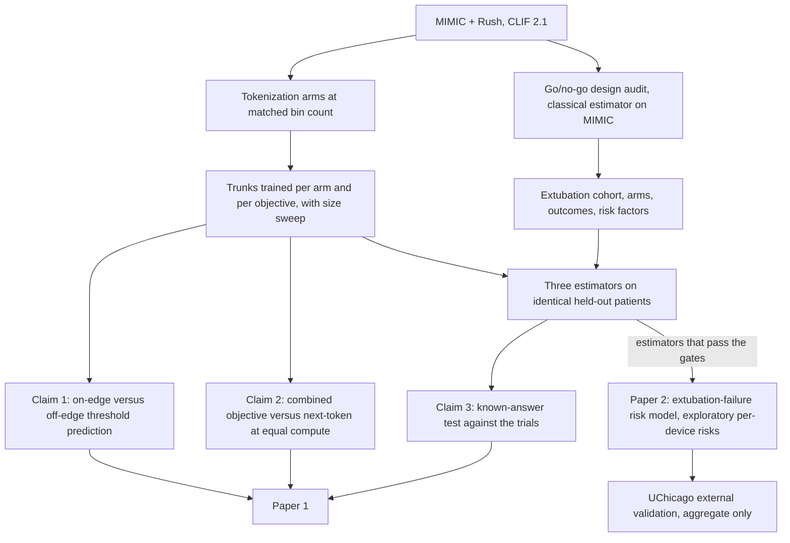
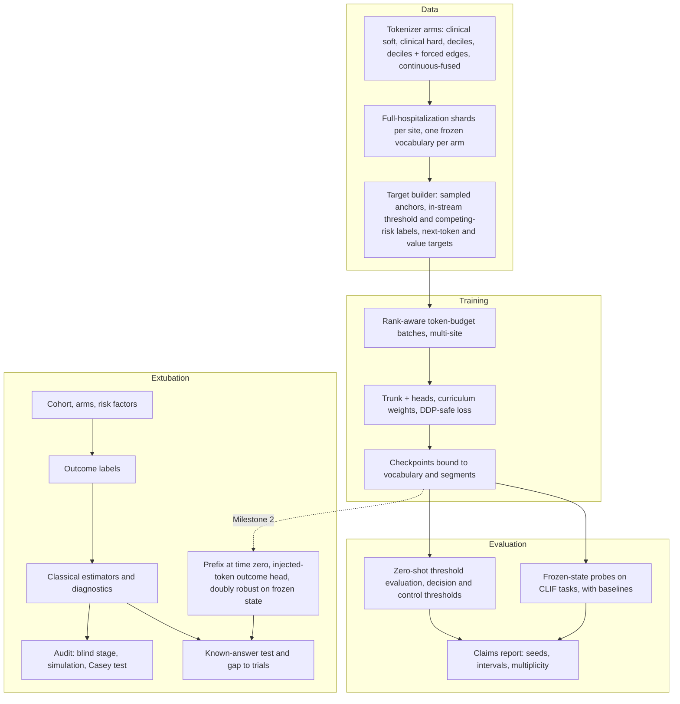

# CLIFATRON 2.0 Three-Claim Paper and Extubation Risk Model - Plan

> **Revision 2026-10-03 (product authority):** the goal was re-confirmed — see the "GOAL RE-CONFIRMED" section of `AGENTS.md`. Claim 3 is now the injected-device check against the trial *pattern* with a classical comparison and negative controls as the only safeguards; the registered agreement-margin rubric (R10, R25, R27, R29, R32 stop rules) is frozen as optional and off the critical path. Paper 2 = extubation-failure risk plus exploratory per-device risks. Context stays at 8,192 tokens. Clinical decisions: `docs/decisions/2026-10-03-clinical-decisions.md`.

## Goal Capsule

- **Objective:** ICU researchers have an open, CLIF-native ICU foundation model whose AI contribution is shown by tests that could have failed: what threshold-aligned tokenization adds, what the combined time-to-event training objective adds, and whether the model, with the device injected at extubation, reproduces what randomized trials established about who benefits from high-flow nasal cannula (HFNC) and noninvasive ventilation (NIV). A second, clinical paper gives an externally validated extubation-failure risk model. Everything is evaluated retrospectively; a clinician-facing tool is not part of this work.
- **Means:** One from-scratch CLIFATRON 2.0 decoder carries all three claims (Key Decisions); the extubation application and the risk model are downstream studies on top of it.
- **Product authority:** J.C. Rojas. Development data: MIMIC-IV-Ext-CLIF and Rush, trained together on the Rush L40 node. External validation: UChicago through model-to-data. Northwestern joins later and is not active scope.
- **Authority:** the Product Contract decides what is built; Key Technical Decisions decide how; `AGENTS.md` hard rules win over both except where R30 amends rule 1.
- **Execution profile:** two tracks in parallel (training and evaluation: U2–U8; extubation audit: U9–U13) on disjoint files apart from the vendored site-package tree, each unit landed as one commit on the feature branch with its tests. Milestone 1 (U1–U13, U19) makes the code ready for the L40 node; Milestone 2 (U14–U17) follows the first base checkpoint; Milestone 3 (U18) follows partner readiness.
- **Stop conditions:** stop and report if research or a test shows a session-settled decision cannot work; never run an outcome-by-arm comparison outside the registered protocol (the audit's Casey test is the only one before registration); never print or commit patient-level data.
- **Open blockers:** no trained base model checkpoint yet (GEM plan unit G2, itself blocked by the training-readiness fixes from the 2026-10-03 audit); Rush data not staged on the L40 box; `clif-validate` not yet partner-ready for UChicago; written approval to transfer Rush-derived model weights to UChicago (project gate G5) not yet obtained.

---

## Product Contract

### Summary

Paper 1 makes three claims about one CLIF-native ICU foundation model, each with a pre-specified test that can fail. Claim 1: bin edges placed at clinical decision thresholds and shared with the training objective improve prediction and calibration at those thresholds. Claim 2: the combined time-to-event objective beats next-token training at equal compute. Claim 3: with the post-extubation device injected, the model reproduces the randomized-trial pattern of who benefits from NIV and HFNC, at least as well as a classical emulation. Paper 2 is an extubation-failure risk model on the guideline's risk axis, externally validated at UChicago, with per-device risks reported as exploratory.

### Problem Frame

Generic generative event models (GEMs) on structured EHR data are published, including on CLIF. The CLIF consortium trained federated GEMs across UChicago, Northwestern and BIDMC (Burkhart 2026) and benchmarked 28 tokenization variants on MIMIC-IV (Lee 2026). That benchmark settled several questions: fusing code and value into one token helps, time-aware positions match plain event order, and bins anchored to reference ranges or softened across neighbours help only on selected outcomes. A general claim that a new tokenization improves performance would therefore not survive review.

What that work left open is narrower. No one has tied bin edges to the clinical thresholds a model is trained to predict, tested soft discretization on fused tokens, or used physician-designed zones for vitals, doses and ventilator settings. The training objectives this project combines (threshold-conditioned time-to-event, competing-risk incidence, value regression) are each published, but not trained together on an ICU token stream, and the next-token-to-time-to-event curriculum has no controlled test.

Intervention-conditioned generation has been compared with trials outside the ICU (HealthFormer, 41 of 41 directions in a non-ICU cohort) and tested for known pharmacology on MIMIC-IV (FlatASCEND, 4 of 10 directions, which its authors attribute to learned associations). Neither applies confounding control or negative controls to an ICU EHR model.

Post-extubation support is the application because it is a daily decision with strong trial evidence and poor translation. Trials and the 2026 ATS guideline say HFNC for low-risk and NIV for high-risk patients, yet "high risk" has no operational bedside definition, bedside judgement flags only a third of patients who are later reintubated, and US use of post-extubation support is low. Observational analyses of this decision fail in a predictable way: a published MIMIC-IV analysis found HFNC better than NIV at BMI ≥40, the opposite of the trials, and local MIMIC counts show patients started on NIV or HFNC with roughly double the outcome rate of those on nasal cannula. No target trial emulation of post-extubation HFNC or NIV has been published. The evidence is in `notes/ai-novelty-audit.md` and `notes/extubation-evidence-review.md`.

### Key Decisions

- **Paper 1 makes three falsifiable claims: threshold-aligned tokenization, the combined time-to-event objective, and the extubation application.** (session-settled: user-directed — chosen over a tokenization-led paper, an objective-led paper and an extubation-led paper: the AI contribution must lead, and the consortium's own benchmark found no consistent gain for clinically anchored bins or soft discretization, so tokenization alone cannot carry the headline.) Governs R31, R34, R35, R13.
- **A go/no-go design audit comes first for the extubation application; MIMIC is exploratory and Rush confirmatory.** (session-settled: user-approved — chosen over building every prerequisite before testing viability: the classical emulation alone can show within weeks whether the data support the application.) Governs R32, R33.
- **One foundation model, separate downstream study.** The pretrained trunk is reused unchanged; the cohort, outcomes, outcome head and estimators live in the extubation study. MIMIC has about 15,000 eligible extubations, too few to train a strong representation from scratch. Governs R11.
- **Reintubation is read from a dedicated head; respiratory support stays input-only.** (session-settled: user-directed — chosen over making respiratory-support tokens target-eligible, making all treatments targets, or keeping only non-treatment rollout outcomes: hard rule #1 stays intact and reintubation still becomes answerable.) Governs R11, R22.
- **Hard rule #1 gets a scoped amendment for study endpoints.** (session-settled: user-approved — chosen over leaving the rule's wording unchanged: the outcome contract and the config test treat a new ventilation event as a treatment that can never be a target, which would block the reintubation outcome.) The trunk never trains on treatment targets; study heads downstream of it may use trial endpoints defined by a treatment event, such as reintubation, as labels. Governs R4, R11, R30.
- **The extubation claim is the population pattern checked against RCTs; per-patient estimates are second.** (session-settled: user-approved — chosen over per-patient effects first, bedside deployment, or a GEM showcase: the RCTs give an external ground truth that per-patient estimates lack.) Governs R8, R13.
- **Development on Rush + MIMIC on the Rush L40 node; UChicago external now; Northwestern later.** (session-settled: user-directed — chosen over train-on-one-validate-on-three, per-site models, federated training, and pooling under a DUA: Rush data never leaves Rush and rule #5 holds.) Governs R6, R15, R20.
- **The decision is the device at the actual extubation, not extubation timing.** (session-settled: user-directed — chosen over a timing question and a combined device-plus-timing study: it mirrors the RCTs.) Governs R2, R3.
- **For the extubation claim, success means matching the trials and doing at least as well as a classical emulation.** (session-settled: user-approved — chosen over matching trial direction and CI alone, or direction only: a plain covariate model is the comparator a reviewer will ask for.) Governs R10, R11.
- **Agreement with trials is measured per estimator, by the gap to a registered benchmark.** (session-settled: user-approved — chosen over counting agreements at least as often as the classical emulation: that count can pass by chance and with no trial reproduced.) Governs R10, R27, R29.
- **Paper 2 is a risk model; the device recommendation waits for randomized or prospective validation.** (session-settled: user-approved — chosen over keeping the recommendation with stronger gates: every added gate would still rest on the same confounded estimates.) Governs R16, R17, R18, R19.
- **UChicago validation belongs to Paper 2.** (session-settled: user-approved — chosen over running the full extubation analysis at UChicago in Paper 1: two of the three estimators need fitting on UChicago data, which the frozen-bundle package cannot do today.) Governs R15, R20.
- **"Best" device means the lowest predicted 7-day reintubation or death.** (session-settled: user-approved — chosen over 72-h reintubation alone and a composite including respiratory failure: death competes with reintubation and matches the HIGH-WEAN horizon.) Governs R4, R13, R17.
- **Estimation uses the injected-token head plus a doubly robust cross-check on the frozen model state.** (session-settled: user-approved — chosen over injection alone and doubly robust alone: a single-model estimate is biased toward the null, and disagreement between the two flags confounding.) Governs R11.
- **Rollouts are descriptive only.** With treatments never generated, a rollout simulates "no further documented treatment", which is outside the training data; claims come only from the head and the doubly robust estimator. Governs R22.
- **The device-choice (propensity) model is an estimator nuisance, not a model target.** It is fit inside the estimator, never trained into the trunk and never shown to clinicians, so hard rule #1 holds. Governs R11.
- **No reward-based post-training.** In the closest prior work it destroyed the associations the model had learned correctly. Governs R31.
- **Two papers share one model: Paper 1 carries the three claims and Paper 2 is the clinical risk model.** Governs R23.

### How the study fits together



### Requirements

**Model, tokenization and objective (claims 1 and 2)**

- R34. Tokenization arms are compared at matched bin count and equal training budget, with at least three seeds each: physician clinical-segment bins with soft inputs (primary), the same bins with hard inputs, population deciles, deciles with forced threshold edges, and continuous-fused values.
- R35. Claim 1 is tested by comparing zero-shot prediction and calibration for thresholds that sit on a forced bin edge with thresholds that do not, across the R34 arms. The claim is rejected if deciles match the primary arm within the confidence interval on the on-edge thresholds, or if the gain disappears at matched bin count.
- R31. Claim 2 is tested by comparing the combined objective (threshold hazard, competing-risk incidence, value regression and low-weight next token, with the next-token-to-time-to-event curriculum) at equal compute with next-token-only training, with each component removed, and with the curriculum removed. The claim is rejected if next-token training with a linear probe, or generated rollouts, match it on discrimination and calibration.
- R36. Two ablations are reported without being headline claims: event order only versus admission-relative time positions, and language-grounded codes versus the frozen vocabulary for cross-site transfer.
- R37. The primary arm is trained at about 3M, 10M and 30M parameters, and the reported model size is the measured one.
- R38. Every evaluation includes the same baselines on the same splits: gradient-boosted trees on token counts, logistic regression on tokens, and a decile next-token model with a linear probe that replicates the published CLIF GEM. The released CLIFATRON 0.5B checkpoint is reported as a larger frozen comparator when it is available.
- R24. Prediction performance is reported on standard CLIF tasks defined to match published CLIF GEMs. Tasks that predict treatment initiation are left out under hard rule #1, and the comparison states which tasks were matched.
- R39. Claims 1 and 2 are evaluated on classification, zero-shot threshold outcomes, calibration, value regression, time-to-event and the cross-site gap between MIMIC and Rush, with bootstrap intervals and a multiplicity correction registered before the runs.
- R41. `AGENTS.md` and `MEMORY.md` record the three-claim framing, and the literature figures in the repo's configs and notes that do not match their sources are corrected, before implementation starts.

**Extubation cohort, exposure and outcomes (claim 3 and Paper 2)**

- R1. Eligible patients are adults at their first planned extubation after at least 24 hours of invasive ventilation, excluding tracheostomy, terminal or comfort-care extubations, and patients with a documented do-not-reintubate status. A sensitivity analysis uses 12 hours.
- R2. Time zero is the extubation timestamp, and every covariate uses only information available (by storetime) before time zero.
- R3. Arms are NIV (alone or alternating with HFNC), HFNC, and conventional oxygen, assigned by the first device started within a pre-specified grace period; support started after the grace period is rescue, never the assigned arm.
- R4. The primary study outcome is reintubation or death within 7 days; each emulation also reports its benchmark trial's own outcome and window, and cause-specific cumulative incidence with death as a competing event. Use of NIV or HFNC is never counted as failure.
- R5. Trial risk factors are built from CLIF data with a documented proxy for each (hypercapnia as pre-extubation PaCO2 >45 mmHg, BMI from weight and height, prior-history comorbidities), and every proxy and its coverage is reported.
- R6. Everything that leaves a node is aggregate, with cells under 10 suppressed on numerator and denominator; no row-level data leaves Rush or UChicago. Suppression holds under differencing across this study's overlapping releases: pooled versus per-site results (R14), nested trial-eligibility cohorts (R8), nested modifier strata (R13), arm-by-subgroup cells (R20), exposure-definition variants (R9) and feasibility counts (R25). Every release, including counts written into planning notes or the registered protocol, passes disclosure review and enters the cumulative release ledger before it leaves the node.
- R30. Before any outcome head is built, the scoped amendment to hard rule #1 is recorded in `AGENTS.md`, `MEMORY.md`, the outcome contract and the config test that enforces the rule.

**Claim 3: the extubation known-answer test (Paper 1)**

- R32. Before registration and before any model-dependent extubation work, a design audit runs on MIMIC with the classical estimator only: arm sizes, effective sample size and detectable effect for each emulation without reading outcomes; the share of first devices by calendar period and unit; the planted-effect simulation (R29); and one unblinded all-comer emulation of HFNC versus conventional oxygen against Casey 2021. The extubation application stops or is re-scoped with the product authority if most emulations fail the precision requirement in R25, the unblinded estimate stays clearly on the harmful side, or the negative controls fail.
- R33. MIMIC results are exploratory. Rush is the confirmatory site for claim 3 and is analysed only after the freeze in R28.
- R7. The emulation protocol, including eligibility, arms, grace period, the causal estimand (treatment strategy, rescue handling, censoring, follow-up and competing death), outcomes, estimators, diagnostic gates and agreement criteria, is registered before any adjusted effect estimate or trial-specific by-arm outcome comparison is run; the registration discloses the unadjusted MIMIC outcome rates by device arm that were computed during feasibility.
- R25. Each extubation benchmark trial passes a pre-specified feasibility screen before any outcome comparison: eligibility, exposure and outcome representable in tokenized CLIF data; each R11 estimator able to run on it; and arm sizes, overlap and effective sample size that give a pre-specified precision. A trial that fails is reported as not evaluable and left out of the agreement results for every estimator.
- R8. One emulation is run per benchmark trial that passes the R25 screen, each with that trial's own eligibility, exposure definition and outcome window. Candidates: Hernández 2016 low risk (HFNC vs conventional oxygen), Hernández 2016 high risk (HFNC vs NIV), HIGH-WEAN (NIV plus HFNC vs HFNC, emulated as any NIV and labelled approximate because the alternating regimen cannot be represented), Hernández 2022 very high risk (NIV vs HFNC), Ferrer 2009 hypercapnic (NIV vs conventional oxygen), and Casey 2021 (protocolized support vs usual care in all-comers, as the US benchmark).
- R9. Diagnostic gates must pass before effect estimates are read: overlap and positivity, covariate balance, effective sample size, a leakage probe on the model state, and sensitivity to grace-period length and exposure definition.
- R13. The primary test of claim 3 is a known-answer test on held-out patients: the predicted advantage of NIV over HFNC grows with predicted baseline risk, and the lowest-predicted-risk device in trial-defined groups matches what the trials established (NIV for hypercapnic, obese and very-high-risk patients; HFNC over conventional oxygen for low-risk patients).
- R10. Each evaluable trial is judged by the gap between the emulation's estimate and a benchmark effect registered in advance: the trial's published relative effect, with its transport to the site population as a sensitivity analysis. The gap, pooled across trials for each estimator, must lie inside a margin registered in advance. Trials that found an effect and null trials are scored separately, and a null trial counts as reproduced only when the estimate's interval lies inside the equivalence margin.
- R11. Three estimators run on identical cohorts: a classical clone-censor-weight emulation with doubly robust estimation on structured covariates, a doubly robust estimator on the frozen model state plus structured covariates, and standardization over an injected-token competing-risk outcome head read from the frozen trunk (reintubation and death). All three target the registered estimand, and treatments stay input-only. Model-based estimators are evaluated only on patients held out of pretraining. Baselines are the same learners on structured covariates plus token counts, a randomly initialised trunk, and a model trained only on the study cohort.
- R12. Negative controls are pre-registered as diagnostics, each with a stated reason to expect a null: negative-control outcomes fixed early in the stay, and balance on pre-time-zero variables held out of adjustment. The expected bias direction is stated for each contrast, and quantitative bias analysis is reported for every estimate. Rescue NIV and HFNC versus face-mask oxygen in hypoxaemic patients are reported descriptively, not as gates. The unadjusted contrast was already observed in MIMIC during feasibility, so it is a prospective check only at Rush and UChicago.
- R40. If the audit shows device use shifted sharply by calendar period or unit for reasons unrelated to patients, an adoption-era contrast is run as a supporting analysis that does not depend on measured confounders, compared with Casey 2021 and reported as a bound.
- R14. The emulation is repeated on the Rush and MIMIC development sites separately as well as pooled.
- R27. Results are reported per estimator and per trial, including where the model fails. The primary comparison between estimators is the paired difference in the absolute gap to the benchmark between each model-based estimator and the classical estimator on identical patients.
- R29. The operating characteristics of the agreement rule are estimated by planted-effect simulation on each frozen cohort and published with the results: how often it passes when the true effect equals the trial's, is zero, or has the opposite sign, with and without a withheld confounder. Treatment in the simulation is drawn from a fitted device-choice model.
- R28. Before any confirmatory or external run, the model checkpoint, vocabulary, cohort definition, estimator code, hyperparameters and every threshold are frozen and recorded by hash, and nothing is tuned on returned aggregates.

**Paper 2: extubation-failure risk model**

- R15. The frozen extubation protocol is run at UChicago through `clif-validate`, returning only aggregate estimates: the frozen model-based head is applied as shipped, and the classical emulation is fitted locally on UChicago data.
- R16. For each eligible patient at extubation, the model reports the calibrated 7-day risk of reintubation or death under the care the patient is expected to receive, with an uncertainty interval, and places the patient on the guideline's low-versus-high risk axis using cutpoints frozen before validation.
- R17. Unless R18 withholds them, risks under HFNC, NIV and conventional oxygen are reported as exploratory, with the difference between each pair of devices and a joint uncertainty interval; the output does not say which device to use.
- R18. Per-device estimates are withheld for a patient who lies outside the region where the compared devices were both used, and the share of patients who receive estimates is reported.
- R19. Validation covers discrimination, calibration, net benefit and reclassification of the risk in R16 against the guideline's risk rule (age over 65 or chronic cardiac or respiratory disease), the trial risk-factor count, published extubation-failure scores and a gradient-boosted model refit on the same cohort, with TRIPOD+AI reporting. The exploratory benefit ranking is described by rank-weighted average treatment effect, calibration of benefit and c-for-benefit, and is not a success criterion.
- R20. Paper 2's model is validated externally at UChicago, with subgroup performance by sex, race and age.
- R21. Concordance between the lowest-predicted-risk device and the received device is reported only as a secondary, hypothesis-generating analysis.
- R22. Rollout trajectories may illustrate a patient's predicted course but are labelled as descriptive and never used as evidence of effect.
- R23. Paper 2's per-device estimates use only the estimators that passed the diagnostic gates and negative controls (R9, R12), met the registered agreement rule (R10) on the extubation trials that found an effect, and passed the known-answer test (R13).

### Acceptance Examples

- AE1. **Covers R3.** **Given** a patient extubated to face mask who starts NIV 5 hours later for distress, **when** the grace period is shorter than 5 hours, **then** the patient is in the conventional-oxygen arm and the NIV is rescue.
- AE2. **Covers R1.** **Given** a patient extubated under comfort-care status who dies within 24 hours without reintubation, **then** the patient is excluded from the cohort rather than counted as an outcome.
- AE3. **Covers R12, R23.** **Given** a pre-registered negative-control outcome shows a significant effect for an estimator, **then** the estimator that produced it fails its gate, the result is reported, and that estimator does not carry into Paper 2.
- AE4. **Covers R18.** **Given** a hypercapnic COPD patient whose comparable patients nearly all received NIV, **when** HFNC is compared with NIV, **then** the output shows the patient's risk and risk-axis position and withholds the HFNC-versus-NIV estimate.
- AE5. **Covers R16, R17.** **Given** a patient with 6% predicted risk under conventional oxygen and 5% under HFNC with an interval on the difference spanning zero, **then** the output reads as low risk, reports both risks and the interval as exploratory, and does not say which device to use.
- AE6. **Covers R35.** **Given** the primary arm and the decile arm predict a MAP-below-65 crossing equally well, **when** the same comparison at MAP below 60 also shows no difference, **then** claim 1 is reported as not supported.

### Success Criteria

- Claim 1: on thresholds that sit on a forced bin edge, the primary tokenization arm beats deciles on zero-shot discrimination or calibration with an interval that excludes zero across seeds, and the advantage is smaller or absent off-edge (R35).
- Claim 2: the combined objective beats next-token-only training at equal compute on the zero-shot threshold and time-to-event evaluations, and the ablations show which components carry the gain (R31).
- Claim 3: at Rush, the known-answer test passes (R13), negative controls pass (R12), and a model-based estimator's gap to the trials is no larger than the classical estimator's (R27). "Injecting the device reproduces the trial pattern" is claimed only if the injected-token head meets these criteria itself. The claim is agreement with the trials' pattern, not proof of cause.
- The model is not a weak one: prediction performance (R24) is in the range of published CLIF GEMs and above the R38 baselines.
- Paper 2: at UChicago, the risk in R16 is calibrated and classifies patients better than the guideline's risk rule on net benefit or reclassification (R19).
- A null result on any claim is publishable and is reported as such.

### Scope Boundaries

**Deferred for later**
- Trial families beyond extubation (HFNC or NIV before intubation, vasopressin, prone positioning); the screen in `notes/rct-recovery-candidate-families.md` is kept for that work.
- Extubation timing ("extubate now versus wait") and an extubation-readiness output.
- A per-patient device recommendation, until the benefit ranking is tested for interaction in randomized trial data or in a prospective silent evaluation.
- Northwestern as a third site.
- Bedside deployment, alerts, or EHR integration; a silent prospective evaluation at Rush is the natural next step.
- A treatment-policy model that would let rollouts simulate future care.
- Dose questions (NIV hours per day, HFNC flow).

**Outside this work's identity**
- Making respiratory support or any treatment a prediction target of the trunk.
- Claiming a new method: the tokenization and objective components are published; the contribution is their pairing, the controlled tests and the CLIF-native execution.
- Reward-based post-training of the generator.
- Replacing randomized trials or issuing autonomous treatment decisions; output supports clinician judgment.
- Unplanned or self-extubation, which CLIF 2.1 cannot represent.
- Federated training methods; the consortium has published them.

<!-- ce-section: work-relationships -->
### How This Work Fits Together

This plan owns the three-claim paper and the extubation-failure risk model. The breakdown below is the current understanding, not a committed roadmap.

- Base-model pretraining (`docs/plans/2026-09-25-001-feat-icu-gem-generative-model-plan.md`, unit G2)
  - Enables claims 1 and 2 and the model-based extubation estimators; the classical emulation, cohort and outcome work can proceed independently of it.
  - Depends on the training-readiness fixes from the 2026-10-03 repo audit (multi-GPU crash, full-hospitalization loader, curriculum wiring, threshold-head time grid).
- GEM plan unit G6 (post-extubation device decision)
  - Superseded in scope by this plan; this plan drops G6's gate on reward-based post-training (G5).
- `clif-validate` partner readiness
  - Enables R15 and R20; still to decide which audit fixes land first.
  - Depends on written approval to transfer Rush-derived model weights to UChicago as a signed, governed bundle.
- Trial-data collaboration with the post-extubation trial groups (Poitiers, Toledo)
  - Still to decide; would enable testing the benefit ranking in randomized data and a later device recommendation.
- Northwestern site and prospective silent evaluation
  - Still to decide; would depend on this plan's Paper 2 model.
- Consortium federated GEMs and tokenization benchmark (Burkhart 2026, Lee 2026)
  - Can proceed independently of this plan; shares the CLIF task definitions and baselines this plan compares against.

### Dependencies / Assumptions

- Rush CLIF data is staged on the L40 node under existing governance before development analyses; Rush cohort size is unknown, and MIMIC alone has only about 630 NIV and 830 HFNC patients within 6 hours of extubation, so Rush is needed for power. Those counts span all data partitions.
- The training corpus may be too small for a 30M-parameter model; the size sweep (R37) decides the reported size.
- Code status is missing for about 43% of MIMIC extubations, and in published data most palliative extubations occur in patients admitted full code, so the R1 exclusions cannot rest on code status alone.
- The base model is trained on the full-hospitalization stream with the v2 tokenizer before the model-based estimators run.
- Pre-extubation arterial PaCO2 is available for about 81% of MIMIC extubations; hypercapnia analyses assume the missingness can be handled and is reported.
- MIMIC diagnosis codes carry no present-on-admission flag, so index-stay comorbidity codes would leak post-extubation information.
- Cough strength, secretions and clinician judgement are not recorded in CLIF, so the extubation claim is limited to agreement with the trials' pattern.
- Fitting the classical emulation locally at UChicago (R15) is a new capability for `clif-validate`, which today only runs a frozen bundle, and needs its own governance review.
- Post-discharge death is not in the token stream; outcomes need a separate labeller from `clif_patient.death_dttm`, or a pre-declared in-hospital proxy.

### Outstanding Questions

**Deferred to Planning**
- Which additional training techniques to adopt: output-side soft or ordinal targets, a continuous time head, efficient rollout estimators, and a patient-sampling weight.
- Which on-edge and off-edge thresholds are registered for claim 1, and the primary metrics and multiplicity correction for claims 1 and 2 (R39).
- Which comorbidity source to use for COPD and heart failure (prior hospitalizations, index-stay codes with a leakage sensitivity analysis, or physiology proxies only).
- Grace-period length, given that post-extubation device rows are a median 180 minutes apart in MIMIC.
- How to define the conventional-oxygen arm when "Face Mask" may include aerosol face tents.
- Registration venue for the protocol (OSF or ClinicalTrials.gov) and timing relative to Rush staging.
- Whether out-of-hospital deaths within 7 days are captured (completeness of the patient death timestamp).
- Rush cohort size and a power check for each emulated trial before registration.
- UChicago arm counts at extubation before registration, returned through the release ledger.
- How terminal extubations are identified when code status is missing; a sensitivity analysis drops deaths within 24 hours without reintubation.
- Whether HFNC was available across the MIMIC calendar period, and how the analysis is restricted if it was not.
- How the study's partitions are sized so that held-out arms are adequate, given that model-based estimators run only on patients outside pretraining (R11).
- Whether the base model or only the downstream heads are trained on Rush data, which sets what the transfer approval must cover.
- Whether the PhysioNet agreement lets UChicago staff run MIMIC-derived weights.
- Which negative-control outcomes are registered; none are validated for respiratory-support exposures in the literature.
- Whether a proximal analysis using pre-extubation proxies of the unrecorded confounders is added as a supporting analysis.
- Risk-axis cutpoints for Paper 2, anchored to trial event rates, and whether practice-driven inputs (sedatives, vasopressors) are excluded for transfer.
- Which standard prediction tasks to report (R24), matched to the published CLIF GEM task set where CLIF definitions allow.

### Sources / Research

- `notes/ai-novelty-audit.md` — closest prior work per design axis, the three defensible claims with their falsifying results, expected techniques, the minimum experiment table, and repo citations that do not match their sources.
- `notes/extubation-evidence-review.md` — benchmark trial table, who-benefits evidence, EHR definitions, causal design, agreement scoring, identification strategy, risk-model benchmarks, MIMIC feasibility counts, and clinician-needs evidence.
- `notes/rct-recovery-candidate-families.md` — screen for trial families beyond extubation (deferred).
- `docs/plans/2026-09-25-001-feat-icu-gem-generative-model-plan.md` — GEM units G2 and G6.
- `configs/tokenization_ablation.yaml` and `website/docs/data-tokenization.md` — the tokenization arms and the as-built tokenizer.
- `configs/data.yaml` — respiratory support is tokenized as input-only; device, PaCO2, pH, weight and height concepts are present in the v2 vocabulary.
- `configs/cohort.yaml` — the current outcome contract has no reintubation or mortality outcome.
- `src/model/generate.py` — rollouts sample the full vocabulary on an imposed clock; there is no learned time head.
- clifpy issue #124 — the CLIF consortium's in-progress extubation and reintubation definitions.
- Lee et al. 2026 (arXiv 2604.16775) — fixed-budget tokenization benchmark on MIMIC-IV with CLIF codes; Burkhart et al. 2026 (arXiv 2608.02939) — federated CLIF GEMs and the 12-task suite.
- ORA (arXiv 2602.00541), ICareFM (medRxiv 10.1101/2025.07.25.25331635), SurvivEHR (PMID 42106492) — the published objective components.
- HealthFormer (arXiv 2604.27899) and FlatASCEND (arXiv 2605.04071) — intervention-conditioned generative models compared with trials or known pharmacology.
- BenchExCal (PMID 40067205), Heyard 2024 (PMID 38348308), Pawel 2024 (PMID 38739437), Shaw 2026 (PMID 42487285) — agreement scoring, null trials and planted-effect simulation.

---

## Planning Contract

Product Contract preservation: Product Contract unchanged.

### Key Technical Decisions

- KTD1. **One trunk carries all three claims by training time-to-event supervision in-stream on the full-hospitalization representation.** Anchors are sampled along each stay and labels are computed from the stream's own future, so the model that answers threshold questions is the model that has seen extubation. A period with no measurement of the queried concept is not counted as a negative: the label is `not_ascertainable` unless the concept is measured inside the registered window before the horizon, the rule the 24-hour outcome contract already applies. The existing 24-hour representation and its joined outcome labels stay as a regression path. Implements the labeled decision "Paper 1 makes three falsifiable claims" for R31 and R13.
- KTD2. **Heads that are skipped still touch their parameters with a zero-valued term**, so the set of parameters receiving gradients is the same on every rank and step. PyTorch's `find_unused_parameters` would also work but walks the graph every iteration; a static graph is cheaper and fails loudly on real bugs. Accumulation wraps the forward and backward of non-boundary microsteps in `no_sync`, as the PyTorch source requires the forward to be inside the context. The last microbatch of an epoch, and of a stop at the update limit, is always a synchronized step, so the engine's partial-accumulation update is reduced across ranks and the replicas cannot drift apart.
- KTD3. **Thresholds are registered once, in `configs/thresholds.yaml`, as (target concept, threshold value, direction) and shown to the model as (concept, bin index under the arm's own segments, direction).** U3 creates the file; U6 and U8 read it. Labels are computed at the exact threshold value. Training samples thresholds from each arm's own edges; evaluation uses the registered decision and control thresholds, mapped to the bin that contains them. Every decision threshold equals a `forced_edges` entry in `configs/data.yaml`. A control threshold is registered only where it is off-edge in every arm, checked by an edge-distance table computed from the frozen vocabularies before any training: the physician segments already have edges at MAP 60 and 61 and at every integer SpO2 from 88 to 98, so controls cannot be picked by eye. Each target concept also names one threshold as its competing-risk cause. This is what makes the on-edge versus off-edge test in R35 well defined.
- KTD4. **Each head bins time on its own grid from hours since the anchor**, and a censored interval is credited only through the last fully observed bin.
- KTD5. **The curriculum sets the loss weights per optimizer update when enabled; loss balancing is fixed weights.** The step is the engine's optimizer-update counter, restored from the checkpoint on resume, not a count of forward calls. The unimplemented uncertainty-weighting option is removed rather than left as a silent no-op.
- KTD6. **Model-based extubation estimators use only patients outside the pretraining partition, and the split is frozen by hash before the first L40 training run.** The split is baked into every checkpoint, so the held-out share (60/15/10/15 today) is decided from the U13 blind-stage arm sizes first. Partition is by patient; a cohort patient with no partition in the episode artifact gets one from the same deterministic rule, and U9 reports the count.
- KTD7. **The extubation estimators are written in-house on numpy and scikit-learn**, with histogram gradient boosting for the nuisance models. Those are libraries `clif-validate` already declares, so the modules can be vendored into the site package; LightGBM stays on the repo side for the U7 baselines. Correctness is carried by planted-effect tests.
- KTD8. **The classical estimate is a one-step clone-censor-weight emulation, as R11 names it; the point-treatment analysis is the sensitivity analysis.** Each patient is cloned into every arm at extubation, a clone is censored when the first device row inside the grace window shows another arm, and an event before the first device row counts in every clone. Device rows are a median 180 minutes apart, so the grace window holds one decision step.
- KTD9. **The audit has an outcome-blind stage and an unblinded stage as separate commands.** Before registration the unblinded stage runs on MIMIC only, and only the single all-comer comparison against Casey 2021 that R32 names, which needs no protocol hash. Every other outcome-by-arm run requires the recorded protocol hash, and any Rush run also requires the R28 freeze hashes.
- KTD10. **Every aggregate leaves through the existing suppression and ledger code.** Audit and causal results use a new export type in `src/eval/schema.py` with its own allow-list (arm counts, effective sample size, effect estimates with intervals, diagnostics) and no model-bundle envelope. Overlapping cells are declared with their parent cells, and suppression and the differencing check run over each declared parent-child pair (R6). The existing prediction export and its refusal of crosstab keys stay unchanged.
- KTD11. **The decile arms request each concept's bin count from the clinical arm**, and the forced-edge decile arm inserts the decision thresholds before matching the count, so R34's comparison is at matched granularity. Tied values can leave fewer distinct quantile edges (on local MIMIC, SpO2 gives at most 9 quantile bins against 11 clinical segments); the missing edges are filled from the next unused distinct observed values, and a concept with too few distinct values keeps the smaller count and is listed in the tokenization and claims reports.
- KTD12. **Claims are read only from full-budget runs listed by arm and seed in the experiment matrix before launch.** Screening-budget runs are for shake-out and for sizing the full budget from a timing run on the L40 node; they never decide which arms or seeds are reported.
- KTD13. **Claim 2's comparators are scored on the same registered thresholds.** The next-token arm has no threshold head, so it is scored with a linear probe on its frozen trunk; the combined arm is scored by its head, zero-shot, and by the same probe. The rollout comparator uses `src/model/generate.py`, which advances time on an imposed clock; where that makes a horizon-bounded outcome not evaluable, the report says so and keeps the row.
- KTD14. **Study endpoints are declared in a new `study_endpoints` block of `configs/cohort.yaml`, beside `treatment_target_policy` and never under `outcomes`.** The `outcomes` block is hashed into every vocabulary and signed bundle and must equal the fine-tune task list, so it does not change.

### High-Level Technical Design



In-stream label at one sampled anchor (directional sketch):

```text
anchor a at minute t_a, query (concept c, threshold tau, direction d), horizon H
  prevalent          if the last value of c in the lookback window is already beyond tau
  positive           at the first future event of c beyond tau, if its time - t_a <= H
  competing          if DISCHARGE//expired arrives first within H
  censored           at stream end or a non-death discharge inside H
  not_ascertainable  if H elapses with no crossing and c is not measured in the registered window before t_a + H
  negative           if H elapses with no crossing and c is measured in that window
time bin = floor(hours since anchor) on the head's own grid
```

### Sequencing

Milestone 1 runs as two tracks. Track 1: U2 → U3 → U4 → U5 → U6, with U7 → U8 alongside from U3; U4 and U5 run in sequence because both edit `src/train/pretrain.py`. Track 2: U9 → U10 and U11 → U12, then U13. U1 lands first; U19's pages are written as units land and its runbook and pre-flight last.

The tracks share `clif-validate/src/clif_validate/_vendor/` and its `vendor_manifest.json`. A unit that edits a vendored source re-syncs in its own commit, and the tracks take turns on that step.

The first L40 training run needs U1–U8, the U13 blind stage (which needs only U9, U11's diagnostics and U12's registry), the split freeze in KTD6, and the U19 runbook and pre-flight. The rest of Track 2 does not gate it. Milestone 2 (U14–U17) needs a trained base checkpoint to be meaningful, and Milestone 3 (U18) needs `clif-validate` partner readiness and the weight-transfer approval.

### Risks

- The in-stream target builder is new modeling code on the hot path; the existing 24-hour path stays as a regression baseline and every label rule has a hand-checked synthetic case.
- About 40 training runs exceed two L40s if run at full length; the matrix separates a one-pass screening budget from full runs.
- The audit may show too few NIV and HFNC patients in MIMIC; R32's stop rule covers that outcome.
- Memory on the L40 node is unmeasured for the full-hospitalization corpus: every window is held as Python lists and each rank holds its own copy. The pre-flight measures resident memory on a sample before the first full run. If U5 later moves to lazy shards it must still assemble whole stays, because KTD1's labels cross windows.
- Discharge may be informative censoring for the in-stream labels, and three seeds may be too few for the claim 1 interval; both are reported with the results.

### Open items for the product authority

These came out of the review of the implementation sections and change, or depend on, the Product Contract. The code is built so that each can go either way.

- **Claim 1 attribution.** A gain on on-edge thresholds could come from the query grid and not from the input tokens. The matrix carries an optional control arm (decile input tokens, threshold head trained and queried on the clinical grid). Whether R35's rejection rule uses it is undecided.
- **AE6's control value.** AE6 names MAP below 60 as the off-edge control, but 60 is an edge in the physician segments. The code registers controls from the edge-distance table (MAP 63 is off-edge in the clinical arm); AE6's example value needs replacing.
- **Competing-risk cause thresholds.** The outcome contract fixes a threshold for three of the ten target concepts. The other seven in `configs/thresholds.yaml` are proposed defaults that need physician confirmation before the first L40 run.
- **Calendar period on MIMIC.** MIMIC dates are shifted per patient, so R32's by-period table is not evaluable there unless the MIMIC-IV `anchor_year_group` table is staged; the by-unit table is unaffected.

---

## Implementation Units

| Unit | Title | Key files | Depends on |
|---|---|---|---|
| U1 | Framing, rule amendment, corrected citations | `AGENTS.md`, `MEMORY.md`, `tests/test_data_config.py` | — |
| U2 | DDP-safe objective and accumulation | `src/train/pretrain.py`, `src/train/engine.py` | U1 |
| U3 | In-stream time-to-event targets | `src/data/targets.py`, `src/data/threshold_grid.py`, `configs/thresholds.yaml` | U2 |
| U4 | Curriculum and objective arms | `src/train/pretrain.py`, `configs/objective_arms.yaml` | U3 |
| U5 | Full-hospitalization training path and batching | `src/train/pretrain.py`, `src/data/dataset.py` | U4 |
| U6 | Experiment matrix and tokenization arms | `src/data/tokenize.py`, `src/train/run_matrix.py` | U4, U5 |
| U7 | CLIF task suite and baselines | `src/eval/clif_tasks.py`, `src/eval/baselines.py` | U1 |
| U8 | Claims evaluation panel | `src/eval/threshold_eval.py`, `src/eval/claims_report.py` | U3, U7 |
| U9 | Extubation cohort, arms, risk factors | `src/data/extubation_cohort.py`, `configs/extubation.yaml` | U1 |
| U10 | Extubation outcome labels | `src/eval/extubation_labeler.py` | U9 |
| U11 | Classical estimators and diagnostics | `src/eval/causal/estimators.py` | — |
| U12 | Benchmark registry, per-trial emulation, agreement rule, simulation | `src/eval/causal/benchmark.py`, `src/eval/causal/emulate.py`, `src/eval/causal/simulation.py` | U9, U11 |
| U13 | Audit runner and aggregate report | `src/eval/extubation_audit.py`, `src/eval/schema.py` | U10, U12 |
| U14 | Time-zero prompts and leakage probe | `src/data/extubation_prefix.py` | U5, U9 |
| U15 | Injected-token outcome head | `src/model/heads.py`, `src/eval/extubation_head.py` | U14, U10 |
| U16 | Doubly robust on frozen state, known-answer test | `src/eval/causal/representation.py`, `src/eval/known_answer.py` | U15, U12 |
| U17 | Extubation-failure risk model | `src/eval/extubation_risk.py` | U16 |
| U18 | UChicago site runner | `clif-validate/`, `src/eval/clif_validate.py` | U13, U17 |
| U19 | Documentation, L40 runbook and pre-flight | `website/docs/`, `README.md`, `docs/plans/l40-runbook.md`, `src/train/preflight.py` | U1–U8, U13 blind stage |

### U1. Framing, rule amendment, corrected citations

- **Goal:** The project documents and the rule test say what this plan decided, before any head is built.
- **Requirements:** R41, R30.
- **Dependencies:** none.
- **Files:** `AGENTS.md`, `MEMORY.md`, `configs/cohort.yaml`, `configs/model.yaml`, `configs/tokenization_ablation.yaml`, `notes/RESEARCH.md`, `docs/plans/2026-09-25-001-feat-icu-gem-generative-model-plan.md`, `docs/plans/l40-g2-runbook.md`, `tests/test_data_config.py`.
- **Approach:**
  1. Rewrite the goal, novelty and locked-decision passages in `AGENTS.md` and `MEMORY.md` for the three-claim framing, and update the known-blockers list.
  2. Amend hard rule 1 in both files with the scoped wording from the labeled decision, and declare study endpoints in `configs/cohort.yaml` per KTD14.
  3. Correct the citations listed in `notes/ai-novelty-audit.md` section 6 where they appear in configs and notes.
  4. Mark GEM plan unit G6 as superseded by this plan and put a superseded banner on the old runbook.
- **Patterns to follow:** the dated "locked" and "retired" call-outs already in `AGENTS.md`.
- **Test scenarios:**
  - A treatment source listed as a trunk prediction target fails the rule test, as today.
  - `new_imv_24h` is still rejected as a trunk task.
  - A study endpoint declared as a label-only treatment event (reintubation) is accepted by the rule test.
  - A study endpoint without the label-only declaration is rejected.
  - The `outcomes` block, and so the `outcome_spec` hash, is unchanged.
- **Verification:** the two project documents, the outcome contract and the test state the same rule; the full suite is green.

### U2. DDP-safe objective and accumulation

- **Goal:** Two-GPU training runs with any combination of head weights and with batches that lack labels for a head.
- **Requirements:** R31.
- **Dependencies:** U1.
- **Files:** `src/train/pretrain.py`, `src/train/engine.py`, `src/train/run_tokenization_ablation.py`, `tests/test_ddp_multihead.py`, `tests/test_train_engine.py`.
- **Approach:** per KTD2. Also fail closed when the run is launched as a distributed job without CUDA, unless an explicit CPU flag is passed; single-process CPU and MPS runs stay allowed and log that bf16 is inert.
- **Execution note:** start with a failing two-process CPU test (gloo backend) that reproduces the crash.
- **Patterns to follow:** the masked-loss skips in `pretrain.Model.loss`; the unwrap helper in `src/train/checkpoint.py`.
- **Test scenarios:**
  - Two processes, time-to-event weights zero: three optimizer updates complete.
  - Two processes, one rank's batch has no supervised anchor: the update completes.
  - Accumulating four microbatches with `no_sync` gives the same gradients as a single process over the same samples, within tolerance.
  - Single-process loss values are unchanged from before the change on a fixed seed.
  - Two processes, an epoch whose microbatch count is not a multiple of the accumulation factor: parameters are identical on both ranks afterwards.
  - A distributed launch without CUDA and without the CPU flag raises a clear error; a single-process CPU run with bf16 configured still trains.
- **Verification:** the two-process test passes in the suite; the ablation runner trains under the same test.

### U3. In-stream time-to-event targets

- **Goal:** The full-hospitalization representation carries threshold-hazard, competing-risk, value and next-token targets at sampled anchors.
- **Requirements:** R31, R35, R39.
- **Dependencies:** U2.
- **Files:** `configs/thresholds.yaml`, `src/data/threshold_grid.py`, `src/data/targets.py`, `src/data/dataset.py`, `src/data/collate.py`, `src/train/engine.py`, `src/train/pretrain.py`, `src/model/heads.py`, `configs/model.yaml`, `tests/test_threshold_grid.py`, `tests/test_targets_gem_tte.py`, `tests/test_cr_invariants.py`, `tests/test_model_heads.py`.
- **Approach:** per KTD1, KTD3 and KTD4.
  1. Create `configs/thresholds.yaml` with the decision thresholds, the control thresholds and one competing-risk cause threshold per target concept. Build the threshold grid from it and the frozen vocabulary's segments, bound to the vocabulary hash, with the edge-distance table as a function of the grid.
  2. Add a target mode that samples anchors deterministically per (seed, epoch, episode), computes labels on the whole stay before windowing, and emits several anchors per sample.
  3. Carry multiple anchors through collate, the engine batch and the loss.
  4. Bin each head on its own grid and fix the censored-interval credit.
  5. Apply the ascertainment rule from KTD1 and report the share of anchors in each label status.
- **Technical design:** the label rule is the sketch under High-Level Technical Design; directional, not a specification.
- **Patterns to follow:** `TargetBuilder` validation and error types; `segments.bin_index` as the single binning call; `OUTCOME_STATUSES`.
- **Test scenarios:**
  - MAP falls below 65 five hours after the anchor: positive, hour bin 5 on the threshold grid and the matching 3-hour bin on the competing-risk grid.
  - No crossing within the horizon: negative at the horizon.
  - Stream ends in a non-death discharge ten hours after the anchor: censored at ten hours, with survival credited only through the last fully observed bin.
  - `DISCHARGE//expired` arrives before any crossing: competing event.
  - The last value in the lookback is already below the threshold: prevalent, not supervised.
  - No crossing and no measurement of the concept in the registered window before the horizon: `not_ascertainable`, not supervised as a negative.
  - A stay longer than one window: the label uses events from the next window.
  - Anchor and threshold sampling repeat exactly for the same seed, epoch and episode, and differ across epochs.
  - Threshold targets are only ever target-eligible concepts; an input-only concept in the grid is refused.
  - A decile-arm vocabulary yields a grid on its own edges; a decision threshold maps to the bin that contains it.
  - Every decision threshold in `configs/thresholds.yaml` equals a `forced_edges` entry in `configs/data.yaml`, and each target concept has exactly one competing-risk cause threshold.
  - The 24-hour mode's outputs are byte-identical to before.
- **Verification:** all label rules pass on hand-built streams; a three-step CPU training run on the synthetic site produces finite losses for every head.

### U4. Curriculum and objective arms

- **Goal:** The curriculum drives training, and each objective variant in R31 is one config choice at equal compute.
- **Requirements:** R31.
- **Dependencies:** U3.
- **Files:** `src/train/pretrain.py`, `src/train/engine.py`, `src/train/curriculum.py`, `configs/model.yaml`, `configs/objective_arms.yaml`, `src/train/joint_pretrain.py`, `website/docs/objectives-training.md`, `tests/test_curriculum.py`, `tests/test_objective_arms.py`.
- **Approach:** per KTD5. The engine passes its optimizer-update counter to the model for the curriculum weights. Arms: full, next-token only, minus value, minus competing risk, minus threshold, no curriculum. Remove the dead joint-pretraining entry point and its documentation.
- **Patterns to follow:** `curriculum_weights`; the per-arm config shape in `configs/tokenization_ablation.yaml`.
- **Test scenarios:**
  - Before the warm-up boundary only the next-token weight is nonzero, and the run is DDP-safe.
  - Inside the transition the weights blend linearly; after it they equal the configured values.
  - A run resumed after the transition continues with the configured weights, not the warm-up weights.
  - With an accumulation factor of four, the schedule advances once per optimizer update, not once per microbatch.
  - Each arm resolves to the expected weights and curriculum flag.
  - All arms report the same steps, batch size and token budget.
  - An unknown loss-balancing value fails closed.
- **Verification:** a short CPU run of each arm logs the weight schedule it was configured for.

### U5. Full-hospitalization training path and batching

- **Goal:** `pretrain` trains on the full-hospitalization shards from one or more sites, efficiently under DDP.
- **Requirements:** R31, R34, R37, R39.
- **Dependencies:** U4.
- **Files:** `src/train/pretrain.py`, `src/data/dataset.py`, `src/train/engine.py`, `src/train/manifest.py`, `tests/test_gem_training_path.py`, `tests/test_ddp_coverage.py`.
- **Approach:**
  1. Add the full-hospitalization representation to `build_loaders`, with one or more site directories sharing one frozen vocabulary.
  2. Replace uniform DDP batches with a rank-aware token-budget sampler. Batches are formed globally and dealt to ranks so every rank yields the same number per pass, repeating at most world-size minus one batches to even the count.
  3. Derive the embedding size from the vocabulary and record the measured parameter count in the manifest.
  4. Express run length in passes over the data as well as steps.
  5. Carry the continuous-fused value channel on the full-hospitalization representation, which today accepts it for 24-hour shards only.
- **Patterns to follow:** `build_loaders` and its sample-vocabulary refusal; `TokenBudgetBatchSampler`; the shard hash checks in `ModelDataset`.
- **Test scenarios:**
  - Two synthetic sites with the same vocabulary load together; a shard bound to another vocabulary is refused.
  - The sampler's batches are disjoint across ranks apart from the evening-out padding, cover every sample at least once per pass, and both ranks report the same batch count on a skewed length distribution in the two-process test.
  - The continuous-fused value channel loads on the full-hospitalization representation.
  - Padding stays under a set bound on a skewed length distribution.
  - The manifest's parameter count equals the summed parameter sizes.
  - A vocabulary built from a sample is refused on this path.
  - Three CPU steps on the synthetic site complete with the full objective.
- **Verification:** the synthetic two-site run trains end to end; the 24-hour path still passes its tests.

### U6. Experiment matrix and tokenization arms

- **Goal:** Every row of the experiment table is a reproducible run specification with matched granularity and budget.
- **Requirements:** R34, R36, R37.
- **Dependencies:** U4, U5.
- **Files:** `src/data/tokenize.py`, `configs/data.yaml`, `configs/tokenization_ablation.yaml`, `configs/experiment_matrix.yaml`, `src/train/run_matrix.py`, `src/train/run_tokenization_ablation.py`, `src/train/pretrain.py`, `src/train/real_data_smoke.py`, `clif-validate/scripts/sync_vendor.py`, `tests/test_tokenize_bins.py`, `tests/test_experiment_matrix.py`, `tests/test_real_data_smoke.py`.
- **Approach:** per KTD11 and KTD12.
  1. The matrix lists tokenization arms, objective arms, the order-only time arm, the language-grounded arm, the size sweep and seeds, each with a screening budget and a full budget, and expands to run specifications with unique run identifiers. The claim-bearing full-budget runs are listed by arm and seed.
  2. The runners take a seed and use it for model initialisation, batch order, and anchor and threshold sampling, in place of the hard-coded 42.
  3. The edge-distance table is produced for every arm before training, and a control threshold that is on-edge in any arm is refused.
  4. The real-data smoke builds each arm's full-hospitalization shard and trains it through `build_loaders`.
  5. The optional attribution control arm (decile input tokens, clinical query grid) is a matrix row that is off by default.
- **Patterns to follow:** `build_segments` dispatch; the arm keys in `configs/tokenization_ablation.yaml`; vendor sync after tokenizer changes.
- **Test scenarios:**
  - The decile arms have the clinical arm's bin count for every concept with enough distinct values, and every exception is reported.
  - A concept with heavy ties (an SpO2-like fixture) reaches the clinical bin count through the fill rule.
  - The forced-edge decile arm contains every registered decision threshold as an edge.
  - The matrix expands to the expected number of runs with unique identifiers, and every referenced config key exists.
  - Size-sweep rows differ only in trunk size.
  - Two seeds give different initial weights and batch order; the same seed reproduces both.
  - A control threshold that sits on an edge in one arm is refused, with the arm named.
  - A claim-bearing row with a screening budget is refused.
  - The vendored tokenizer copy matches the source.
- **Verification:** the matrix command prints the run list and the launch command for each run without starting training.

### U7. CLIF task suite and baselines

- **Goal:** The standard post-24-hour CLIF tasks, the count and token baselines, and a frozen-state probe exist on identical splits.
- **Requirements:** R24, R38.
- **Dependencies:** U1.
- **Files:** `configs/tasks.yaml`, `src/eval/clif_tasks.py`, `src/eval/baselines.py`, `src/eval/probe.py`, `tests/test_clif_tasks.py`, `tests/test_baselines.py`.
- **Approach:** take the task definitions from the published CLIF GEM task table, leave out treatment-initiation tasks, and record which were matched. Baselines and probes fit on the train partition only. The decile next-token arm with a linear probe is the replica of the published CLIF GEM, and the report keeps a row for the CLIFATRON 0.5B frozen probe that is filled when a checkpoint is staged (R38).
- **Patterns to follow:** `method3.fit_probe` and its partition handling; `metrics.full_panel`.
- **Test scenarios:**
  - A task label uses only information after hour 24, and its features only information up to hour 24.
  - A treatment-initiation task in the config is rejected.
  - Baselines never see validation, calibration or test rows during fitting.
  - The probe leaves the trunk's parameters without gradients.
  - A task with no positives in a partition is reported as not evaluable.
  - With no 0.5B checkpoint staged, its row reads not available and the report still builds.
- **Verification:** baselines and probe run end to end on the synthetic site and write an aggregate table.

### U8. Claims evaluation panel

- **Goal:** One command turns finished runs into the claim 1 and claim 2 tables with intervals and multiplicity correction.
- **Requirements:** R35, R39, R31.
- **Dependencies:** U3, U7.
- **Files:** `configs/claims.yaml`, `src/eval/threshold_eval.py`, `src/eval/claims_report.py`, `src/eval/metrics.py`, `tests/test_threshold_eval.py`, `tests/test_claims_report.py`.
- **Approach:** per KTD13. `configs/claims.yaml` registers the primary metrics and the multiplicity correction; the thresholds come from `configs/thresholds.yaml`. Evaluate zero-shot threshold prediction from the head and from the frozen-trunk probe, add the rollout comparator, classify each threshold as on-edge or off-edge per arm from the edge-distance table, aggregate over seeds with bootstrap intervals, and apply the registered correction. Only full-budget runs listed in the matrix are read (KTD12).
- **Patterns to follow:** the calibration and suppression helpers in `src/eval/metrics.py`; the identifier guard in the tokenization report.
- **Test scenarios:**
  - Covers AE6. The primary and decile arms tie on an on-edge threshold and on its off-edge control: claim 1 is reported as not supported.
  - The primary arm beats deciles on-edge and ties off-edge: claim 1 is reported as supported.
  - MAP 65 is on-edge for the clinical arm and off-edge for plain deciles.
  - The multiplicity correction matches a hand-computed example.
  - Fewer than three seeds for an arm is reported as incomplete, not averaged.
  - The next-token arm is scored by the probe on every registered threshold; the combined arm has a head row and a probe row.
  - A rollout row the imposed clock cannot evaluate reads not evaluable and stays in the table.
  - A screening-budget run offered as claim evidence is refused.
  - The output contains no identifiers and suppresses small cells.
- **Verification:** the report builds from synthetic run outputs and marks each claim supported, not supported or incomplete.

### U9. Extubation cohort, arms and risk factors

- **Goal:** A leakage-safe extubation cohort with device arms and trial risk factors for each site.
- **Requirements:** R1, R2, R3, R5, R32.
- **Dependencies:** U1.
- **Files:** `configs/extubation.yaml`, `src/data/extubation_cohort.py`, `tests/fixtures_extubation.py`, `tests/test_extubation_cohort.py`.
- **Approach:** per KTD6 and KTD8. Detect extubation as invasive ventilation followed by a non-invasive device with look-back and look-forward rows, first extubation only, and keep every device row inside the grace window so the clones can be censored. Inherit each patient's partition by joining the episode artifact. Keep ineligible rows with a reason. Each site declares its calendar-period source in `configs/extubation.yaml` (for MIMIC, the `anchor_year_group` band joined on patient); a period is never derived from shifted event timestamps.
- **Patterns to follow:** the validators, waterfall and content hash in `src/data/cohort.py`; row-level output under the governed directory.
- **Test scenarios:**
  - Covers AE1. NIV started five hours after extubation to face mask is rescue when the grace window is shorter.
  - Covers AE2. A comfort-care extubation is excluded.
  - Tracheostomy rows and trach-collar transitions are excluded.
  - A ventilator gap under one hour is stitched, not counted as extubation.
  - Extubation after 18 hours is excluded from the primary cohort and included in the 12-hour sensitivity cohort.
  - A lab resulted after time zero is not used for hypercapnia.
  - A patient keeps the partition assigned in the episode artifact; a patient absent from it gets one from the same rule and is counted.
  - A site with no declared period source has a null period, not one read from event dates.
  - Missing code status keeps the patient and sets a flag.
- **Verification:** the cohort builds on the synthetic fixture and on local MIMIC, returning only the waterfall counts.

### U10. Extubation outcome labels

- **Goal:** Reintubation, death and the composite, with competing-risk states, for each trial's window.
- **Requirements:** R4, R30.
- **Dependencies:** U9.
- **Files:** `src/eval/extubation_labeler.py`, `tests/test_extubation_labeler.py`.
- **Approach:** read respiratory support as a label source only, under the amended rule. Use the death timestamp and discharge category for death, treat hospice as a competing event, and flag deaths within 24 hours without reintubation for the sensitivity analysis.
- **Patterns to follow:** `OUTCOME_STATUSES`; the labeler's input-only refusal, which this module replaces for declared study endpoints only.
- **Test scenarios:**
  - Reintubation at 80 hours is positive for the 7-day window and negative for the 72-hour window.
  - Death on day 3 without reintubation is a composite event with cause death.
  - Discharge alive on day 2 with a death timestamp on day 5 is a composite event; without one it is censored at discharge.
  - NIV started on day 1 is not a failure.
  - An endpoint not declared label-only is refused.
- **Verification:** labels on the synthetic fixture match hand-computed states.

### U11. Classical estimators and diagnostics

- **Goal:** A tested doubly robust estimator with overlap, balance and effective-sample-size diagnostics.
- **Requirements:** R11, R9, R12.
- **Dependencies:** none.
- **Files:** `src/eval/causal/__init__.py`, `src/eval/causal/estimators.py`, `src/eval/causal/diagnostics.py`, `tests/test_causal_estimators.py`.
- **Approach:** per KTD7 and KTD8. One-step clone-censor-weight with inverse-probability-of-censoring weights and a cross-fitted doubly robust outcome step as the primary; cross-fitted augmented inverse-probability weighting with overlap weights for the point-treatment sensitivity analysis; cumulative incidence with death as a competing event; negative-control and bias-analysis hooks.
- **Test scenarios:**
  - On simulated data with a planted risk difference and measured confounding, the unadjusted contrast is biased and the estimator recovers the planted value within tolerance across seeds.
  - With limited overlap, overlap weights stay stable where inverse-probability weights blow up.
  - Effective sample size matches the closed form.
  - Clone-censor-weight with a zero-length grace window equals the point-treatment estimate.
  - An event before the first device row is counted in every clone.
  - The modules import nothing beyond numpy and scikit-learn.
  - Cause-specific incidences and survival sum to one.
  - A negative-control outcome with no planted effect returns an interval covering zero.
- **Verification:** the planted-effect suite passes over multiple seeds.

### U12. Benchmark registry, per-trial emulation, agreement rule and simulation

- **Goal:** Trial benchmarks, one emulation per trial, the gap-based agreement rule and its measured operating characteristics.
- **Requirements:** R8, R10, R14, R25, R27, R29.
- **Dependencies:** U9, U11.
- **Files:** `configs/extubation_benchmarks.yaml`, `src/eval/causal/benchmark.py`, `src/eval/causal/emulate.py`, `src/eval/causal/simulation.py`, `tests/test_causal_benchmark.py`, `tests/test_causal_emulate.py`.
- **Approach:** store each trial's eligibility, exposure definition, window and published effect with its identifier. A per-trial emulation command applies one trial's eligibility, exposure and window to a site cohort and runs the U11 estimator, per site and pooled (R14); it refuses a confirmatory run without the frozen hashes. Score the gap on the relative scale against a registered margin, pooled per estimator, with a paired bootstrap between estimators. Simulate by resampling covariates, drawing treatment from a fitted device-choice model and planting an effect.
- **Test scenarios:**
  - A gap inside the margin passes; a null trial with a wide interval fails equivalence.
  - A trial that fails the feasibility screen is excluded from every estimator's results.
  - Two trials with different eligibility select different patients from the same cohort, each with its own outcome window.
  - The emulation command refuses a Rush run without the R28 freeze hashes.
  - With a planted zero effect, the reported false-pass rate matches the simulation count.
  - Simulated treatment keeps overlap in the range of the fitted model.
  - A withheld-confounder scenario shows the expected bias direction.
  - The paired comparison between two identical estimators is centred on zero.
- **Verification:** the simulation report lists pass rates for trial-sized, zero and reversed effects.

### U13. Audit runner and aggregate report

- **Goal:** The go/no-go audit runs on a site and returns only aggregates.
- **Requirements:** R32, R6, R7, R25, R40, R33.
- **Dependencies:** U10, U12.
- **Files:** `src/eval/extubation_audit.py`, `src/eval/schema.py`, `src/eval/attestation.py`, `docs/protocols/extubation-emulation-protocol.md`, `tests/test_extubation_audit.py`.
- **Approach:** per KTD9 and KTD10. The blind stage reports arm sizes, effective sample size, detectable effect, covariate coverage and the share of first devices by period and unit, per data partition so the held-out arms can be sized (KTD6); it is built first and needs only U9, U11's diagnostics and U12's registry. A period table with no declared period source is reported as not evaluable. The simulation stage runs U12. The unblinded stage runs the Casey comparison only, on MIMIC only. If the by-period or by-unit table shows a sharp shift, the report flags R40's adoption-era contrast as triggered and runs it as a supporting analysis against Casey 2021. The protocol document is the registration draft.
- **Patterns to follow:** `suppress_cell` and complementary suppression; the release ledger.
- **Test scenarios:**
  - The blind stage's output has no cell that crosses outcome with arm.
  - Counts under ten are suppressed, and a pooled cell minus a public-site cell cannot recover a suppressed cell.
  - The Casey comparison runs on MIMIC without a protocol hash; any other outcome-by-arm comparison is refused without one.
  - The unblinded stage refuses a Rush cohort until the R28 freeze hashes are recorded.
  - A site with shifted dates and no declared period source yields a period table marked not evaluable.
  - A parent cell and a child cell whose difference would reveal a suppressed count are both suppressed.
  - An audit payload with a field outside the audit allow-list is refused, and the prediction export still refuses crosstab keys.
  - A stop rule that fires is written into the report.
  - Each release adds a ledger entry.
- **Verification:** the blind stage runs on local MIMIC and prints only aggregate tables.

### U14. Time-zero prompts and leakage probe

- **Goal:** Patient histories that end exactly at extubation, for every cohort patient, with a test that nothing after time zero leaks in.
- **Requirements:** R2, R9, R11.
- **Dependencies:** U5, U9.
- **Files:** `src/data/extubation_prefix.py`, `src/data/tokenize.py`, `tests/test_extubation_prefix.py`.
- **Approach:** a full-hospitalization tokenization pass for cohort stays with the frozen vocabulary, cut at the last ventilator row with a blackout window, left-truncated to the context limit.
- **Test scenarios:**
  - No token in a prompt is timed after the cut.
  - A device row charted in the same minute as extubation is excluded.
  - A stay longer than the context keeps the most recent tokens and the admission header.
  - A prompt containing a discharge token is refused.
  - On a fixture with a planted leak (a post-extubation device row left inside the prompt), the device probe scores well above the base rate and the leakage test fails.
  - On the clean fixture, widening the blackout window does not change the probe's accuracy.
- **Verification:** prompts build for the synthetic cohort and pass the leakage test.

### U15. Injected-token outcome head

- **Goal:** A competing-risk head on the frozen trunk that reads reintubation and death after an injected device token.
- **Requirements:** R11, R13, R22.
- **Dependencies:** U14, U10.
- **Files:** `src/model/heads.py`, `src/eval/extubation_head.py`, `tests/test_extubation_head.py`.
- **Approach:** append one device token to the prompt, read the state at that token, and train the head on held-out patients' factual device and outcome. Feed the arm to the head directly as well, and add a shuffled-token null test.
- **Test scenarios:**
  - The trunk's parameters do not change during head training.
  - With device tokens shuffled, predicted contrasts between devices collapse toward zero.
  - On a synthetic cohort with a planted device effect, standardization over the head recovers its direction.
  - Patients in the pretraining partition are refused.
- **Verification:** the head trains on the synthetic cohort and reports per-device risks with intervals.

### U16. Doubly robust on frozen state and the known-answer test

- **Goal:** The second model-based estimator and the primary test of claim 3.
- **Requirements:** R11, R13, R27, R28.
- **Dependencies:** U15, U12.
- **Files:** `src/eval/causal/representation.py`, `src/eval/known_answer.py`, `tests/test_known_answer.py`.
- **Approach:** reduce the frozen state with supervision on both device and outcome, combine it with structured covariates in the U11 estimator, and test whether NIV's predicted advantage over HFNC grows with baseline risk. Record the frozen hashes before any confirmatory run.
- **Test scenarios:**
  - A planted risk-by-device interaction is detected; a planted flat effect is not.
  - The estimator refuses patients from the pretraining partition.
  - A confirmatory run without recorded hashes is refused.
  - The paired gap comparison against the classical estimator is centred on zero when both receive the same covariates.
- **Verification:** the known-answer report runs on the synthetic cohort.

### U17. Extubation-failure risk model

- **Goal:** The Paper 2 risk output with its comparators.
- **Requirements:** R16, R17, R18, R19, R21, R23.
- **Dependencies:** U16.
- **Files:** `src/eval/extubation_risk.py`, `configs/extubation_risk.yaml`, `tests/test_extubation_risk.py`.
- **Approach:** calibrated factual risk with frozen cutpoints, the bedside rule, the trial factor count, a published score and a gradient-boosted model as comparators, and exploratory per-device estimates gated by R23.
- **Test scenarios:**
  - Covers AE4. Per-device estimates are withheld outside overlap.
  - Covers AE5. An interval spanning zero yields risks without a device statement.
  - Cutpoints cannot change after the freeze.
  - An estimator that failed its gates produces no per-device output.
- **Verification:** the validation panel builds on the synthetic cohort.

### U18. UChicago site runner

- **Goal:** A partner site can run the frozen protocol and return aggregates.
- **Requirements:** R15, R20, R6.
- **Dependencies:** U13, U17.
- **Files:** `clif-validate/src/clif_validate/`, `clif-validate/scripts/sync_vendor.py`, `src/eval/clif_validate.py`, `src/eval/bundle_inference.py`, `clif-validate/README.md`, `clif-validate/tests/`.
- **Approach:** score with the from-scratch trunk including time positions, fit the classical emulation locally, export the aggregate causal fields, and vendor the site-side modules.
- **Test scenarios:**
  - A bundle whose vocabulary does not match the model is refused.
  - The synthetic site run returns only allow-listed aggregate fields.
  - The README command runs as written.
- **Verification:** the synthetic end-to-end run passes in the package's own suite.

### U19. Documentation, L40 runbook and pre-flight

- **Goal:** The repository's documents describe the model, the claims, the pipeline and how to run it on the L40 node, and one command checks the node before training starts.
- **Requirements:** R41, R28.
- **Dependencies:** U1–U8, and the U13 blind stage.
- **Files:** `src/train/preflight.py`, `tests/test_preflight.py`, `website/docusaurus.config.js`, `README.md`, `website/docs/overview.md`, `website/docs/objectives-training.md`, `website/docs/ablations.md`, `website/docs/project-status.md`, `website/docs/paper-claims.md`, `website/docs/extubation-application.md`, `website/sidebars.js`, `docs/plans/l40-runbook.md`.
- **Approach:** document each claim with its test, the in-stream objective, the experiment matrix, the extubation audit and the aggregate-only rules. Write the runbook as the exact command sequence from raw CLIF tables to the screening runs. The pre-flight command checks the GPU driver, runs a two-rank CUDA bf16 smoke step, verifies that shards, vocabulary and segments are bound to each other, measures resident memory on a sample, and refuses to proceed without the split hash from KTD6. Set the site build to fail on broken links.
- **Test scenarios:**
  - The pre-flight refuses when the split hash is missing, and when a shard is bound to another vocabulary.
  - On a machine without CUDA the pre-flight reports the GPU checks as failed and exits non-zero.
  - Every command in the runbook resolves to an existing entry point.
- **Verification:** the documentation site builds with broken links set to fail, and the pre-flight's non-GPU checks pass on the synthetic site.

---

## Verification Contract

| Check | Command | Applies to |
|---|---|---|
| Repository suite | `CLIF_DATA_DIR=~/Data/clif-source uv run --with pytest python -m pytest tests/ -q -n auto` | every unit |
| Site package suite | `uv run --with pytest python -m pytest clif-validate/tests -q` (from the repo root) | U3, U6, U8, U13, U14, U15, U18 |
| Vendored copies in sync | `uv run python clif-validate/scripts/sync_vendor.py --check` | U3, U6, U8, U13, U14, U15, U18 |
| Two-process training | the DDP test added in U2, run inside the repository suite | U2–U5 |
| Synthetic reproduction | `uv run python -m src.eval.reproduce_synthetic` | U3–U8 |
| Real-data smoke, aggregate only | tokenize a sampled MIMIC cohort, build each arm's full-hospitalization shard, train a few steps per arm on CPU or MPS, and print the share of anchors in each label status | U3–U6 |
| Audit blind stage, aggregate only | the U13 blind-stage command on local MIMIC | U9–U13 |
| Edge-distance check | the U6 command that prints the table for every arm | U3, U6, U8 |
| Documentation site | `npm run build` in `website/` | U1, U4, U19 |
| L40 pre-flight | the U19 pre-flight command, on the L40 node | before the first training run |

API facts used by the code are checked against current library documentation before they are relied on: PyTorch distributed training, polars, DuckDB, scikit-learn and LightGBM. The two independent-model review passes on these sections returned no usable output, so the implementation sections have been reviewed by one model family only.

---

## Definition of Done

- Every Milestone 1 unit's test scenarios pass, and the repository and site-package suites are green.
- A two-process CPU run trains the full objective on the synthetic site, and a short real-data run trains each tokenization arm on a MIMIC sample.
- The experiment matrix prints a launch command for every row of the experiment table, and the edge-distance table shows every registered control threshold off-edge in every arm.
- The held-out share is decided from the blind-stage arm sizes and the split is frozen by hash; the pre-flight refuses to train without it.
- The audit's blind stage has run on local MIMIC and produced only suppressed aggregates.
- `AGENTS.md`, `MEMORY.md`, the documentation site and the runbook describe the code as built.
- No patient-level data, checkpoint or governed artifact is committed, and abandoned experimental code is removed from the diff.
- Milestone 2 and 3 units are done when their own scenarios pass against a trained checkpoint and a partner-ready package respectively.
