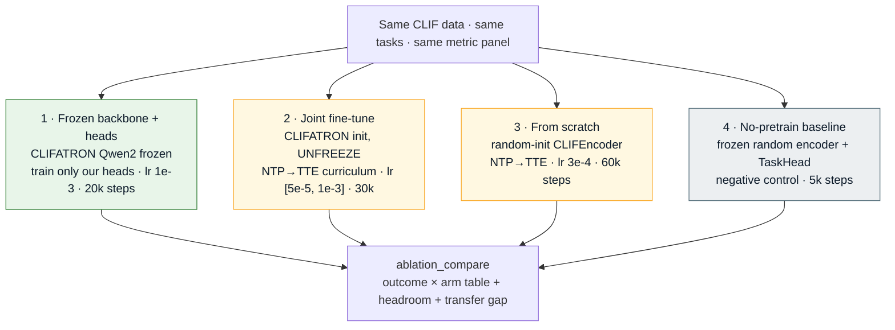
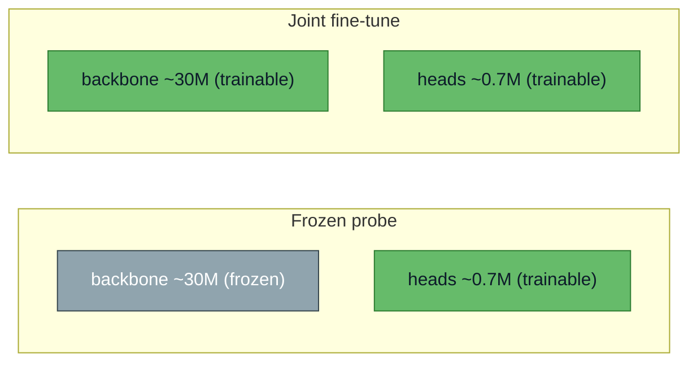
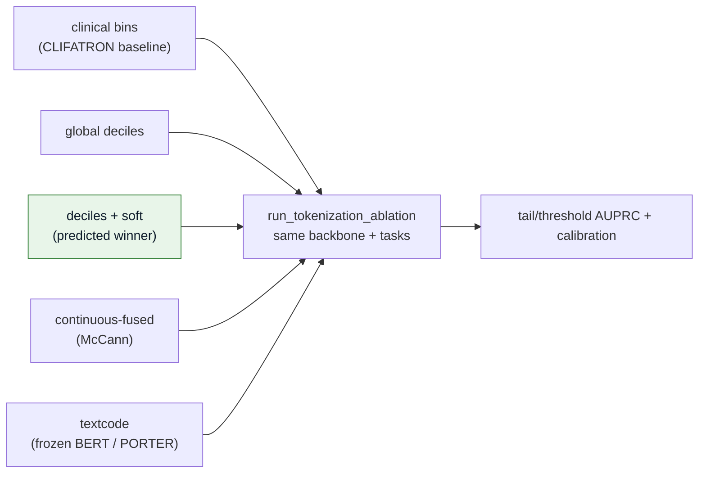
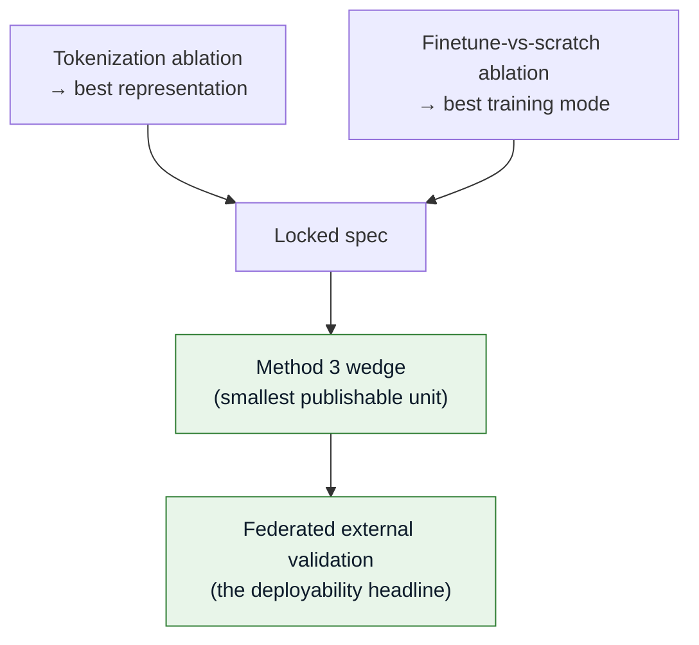

# Ablations

Two design decisions are not asserted — they are empirically tested against the same backbone
and tasks. Configured by `configs/ablation.yaml` (finetune-vs-scratch) and
`configs/tokenization_ablation.yaml` (representation).

---

## Finetune vs train-new — the 4 arms

The central "build ON CLIFATRON or train from scratch?" question. Hypothesis
(`configs/ablation.yaml`): **frozen-backbone head-training > joint fine-tune > from-scratch >
no-pretrain** for in-domain tasks; from-scratch may only close the gap on *transfer*.



| Arm | Backbone | Trainable | Evidence anchor |
|-----|----------|-----------|-----------------|
| **Frozen backbone + heads** | CLIFATRON Qwen2 (frozen) | heads only (~0.7M) | Al Attrach 2025 (frozen > trainable); Mataraso 2025 |
| Joint fine-tune | CLIFATRON init (unfrozen) | full (~30M) | tests catastrophic forgetting |
| From scratch | random CLIFEncoder | full | TOO-BERT (from-scratch can win specific tasks) |
| No-pretrain | random encoder (frozen) | head only | negative control (floor) |

:::tip Why frozen-probe is the expected winner
At ~30M on data-constrained MIMIC (utility saturates ~28M, arXiv:2505.22964), unfreezing risks catastrophic
forgetting, and the task-aligned survival objective *is* the supervision. Frozen-probe is also
the **only** mode that supports label-free federated validation — a new site never trains.
:::

---

## Trainable-parameter contrast



*Measured on real MIMIC:* the model builds at **34.9M params**; frozen arm = **0.7M
trainable**; joint arm = **34.9M trainable**. Gradients flow in every arm (smoke-tested).

---

## Tokenization ablation (recap)

The five representation arms from **[Data & Tokenization](./data-tokenization.md)** run through
the same trunk. Lee 2026 predicts **deciles + soft** wins, especially on tail/threshold AUPRC.



---

## How the ablations feed the paper



Run:

```bash
# finetune-vs-scratch
torchrun --nproc_per_node=2 -m src.train.run_arm --arm frozen_backbone_head_only --checkpoint <ckpt> --data <narratives>

# tokenization ablation
for arm in clifatron_clinical_bins global_deciles deciles_plus_soft continuous_fused textcode; do
    torchrun --nproc_per_node=2 -m src.train.run_tokenization_ablation --arm $arm --data <events.parquet>
done

# compare
python -m src.eval.ablation_compare --results results/ablation
```
