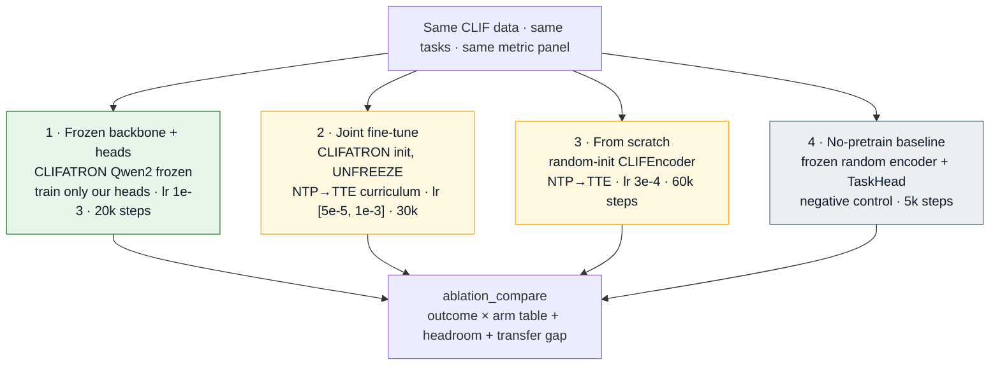
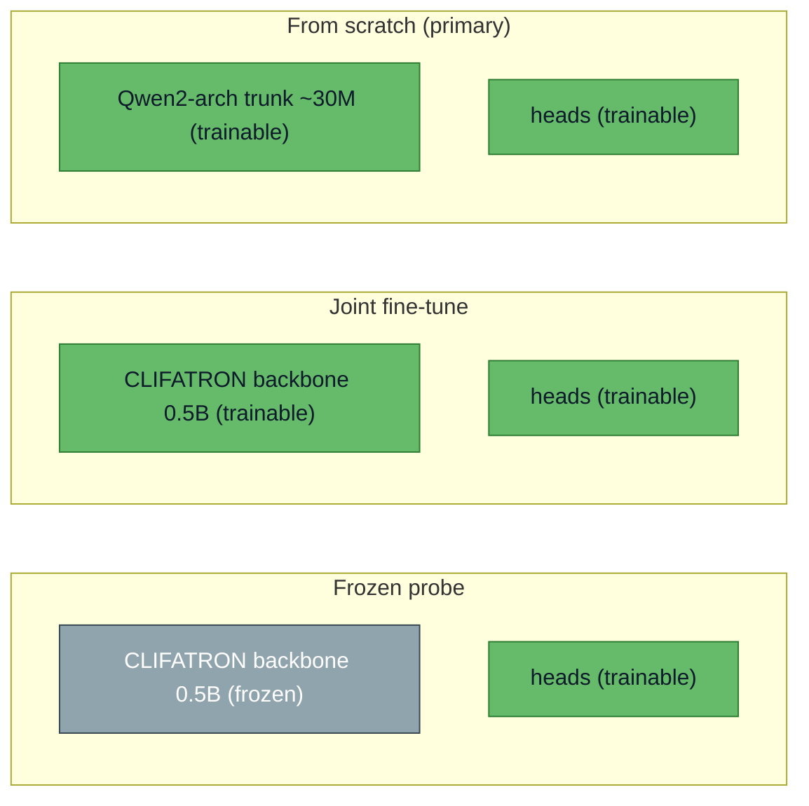
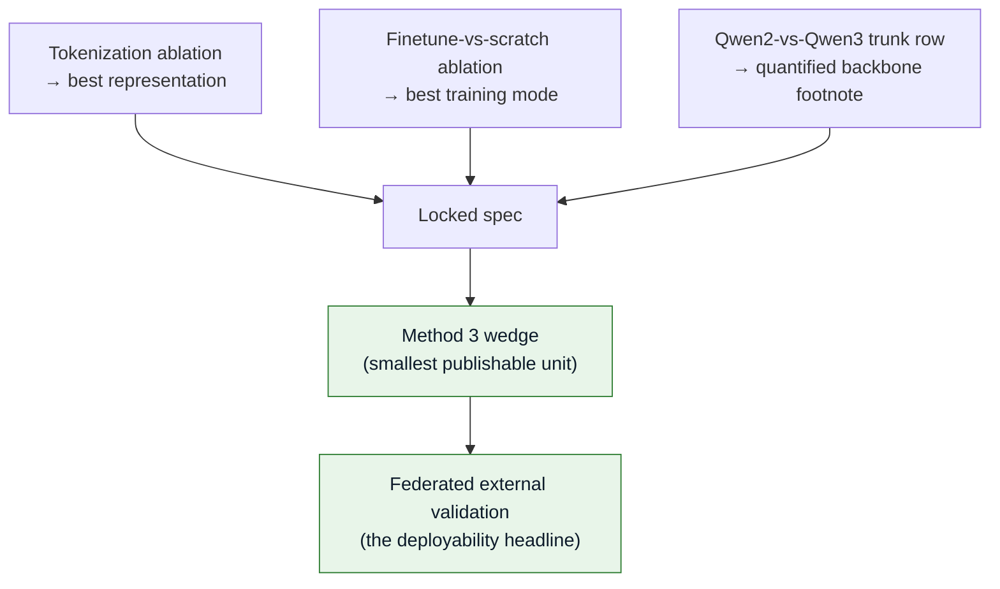

# Ablations

Three design decisions are not asserted — they are to be tested empirically on the same tasks
and metric panel. Configured by `configs/ablation.yaml` (finetune-vs-scratch) and
`configs/tokenization_ablation.yaml` (representation); the Qwen2-vs-Qwen3 trunk row is designed but
not yet configured. **No ablation results exist yet.**

---

## Finetune vs train-new — the 4 arms

The central "build ON CLIFATRON or train from scratch?" question. Hypothesis
(`configs/ablation.yaml`): **frozen-backbone head-training > joint fine-tune > from-scratch >
no-pretrain** for in-domain tasks; from-scratch may only close the gap on *transfer*.


```mermaid
flowchart TB
    DATA["Same CLIF data · same tasks · same metric panel"] --> A1 & A2 & A3 & A4

    A1["1 · Frozen backbone + heads<br/>CLIFATRON Qwen2 frozen<br/>train only our heads · lr 1e-3 · 20k steps"]
    A2["2 · Joint fine-tune<br/>CLIFATRON init, UNFREEZE<br/>NTP→TTE curriculum · lr [5e-5, 1e-3] · 30k"]
    A3["3 · From scratch<br/>random-init CLIFEncoder<br/>NTP→TTE · lr 3e-4 · 60k steps"]
    A4["4 · No-pretrain baseline<br/>frozen random encoder + TaskHead<br/>negative control · 5k steps"]

    A1 & A2 & A3 & A4 --> CMP["ablation_compare<br/>outcome × arm table + headroom + transfer gap"]

    classDef win fill:#e8f5e9,stroke:#2e7d32,color:#0d1b2a;
    classDef test fill:#fff8e1,stroke:#f9a825,color:#0d1b2a;
    classDef ctrl fill:#eceff1,stroke:#546e7a,color:#0d1b2a;
    class A1 win;
    class A2,A3 test;
    class A4 ctrl;
```

| Arm | Backbone | Trainable | Evidence anchor |
|-----|----------|-----------|-----------------|
| **Frozen backbone + heads** | CLIFATRON Qwen2 0.5B (frozen; larger comparator) | heads only | Al Attrach 2025 (frozen > trainable); Mataraso 2025 |
| Joint fine-tune | CLIFATRON Qwen2 0.5B init (unfrozen) | full (~0.5B) | tests catastrophic forgetting |
| From scratch | random-init CLIFEncoder, Qwen2-arch ~30M (our primary model) | full (~35M) | TOO-BERT (from-scratch can win specific tasks) |
| No-pretrain | random encoder (frozen) | head only | negative control (floor) |

:::tip[Why frozen-probe is the expected winner]
On data-constrained single-site data (utility saturates ~28M on Site 1, arXiv:2505.22964),
unfreezing a 0.5B backbone risks catastrophic forgetting, and the task-aligned survival objective
*is* the supervision.

Label-free federated validation is a separate question. A frozen probe trains task heads on
**local labels**, so it is the in-domain wedge, not the federation model. The **zero-shot**
threshold / competing-risk heads that a new site runs without training come from a model
pretrained *with* our TTE heads: the joint fine-tune of CLIFATRON or, on the primary path, the
from-scratch model ([Objectives & Training](./objectives-training.md#two-training-entry-points)).
"Label-free" describes the model only; each site still auto-derives evaluation labels locally.
:::

---

## Trainable-parameter contrast


```mermaid
flowchart LR
    subgraph FROZEN["Frozen probe"]
        FB["CLIFATRON backbone 0.5B (frozen)"]
        FH["heads (trainable)"]
    end
    subgraph JOINT["Joint fine-tune"]
        JB["CLIFATRON backbone 0.5B (trainable)"]
        JH["heads (trainable)"]
    end
    subgraph SCRATCH["From scratch (primary)"]
        SB["Qwen2-arch trunk ~30M (trainable)"]
        SH["heads (trainable)"]
    end

    classDef frozen fill:#90a4ae,stroke:#37474f,color:#fff;
    classDef train fill:#66bb6a,stroke:#2e7d32,color:#0d1b2a;
    class FB frozen;
    class FH,JB,JH,SB,SH train;
```

*Smoke-tested at d=512:* the from-scratch model builds at **34.9M params**, and freezing its
trunk leaves **0.7M trainable** head parameters. Gradients flow in every arm. With the real
CLIFATRON checkpoint (not yet staged), the joint arm trains the full ~0.5B backbone, so the
finetune-vs-scratch comparison is also a 0.5B-vs-~30M comparison and must be reported that way.

---

## Backbone: Qwen2-arch vs Qwen3-arch

The primary from-scratch trunk is Qwen2-arch (standard pre-norm, no QK-Norm). Whether Qwen3's
QK-Norm helps is a **measured row**, not an assumption
([Architecture](./architecture.md)).

| Arm | Trunk | Everything else | Status |
|-----|-------|-----------------|--------|
| **Qwen2-arch (primary)** | ~30M, d512 × 8L × 8H, pre-norm RMSNorm, no QK-Norm | same tokenizer, objective, curriculum, data | `src/model/encoder.py` today |
| Qwen3-arch | identical, plus QK-Norm on queries and keys | same | designed; no QK-Norm option in the encoder yet |

---

## Tokenization ablation (summary)

Six representation arms on the same trunk and objective: physician **clinical segments** with
soft discretization (primary), clinical segments with hard ids, population deciles
(`decile_ablation`, same concept coverage), deciles + soft discretization, continuous-fused, and
TextCode. Each arm loads its own shard and frozen vocabulary through the shared
`pretrain.build_loaders` path and trains with masked losses and the configured objective weights.
The full arm table lives in
**[Tokenization ablation](./data-tokenization.md#9--tokenization-ablation)**.

:::info[Runnable; no result yet]
All six arms run end to end: two optimizer steps on a synthetic shard in CI
(`tests/test_tokenization_ablation.py`), and two steps each on a 5,000-episode Site 1 verification
sample ([verified on real data](./data-tokenization.md#verified-on-real-data)). No tokenization
result exists yet: the sample vocabulary is smoke-only, and results need the production
vocabulary fit on the full train partition plus the full training run.
:::

---

## How the ablations feed the paper


```mermaid
flowchart TB
    T1["Tokenization ablation<br/>→ best representation"] --> SPEC["Locked spec"]
    T2["Finetune-vs-scratch ablation<br/>→ best training mode"] --> SPEC
    T3["Qwen2-vs-Qwen3 trunk row<br/>→ quantified backbone footnote"] --> SPEC
    SPEC --> M3["Method 3 wedge<br/>(smallest publishable unit)"]
    M3 --> FED["Federated external validation<br/>(the deployability headline)"]

    classDef out fill:#e8f5e9,stroke:#2e7d32,color:#0d1b2a;
    class M3,FED out;
```

Run:

```bash
# finetune-vs-scratch
torchrun --nproc_per_node=2 -m src.train.run_arm --arm frozen_backbone_head_only --checkpoint <ckpt> --data <narratives>

# tokenization ablation (per-arm events/vocab/value_stats paths come from the config;
# override with --events / --vocab / --value-stats)
for arm in clinical_soft clinical_hard global_deciles deciles_plus_soft continuous_fused textcode; do
    torchrun --nproc_per_node=2 -m src.train.run_tokenization_ablation --arm $arm
done

# compare
python -m src.eval.ablation_compare --results results/ablation
```
