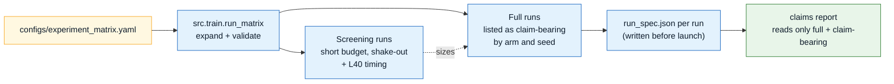
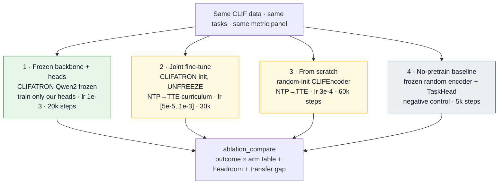
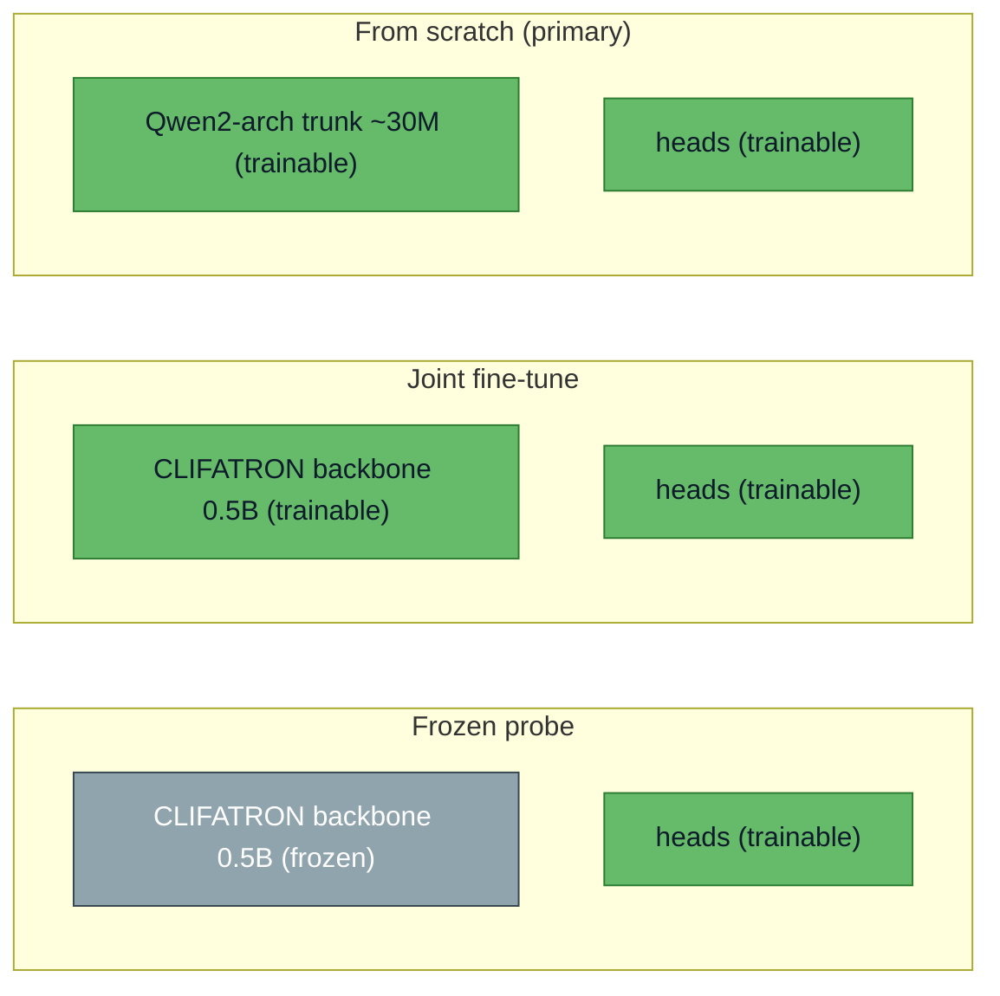
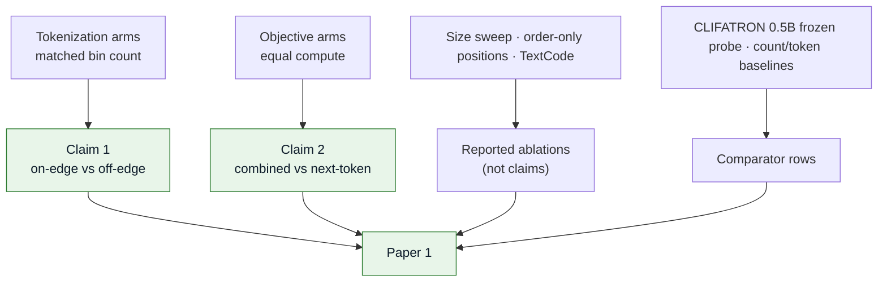

# Ablations

Paper 1's claims and ablations are read from one **experiment matrix**: every training run is
listed by arm, objective, size and seed before launch. The finetune-vs-scratch arms and the
Qwen2-vs-Qwen3 trunk row below are older ablations that now sit beside the matrix as comparator
rows. **No ablation result exists yet.**

---

## The experiment matrix

`configs/experiment_matrix.yaml` lists the rows of the minimum experiment table in
`notes/ai-novelty-audit.md`. `python -m src.train.run_matrix` expands it into one run per
(configuration, seed, budget), validates every arm and key it names, and **prints** the launch
commands. It never starts training. With the write option it also writes each run's
`run_spec.json`, the record the [claims report](./paper-claims.md#statistics-configsclaimsyaml)
reads. The matrix and its command are still being finished, so this section describes the
concept rather than a frozen table.


```mermaid
flowchart LR
    M["configs/experiment_matrix.yaml"] --> E["src.train.run_matrix<br/>expand + validate"]
    E --> S["Screening runs<br/>short budget, shake-out<br/>+ L40 timing"]
    E --> F["Full runs<br/>listed as claim-bearing<br/>by arm and seed"]
    S -.sizes.-> F
    F --> SPEC["run_spec.json per run<br/>(written before launch)"]
    SPEC --> CR["claims report<br/>reads only full + claim-bearing"]

    classDef cfg fill:#fff8e1,stroke:#f9a825,color:#0d1b2a;
    classDef run fill:#e3f2fd,stroke:#1565c0,color:#0d1b2a;
    classDef out fill:#e8f5e9,stroke:#2e7d32,color:#0d1b2a;
    class M cfg;
    class E,S,F,SPEC run;
    class CR out;
```

What a run configuration varies:

| Axis | Values | Source |
|------|--------|--------|
| Tokenization arm (R34) | physician segments with soft inputs (primary); the same with hard inputs; population deciles; deciles with forced threshold edges; continuous-fused; TextCode | `configs/tokenization_ablation.yaml` |
| Objective arm (claim 2) | `full`, `next_token_only`, `minus_value`, `minus_competing_risk`, `minus_threshold`, `no_curriculum` | `configs/objective_arms.yaml` |
| Trunk size (R37) | about 3M, 10M and 30M parameters; the reported size is the measured count in each run's manifest | `trunk` overrides of `configs/model.yaml` |
| Time positions (R36) | admission-relative minutes (primary) or event order only | `trunk.rope_position` |
| Seed | at least 3 per arm | model init, batch order, anchor sampling |

Rules the matrix carries:

- **Equal compute.** Run length is set in passes over the training data
  ([the loader](./objectives-training.md#the-full-hospitalization-loader)). Every arm of a
  budget trains for the same passes, so the same data and the same number of updates.
- **Matched granularity (KTD11).** The decile arms request each concept's bin count from the
  clinical arm, and the forced-edge decile arm inserts the decision thresholds before matching
  the count. A concept with too few distinct values keeps a smaller count and is listed in the
  tokenization and claims reports.
- **Screening vs full budgets (KTD12).** Screening runs are for shake-out and for sizing the
  full budget from a timing run on the L40 node. They never decide which arms or seeds are
  reported. Claims are read only from full-budget runs listed as claim-bearing before launch.
- **Edge check.** The matrix command also prints the edge-distance table for every arm's frozen
  vocabulary and refuses a control threshold that sits on an edge in any arm
  ([claim 1](./paper-claims.md#claim-1--threshold-aligned-tokenization)).
- **Attribution arm.** The optional claim 1 control (decile input tokens, threshold head on the
  clinical grid) is in the matrix but switched off; whether claim 1's rule uses it is an open
  decision.
- **Rows with no training run.** The count and token baselines (`src/eval/baselines.py`) and the
  CLIFATRON 0.5B frozen-probe comparator are table rows filled by the evaluation code, not by
  training.

---

## Finetune vs train-new — the 4 arms

Configured by `configs/ablation.yaml` and run by `src/train/run_arm.py`. Since the three-claim
framing (2026-10-03) the claims are tested on the from-scratch model; the CLIFATRON arms are the
larger comparator, reported when a checkpoint is staged, and carry none of the claims.

The original question was "build ON CLIFATRON or train from scratch?". Hypothesis
(`configs/ablation.yaml`): **frozen-backbone head-training > joint fine-tune > from-scratch >
no-pretrain** for in-domain tasks; from-scratch may only close the gap on *transfer*.


```mermaid
flowchart TB
    DATA["Same CLIF data · same tasks · same metric panel"] --> A1 & A2 & A3 & A4

    A1["1 · Frozen backbone + heads<br/>CLIFATRON Qwen2 frozen<br/>train only our heads · lr 1e-3 · 20k steps"]
    A2["2 · Joint fine-tune<br/>CLIFATRON init, UNFREEZE<br/>NTP→TTE curriculum · lr [5e-5, 1e-3] · 30k"]
    A3["3 · From scratch<br/>random-init CLIFEncoder<br/>NTP→TTE · lr 3e-4 · 60k steps"]
    A4["4 · No-pretrain baseline<br/>frozen random encoder + TaskHead<br/>negative control · 5k steps"]

    A1 & A2 & A3 & A4 --> CMP["ablation_compare<br/>outcome × arm table + headroom + transfer gap"]

    classDef win fill:#e8f5e9,stroke:#2e7d32,color:#0d1b2a;
    classDef test fill:#fff8e1,stroke:#f9a825,color:#0d1b2a;
    classDef ctrl fill:#eceff1,stroke:#546e7a,color:#0d1b2a;
    class A1 win;
    class A2,A3 test;
    class A4 ctrl;
```

| Arm | Backbone | Trainable | Evidence anchor |
|-----|----------|-----------|-----------------|
| **Frozen backbone + heads** | CLIFATRON Qwen2 0.5B (frozen; larger comparator) | heads only | Al Attrach 2025 (frozen > trainable); Mataraso 2025 |
| Joint fine-tune | CLIFATRON Qwen2 0.5B init (unfrozen) | full (~0.5B) | tests catastrophic forgetting |
| From scratch | random-init CLIFEncoder, Qwen2-arch ~30M (our primary model) | full (~35M) | TOO-BERT (from-scratch can win specific tasks) |
| No-pretrain | random encoder (frozen) | head only | negative control (floor) |

:::tip[Why frozen-probe is the expected winner]
On data-constrained single-site data (utility saturates ~28M on Site 1, arXiv:2505.22964),
unfreezing a 0.5B backbone risks catastrophic forgetting, and the task-aligned survival objective
*is* the supervision.

Label-free federated validation is a separate question. A frozen probe trains task heads on
**local labels**, so it is the in-domain wedge, not the federation model. The **zero-shot**
threshold / competing-risk heads that a new site runs without training come from a model
pretrained *with* our TTE heads: the joint fine-tune of CLIFATRON or, on the primary path, the
from-scratch model ([Objectives & Training](./objectives-training.md#training-entry-points)).
"Label-free" describes the model only; each site still auto-derives evaluation labels locally.
:::

---

## Trainable-parameter contrast


```mermaid
flowchart LR
    subgraph FROZEN["Frozen probe"]
        FB["CLIFATRON backbone 0.5B (frozen)"]
        FH["heads (trainable)"]
    end
    subgraph JOINT["Joint fine-tune"]
        JB["CLIFATRON backbone 0.5B (trainable)"]
        JH["heads (trainable)"]
    end
    subgraph SCRATCH["From scratch (primary)"]
        SB["Qwen2-arch trunk ~30M (trainable)"]
        SH["heads (trainable)"]
    end

    classDef frozen fill:#90a4ae,stroke:#37474f,color:#fff;
    classDef train fill:#66bb6a,stroke:#2e7d32,color:#0d1b2a;
    class FB frozen;
    class FH,JB,JH,SB,SH train;
```

*Smoke-tested at d=512:* the from-scratch model builds at **34.9M params**, and freezing its
trunk leaves **0.7M trainable** head parameters. Gradients flow in every arm. With the real
CLIFATRON checkpoint (not yet staged), the joint arm trains the full ~0.5B backbone, so the
finetune-vs-scratch comparison is also a 0.5B-vs-~30M comparison and must be reported that way.

---

## Backbone: Qwen2-arch vs Qwen3-arch

The primary from-scratch trunk is Qwen2-arch (standard pre-norm, no QK-Norm). Whether Qwen3's
QK-Norm helps is a **measured row**, not an assumption
([Architecture](./architecture.md)).

| Arm | Trunk | Everything else | Status |
|-----|-------|-----------------|--------|
| **Qwen2-arch (primary)** | ~30M, d512 × 8L × 8H, pre-norm RMSNorm, no QK-Norm | same tokenizer, objective, curriculum, data | `src/model/encoder.py` today |
| Qwen3-arch | identical, plus QK-Norm on queries and keys | same | designed; no QK-Norm option in the encoder yet |

---

## Tokenization ablation (summary)

The representation arms are the tokenization axis of the [experiment
matrix](#the-experiment-matrix): physician **clinical segments** with soft discretization
(primary), clinical segments with hard ids, population deciles, deciles with forced threshold
edges, continuous-fused, and TextCode. Each arm loads its own frozen vocabulary through the
shared `pretrain.build_loaders` path and trains with the same masked losses and objective
weights. Claim 1 compares the primary arm with population deciles
([Paper 1 claims](./paper-claims.md#claim-1--threshold-aligned-tokenization)). Event order vs
admission-relative positions and TextCode vs the frozen vocabulary are reported as ablations,
not headline claims (R36). The arm table lives in
**[Tokenization ablation](./data-tokenization.md#9--tokenization-ablation)**.

:::info[Runnable; no result yet]
All six arms run end to end: two optimizer steps on a synthetic shard in CI
(`tests/test_tokenization_ablation.py`), and two steps each on a 5,000-episode Site 1 verification
sample ([verified on real data](./data-tokenization.md#verified-on-real-data)). No tokenization
result exists yet: the sample vocabulary is smoke-only, and results need the production
vocabulary fit on the full train partition plus the full training run.
:::

---

## How the ablations feed the paper


```mermaid
flowchart TB
    T1["Tokenization arms<br/>matched bin count"] --> C1["Claim 1<br/>on-edge vs off-edge"]
    T2["Objective arms<br/>equal compute"] --> C2["Claim 2<br/>combined vs next-token"]
    T3["Size sweep · order-only positions · TextCode"] --> AB["Reported ablations<br/>(not claims)"]
    T4["CLIFATRON 0.5B frozen probe · count/token baselines"] --> CMP["Comparator rows"]
    C1 --> P1["Paper 1"]
    C2 --> P1
    AB --> P1
    CMP --> P1

    classDef out fill:#e8f5e9,stroke:#2e7d32,color:#0d1b2a;
    class C1,C2,P1 out;
```

Run:

```bash
# finetune-vs-scratch
torchrun --nproc_per_node=2 -m src.train.run_arm --arm frozen_backbone_head_only --checkpoint <ckpt> --data <narratives>

# experiment matrix: list every run and print its launch command (never trains)
uv run python -m src.train.run_matrix

# one tokenization arm (per-arm events/vocab/value_stats paths come from the config;
# override with --events / --vocab / --value-stats; --objective-arm selects the objective)
torchrun --nproc_per_node=2 -m src.train.run_tokenization_ablation --arm clinical_soft

# compare
python -m src.eval.ablation_compare --results results/ablation
```
