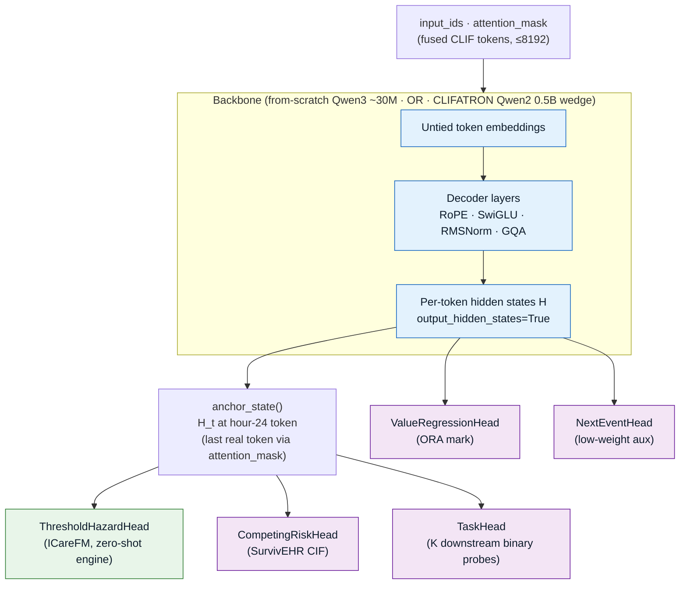
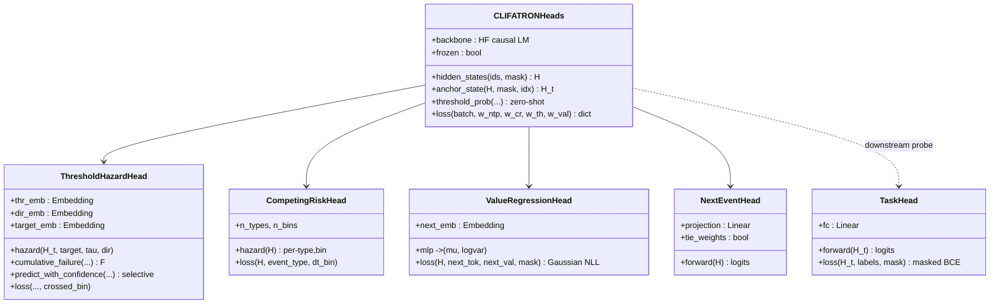
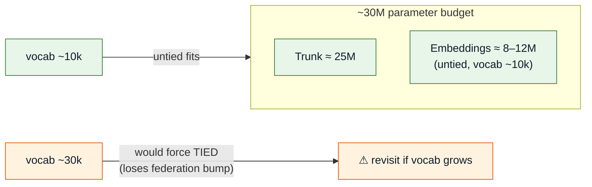
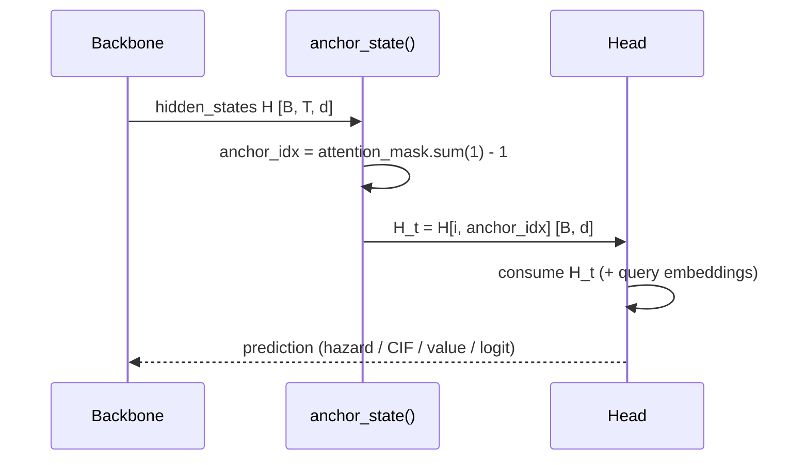

# Model Architecture

The trunk is a flat causal decoder in the Llama/Qwen family (RoPE, SwiGLU, RMSNorm, GQA), 8192
context, **untied** embeddings. Two backbone paths, run as a ladder:

- **Primary paper — from-scratch Qwen3-arch decoder, ~30M, fully ours** (`src/model/encoder.py`).
  Qwen3 adds free QK-Norm training stability; no upstream dependency. This is the headline.
- **Wedge / cheap first result — attach heads to CLIFATRON's released Qwen2 checkpoint** (`head_adapter.py`).
  CLIFATRON's Qwen2 is **0.5B** — a *larger comparator*, never our ~30M model. This is the fast first
  rung (Method 3) and half of the finetune-vs-scratch ablation.

From CLIFATRON v1 we **keep** the Qwen2 architecture for the wedge path, the fused `code=bin`
token format, the mCIDE vocabulary, and the document-isolation packing approach. The from-scratch
Qwen3 path is new and fully independent.

We attach the same four heads to either backbone's per-token hidden states. "Qwen2 vs Qwen3" is itself
a **measured ablation row**, not an assertion.

:::info Objective, not backbone, is the lever
ORA (arXiv:2602.00541) shows the gains are backbone-agnostic — so the backbone is a footnote and the
*objective* is where the novelty lives. The from-scratch Qwen3 model is the primary contribution; the
CLIFATRON-Qwen2 attach is the cheap wedge that de-risks it first. See `MEMORY.md` §B.
:::

---

## Backbone + heads (component view)

*Wiring:* `src/model/head_adapter.py → CLIFATRONHeads`. `hidden_states()` runs the backbone;
`anchor_state()` selects H_t; each head consumes it.

---

## The four heads (class view)

---

## What each head is for

| Head | Source | Role | Zero-shot? |
|------|--------|------|:----------:|
| **ThresholdHazardHead** | ICareFM | P(concept k crosses τ in `direction` within horizon h). Learned threshold + direction + target embeddings → discrete hazard over 48h. **The multi-outcome engine.** | ✅ |
| **CompetingRiskHead** | SurvivEHR | Discrete-time cumulative incidence over competing event types; exactly one event occurs next. | ✅ |
| **ValueRegressionHead** | ORA "mark" | Predict the continuous value of the next event as a Gaussian (μ, log-var). Lifts physiology tasks +33–38% vs NTP. | — |
| **NextEventHead** | SurvivEHR / HealthFormer | Next-token projection; low-weight auxiliary, **untied** by default (explicit tied ablation). | — |
| **TaskHead** | — | K downstream binary heads on the frozen trunk (the fair head-to-head vs XGBoost). | — |

---

## The untied-embedding budget tension

Untied embeddings add +4–7% AUPRC (widening under federation), but at untied the embedding
tables cost `vocab × d × 2`. This constrains vocabulary size.

Resolution: **untied + ~10k vocab** (≈8–12M emb + ~25M trunk ≈ 33–37M, still the "~30M
neighborhood"). Documented in `notes/NEXT_STEPS.md §2.3`.

---

## The anchor: hour-24 hidden state

Every head that produces a per-stay prediction reads **H_t at the hour-24 anchor** — the last
real token of the first-24h window (CLIFATRON's benchmark truncates there). It is selected from
the `attention_mask`, or an explicit `anchor_idx`.

:::warning Transformers v5 caveat
The installed `transformers` is v5, where `output_hidden_states` moved to a
`_can_record_outputs` mechanism and the *final* hidden state may differ from the last
hidden-states entry due to extra normalization. Verify `anchor_state` against a real CLIFATRON
checkpoint before shipping the turnkey validator.
:::
