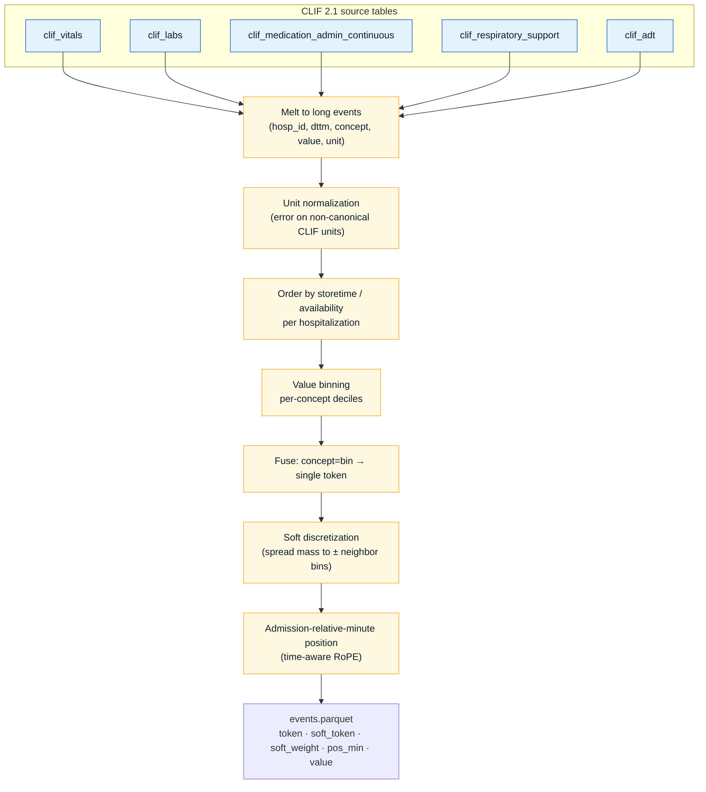
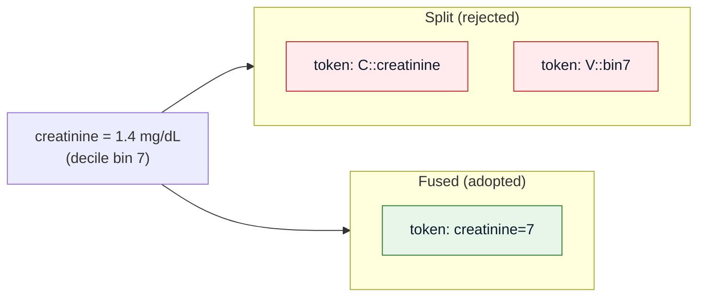
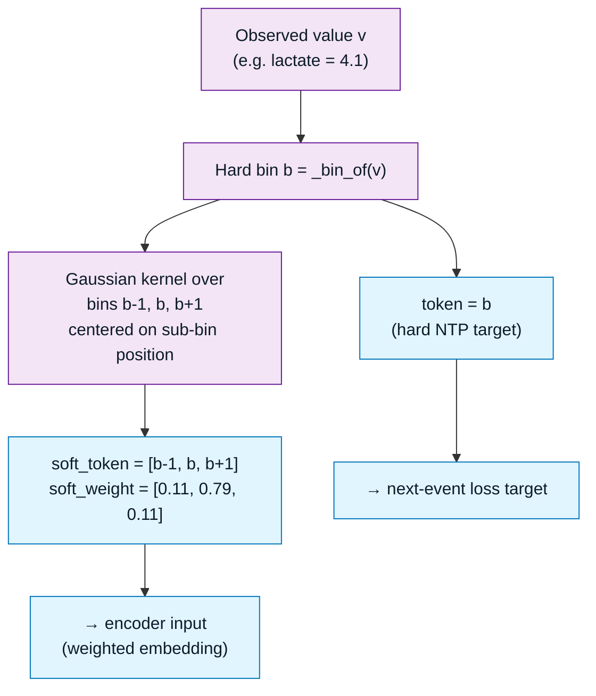
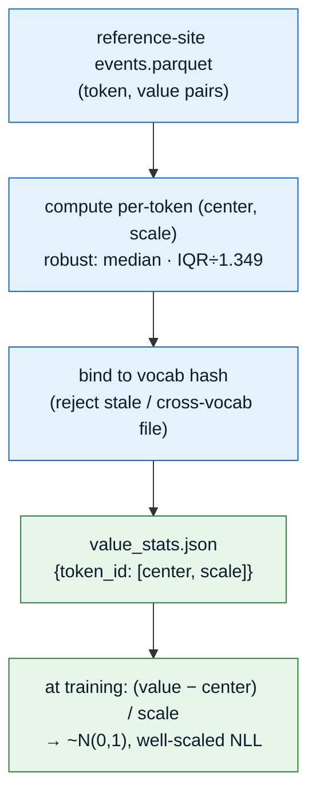
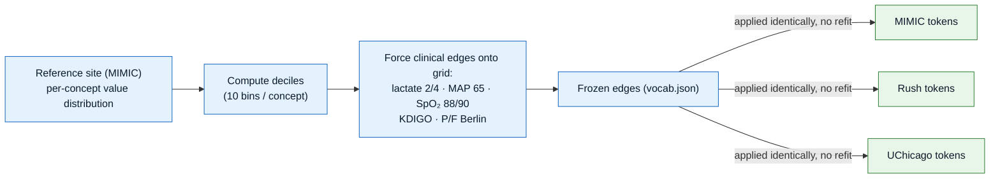
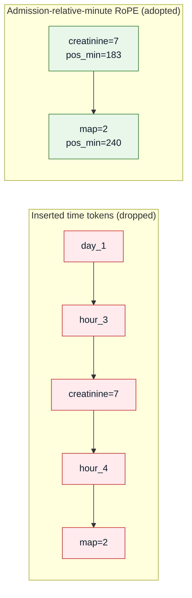
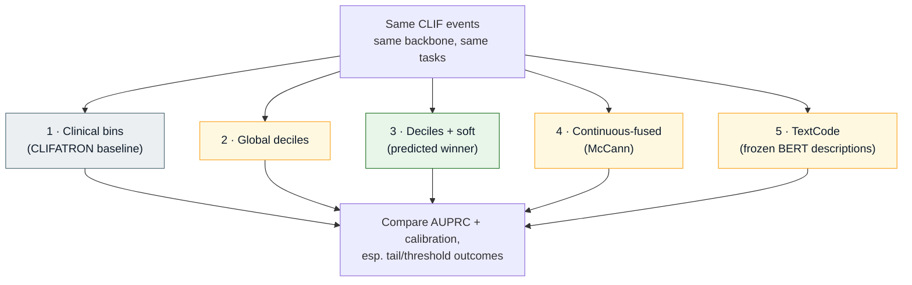

# Data & Tokenization

Turning raw CLIF 2.1 parquet into the fused event-token stream the backbone consumes.
Implemented in `src/data/tokenize.py` (decile arm), `src/data/tokenize_continuous.py`
(McCann ablation), and `src/data/tokenize_textcode.py` (language-grounded ablation);
configured by `configs/data.yaml`.

---

## From CLIF tables to an event stream

Each CLIF domain table is melted to long `(hospitalization_id, dttm, concept, value, unit)`
events, ordered by **availability time** (`storetime`, not `charttime`) so the model never
sees a value before it was knowable.

:::warning Look-ahead leakage guard (Rule 4)
Ordering by `storetime` (when a value became **available**) rather than `charttime` (when it
was nominally measured) prevents the model from conditioning on information a clinician could
not yet have seen at decision time.
:::

---

## Fused `code=bin` tokens vs the split alternative

A single fused token per event beat the split `concept` + `value-bin` representation in the
Lee 2026 benchmark (mortality 0.891 → 0.915). It also avoids the "local binding problem"
where a value token can attach to the wrong concept.

---

## Soft discretization — sensitivity where danger lives

Hard binning throws away where within a bin a value fell. **Soft discretization** spreads a
Gaussian-weighted mass to adjacent bins, which Lee 2026 found is the one encoder that *wins*
on exactly the dangerous tails (severe hypokalemia, hypernatremia, hypotension, CRRT). The
hard token stays the next-token-prediction target; the soft weights feed the encoder input.

*Config:* `value_binning.soft_discretization: true`, `soft_kernel_bins: 1`.
*Code:* `_soft_bins()` in `src/data/tokenize.py` returns a fixed width `2·kernel_bins+1` for
every event (numeric or not) so batching stays dense.

---

## Value-head normalization — per-token, frozen from a reference site

The ORA value-regression head predicts the continuous *value* of the next event. Raw ICU values span
~5 orders of magnitude per concept (creatinine ~1, platelets ~2×10⁵), so an un-normalized Gaussian NLL
is dominated by high-magnitude concepts and never trains (observed `val≈46000` on real MIMIC). The fix:
standardize each numeric event to ~N(0,1) using per-**token** center/scale frozen from a reference site
— the same freeze-on-MIMIC pattern as the decile edges.

- **Robust** center/scale (median, IQR÷1.349, std fallback) so physiologic outliers (severe
  hyperkalemia, extreme lactate) don't inflate the scale and flatten the dangerous tails.
- **Coverage contract:** every token carrying a finite value gets stats — a rare numeric token is
  *widened*, never dropped — because the target builder rejects any numeric target lacking stats.
- **Vocabulary-bound:** the artifact carries the vocab hash; a stale or cross-vocabulary stats file is
  rejected at load, not silently applied.

*Verified:* per-token standardization collapses mean raw value² from ~1.4×10¹⁰ to **0.95** (the O(1)
target). *Code:* `src/data/value_stats.py`; generate with
`python -m src.data.value_stats --events <ref_events.parquet> --out value_stats.json`.

---

## Frozen decile edges + forced clinical thresholds

Bin **edges** are frozen from a reference site (`build_from_site: mimic`) and applied
identically everywhere, so the token space transports across hospitals (Federated GEMs: only
0.025 AUROC cross-site penalty). ICU decision cutpoints are then **forced to be guaranteed bin
edges** so tokens align with the threshold-hazard head's queries.

---

## Time encoding: drop `day_N/hour_N` tokens, rotate by minutes

Instead of inserting literal `day_N` / `hour_N` marker tokens into the stream, position is
encoded as **admission-relative minutes** via time-aware RoPE. Events with the same timestamp
share a position. This matches or beats inserted time tokens while cutting sequence length
~11%.

---

## The 5-arm tokenization ablation

The tokenizer choice is not asserted — it is tested. `configs/tokenization_ablation.yaml`
runs five arms through the **same** backbone and tasks so only the representation varies.

| Arm | Representation | Evidence anchor |
|-----|----------------|-----------------|
| Clinical bins | CLIFATRON reference-range quantiles | baseline |
| Global deciles | population deciles, frozen | Lee 2026 |
| **Deciles + soft** | deciles + Gaussian adjacent-bin mass | Lee 2026 (wins tails) |
| Continuous-fused | fused numeric channel + MC | McCann 2026 |
| TextCode | frozen BioClinical-ModernBERT code descriptions | Al Attrach 2025 / PORTER 2026 |

:::tip Target concepts (K hazard heads)
The threshold-hazard head is trained over `configs/data.yaml → target_concepts`: MAP, lactate,
SpO₂, respiratory rate, creatinine, bilirubin, platelets, heart rate, SBP, temperature — each
with a clinical **direction** (which way is dangerous). Treatments are deliberately absent
(Rule 1). Extend toward K≈35 as coverage allows.
:::
