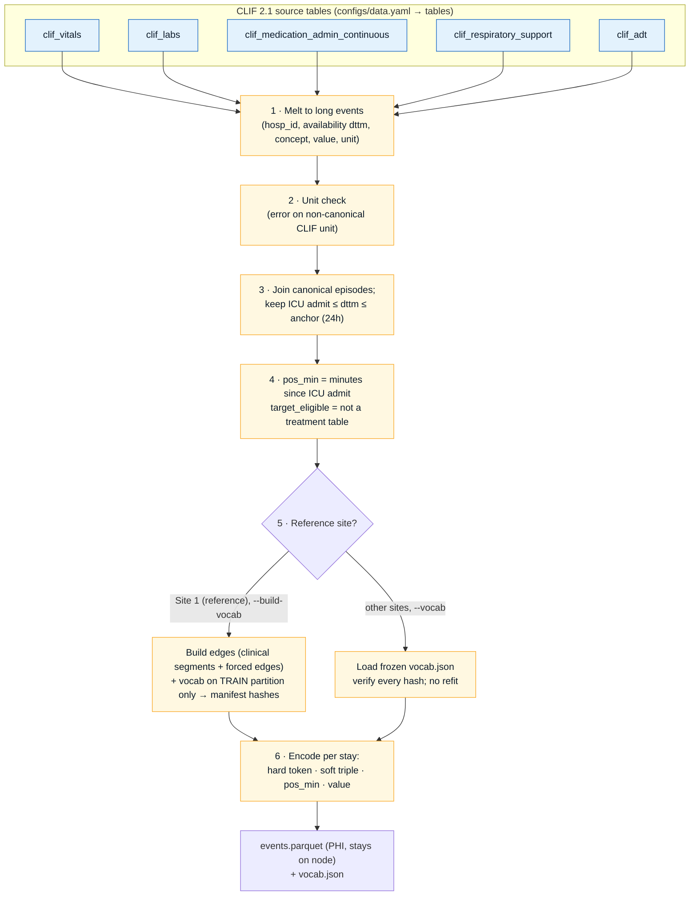
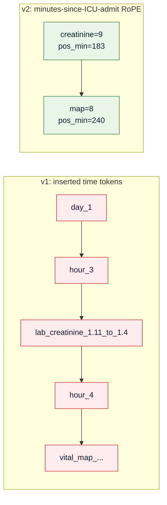
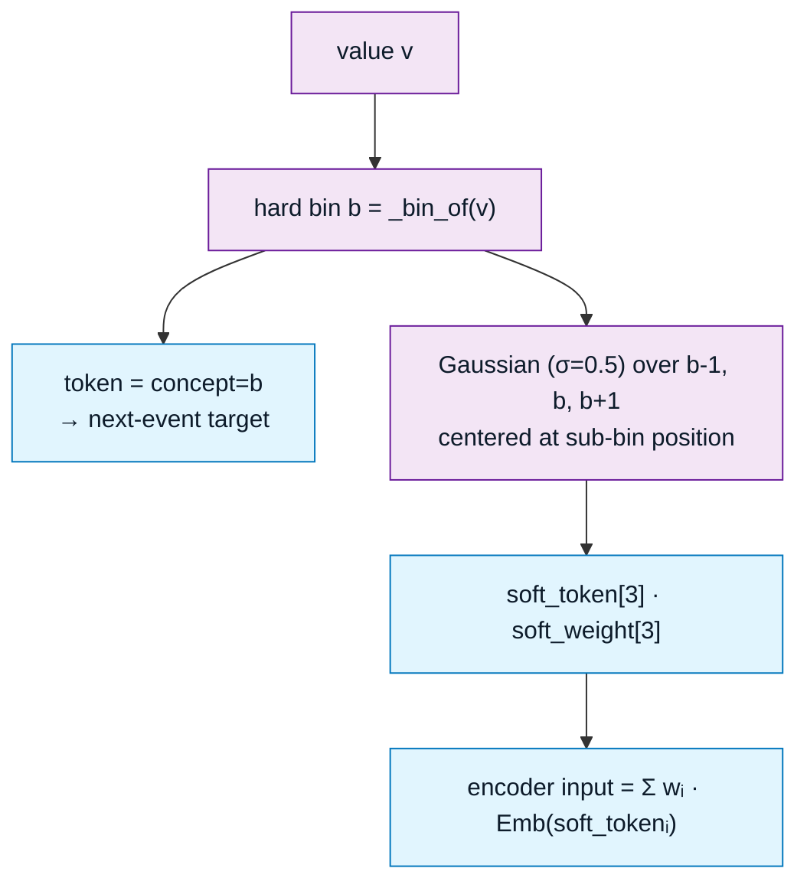
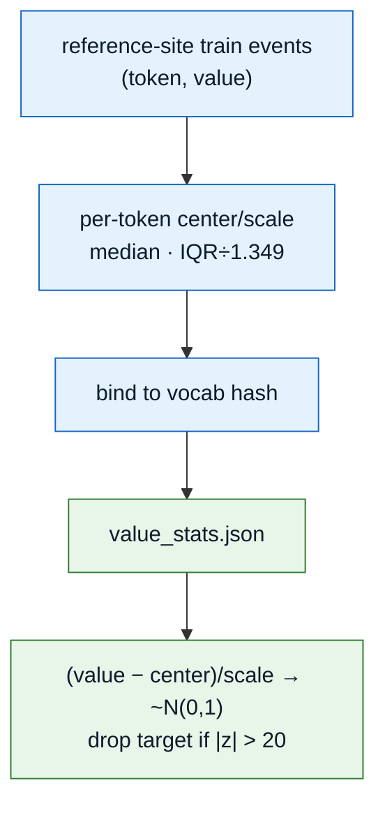

# Data & Tokenization

How raw CLIF 2.1 parquet becomes the fused event-token stream the from-scratch model consumes.
This page is the **canonical specification** of the CLIFATRON 2.0 tokenizer. Every number on it
was computed from the code and config at the commit that last touched this page. If the code
and this page disagree, the code is right and this page is a bug.

| | |
|---|---|
| **Code** | `src/data/tokenize.py` (one file, polars + DuckDB) |
| **Config** | `configs/data.yaml` (tables, targets, binning) · `configs/cohort.yaml` (episode, anchor, windows) |
| **Bin source** | `external/clifatron/tokenETL/config/critical_illness_tokenization_final_with_intervals.csv`: the CLIF consortium's physician-designed segments (1267 segment rows, 92 measurements) |
| **Output** | `events.parquet` (one row per ICU stay) + `vocab.json` (vocabulary, edges, signed-hash manifest) |
| **Tests** | `tests/test_tokenize_bins.py`, `tests/test_tokenize_alignment.py`, `tests/test_value_stats.py` |

---

## One event, one token

Each clinical event becomes **one fused token**:

- **Numeric event on a binned concept:** `concept=bin`. For example, lactate 4.1 mmol/L becomes
  `lactate=10`, the 11th of lactate's 16 physician-designed bins.
- **Categorical event, or numeric event on an unbinned concept:** bare `concept`, e.g. `imv`,
  `norepinephrine`, `icu`, `potassium`.

Each token carries four things:

1. a **hard token id** (the next-event target),
2. a **soft token / soft weight** triple (the encoder input),
3. a **position** in minutes since ICU admission, and
4. the **raw numeric value** (the value-regression "mark" target).


```mermaid
flowchart TB
    subgraph SRC["CLIF 2.1 source tables (configs/data.yaml → tables)"]
        V["clif_vitals"]
        L["clif_labs"]
        M["clif_medication_admin_continuous"]
        RS["clif_respiratory_support"]
        ADT["clif_adt"]
    end
    V & L & M & RS & ADT --> MELT["1 · Melt to long events<br/>(hosp_id, availability dttm, concept, value, unit)"]
    MELT --> UNIT["2 · Unit check<br/>(error on non-canonical CLIF unit)"]
    UNIT --> WIN["3 · Join canonical episodes;<br/>keep ICU admit ≤ dttm ≤ anchor (24h)"]
    WIN --> POS["4 · pos_min = minutes since ICU admit<br/>target_eligible = not a treatment table"]
    POS --> VOC{"5 · Reference site?"}
    VOC -->|"Site 1 (reference), --build-vocab"| BUILD["Build edges (clinical segments + forced edges)<br/>+ vocab on TRAIN partition only → manifest hashes"]
    VOC -->|"other sites, --vocab"| LOAD["Load frozen vocab.json<br/>verify every hash; no refit"]
    BUILD & LOAD --> ENC["6 · Encode per stay:<br/>hard token · soft triple · pos_min · value"]
    ENC --> OUT["events.parquet (PHI, stays on node)<br/>+ vocab.json"]

    classDef src fill:#e3f2fd,stroke:#1565c0,color:#0d1b2a;
    classDef step fill:#fff8e1,stroke:#f9a825,color:#0d1b2a;
    class V,L,M,RS,ADT src;
    class MELT,UNIT,WIN,POS,BUILD,LOAD,ENC step;
```

---

## 1 · Source tables and roles

| Table key | CLIF file | Availability timestamp | Concept column | Value | Role |
|-----------|-----------|------------------------|----------------|-------|------|
| `vitals` | `clif_vitals` | `recorded_dttm` | `vital_category` | `vital_value` | measurement (eligible target) |
| `labs` | `clif_labs` | `lab_result_dttm` | `lab_category` | `lab_value_numeric` (+ `reference_unit`) | measurement (eligible target) |
| `resp_support` | `clif_respiratory_support` | `recorded_dttm` | `device_category` | none | **input only** |
| `meds` | `clif_medication_admin_continuous` | `admin_dttm` | `med_category` | none (no dose) | **input only** |
| `adt` | `clif_adt` | `in_dttm` | `location_category` | none | **input only** |

Rows with a null concept or null timestamp are dropped at read time. A table whose parquet file
is missing is skipped with a log line. If **no** configured table exists, the run fails.

:::warning Rule 1: treatments are inputs, never targets
Every event from an `input_only` table gets `target_eligible = false`. These events stay in the
context the model reads, but the target builder never makes them a next-event or value target.
They are also absent from `target_concepts`, so no hazard head is trained on them.
:::

### What v1 tokenized that v2 does not (yet)

The v1 `tokenETL` pipeline (vendored, **not executed** by v2) also emitted the tokens below.
They are absent from the v2 stream today. This is a deliberate scope cut, not an oversight, but
it should be stated in any v1-vs-v2 comparison:

- **Medication doses.** v1 emitted weight-normalized dose bins (`norepinephrine_0.05_to_0.1_mcg_kg_min`).
  v2 emits only `med_category`, so the model sees *that* norepinephrine is running but not *how much*.
- **Ventilator settings.** v1 binned FiO₂, PEEP, tidal volume and 14 other settings. v2 emits only the device category.
- **Assessments** (GCS, RASS), **therapies** (CRRT, ECMO), **demographics**, **Elixhauser
  comorbidities**, and intermittent medications.

All of these have bins in the CSV (`medications`: 28 measurements, `respiratory_support`: 17), so
adding them is a config change plus a value column, not a new binning design.

---

## 2 · Episode, observation window, and position

The tokenizer refuses to run without the canonical episode artifact built from
`configs/cohort.yaml` (`--episodes`). That artifact fixes:

| Field | Value |
|-------|-------|
| Episode unit | first eligible ICU episode per patient, age ≥ 18 |
| Anchor | first ICU `in_dttm` + **24 h** |
| Observation window | `[ICU admit, anchor]`, both ends inclusive |
| Prediction window | `(anchor, anchor + 48 h]` (used by outcome labels, not the tokenizer) |
| Partition | `train` / `validation` / `calibration` / `test` from the split artifact (`split_sha256`) |

`restrict_to_observation_window()` inner-joins events to eligible episodes and keeps only events
with `icu_admit_dttm ≤ dttm ≤ anchor_dttm`. All three timestamps must be timezone-aware UTC. The
DuckDB session is pinned to `TimeZone = 'UTC'`, so the output does not depend on the host's
timezone.

**Position** is `pos_min = floor(minutes since ICU admission)`. This value feeds time-aware RoPE
directly, as the rotation angle, instead of the token index. Events in the same minute share a
position. v2 inserts no `day_N` / `hour_N` marker tokens.


```mermaid
flowchart LR
    subgraph OLD["v1: inserted time tokens"]
        O1["day_1"] --> O2["hour_3"] --> O3["lab_creatinine_1.11_to_1.4"] --> O4["hour_4"] --> O5["vital_map_..."]
    end
    subgraph NEW["v2: minutes-since-ICU-admit RoPE"]
        N1["creatinine=9<br/>pos_min=183"] --> N2["map=8<br/>pos_min=240"]
    end

    classDef bad fill:#ffebee,stroke:#c62828,color:#0d1b2a;
    classDef good fill:#e8f5e9,stroke:#2e7d32,color:#0d1b2a;
    class O1,O2,O3,O4,O5 bad;
    class N1,N2 good;
```

### Ordering and leakage (Rule 4)

Events are ordered by their **availability** timestamp: when the value could be known, not
when it was nominally measured. For labs that is `lab_result_dttm`, which is where Site 1's
`storetime` lands in CLIF. **CLIF vitals have no separate store time**, so `recorded_dttm` is
the best available proxy. Vitals are charted close to real time, so the residual look-ahead is
small but not zero.

:::caution Known gap: same-timestamp tie order
Events are sorted by `(hosp_id, dttm)` only. Polars does not guarantee a stable order for
equal keys, so events that share a timestamp (a full vitals panel, for example) can come out in
a different order from run to run. This affects next-event targets and byte-reproducibility.
The fix is a deterministic tiebreak (`source`, `concept`); it is tracked under
[Known issues](#known-issues-and-open-decisions).
:::

---

## 3 · Value binning: physician-designed clinical segments (primary)

`value_binning.scheme: clinical_segment` is the default and the primary scheme. It was restored
on 2026-09-02; see [decision history](#decision-history). Edges come from the CLIF consortium's
physician-designed segmentation CSV, the same bin design CLIFATRON v1 used. Within the normal
range, clinicians made bins narrow where measurements are dense. Above and below normal the bins
widen progressively, and each extreme tail is split into quintiles.

### How the CSV becomes edges (`build_clinical_segment_bins`)

1. Read every row whose `measurement` is one of the `target_concepts`.
2. Collect every `min_value` and `max_value` into one set per concept.
3. Sort the set and **drop the outermost two values** (the CSV's floor and ceiling). What
   remains are the interior edges.
4. Add any `forced_edges` not already present: these are clinical decision cutpoints that are
   guaranteed to be bin boundaries.

`k` interior edges give `k + 1` bins. Values below the lowest edge go to bin 0, and values above
the highest edge go to the top bin. Nothing is out of vocabulary because of range.

### The frozen edges (current config)

| Concept | Direction | Unit | Bins | Forced edges (added beyond CSV) | Interior edges |
|---------|-----------|------|-----:|---------------------------------|----------------|
| `map` | below | mmHg | 23 | 65 (already in CSV) | 53 · 57 · 59 · 60 · 61 · **65** · 67 · 69 · 70 · 77 · 83 · 88 · 94 · 100 · 102.3 · 106 · 110 · 117 · 119 · 122 · 126 · 133 |
| `lactate` | above | mmol/L | 16 | **4.0** added; 2.0 in CSV | 0.5 · 0.9 · 1.1 · 1.3 · 1.6 · **2.0** · 2.2 · 2.7 · 3.4 · **4.0** · 5.4 · 6.2 · 7.6 · 9.6 · 12.8 |
| `spo2` | below | % | 11 | 88, 90 (already in CSV) | **88** · **90** · 91 · 92 · 93 · 94 · 95 · 96 · 97 · 98 |
| `respiratory_rate` | above | breaths/min | 18 | — | 6 · 9 · 10 · 11 · 12 · 16 · 17 · 18 · 19 · 20 · 22 · 24 · 27 · 28 · 29 · 31 · 34 |
| `creatinine` | above | mg/dL | 18 | **1.5, 2.0, 3.0** added (≈ KDIGO) | 0.49 · 0.53 · 0.56 · 0.59 · 0.6 · 0.69 · 0.76 · 0.84 · 0.97 · 1.2 · 1.42 · **1.5** · 1.81 · **2.0** · 2.63 · **3.0** · 4.87 |
| `bilirubin_total` | above | mg/dL | 15 | — | 0.3 · 0.4 · 0.5 · 0.6 · 0.8 · 1.2 · 1.4 · 1.9 · 2.8 · 6.1 · 8.0 · 11.3 · 16.4 · 25.0 |
| `platelet_count` | below | 10³/µL | 19 | — | 12 · 20 · 29 · 37 · 43 · 81 · 110 · 133 · 150 · 182 · 213 · 245 · 286 · 350 · 372 · 400 · 442 · 513 |
| `heart_rate` | above | beats/min | 18 | — | 52 · 56 · 58 · 60 · 70 · 77 · 83 · 91 · 100 · 103 · 107 · 112 · 120 · 122 · 126 · 130 · 138 |
| `sbp` | below | mmHg | 23 | — | 67 · 72 · 75 · 77 · 78 · 83 · 86 · 89 · 90 · 100 · 106 · 111 · 116 · 120 · 126 · 134 · 142 · 155 · 158 · 162 · 168 · 177 |
| `temp_c` | above | °C | 24 | — | 35.388 · 35.611 · 35.722 · 35.833 · 35.889 · 36.111 · 36.278 · 36.389 · 36.5 · 36.611 · 36.722 · 36.889 · 37.111 · 37.499 · 37.5 · 37.611 · 37.722 · 37.944 · 38.333 · 38.444 · 38.555 · 38.777 · 39.166 |

**Total: 185 numeric fused tokens across the 10 target concepts.** The `temp_c` edges are °F
segment boundaries converted to °C. The adjacent 37.499 / 37.5 pair is a CSV artifact that
produces a near-empty bin.

To regenerate this table:

```bash
uv run python -c "import yaml; from src.data.tokenize import build_edges; \
cfg=yaml.safe_load(open('configs/data.yaml')); tc=[t['name'] for t in cfg['target_concepts']]; \
[print(c, len(e)+1, e) for c, e in build_edges(cfg['value_binning'], None, tc).items()]"
```

### Bin assignment rule

`_bin_of(v) = searchsorted(edges, v, side="right")`, clamped to `[0, len(edges)]`. Bins are
therefore **left-closed, right-open: `[a, b)`**. A value exactly on an edge goes to the bin
**above** it:

| Value | Bin | Interval |
|-------|----:|----------|
| lactate 1.99 | 5 | `[1.6, 2.0)` |
| lactate 2.00 | 6 | `[2.0, 2.2)` |
| MAP 64.9 | 5 | `[61, 65)` |
| MAP 65.0 | 6 | `[65, 67)` |

:::caution Boundary semantics differ from the CSV
The CSV writes most segments as **`(a, b]`** (left-open, right-closed), and v1 `tokenETL`
honored that. v2 applies `[a, b)` to every concept. So a value sitting exactly on an edge lands
one bin higher in v2 than in v1. Lab values are reported at fixed precision, so exact-edge
values are common (lactate 2.0, creatinine 1.5). For `direction: below` concepts (MAP < 65),
`[a, b)` matches the clinical definition. For `direction: above` concepts (lactate > 2), it puts
the threshold value on the "abnormal" side. This is an open decision; see
[Known issues](#known-issues-and-open-decisions).
:::

### Which numeric concepts get bins: only the 10 targets

The clinical-segment builder reads CSV rows **only for `target_concepts`**. Every other numeric
lab or vital (potassium, sodium, pH, hemoglobin, WBC and the rest, 37 more lab and vital
measurements that have CSV segments) has no edges, so it is emitted as a **bare concept token**.
Its raw value is still written to the `value` column, so the value-regression head can learn to
predict it. But the encoder **input** carries no information about its magnitude: "potassium"
looks the same at 2.4 as at 6.8.

This differs from the `decile_ablation` arm, which bins **every** numeric concept present in the
training data. Until the two arms bin the same concept set, a clinical-segment vs decile
comparison confounds the binning scheme with binning coverage.

### Forced clinical edges

```yaml
forced_edges:
  lactate:    [2.0, 4.0]        # Sepsis-3 / Surviving Sepsis
  map:        [65.0]            # vasopressor trigger
  spo2:       [88.0, 90.0]
  creatinine: [1.5, 2.0, 3.0]   # ≈ KDIGO stages
```

Forced edges serve two purposes. They keep tokens legible at decision points, and they line bin
boundaries up with the threshold-hazard head's queries: `outcome_join` computes `threshold_bin`
with the same `searchsorted(..., side="right")` rule, so a query such as "MAP < 65" lands exactly
on a token boundary. Under `clinical_segment`, a forced edge is **added** to the CSV grid and the
bin count grows. Under `decile_ablation`, it **replaces** the nearest quantile edge, so the bin
count stays at `n_bins`.

### Missing and non-finite values

- A numeric event on a binned concept with a null or non-finite value is **skipped**: no token,
  no position, nothing. It is never mapped to bin 0, because a missing lactate is not a low
  lactate.
- An unbinned or categorical event with no value is emitted as the bare concept, with `value = NaN`.
- Finite but implausible sentinels (for example pH 999999) are kept as tokens. The target builder
  drops their value target when the standardized value has `|z| > 20`.

---

## 4 · Fused vocabulary and the frozen manifest

`build_vocab()` assigns ids in this order:

1. Special tokens: `<pad>`=0, `<bos>`=1, `<eos>`=2, `<unk>`=3. The tokenizer reserves these but
   does not emit `<bos>`/`<eos>`; the packer and collator own sequence framing.
2. Every concept seen in the **train partition of the reference site**, in sorted order. A binned
   concept gets `len(edges)+1` ids (`concept=0` … `concept=k`); any other concept gets one id.

Vocabulary size is therefore `4 + 185 + (number of distinct unbinned concepts in the Site 1 train partition)`.
That is a few hundred ids, far below the 10k `target_vocab` budget in `configs/model.yaml`. This
headroom is what would let us add bins for more concepts and med doses without breaking the
untied-embedding parameter budget.

**Freeze once, apply everywhere.** Only `value_binning.build_from_site` (the reference site, Site 1; config value `mimic`) may run
`--build-vocab`, and edges and vocab are fit on `fit_partition: train` only. The resulting
`vocab.json` carries a manifest:

| Manifest hash | Binds the vocab to… |
|---------------|---------------------|
| `vocabulary` | the exact token → id map |
| `numeric_edges` | the exact per-concept edges |
| `target_map` | `target_concepts` (names, directions, units) |
| `outcome_spec` | `configs/cohort.yaml → outcomes` |
| `clif_version` | CLIF schema version (2.1.0) |
| `training_split` | the split artifact's `split_sha256` |

When a second site runs `--vocab`, `validate_vocabulary_artifact()` recomputes every hash and
also checks the artifact family, the CLIF/mCIDE versions, and the fit partition. Any mismatch is
a hard failure, never a silent refit. A concept or bin the frozen vocab does not cover becomes
`<unk>` (id 3). An imported vocab that does not reserve id 3 for `<unk>` is rejected.

:::info Single-hospital guard
If a site's `clif_adt` contains more than one `hospital_id`, tokenization fails. Each hospital
must be its own site, because pooling hospitals under one site silently merges different
workflows and populations (Rule 2).
:::

---

## 5 · Soft discretization (encoder input)

A hard bin discards *where* inside the bin a value fell. With `soft_discretization: true` and
`soft_kernel_bins: 1`, each numeric event also gets a soft triple over bins `b-1, b, b+1`:

1. **Sub-bin center:** `center = b + clip((v − lower) / (upper − lower), 0, 1) − 0.5`.
   The open-ended end bins borrow the width of their neighbor.
2. **Gaussian weights:** `w_i ∝ exp(−½ ((i − center)/σ)²)` with `σ = max(k/2, 0.5) = 0.5`,
   normalized to sum to 1 over the bins that exist.
3. **Fixed width:** every event, numeric or not, returns exactly `2k + 1 = 3` (bin, weight)
   pairs so batches stay dense `[B, T, 3]`. At the end bins and for categorical events, unused
   slots repeat the hard bin with weight 0.

Worked examples (computed from the frozen lactate edges):

| Value | Hard token | soft bins | soft weights |
|-------|-----------|-----------|--------------|
| lactate 4.1 (bin `[4.0, 5.4)`) | `lactate=10` | 9 · 10 · 11 | 0.42 · 0.56 · 0.01 |
| lactate 0.0 (bottom bin) | `lactate=0` | 0 · 0 · 1 | 0.00 · 0.98 · 0.02 |
| lactate 50 (top bin) | `lactate=15` | 14 · 15 · 15 | 0.02 · 0.98 · 0.00 |
| `imv` (categorical) | `imv` | imv · imv · imv | 1 · 0 · 0 |

lactate 4.1 sits just above the 4.0 edge, so most of the remaining mass goes to the bin *below*.
That smooths the jump at a boundary crossing.


```mermaid
flowchart TB
    VAL["value v"] --> HARD["hard bin b = _bin_of(v)"]
    HARD --> TGT["token = concept=b<br/>→ next-event target"]
    HARD --> KERN["Gaussian (σ=0.5) over b-1, b, b+1<br/>centered at sub-bin position"]
    KERN --> W["soft_token[3] · soft_weight[3]"]
    W --> ENC["encoder input = Σ wᵢ · Emb(soft_tokenᵢ)"]

    classDef v fill:#f3e5f5,stroke:#6a1b9a,color:#0d1b2a;
    classDef o fill:#e1f5fe,stroke:#0277bd,color:#0d1b2a;
    class VAL,HARD,KERN v;
    class W,TGT,ENC o;
```

`CLIFEncoder.forward(token, pos_min, token_weight)` takes either hard `[B,T]` ids or soft
`[B,T,K]` ids with matching weights, and computes the weighted sum of embeddings. The
next-event loss always targets the **hard** id.

---

## 6 · Output schema (`events.parquet`)

One row per ICU stay, in stay order. All list columns have length `n_events` and are aligned
index by index. A skipped event is dropped from **every** list, which is why positions and
eligibility are collected inside the encode loop
(`tests/test_tokenize_alignment.py`).

| Column | Type | Meaning |
|--------|------|---------|
| `hosp_id` | str | hospitalization id (**PHI**) |
| `token` | list[int] | hard fused-token ids |
| `soft_token` | list[list[int]] | 3 ids per event |
| `soft_weight` | list[list[float]] | 3 weights per event, summing to 1 |
| `pos_min` | list[int] | minutes since ICU admission |
| `value` | list[float] | raw numeric value, `NaN` if none |
| `target_eligible` | list[bool] | `false` for meds / resp_support / adt |
| `partition` | str | split partition |
| `n_events` | int | sequence length |

:::danger Data classification
`events.parquet` is patient-level PHI. It stays on its node. External validation returns only
aggregate metrics, through `clif-validate` (Rule 5).
:::

---

## 7 · How the tokens become training targets

The target builder (`src/data/targets.py`) consumes the shards:

- **Next event.** For each eligible (physiologic) event, the target is the *next eligible*
  event's hard token plus the minutes until it. Treatment events are context but never targets.
- **Value mark.** The target is the next eligible event's value, standardized with **per-token**
  robust statistics (median, IQR ÷ 1.349) frozen from the reference site's train partition
  (`src/data/value_stats.py`). Stats are bound to the vocab hash, and training fails closed if
  they are missing or stale. Every token that ever carries a finite value gets stats; rare
  tokens get a wider fallback scale instead of being dropped.
- **Threshold hazard.** Outcome thresholds are mapped to `threshold_bin` with the same frozen
  edges, so the query and the token grid agree.


```mermaid
flowchart TB
    REF["reference-site train events<br/>(token, value)"] --> STATS["per-token center/scale<br/>median · IQR÷1.349"]
    STATS --> BIND["bind to vocab hash"]
    BIND --> JSON["value_stats.json"]
    JSON --> STD["(value − center)/scale → ~N(0,1)<br/>drop target if |z| > 20"]

    classDef ref fill:#e3f2fd,stroke:#1565c0,color:#0d1b2a;
    classDef out fill:#e8f5e9,stroke:#2e7d32,color:#0d1b2a;
    class REF,STATS,BIND ref;
    class JSON,STD out;
```

Before this normalization, the value head's NLL was about 46,000 on Site 1. Standardizing
collapses the mean squared target from about 1.4×10¹⁰ to **0.95**.

---

## 8 · Two token streams: from-scratch vs the wedge

There are two token streams, and they are **not interchangeable**:

| | From-scratch path (primary) | Method-3 wedge (attach to CLIFATRON 0.5B) |
|---|---|---|
| Tokenizer | `src/data/tokenize.py` (this page) | CLIFATRON v1 `tokenETL` output, packed rows |
| Token strings | `lactate=6` | `labs_lactate_(2.0,2.2]` |
| Vocabulary | v2 frozen fused vocab (a few hundred ids) | v1 `clinical_tokenizer/vocab.json` (~1.3k) |
| Time | `pos_min` RoPE | `day_N` / `hour_N` tokens; `pos_min` if present, else token index (with a warning) |
| Dataset representation | `ModelDataset(representation="decile")`* | `ModelDataset(representation="clifatron_packed")` |

\*`"decile"` is a **legacy name** for the canonical v2 shards. It does not mean the shards were
decile-binned. The shards use whatever `value_binning.scheme` produced them (clinical segments
by default).

The two paths share the **bin design** (the physician CSV) and the **fused one-token-per-event
idea**. They do **not** share token ids, so a v2 shard cannot be fed to the v1 checkpoint, and
the reverse is also impossible. The finetune-vs-scratch ablation therefore compares two models
and two tokenizations, and should be reported that way.

---

## 9 · Tokenization ablation: designed, not yet runnable

`configs/tokenization_ablation.yaml` declares five arms on one frozen trunk:

| Arm | Representation | Status today |
|-----|----------------|--------------|
| `clifatron_clinical_bins` | physician CSV segments (this page's default) | edges ✅ via `build_edges`; runner has no data loader |
| `global_deciles` | per-concept population deciles, frozen | edges ✅ (`scheme: decile_ablation`); runner has no data loader |
| `deciles_plus_soft` | deciles + soft + forced edges | edges ✅; runner has no data loader |
| `continuous_fused` | concept embedding + scalar value projection (McCann 2026) | ❌ `normalize_value` is a stub that raises; `scheme: continuous_fused_ablation` is not accepted by `build_edges` |
| `textcode` | frozen BioClinical-ModernBERT code descriptions (Al Attrach 2025) | ❌ `code_description` is a stub; the runner builds a plain `CLIFEncoder` for this arm |

`src/train/run_tokenization_ablation.py` builds each arm's model and then exits at a
`TODO: wire DataLoader`. Only the `--dry-run` model construction is tested. Before any
ablation result is claimed:

1. Wire the runner to `ModelDataset` and the per-arm `events.parquet`.
2. Make the clinical-segment and decile arms bin the **same concept set** (see §3).
3. Implement `normalize_value` on top of `value_stats.py`, and the real mCIDE descriptions for TextCode.
4. Honor `shared.freeze_trunk` and the configured loss weights. Today the runner hard-codes the
   weights and trains every parameter.

---

## Decision history

| Date | Decision | Where |
|------|----------|-------|
| 2025-10 | v1 `tokenETL`: physician CSV segments, `(a,b]` intervals, `day_N`/`hour_N` tokens, dose + vent-setting bins, Qwen2-0.5B | `external/clifatron/tokenETL/` |
| 2026-08-27 | v2 rewrite as one polars file: fused tokens, minute RoPE, soft discretization, forced edges, availability-time ordering, frozen-vocab manifest. Default binning set to **population deciles** after Lee 2026 | `375beae`, `a8998c5` |
| 2026-09-01 | Clinical-segment builder added; decile path made runnable as an arm | `db30f4c`, `20639ae` |
| 2026-09-02 | **Physician clinical segments restored as primary**, deciles demoted to `decile_ablation` | `2b9fd30`; `docs/solutions/methods-decisions/clinical-segment-binning-primary-scheme.md` |
| 2026-09-07 | Vocab, edges and value stats fit on the **train partition only** | `7a630bd` |

Why clinical segments are primary: the consortium's segments are finer than deciles where it
matters (16 lactate bins vs 10, with five above 5.4 mmol/L), and they encode clinical judgment
about decision zones that a quantile estimator cannot recover. Lee 2026 found deciles roughly
equal to reference ranges *at matched granularity*. The `decile_ablation` arm exists to measure
that difference on CLIF data rather than assert it.

---

## Known issues and open decisions

| # | Issue | Impact | Proposed resolution |
|---|-------|--------|---------------------|
| T1 | Only the 10 `target_concepts` are binned. Other numeric labs and vitals are bare tokens. | Encoder input carries no magnitude for potassium, sodium, pH, Hb, … | Bin every CSV measurement present in the data; keep `target_concepts` for hazard heads only |
| T2 | `[a,b)` assignment vs the CSV's `(a,b]` | Exact-edge values shift one bin vs v1 | Decide per direction, or honor the CSV's interval flags; document either way |
| T3 | Unstable tie order for same-timestamp events | Run-to-run token-order differences; NTP target drift | Sort by `(hosp_id, dttm, source, concept)` |
| T4 | No med doses or vent settings | Model cannot see vasopressor dose or FiO₂/PEEP | Add value columns + CSV bins for `medications` / `respiratory_support` |
| T5 | Ablation runner unwired; continuous-fused and TextCode stubs | No tokenization result can be claimed yet | See §9 |
| T6 | `temp_c` 37.499 / 37.5 near-duplicate edge | One near-empty bin | Dedupe edges within tolerance in `build_clinical_segment_bins` |
| T7 | Vitals use `recorded_dttm` (no store time in CLIF) | Small residual look-ahead | Document per site; audit at each node |

---

## Run it

```bash
# 1. Reference site (Site 1; --site must equal value_binning.build_from_site): build the frozen vocab and shards
uv run python -m src.data.tokenize --site mimic --in "$SITE1_DIR" \
  --out output/intermediate_phi/site1 --build-vocab \
  --episodes output/intermediate_phi/episodes.parquet

# 2. Every other site: reuse the frozen vocab (hash-verified, no refit)
uv run python -m src.data.tokenize --site site2 --in "$SITE2_DIR" \
  --out output/intermediate_phi/site2 \
  --vocab output/intermediate_phi/site1/vocab.json \
  --episodes output/intermediate_phi/site2_episodes.parquet

# 3. Value-head stats from the reference site's train partition
uv run python -m src.data.value_stats \
  --events output/intermediate_phi/site1/events.parquet --out value_stats.json

# Inspect without writing anything
uv run python -m src.data.tokenize --site mimic --in "$SITE1_DIR" --out /tmp/x \
  --build-vocab --episodes output/intermediate_phi/episodes.parquet --dry-run
```

Outputs go under `output/intermediate_phi/`, which `configs/artifact_policy.yaml` classifies as
`patient_level_phi`. The tokenizer refuses to write events to a destination the policy does not
allow.
