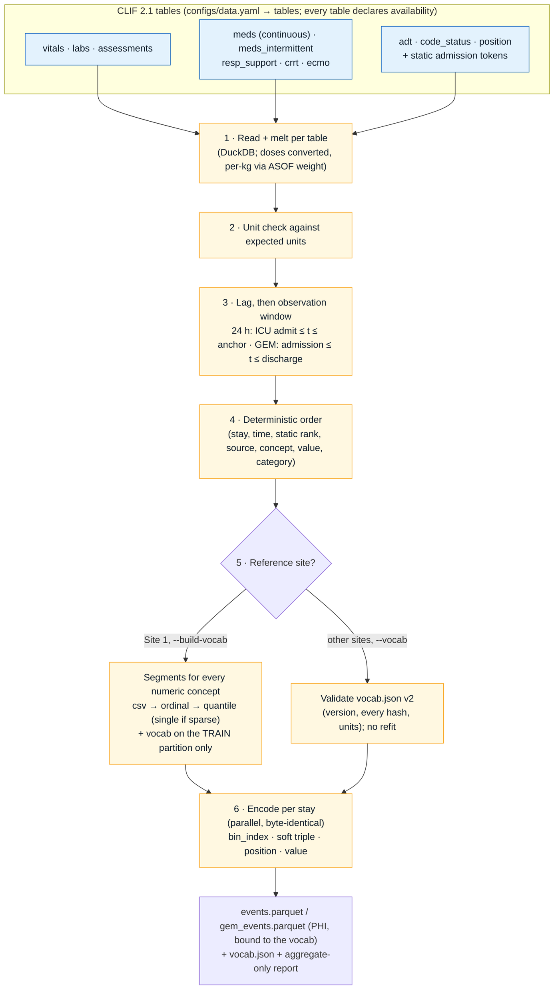
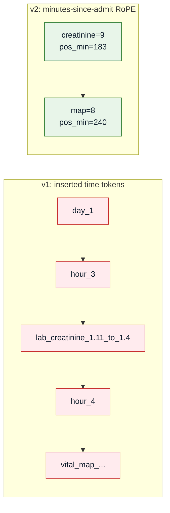
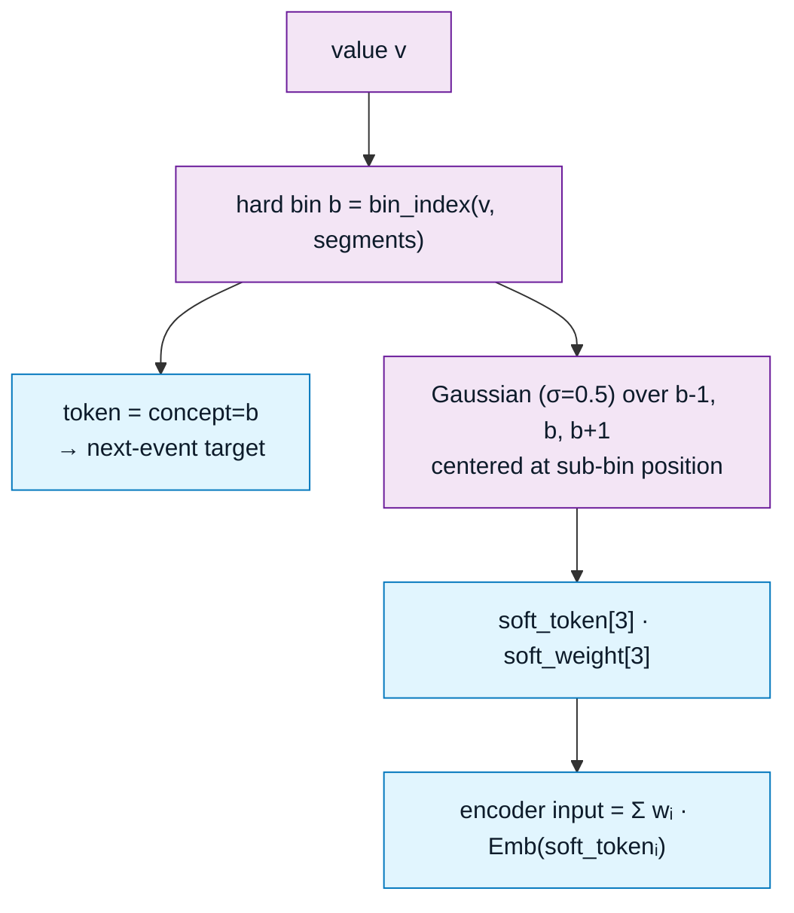
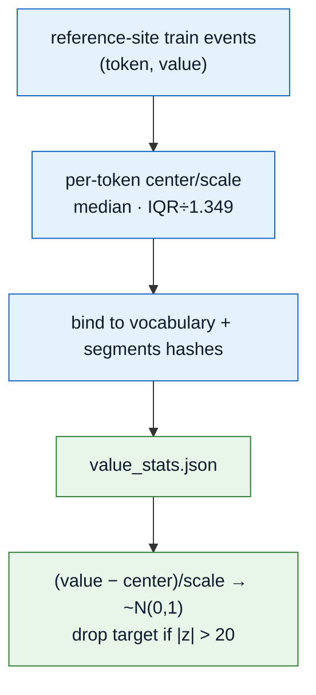

# Data & Tokenization

How raw CLIF 2.1 parquet becomes the fused event-token stream the from-scratch model consumes.
This page is the **canonical specification** of the CLIFATRON 2.0 tokenizer (tokenizer
version 2, precedence policy v2). Every number on it was computed from the code and config at
the commit that last touched this page. If the code and this page disagree, the code is right
and this page is a bug.

| | |
|---|---|
| **Code** | `src/data/tokenize.py` (polars + DuckDB), `src/data/segments.py` (segments, precedence policy, the one binning function), `src/data/units.py` (dose units), `src/data/tokenization_report.py` (report + gate) |
| **Config** | `configs/data.yaml` (tables, availability, targets, binning, static tokens, GEM allowlists) · `configs/cohort.yaml` (episode, anchor, windows) |
| **Bin source** | `external/clifatron/tokenETL/config/critical_illness_tokenization_final_with_intervals.csv`: the CLIF consortium's physician-designed segments (1267 segment rows, 92 measurements) |
| **Output** | `events.parquet` (24 h artifact, one row per ICU stay) · `gem_events.parquet` (full hospitalization, one row per window) · `vocab.json` (tokenizer v2 contract) · `tokenization_report.json` / `gem_tokenization_report.json` (aggregate-only) |
| **Tests** | `tests/test_segments.py`, `tests/test_tokenize_bins.py`, `tests/test_tokenize_alignment.py`, `tests/test_units.py`, `tests/test_gem_artifact.py`, `tests/test_tokenize_workers.py`, `tests/test_tokenization_report.py`, `tests/test_tokenization_ablation.py` |

:::warning[Every v1 tokenizer artifact must be rebuilt]
Tokenizer v2 changed the token stream (bins, coverage, order, new sources). Every
`vocab.json`, shard, value-stats file and checkpoint built by the previous tokenizer is
**refused** with a re-tokenize message, never silently reused. The production vocabulary must be
fit on the reference site's **full** train partition; a vocabulary built from a verification
sample (`--sample-episodes`) is marked `provenance.sample: true` and training refuses it.
:::

---

## One event, one token

Each clinical event becomes **one fused token**:

| Event | Token | Example |
|-------|-------|---------|
| Numeric value on any numeric concept | `concept=k`, the index of its value segment | lactate 4.1 mmol/L → `lactate=10`, segment `(4, 5.4]` |
| Categorical finding with no numeric value | `concept=value` (normalized: lowercase, spaces → `_`) | `cam_total=positive`, `mode_category=assist_control-volume_control`, `code_status=dnr` |
| Pure presence (no value at all) | bare `concept` | `icu` (ADT location) |
| Value or concept the frozen vocabulary does not cover | `<unk>` (id 3) | a category string never seen at the reference site |

Every numeric concept is binned (there are no bare numeric tokens), and a row that carries a
number emits only its numeric token, never a second descriptor token. A bare-integer categorical
value is written `concept=cat_2`, so it cannot be mistaken for a bin index.

Each token carries four things:

1. a **hard token id** (the next-event target),
2. a **soft token / soft weight** triple (the encoder input),
3. a **position** in minutes (since ICU admission for the 24 h artifact, since hospital
   admission for the GEM artifact), and
4. the **raw numeric value** (the value-regression "mark" target), `NaN` if none.


```mermaid
flowchart TB
    subgraph SRC["CLIF 2.1 tables (configs/data.yaml → tables; every table declares availability)"]
        V["vitals · labs · assessments"]
        TX["meds (continuous) · meds_intermittent<br/>resp_support · crrt · ecmo"]
        CX["adt · code_status · position<br/>+ static admission tokens"]
    end
    V & TX & CX --> READ["1 · Read + melt per table<br/>(DuckDB; doses converted, per-kg via ASOF weight)"]
    READ --> UNIT["2 · Unit check against expected units"]
    UNIT --> WIN["3 · Lag, then observation window<br/>24 h: ICU admit ≤ t ≤ anchor · GEM: admission ≤ t ≤ discharge"]
    WIN --> SORT["4 · Deterministic order<br/>(stay, time, static rank, source, concept, value, category)"]
    SORT --> VOC{"5 · Reference site?"}
    VOC -->|"Site 1, --build-vocab"| BUILD["Segments for every numeric concept<br/>csv → ordinal → quantile (single if sparse)<br/>+ vocab on the TRAIN partition only"]
    VOC -->|"other sites, --vocab"| LOAD["Validate vocab.json v2<br/>(version, every hash, units); no refit"]
    BUILD & LOAD --> ENC["6 · Encode per stay (parallel, byte-identical)<br/>bin_index · soft triple · position · value"]
    ENC --> OUT["events.parquet / gem_events.parquet (PHI, bound to the vocab)<br/>+ vocab.json + aggregate-only report"]

    classDef src fill:#e3f2fd,stroke:#1565c0,color:#0d1b2a;
    classDef step fill:#fff8e1,stroke:#f9a825,color:#0d1b2a;
    class V,TX,CX src;
    class READ,UNIT,WIN,SORT,BUILD,LOAD,ENC step;
```

---

## 1 · Source tables and roles

Event sources are declared in `configs/data.yaml`. A long table names a concept column; a wide
table is melted to one event per non-null cell (`value_cols` for numbers, `categorical_value_cols`
for categories). Every table declares its availability semantics (§2). A configured wide-table
column (or `categorical_value_col` / `concept_qualifier_col`) that a site's parquet lacks is
skipped, never a DuckDB error, and listed per table under `missing_columns` in the tokenization
report; without the qualifier column, ECMO/MCS metrics fall under the `unknown` group. (Synthetic
CLIF releases lack 11 `resp_support` columns, the assessments `categorical_value` and ECMO `fdO2`.)

| Table key | CLIF file | Availability | Events | Role |
|-----------|-----------|--------------|--------|------|
| `vitals` | `clif_vitals` | `recorded_dttm` · `missing_storetime` | `vital_category` + value | measurement (target-eligible) |
| `labs` | `clif_labs` | `lab_result_dttm` · `result` | `lab_category` + value (+ `reference_unit`) | measurement (target-eligible) |
| `assessments` | `clif_patient_assessments` | `recorded_dttm` · `missing_storetime` | `assessment_category` (lowercased): numeric scales binned (GCS, RASS, Braden are ordinal), results without a number fused (`cam_total=positive`, SBT) | measurement (target-eligible) |
| `meds` | `clif_medication_admin_continuous` | `admin_dttm` · `recorded` | dose per medication in the CSV's preferred unit; a `stop` action is a dose of 0 | **input only** |
| `meds_intermittent` | `clif_medication_admin_intermittent` | `admin_dttm` · `recorded` | dose per medication in one canonical unit (mass → mg, units → u) | **input only** |
| `resp_support` | `clif_respiratory_support` | `recorded_dttm` · `missing_storetime` | the 17 numeric settings/observations (FiO₂, PEEP, tidal volume, …) + fused `device_category`, `mode_category`, `tracheostomy` | **input only** |
| `crrt` | `clif_crrt_therapy` | `recorded_dttm` · `missing_storetime` | 5 flow/rate settings + fused `crrt_mode_category` | **input only** |
| `ecmo` | `clif_ecmo_mcs` | `recorded_dttm` · `missing_storetime` | `{mcs_group}_{column}` (device rate, flow, sweep, FdO₂) + fused device | **input only** |
| `code_status` | `clif_code_status` (patient-keyed) | `start_dttm` · `recorded` | fused `code_status=…`: the status in effect at admission, then each change | **input only** |
| `position` | `clif_position` | `recorded_dttm` · `missing_storetime` | fused `position=prone` / `position=not_prone`, transitions only | **input only** |
| `adt` | `clif_adt` | `in_dttm` · `recorded` | bare `location_category` | **input only** |
| static | `clif_hospitalization` + `clif_patient` | stay start | `age_decile=k`, `sex=…`, `race=…`, `ethnicity=…`, `admission_type=…`, once, first, fixed order | **input only** |

**Doses (R6, R7).** Each distinct (medication, unit) pair is resolved once by `units.dose_plan`
and applied vectorized. Continuous doses convert to the physician CSV's preferred unit
(mcg ↔ mg, per hour ↔ per minute, units/h → units/min). A per-kg target uses the most recent
`weight_kg` whose availability time is at or before the dose's (DuckDB `ASOF JOIN`; a later
weight is never used). A dose that cannot be converted keeps its native unit under
`{medication}_{unit}` (for example `fentanyl_mcg_hr`), with a recorded reason (`no_weight`,
`unconvertible`). The reference site also fits those native-unit fallback concepts from its
pre-conversion doses (a fit-only shadow), so they exist in the frozen vocabulary even where the
reference site converted every row. Intermittent doses fall back to `{medication}_dose` or
`{medication}_ml` only for `dose` and `mL`. ECMO/MCS metrics are qualified by device group, so an
ECMO pump speed and an LVAD pump speed are different concepts.

**State tables.** Code status and position are carried forward: the last state charted before
the window opens is placed at the window start (it was already knowable then), so a code status
set at hospital admission is not lost from an ICU stay that starts later. Position emits only on
prone / not-prone transitions.

Rows with a null concept or null timestamp are dropped at read time. A table whose parquet file
is missing is skipped with a log line. If **no** configured table exists, the run fails.

:::warning[Rule 1: treatments are inputs, never targets]
Every event from an `input_only` table (medications, respiratory support, CRRT, ECMO/MCS, code
status, position, ADT) and every static token gets `target_eligible = false`. These events stay
in the context the model reads, but the target builder never makes them a next-event or value
target, and they are absent from `target_concepts`, so no hazard head is trained on them.
:::

Compared with v1 `tokenETL`, v2 now covers doses, ventilator settings, assessments, CRRT,
ECMO/MCS, code status, position and demographics. Elixhauser comorbidities and a discretized SOFA
score are still out of scope (see [residuals](#known-issues-and-open-decisions)).

---

## 2 · Episode, observation window, and position

The tokenizer refuses to run without the canonical episode artifact built from
`configs/cohort.yaml` (`--episodes`). That artifact fixes:

| Field | Value |
|-------|-------|
| Episode unit | first eligible ICU episode per patient, age ≥ 18 |
| Anchor | first ICU `in_dttm` + **24 h** |
| Observation window (24 h artifact) | `[ICU admit, anchor]`, both ends inclusive |
| GEM window | `[hospital admission, discharge]`, both ends inclusive (§10) |
| Prediction window | `(anchor, anchor + 48 h]` (used by outcome labels, not the tokenizer) |
| Partition | `train` / `validation` / `calibration` / `internal_test` from the split artifact (`split_sha256`) |

`restrict_to_observation_window()` inner-joins events to eligible episodes and keeps only events
with `icu_admit_dttm ≤ dttm ≤ anchor_dttm`. All timestamps must be timezone-aware UTC, and the
DuckDB session is pinned to `TimeZone = 'UTC'`, so the output does not depend on the host's
timezone.

**Position** is `pos_min = floor(minutes since ICU admission)` (since hospital admission in the
GEM artifact). It feeds time-aware RoPE directly, as the rotation angle, instead of the token
index. Events in the same minute share a position. v2 inserts no `day_N` / `hour_N` tokens.


```mermaid
flowchart LR
    subgraph OLD["v1: inserted time tokens"]
        O1["day_1"] --> O2["hour_3"] --> O3["lab_creatinine_1.11_to_1.4"] --> O4["hour_4"] --> O5["vital_map_..."]
    end
    subgraph NEW["v2: minutes-since-admit RoPE"]
        N1["creatinine=9<br/>pos_min=183"] --> N2["map=8<br/>pos_min=240"]
    end

    classDef bad fill:#ffebee,stroke:#c62828,color:#0d1b2a;
    classDef good fill:#e8f5e9,stroke:#2e7d32,color:#0d1b2a;
    class O1,O2,O3,O4,O5 bad;
    class N1,N2 good;
```

### Ordering, availability and leakage (Rule 4)

Events are ordered by their **availability** timestamp: when the value could be known, not when
it was nominally measured. Every table must declare what its timestamp means
(`availability:`), and the run fails closed if any table does not:

| Semantics | Meaning | Tables |
|-----------|---------|--------|
| `result` | the time the result became available | labs (`lab_result_dttm`, where Site 1's store time lands) |
| `recorded` | the time the event was charted or administered | meds, intermittent meds, code status, ADT |
| `missing_storetime` | CLIF carries no store time, so `recorded_dttm` stands in and may precede true availability | vitals, assessments, respiratory support, CRRT, ECMO/MCS, position |

An optional `availability_lag_minutes` (default 0) shifts a table's timestamps later **before**
windowing, so a site can be conservative where its charting lags: an event whose shifted time
passes the anchor is excluded, and a kept event is positioned at its shifted time.

**Deterministic order.** After the window join (never before: a join does not preserve row
order), events are sorted by `(stay, time, static rank, source table, concept, value,
categorical value)` with nulls last and a stable sort. Static admission tokens therefore lead
the stream in their fixed order, and three vitals charted in the same minute always come out in
the same order. Identical input gives a byte-identical `events.parquet`, for any row order of
the source tables and for any number of encoding workers.

---

## 3 · Value binning: segments for every numeric concept

`value_binning.scheme: clinical_segment` with `coverage: all` is the default. A binned concept is
an ordered list of **segments** `{lo, hi, lo_closed, hi_closed}`; a point segment has
`lo == hi`. The fused token is `concept=<segment index>`. `segments.bin_index(value, segments)` is
the **only** code path that maps a value to a bin: the tokenizer, `outcome_join`'s
`threshold_bin`, plausibility checks, the sequence viewer, generation and the `clif-validate`
site package all call it.

### Binning sources

Each numeric concept seen in the reference site's train partition gets segments from the first
source that applies. The choice is recorded per concept in `vocab.json → binning_sources`.

| Source | When | Segments |
|--------|------|----------|
| `csv` | the physician CSV defines the concept | the CSV's segments under the precedence policy |
| `single` | fewer than `min_count: 20` training values | one segment (reported, never silently bare) |
| `ordinal` | integer-valued with at most 25 distinct training values (GCS and components, RASS, Braden) | one point segment per value |
| `quantile` | anything else | frozen quantile segments, target 10 (`quantile_n_bins`), deduplicated, `[a, b)`, unbounded ends, forced edges pinned |

**Doses are zero-aware.** Every dose concept (continuous or intermittent, CSV or not) has a
`[0, 0]` point segment, and its quantiles are fit on strictly positive doses only, so a stopped
infusion (`stop` action, dose 0) is never the same token as a running one. No running dose can
reach the stop bin through the gap rule either (policy step 8): when the next segment starts above
0, an open running-dose segment `(0, next)` is inserted (the CSV gives `lorazepam_mg_hr` only
`[0]` and `[1]` below 1 mg/h, so 0.25 mg/h used to bin as stopped; ordinal doses had the same gap
between their 0 and 1 points). The static
`age_decile` token is always quantile (deciles of age).

### Precedence policy v2 (how CSV rows become a strict partition)

Applied in order and recorded in the vocabulary (`precedence_policy: 2`; a vocabulary built under
v1 is refused with a re-tokenize message):

1. **Merge near-duplicates.** Boundaries within 1e-6 relative are merged (a forced edge wins).
2. **Overlap.** The earlier segment keeps its upper endpoint and closure; the later segment
   starts there with the complementary closure. This resolves the CSV's temp_c
   `(37.111, 37.5]` / `(37.499, 37.611]` pair, so temp_c no longer has a near-empty bin.
3. **Forced edges, direction-aware.** A forced clinical edge splits the segment containing it.
   For a target concept the threshold value lands on the **non-event** side: `below` targets put
   the edge value in the bin above (`[65, …`), `above` targets in the bin below (`…, 4]`).
   Non-target forced edges use `[`.
4. **Exact points win.** CSV rows flagged `exact_dose_token` (and any closed `[v, v]` row) become
   point segments that win over any interval containing the same value.
5. **Gaps.** A value between two segments goes to the nearest; equidistant goes to the lower.
6. **Clamp.** A value beyond the floor or ceiling goes to the end segment. No numeric event is
   dropped for being out of range.
7. **Alias.** CSV `angiotension_*` is read as CLIF `angiotensin_*`.
8. **Dose gap (v2).** For a dose concept, if the segment after the `[0, 0]` stop bin starts above
   0, an open segment `(0, next.lo)` is inserted, its upper end the complement of the next
   segment's lower closure. A new segment rather than extending the next one down to 0, because
   the next one may be a physician point bin (`[1]`) that must stay a point.

Steps 5 and 6 are applied by `bin_index`; the rest when segments are built. The CSV's interval
flags are honored everywhere else: `(a, b]` stays `(a, b]`, as in v1.

### Bin assignment rule

| Value | Bin | Segment | Rule |
|-------|----:|---------|------|
| lactate 1.99 | 5 | `(1.6, 2]` | CSV flags |
| lactate 2.00 | 5 | `(1.6, 2]` | CSV flag; forced edge, `above` |
| lactate 2.01 | 6 | `(2, 2.2]` | CSV flags |
| lactate 4.00 | 9 | `(3.4, 4]` | forced split, `above` |
| MAP 64.9 | 5 | `(61, 65)` | forced edge, `below` |
| MAP 65.0 | 6 | `[65, 67]` | forced edge, `below` |
| SpO₂ 88.0 | 1 | `[88, 90)` | forced edge, `below` |
| SpO₂ 92.0 | 3 | `[92]` | exact point row |
| respiratory rate 9.5 | 2 | `(6, 9]` | gap, equidistant → lower |
| temp_c 37.4995 | 13 | `(37.111, 37.5]` | overlap, earlier owns |
| lactate 0.0 / 50 | 0 / 15 | first / last segment | clamp |

A threshold query uses the same function: `segments.threshold_bin` bins a value just on the
event side of the threshold, so "MAP below 65" names the bin of 64.9 and "lactate above 4" the
bin of 4.01.

### The frozen target-concept segments (current config)

Recomputed from `build_clinical_segment_bins` with the configured forced edges and directions.

| Concept | Direction | Unit | Bins | Forced edges | Segments |
|---------|-----------|------|-----:|--------------|----------|
| `map` | below | mmHg | 23 | 65 (in CSV) | `[0, 53]` … `(61, 65)` · `[65, 67]` … `(133, 250]` |
| `lactate` | above | mmol/L | 16 | 2.0 (in CSV), **4.0** | `[0.1, 0.5]` … `(1.6, 2]` · `(2, 2.2]` … `(3.4, 4]` · `(4, 5.4]` … `(12.8, 30]` |
| `spo2` | below | % | 11 | 88, 90 (in CSV) | `[49.9, 88)` · `[88, 90)` · `[90, 91]` · `[92]` · `(92, 93]` … `(98, 100]` |
| `respiratory_rate` | above | breaths/min | 19 | — | `[0]` · `(0, 6]` · `(6, 9]` · `[10]` · `(10, 11]` … `(34, 60]` |
| `creatinine` | above | mg/dL | 18 | **1.5, 2.0, 3.0** (≈ KDIGO) | `[0.19, 0.49]` … `(1.42, 1.5]` · `(1.5, 1.81]` · `(1.81, 2]` · `(2, 2.63]` · `(2.63, 3]` · `(3, 4.87]` · `(4.87, 20]` |
| `bilirubin_total` | above | mg/dL | 15 | — | `[0.1, 0.3]` … `(25, 76.4]` |
| `platelet_count` | below | 10³/µL | 19 | — | `[0, 12]` … `(513, 1997]` |
| `heart_rate` | above | beats/min | 19 | — | `[0]` · `(0, 52]` … `(138, 300]` |
| `sbp` | below | mmHg | 23 | — | `[0, 67]` … `(177, 300]` |
| `temp_c` | above | °C | 23 | — | `[31.999, 35.388]` … `(37.111, 37.5]` · `(37.5, 37.611]` … `(39.166, 44]` |

These 10 concepts carry 186 numeric tokens. Across all 92 CSV measurements policy steps 1–4 yield 1,271
segments (92 of them point segments). To regenerate:

```bash
uv run python -c "import yaml; from src.data.tokenize import build_clinical_segment_bins, ROOT; \
from src.data.segments import interval_label; cfg=yaml.safe_load(open('configs/data.yaml')); \
vb=cfg['value_binning']; tc=cfg['target_concepts']; \
segs=build_clinical_segment_bins(ROOT/vb['segment_source'], [t['name'] for t in tc], \
vb['forced_edges'], {t['name']: t['direction'] for t in tc}); \
[print(c, len(s), ' '.join(interval_label(x) for x in s)) for c, s in segs.items()]"
```

### Forced clinical edges

```yaml
forced_edges:
  lactate:    [2.0, 4.0]        # Sepsis-3 / Surviving Sepsis
  map:        [65.0]            # vasopressor trigger
  spo2:       [88.0, 90.0]
  creatinine: [1.5, 2.0, 3.0]   # ≈ KDIGO stages
```

Forced edges keep tokens legible at decision points and line bin boundaries up with the
threshold-hazard head's queries. Under `clinical_segment` a forced edge is **added** to the CSV
grid. Under `decile_ablation` (and for `quantile` concepts) it **replaces** the nearest quantile
edge, so the bin count stays at most the quantile target.

### Missing and non-finite values

- A row on a binned concept with no finite value and no categorical result is **skipped**: no
  token, no position. A missing lactate is not a low lactate.
- A row with no finite value but a categorical result emits the fused `concept=value` token.
- Finite but implausible sentinels are kept (they clamp to an end segment); the target builder
  drops their value target when the standardized value has `|z| > 20`.

---

## 4 · Fused vocabulary and the frozen manifest

`build_vocab()` assigns ids in this order:

1. Special tokens: `<pad>`=0, `<bos>`=1, `<eos>`=2, `<unk>`=3.
2. Every concept seen in the **train partition of the reference site**, sorted. A binned concept
   gets one id per segment (`concept=0` … `concept=k`), then its fused categorical values; a
   presence concept gets one id.
3. Concepts and categorical values charted only in the full-hospitalization train events (ED and
   ward locations, ward-only labs), appended after every 24 h token so 24 h ids never move.

A fused categorical value (`concept=value`, after normalization) gets an id only if it was charted
in at least `minimum_cell_size` (10, from `configs/artifact_policy.yaml`) **distinct** train stays.
`vocab.json` ships to every site in the bundle, so a value charted for fewer patients never leaves
the node verbatim; it encodes as `<unk>`. The floor applies to every categorical value, including
controlled CLIF `*_category` values and the static `sex` / `race` / `ethnicity` /
`admission_type` categories; the fixed `ADMISSION//*` / `DISCHARGE//*` allowlist is configuration
and is exempt.
4. The fixed `ADMISSION//*` and `DISCHARGE//*` allowlist (§10), present even if no stay has that
   admission type or disposition.

On the Site 1 verification sample the vocabulary has 2,083 ids, within the 10k `target_vocab`
budget in `configs/model.yaml`.

**Freeze once, apply everywhere.** Only `value_binning.build_from_site` (the reference site,
Site 1; config value `mimic`) may run `--build-vocab`, and segments and vocabulary are fit on
`fit_partition: train` only. `vocab.json` (tokenizer v2) carries `vocab`, `segments`,
`binning_sources`, `reference_units` (every binned concept's reference unit or device metric, plus
the dose target units), `concept_sources` (charting tables and the input-only tables),
`precedence_policy`, and a manifest:

| Manifest field | Binds the vocab to… |
|----------------|---------------------|
| `tokenizer_version: 2` | the v2 token stream; anything else is refused with a re-tokenize message |
| hash `vocabulary` | the exact token → id map |
| hash `numeric_edges` | the segments (the "segments hash") |
| hashes `binning_sources`, `reference_units`, `concept_sources` | those v2 fields |
| hash `target_map` | `target_concepts` (names, directions, units) |
| hash `outcome_spec` | `configs/cohort.yaml → outcomes` |
| hash `clif_version` / `training_split` | CLIF 2.1.0 / the split artifact's `split_sha256` |
| `provenance` | source site, fit partition, policy version, per-table availability and lag, dose-conversion counts, static tokens, and `sample` / `sample_size` |

**Stale-artifact rejection.** When another site runs `--vocab`, `validate_vocabulary_artifact()`
recomputes every hash and checks the version, family, CLIF/mCIDE versions and fit partition; any
mismatch is a hard failure, never a silent refit. Every shard row records the binding
(`artifact_hashes`: tokenizer version, vocabulary hash, segments hash), and `ModelDataset`,
value stats, training resume, generation, the viewer and `clif_validate.load_checkpoint` refuse
a mismatch or a missing binding. A unit charted differently from the vocabulary's reference unit
fails the run under `unit_normalization.on_mismatch: error`.

**Derived `n_value_bins`.** The threshold head's value-bin count is the largest segment count of
any binned concept plus one, derived from the vocabulary in training and in the site package's
checkpoint loader, never hard-coded (24 on the Site 1 sample).

:::info[Single-hospital guard]
If a site's `clif_adt` contains more than one `hospital_id`, tokenization fails. Each hospital
must be its own site, because pooling hospitals under one site silently merges different
workflows and populations (Rule 2).
:::

---

## 5 · Soft discretization (encoder input)

A hard bin discards *where* inside the bin a value fell. With `soft_discretization: true` and
`soft_kernel_bins: 1`, each numeric event also gets a soft triple over bins `b-1, b, b+1`:

1. **Sub-bin center:** `center = b + clip((v − lo) / (hi − lo), 0, 1) − 0.5`. End segments borrow
   their neighbor's width (clamped values make their own width meaningless); point segments sit
   at their center.
2. **Gaussian weights:** `w_i ∝ exp(−½ ((i − center)/σ)²)` with `σ = max(k/2, 0.5) = 0.5`,
   normalized to sum to 1 over the bins that exist.
3. **Fixed width:** every event, numeric or not, returns exactly `2k + 1 = 3` (bin, weight)
   pairs so batches stay dense `[B, T, 3]`. At the end bins and for categorical events, unused
   slots repeat the hard bin with weight 0.

Worked examples (frozen lactate segments):

| Value | Hard token | soft bins | soft weights |
|-------|-----------|-----------|--------------|
| lactate 4.1 (segment `(4, 5.4]`) | `lactate=10` | 9 · 10 · 11 | 0.42 · 0.56 · 0.01 |
| lactate 0.0 (clamped to the first segment) | `lactate=0` | 0 · 0 · 1 | 0.00 · 0.98 · 0.02 |
| lactate 50 (clamped to the last segment) | `lactate=15` | 14 · 15 · 15 | 0.02 · 0.98 · 0.00 |
| `cam_total=positive` (categorical) | `cam_total=positive` | same id ×3 | 1 · 0 · 0 |


```mermaid
flowchart TB
    VAL["value v"] --> HARD["hard bin b = bin_index(v, segments)"]
    HARD --> TGT["token = concept=b<br/>→ next-event target"]
    HARD --> KERN["Gaussian (σ=0.5) over b-1, b, b+1<br/>centered at sub-bin position"]
    KERN --> W["soft_token[3] · soft_weight[3]"]
    W --> ENC["encoder input = Σ wᵢ · Emb(soft_tokenᵢ)"]

    classDef v fill:#f3e5f5,stroke:#6a1b9a,color:#0d1b2a;
    classDef o fill:#e1f5fe,stroke:#0277bd,color:#0d1b2a;
    class VAL,HARD,KERN v;
    class W,TGT,ENC o;
```

`CLIFEncoder.forward(token, pos_min, token_weight)` takes either hard `[B,T]` ids or soft
`[B,T,K]` ids with matching weights. The next-event loss always targets the **hard** id.

---

## 6 · Output schema (`events.parquet`)

One row per ICU stay, in stay order. All list columns have length `n_events` and are aligned
index by index; a skipped event is dropped from **every** list.

| Column | Type | Meaning |
|--------|------|---------|
| `hosp_id` | str | hospitalization id (**PHI**) |
| `token` | list[int] | hard fused-token ids |
| `soft_token` | list[list[int]] | 3 ids per event |
| `soft_weight` | list[list[float]] | 3 weights per event, summing to 1 |
| `pos_min` | list[int] | minutes since ICU admission |
| `value` | list[float] | raw numeric value, `NaN` if none |
| `target_eligible` | list[bool] | `false` for every input-only and static event |
| `partition` | str | split partition |
| `n_events` | int | sequence length |
| `artifact_hashes` | struct | tokenizer version, vocabulary hash, segments hash |

`gem_events.parquet` has the same per-token columns plus `trajectory`, the window fields
(`source_start`, `source_end`, `continuation_index`, `n_windows`, `continues_from_previous`,
`continues_to_next`) and the stay's `anchor_idx` / `anchor_min` (§10).

:::danger[Data classification]
`events.parquet` and `gem_events.parquet` are patient-level PHI under `output/intermediate_phi/`.
They stay on their node. External validation returns only aggregate metrics, through
`clif-validate` (Rule 5). The tokenization reports are aggregate-only (§11).
:::

**Parallel encoding.** The per-stay encode loop runs in a process pool (`--workers N`, `0` = every
CPU) over contiguous chunks of the ordered events, cut only at stay boundaries and concatenated in
order. Every artifact is byte-identical for any worker count (tested on both trajectories).

---

## 7 · How the tokens become training targets

The target builder (`src/data/targets.py`) consumes the shards:

- **Next event.** For each eligible (physiologic or assessment) event, the target is the *next
  eligible* event's hard token plus the minutes until it. Treatment, context and static events are
  context but never targets.
- **Value mark.** The target is the next eligible event's value, standardized with **per-token**
  robust statistics (median, IQR ÷ 1.349) frozen from the reference site's train partition
  (`src/data/value_stats.py`). Stats are bound to the vocabulary **and** segments hashes, and
  training fails closed if they are missing or stale.
- **Threshold hazard.** Outcome thresholds map to `threshold_bin` through `bin_index` on the same
  frozen segments, so the query and the token grid agree.
- **GEM mode.** `TargetBuilder(mode="gem")` builds next-event targets over the whole
  hospitalization (including the terminal `DISCHARGE//*` token) and no TTE labels; the 24 h mode
  keeps its post-anchor feature check.
- **In-stream mode (`gem_tte`).** `gem` plus time-to-event labels computed from the stay's own
  future. Anchors are sampled along the stay, deterministically per (run seed, epoch, stay), and
  each (anchor, threshold query) gets exactly one state: `prevalent`, `positive`,
  `competing_event`, `censored`, `not_ascertainable` or `negative`, at the exact threshold value.
  A horizon with no measurement of the queried concept is `not_ascertainable`, never a negative.
  This is the mode the full-hospitalization training path uses; the label rule is in
  [Objectives & Training → in-stream targets](./objectives-training.md#in-stream-targets) and
  the registered thresholds in `configs/thresholds.yaml`.

| Mode | Stream | Next-event targets | Time-to-event labels |
|------|--------|--------------------|----------------------|
| `icu_24h` | `events.parquet` | up to the 24 h anchor | joined outcome labels at the anchor |
| `gem` | `gem_events.parquet` | whole stay | none |
| `gem_tte` | `gem_events.parquet` | whole stay | in-stream, at sampled anchors |

:::warning[Value stats for the full-hospitalization path]
Fit value stats on the reference site's `gem_events.parquet` train stays, not on the 24 h
`events.parquet`. The 24 h stats lack tokens seen only outside the ICU window (ED, ward,
post-ICU), and target building refuses a token with no stats.
:::


```mermaid
flowchart TB
    REF["reference-site train events<br/>(token, value)"] --> STATS["per-token center/scale<br/>median · IQR÷1.349"]
    STATS --> BIND["bind to vocabulary + segments hashes"]
    BIND --> JSON["value_stats.json"]
    JSON --> STD["(value − center)/scale → ~N(0,1)<br/>drop target if |z| > 20"]

    classDef ref fill:#e3f2fd,stroke:#1565c0,color:#0d1b2a;
    classDef out fill:#e8f5e9,stroke:#2e7d32,color:#0d1b2a;
    class REF,STATS,BIND ref;
    class JSON,STD out;
```

---

## 8 · Two token streams: from-scratch vs the wedge

There are two token streams, and they are **not interchangeable**:

| | From-scratch path (primary) | Method-3 wedge (attach to CLIFATRON 0.5B) |
|---|---|---|
| Tokenizer | `src/data/tokenize.py` (this page) | CLIFATRON v1 `tokenETL` output, packed rows |
| Token strings | `lactate=6`, `cam_total=positive` | `labs_lactate_(2.0,2.2]` |
| Vocabulary | v2 frozen fused vocab (about 2k ids) | v1 `clinical_tokenizer/vocab.json` (~1.3k) |
| Time | `pos_min` RoPE | `day_N` / `hour_N` tokens; `pos_min` if present, else token index (with a warning) |
| Dataset representation | `ModelDataset(representation="decile")`* / `"gem"` | `ModelDataset(representation="clifatron_packed")` |

\*`"decile"` is a **legacy name** for the canonical v2 24 h shards; they use whatever binning
scheme produced them (clinical segments by default).

The two paths share the **bin design** (the physician CSV, now with the same interval flags) and
the **fused one-token-per-event idea**. They do **not** share token ids, so the finetune-vs-scratch
ablation compares two models and two tokenizations, and should be reported that way.

---

## 9 · Tokenization ablation

`configs/tokenization_ablation.yaml` declares six arms. Each loads its **own** events shard and
frozen `vocab.json` through `pretrain.build_loaders` and trains through `pretrain.Model` and
`engine.train` with masked losses and the `configs/model.yaml` objective weights; only the input
representation varies.

| Arm | Representation | Inputs |
|-----|----------------|--------|
| `clinical_soft` (primary) | physician segments + soft discretization | soft `[T, 3]` ids |
| `clinical_hard` | physician segments | hard ids (same shard) |
| `global_deciles` | `scheme: decile_ablation`: every numeric concept on quantile segments (same coverage) | hard ids |
| `deciles_plus_soft` | deciles + soft + forced edges | soft ids (same decile shard) |
| `continuous_fused` | edgeless concept ids + a normalized current-value channel (McCann 2026), derived from the primary shard by `python -m src.data.tokenize_continuous` | ids + value + mask; threshold bins and `n_value_bins` from the primary segments |
| `textcode` | frozen BioClinical-ModernBERT embedding of a generated description (concept, source table, bin interval, unit) of every fused id + a trainable projection | primary shard, hard ids |

The clinical and decile arms bin the **same concept set**, so the comparison isolates the binning
scheme. `freeze_trunk` freezes the trunk only when an init checkpoint bound to the arm's
vocabulary is given. All six arms run two optimizer steps end to end on a synthetic shard in CI
and on the Site 1 verification sample ([below](#verified-on-real-data)). No ablation result is
claimed yet: that needs the production vocabulary and the full training run.

---

## 10 · Full-hospitalization GEM artifact

`--trajectory hospitalization` writes `gem_events.parquet` beside `events.parquet`, with the
**same** frozen vocabulary (the reference site passes the `vocab.json` its 24 h build wrote). One
stay runs from hospital admission to discharge, including pre-ICU (ED, ward) and post-ICU events:

```text
<bos>  ADMISSION//<type>  <static tokens>  …events…  DISCHARGE//<disposition>  <eos>
```

- **Dispositions** (`gem.disposition_map`): `home`, `facility` (SNF, rehab, LTACH, acute care,
  psychiatric, assisted living), `hospice`, `expired`, `ama`, `other`, `unknown`. A missing or
  unmapped disposition is `unknown`: end of observation, never read as survival.
- The disposition appears **only** as the single `DISCHARGE//*` token, at the true
  `discharge_dttm` position, and it is target-eligible. No future outcome is an input flag.
  `<bos>`, `ADMISSION//*` and `<eos>` are inputs only.
- Positions are minutes since hospital admission. `anchor_idx` (the last token at or before ICU
  admit + 24 h) is kept for representation evaluation.
- Stays longer than `gem.max_tokens` (8192) are split into consecutive windows with the
  packed-segment continuation fields; the first window starts `<bos> ADMISSION//…`, the last ends
  `DISCHARGE//… <eos>`.

**Generate until disposition.** Generation stops at any `DISCHARGE//*` token or `<eos>`; each
rollout records `stop_reason` (`terminal`, `eos`, `censored`), its terminal type and step. A
rollout that hits the token cap is **right-censored**, never counted as survival. Rollout
mortality is the `expired` count over terminated rollouts, with a Wilson confidence interval and
the censored count reported separately. The generative evaluation reports terminal-type confusion,
the nontermination (censoring) rate, and mortality discrimination and calibration against the
observed disposition. Time-to-terminal is **not** estimated yet (see residuals).

**Training on it.** `python -m src.train.pretrain --trajectory hospitalization` reads one or
more sites' `gem_events.parquet` under **one** frozen vocabulary and labels anchors in-stream
(`gem_tte`). Sites are read side by side and never pooled on disk; a stay key is
`<site>:<hosp_id>`, so the same raw id at two sites stays two stays. Every window of a stay is
kept, because a window's labels read events from later windows. The windows are stored
columnar and memory-mapped from a cache beside each shard (`gem_cache/`), so the ranks on one
node share one copy. Details:
[Objectives & Training → the full-hospitalization loader](./objectives-training.md#the-full-hospitalization-loader).

---

## 11 · Tokenization report and real-data gate

Every run writes an aggregate-only report beside its events: `tokenization_report.json` (24 h)
or `gem_tokenization_report.json` (GEM). It contains:

- events and stays per source table, with `low_coverage` (fewer than 50 stays: present but
  unverified);
- token kinds (binned, fused categorical, presence, numeric-but-bare, skipped missing numeric)
  and the numeric concepts emitted bare, split into fit and non-fit partitions;
- vocabulary size, concepts per binning source, and the single-bin concepts;
- where `bin_index` placed each value (inside a segment, gap, clamped low or high), per concept;
- dose-conversion status counts (unconverted doses by reason);
- unit mismatches and concepts charted in more than one unit;
- `<unk>` counts and rates per partition, on the non-fit partitions, and per concept;
- events per stay (mean, p99) against the 8192 context; for GEM, windows and tokens per stay;
- the availability semantics and lag of every table, the vocabulary binding, and whether the
  vocabulary and the run are a sample.

Disclosure control reads the threshold from the artifact policy
(`classes.aggregate_no_phi.minimum_cell_size`, 10 in `configs/artifact_policy.yaml`; a policy
without it fails the run): every patient-derived count below 10 is written `"<10"`, and a mean,
percentile or rate over fewer than 10 stays or tokens is withheld, as is a rate whose numerator is
a suppressed count (rate × tokens would give it back). **Complementary suppression:** where cells
sum to a published total (token kinds and per-source events vs the event total, value placements
vs binned events, `<unk>` per partition and per concept vs the overall, GEM dispositions and
admission types vs stays), one suppressed nonzero cell would be the total minus the others, so the
next-smallest published cell is withheld too (`"suppressed"`), repeated until no such equation has
a single hidden nonzero cell. The non-fit `<unk>` count the gate reads is withheld only as a last
resort. The report also lists `missing_columns` per table (§1). Before writing, the report is
scanned for identifier fields and for any string equal to a hospitalization or patient id; a hit
fails the run.

The gate reads the reports and the data config and fails on: a table without an availability
declaration, an identifier field, an unsuppressed small cell, a numeric concept emitted bare in
the fit partition, a non-fit `<unk>` rate of 1% or more (or one too small to measure), or events
per stay (GEM: window length) beyond the context. It lists low-coverage sources and single-bin
concepts.

```bash
uv run python -m src.data.tokenization_report \
  --report output/intermediate_phi/mimic_v2_sample/tokenization_report.json \
  --report output/intermediate_phi/mimic_v2_sample/gem_tokenization_report.json
```

---

## Verified on real data

Run on 2026-10-02 on the dev Mac (16 CPUs), entirely on node, on a **verification sample of 5,000
eligible Site 1 ICU episodes** (`--sample-episodes 5000`: ranked by a salted hash of the
hospitalization id, never the first ids), re-run after the review fixes (policy v2, the
categorical small-cell floor, complementary suppression). The sample's vocabulary is smoke-only.
All numbers are aggregates from the reports; counts under 10 are shown as "fewer than 10", and a
cell withheld by complementary suppression is shown as "withheld". Every report passes the gate.

| 24 h artifact | Value |
|---------------|-------|
| Events / stays | 1,959,995 / 5,000 |
| Events per stay | mean 391.8, p99 811 (context 8192; fewer than 10 stays exceed it) |
| Vocabulary | 2,083 ids; 252 binned concepts: 86 `csv`, 42 `ordinal`, 55 `quantile`, 69 `single`; `n_value_bins` 24 |
| Token kinds | 1,832,580 binned · 120,620 fused categorical · 5,963 presence · numeric-but-bare fewer than 10 · skipped (missing numeric) withheld |
| Numeric concepts bare | **0** in the fit partition; 2 rare concepts charted only outside train (fewer than 10 events) |
| `<unk>` rate | 0.016% on train; 0.021% on the non-fit partitions (785,943 tokens): categorical values charted in fewer than 10 train stays |
| Value placement | about 1.83 M inside a segment · about 100 in a gap · 298 clamped low · 308 clamped high |
| Unit mismatches | none; no concept charted in more than one unit |
| Continuous doses (all rows read) | 30,492 converted · 521,511 already in the target or native unit · 0 without weight · 0 unconvertible |
| Intermittent doses (all rows read) | 23,848 converted · 67,513 already canonical · 146,577 unconvertible (`dose` / `mL`) · 0 without weight |
| Missing configured columns | none |

| Source | Stays with events (of 5,000) | Source | Stays with events |
|--------|------:|--------|------:|
| ADT / static | 5,000 / 5,000 | position | 4,726 |
| labs | 4,974 | resp_support | 4,135 |
| vitals | 4,774 | meds_intermittent | 4,073 |
| assessments | 4,772 | meds | 4,000 |
| code_status | 2,013 | CRRT | 79 |
| ECMO/MCS | **14, unverified** (under 50 stays) | | |

| GEM artifact | Value |
|--------------|-------|
| Stays / windows | 5,000 / 5,193 (144 stays need more than one 8192-token window) |
| Tokens per stay | mean 1,769.9, p99 14,097 |
| `<unk>` rate, non-fit | 0.061% (rare categorical values and concepts never charted in the train partition) |
| Dispositions | home 2,433 · facility 1,834 · expired 550 · hospice 123 · AMA 29 · other withheld · unknown fewer than 10 |
| Admission types | ED 4,221 · elective withheld · direct fewer than 10 |

**What the review fixes changed.** Compared token by token with the first verification run, every
position, value, flag and stay is identical; the only differences are the two intended ones.
Policy v2 inserted one running-dose segment into 25 dose concepts (1 `csv`: `lorazepam_mg_hr`; 24
`ordinal`), which re-indexes their higher bins (12,198 24 h and 63,482 GEM events) and moves
fewer than 10 running-dose events in each artifact out of the stop bin. The categorical floor
removed 10 categorical values from the vocabulary (343 24 h and 4,031 GEM events now `<unk>`). The
decile and continuous-fused arms lost the same 10 values and kept their segments.

**Training smoke.** On the same sample (CPU, a 2-layer d64 smoke trunk, batch 2), every ablation
arm (`clinical_soft`, `clinical_hard`, `global_deciles`, `deciles_plus_soft`, `continuous_fused`,
`textcode` with the real frozen BioClinical-ModernBERT encoder) ran 2 optimizer steps with finite
losses and nonzero masked next-event, value, competing-risk and threshold targets. The GEM path ran
2 next-event steps and 2 rollouts from a held-out stay's 24 h prefix; both rollouts hit the
32-token cap and were reported **censored** (expected for a 2-step model), not survival.

**Encoding time.** Encoding runs in stay-contiguous chunks of at most 2M events
(`--encode-chunk-events`), which bounds memory for any worker count. 24 h build: 13.8 s with one
worker, 8.9 s with all CPUs; GEM build: 37.7 s vs 12.7 s. Artifacts were byte-identical.

---

## Decision history

| Date | Decision | Where |
|------|----------|-------|
| 2025-10 | v1 `tokenETL`: physician CSV segments, `(a,b]` intervals, `day_N`/`hour_N` tokens, dose + vent-setting bins, Qwen2-0.5B | `external/clifatron/tokenETL/` |
| 2026-08-27 | v2 rewrite as one polars file: fused tokens, minute RoPE, soft discretization, forced edges, availability-time ordering, frozen-vocab manifest. Default binning set to **population deciles** after Lee 2026 | `375beae`, `a8998c5` |
| 2026-09-01 | Clinical-segment builder added; decile path made runnable as an arm | `db30f4c`, `20639ae` |
| 2026-09-02 | **Physician clinical segments restored as primary**, deciles demoted to `decile_ablation` | `2b9fd30`; `docs/solutions/methods-decisions/clinical-segment-binning-primary-scheme.md` |
| 2026-09-07 | Vocab, edges and value stats fit on the **train partition only** | `7a630bd` |
| 2026-10-02 | **Review fixes.** Precedence policy v2 (no running dose in the stop bin), categorical values need 10 distinct train stays to enter the shipped vocabulary, report threshold from the artifact policy with rate withholding and complementary suppression, bounded-memory chunked encode, missing site columns skipped, sample vocabularies refused by `load_bundle`, generative eval checks the events binding | code review `20261002-180059` |
| 2026-10-02 | **Tokenizer v2: bins for everything.** Closure-aware segments + precedence policy v1, coverage `all`, zero-aware doses, fused categoricals, doses/vent/assessments/CRRT/ECMO/code status/position/static tokens, deterministic order + availability declarations, vocab v2 contract with stale-artifact rejection, GEM full-hospitalization artifact, runnable six-arm ablation, aggregate report + gate, verification sample | `docs/plans/2026-10-02-1450-fix-tokenizer-bins-for-everything-plan.md` |

Why clinical segments are primary: the consortium's segments are finer than deciles where it
matters (16 lactate bins vs 10, with five above 5.4 mmol/L), and they encode clinical judgment
about decision zones that a quantile estimator cannot recover. Lee 2026 found deciles roughly
equal to reference ranges *at matched granularity*. The `decile_ablation` arm exists to measure
that difference on CLIF data rather than assert it.

---

## Known issues and open decisions

The 2026-10-02 audit items are resolved:

| # | Issue | Resolution |
|---|-------|------------|
| T1 | Only the 10 target concepts were binned | `coverage: all`: every numeric concept gets segments (csv, ordinal, quantile, or single), recorded in `binning_sources`; 0 bare numeric concepts in the fit partition on the Site 1 sample |
| T2 | `[a,b)` assignment vs the CSV's `(a,b]` | Segments honor the CSV interval flags; forced edges take outcome-direction closure; precedence policy (v1, now v2); one `bin_index` for every consumer |
| T3 | Unstable tie order for same-timestamp events | Full-key stable sort after the window join; byte-identical output for any input row order and any worker count |
| T4 | No med doses or vent settings | Continuous doses (weight ASOF, per-kg, native-unit fallback), intermittent doses, 17 respiratory settings, assessments, CRRT, ECMO/MCS by device group, code status, position, static admission tokens; zero bin for every dose |
| T5 | Ablation runner unwired; continuous-fused and TextCode stubs | Six runnable arms through `build_loaders`; real continuous-fused and TextCode implementations |
| T6 | `temp_c` 37.499 / 37.5 near-duplicate edge | Overlap rule (policy step 2): the earlier segment owns the region; temp_c has 23 bins and no near-empty bin |
| T7 | Vitals use `recorded_dttm` (no store time in CLIF) | Every table declares `availability` (vitals: `missing_storetime`) plus an optional lag; the report states it and the gate fails without it. The residual look-ahead is declared, not removed |

Remaining residuals:

| Residual | Impact | Next step |
|----------|--------|-----------|
| Time-to-terminal is not estimated | Generation advances a fixed clock, so rollouts give mortality but no time to discharge or death | A learned time head (G4) |
| Two suspect CSV rows: `bilirubin_conjugated [0, 0.14]` and `peak_inspiratory_pressure_set (5, 10)` are flagged exact, so each becomes a point bin at its lower bound | Values inside those ranges fall into neighbouring bins by the gap rule | Clinician review of the CSV |
| Data-driven bins for non-CSV concepts (`ordinal`, `quantile`, `single`) | 69 single-bin concepts on the sample, mostly rare medications and native-unit fallbacks; the full train partition will bin many of them | Clinician review; physician segments added to the CSV replace them |
| A continuous medication without a CSV preferred unit keeps its charted unit, so one drug charted in two rate units splits into two concepts (for example heparin units/h and units/min) | Fragmented dose concepts for those drugs | Canonical continuous units for non-CSV medications |
| 62% of Site 1 intermittent dose rows are charted as `dose` or `mL` | Those rows bin as `{medication}_dose`, a count of doses, not a mass | Site-level unit mapping |
| ECMO/MCS (14 stays) and CRRT (79 stays) are sparse in the sample | ECMO/MCS bins are unverified (single-bin) | Re-check on the full train partition and at Site 2 / Site 3 |
| NEE, discretized SOFA and Elixhauser comorbidities | Not in the stream | Deferred follow-up work |
| Norepinephrine salt vs base reporting differs by site | Dose bins may not transport | Per-site audit before federation |
| Post-discharge deaths are excluded | The GEM unit ends at hospital disposition | By design |
| Production vocabulary | The sample vocabulary is smoke-only | Fit on the full Site 1 train partition in the L40 re-tokenization, then rebuild shards, value stats and checkpoints |

---

## Run it

```bash
# 1. Reference site (Site 1; --site must equal value_binning.build_from_site)
uv run python -m src.data.tokenize --site mimic --in "$SITE1_DIR" \
  --out output/intermediate_phi/mimic --build-vocab \
  --episodes output/intermediate_phi/episodes.parquet --workers 0

# 2. GEM artifact with the same frozen vocabulary
uv run python -m src.data.tokenize --site mimic --in "$SITE1_DIR" \
  --out output/intermediate_phi/mimic --vocab output/intermediate_phi/mimic/vocab.json \
  --episodes output/intermediate_phi/episodes.parquet --trajectory hospitalization --workers 0

# 3. Every other site: reuse the frozen vocab (hash-verified, no refit)
uv run python -m src.data.tokenize --site site2 --in "$SITE2_DIR" \
  --out output/intermediate_phi/site2 \
  --vocab output/intermediate_phi/mimic/vocab.json \
  --episodes output/intermediate_phi/site2_episodes.parquet

# 4. Value-head stats from the reference site's train partition
uv run python -m src.data.value_stats \
  --events output/intermediate_phi/mimic/events.parquet --out value_stats.json
#    For the full-hospitalization training path, refit on the GEM shard's train stays
uv run python -m src.data.value_stats \
  --events output/intermediate_phi/mimic/gem_events.parquet \
  --out output/intermediate_phi/mimic/gem_value_stats.json

# Verification sample (smoke-only vocabulary), then the gate and the training smoke
uv run python -m src.data.tokenize --site mimic --in "$SITE1_DIR" \
  --out output/intermediate_phi/mimic_v2_sample --build-vocab \
  --episodes output/intermediate_phi/episodes.parquet --sample-episodes 5000 --workers 0
uv run python -m src.data.tokenization_report \
  --report output/intermediate_phi/mimic_v2_sample/tokenization_report.json
uv run python -m src.train.real_data_smoke --data-dir "$SITE1_DIR" \
  --sample-dir output/intermediate_phi/mimic_v2_sample \
  --episodes output/intermediate_phi/episodes.parquet \
  --labels output/intermediate_phi/mimic_v2_sample/labels.parquet

# Inspect without writing anything
uv run python -m src.data.tokenize --site mimic --in "$SITE1_DIR" --out /tmp/x \
  --build-vocab --episodes output/intermediate_phi/episodes.parquet --dry-run
```

Outputs go under `output/intermediate_phi/`, which `configs/artifact_policy.yaml` classifies as
`patient_level_phi`. The tokenizer refuses to write events to a destination the policy does not
allow.
