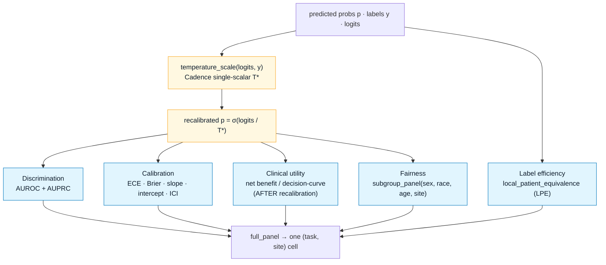
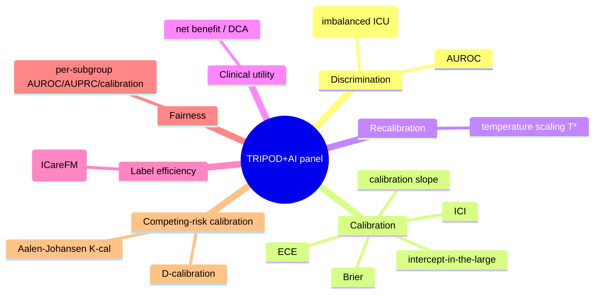
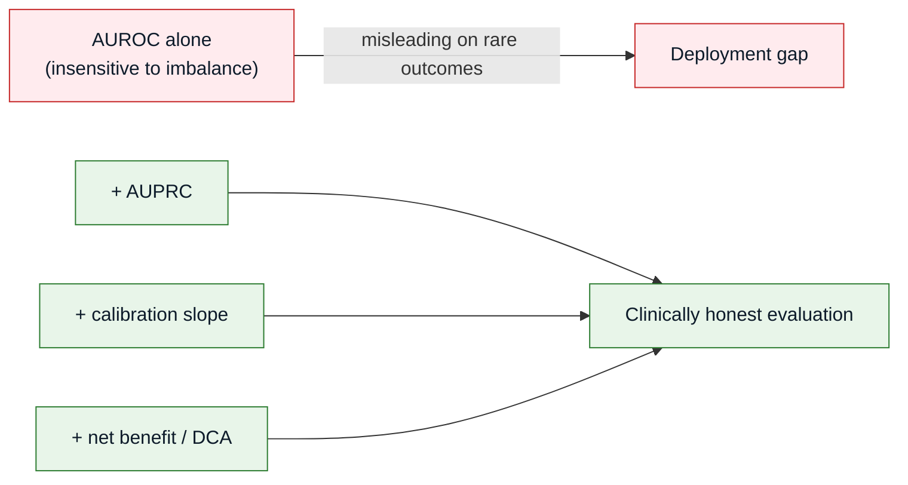
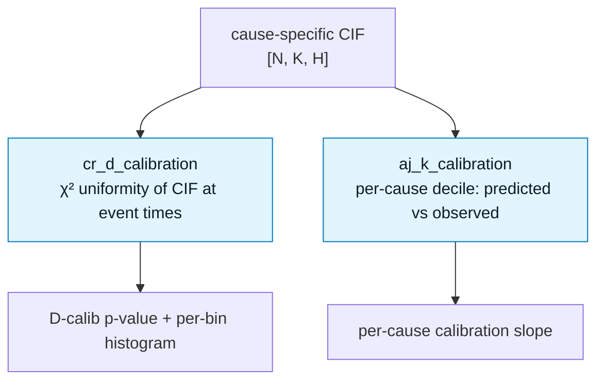
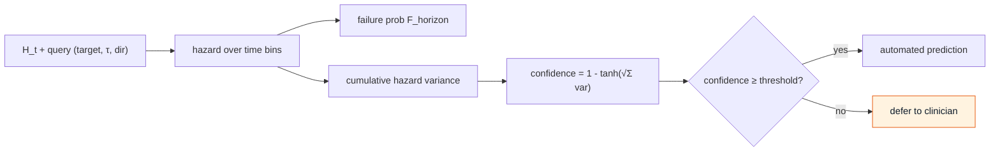

# Evaluation Panel — TRIPOD+AI

Every (task, site) cell runs through one panel so results compose across the internal matrix
and the external federation. Implemented in `src/eval/metrics.py` (pure numpy + sklearn; torch
only inside temperature scaling). The headline metric is **net benefit**, not AUROC alone.

---

## The metric pipeline (order matters)

:::warning DCA assumes calibrated probabilities
Decision-curve analysis is computed **after** temperature scaling — net benefit is only
meaningful on calibrated probabilities. The panel enforces this ordering in `full_panel`.
:::

---

## The full metric set

| Group | Metrics | Function |
|-------|---------|----------|
| Discrimination | AUROC, AUPRC | `score()` |
| Calibration | ECE, Brier, slope, intercept, ICI | `full_panel()` |
| Recalibration | temperature T* | `temperature_scale()` |
| Clinical utility | net benefit / DCA | `net_benefit()` |
| Label efficiency | LPE | `local_patient_equivalence()` |
| Fairness | subgroup AUROC/AUPRC/calibration | `subgroup_panel()` |
| Competing-risk | D-calibration, AJ K-cal | `cr_d_calibration()`, `aj_k_calibration()` |

---

## Why AUPRC *and* calibration, not AUROC alone

ICU outcomes are highly imbalanced (LTACH ~3.6% positive), and calibration degrades faster
than discrimination off-site. A model can look great on AUROC and still be clinically useless.

---

## Competing-risk calibration

Deep competing-risk models are badly miscalibrated by default. Two dedicated checks
(arXiv:2602.00194) go beyond the binary panel: **D-calibration** (a chi-squared uniformity
test on the CIF at observed event times) and **Aalen-Johansen K-calibration** (per-cause
predicted-vs-observed by decile).

---

## Selective prediction — defer the uncertain cases

The threshold head can abstain: `predict_with_confidence()` returns both a failure probability
and a confidence derived from the variance of the cumulative hazard across time bins. High
variance → low confidence → candidate for deferral to human review.

The deferral threshold is set at calibration time and tuned per-outcome on a held-out set.

---

## Reporting standard

**TRIPOD+AI** (BMJ 2024;385:e078378). New items this project explicitly hits: subgroup
performance, open-science (protocol registration, data + code sharing), and external validation
on ≥1 unseen site. Baselines are mandatory: **MEDS-Tab XGBoost** as the strong ML floor, plus
the CLIFATRON Method-1 XGBoost-on-embeddings comparator.
