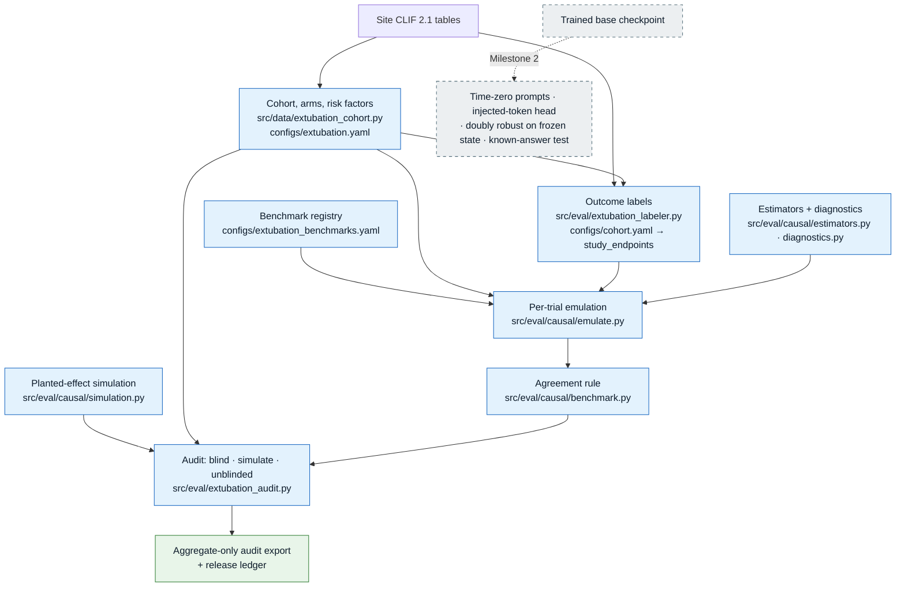

# Extubation application (claim 3)

The extubation study asks whether a classical target-trial emulation, and later the foundation
model with the post-extubation device injected at the real extubation, reproduces the pattern
that randomized trials established for high-flow nasal cannula (HFNC) and noninvasive
ventilation (NIV) after extubation.

The claim is **agreement with the trials' pattern**. An estimate that lands inside the margin is
consistent with the trial; it is not proof of cause. The study makes **no device
recommendation**: per-device risks in Paper 2 are exploratory.

:::note[What is built]
The classical half is built and tested: the cohort, the outcome labels, the estimators, the
benchmark registry, the agreement rule and its simulation, and the go/no-go audit with an
aggregate-only export. The model-based half is Milestone 2 and needs a trained base model
([below](#what-milestone-2-adds)). The emulation protocol is a registration draft:
**`docs/protocols/extubation-emulation-protocol.md`**. Every margin and threshold in it is
`proposed` until the protocol is registered.
:::

---

## The pipeline as built



Respiratory support stays a model **input** throughout (hard rule 1). The cohort and the labels
only read it. The device-choice (propensity) model is a nuisance fitted inside the estimator,
never trained into the trunk.

---

## Cohort (`configs/extubation.yaml`)

Every definitional choice is a named parameter in the config; the cohort builder reads nothing
else.

- **Who.** Adults (18 or older) at their **first extubation per patient**, after at least
  **24 hours** of invasive ventilation. A 12-hour cohort is the sensitivity analysis; it reuses
  the same first extubation, so the cohorts nest.
- **Time zero.** The availability time of the first recognised non-invasive device row after a
  run of invasive-ventilation rows. A return to invasive ventilation within 1 hour is a charting
  gap, stitched into one episode, not an extubation.
- **Exclusions.** Tracheostomy at or before time zero; comfort-care status (`AND`) at time zero;
  documented do-not-reintubate status (`DNR/DNI`, `DNAR/DNI`). DNR without DNI is kept and
  recorded. Missing code status never excludes: about 43% of MIMIC extubations have none, so the
  patient is kept and flagged.
- **No look-ahead.** Every covariate uses only rows whose availability time is strictly before
  time zero.
- **Risk factors (R5).** Each trial risk factor has a documented proxy: age over 65 (age at
  admission), hypercapnia (latest arterial PaCO₂ above 45 mmHg in the 24 hours before time zero),
  BMI above 30 (latest weight and height), prolonged ventilation (7 days or more), and
  comorbidities. MIMIC diagnosis codes have no present-on-admission flag, so index-stay codes
  would leak post-extubation information. By default comorbidities come only from earlier
  hospitalizations, and are null (not false) when there is no usable history. Factors with no
  CLIF proxy (APACHE II, secretions, cough strength, airway patency, difficult weaning) are
  listed as not built.
- **Partition.** Each patient carries the partition of the episode artifact. A cohort patient
  with no partition there gets one from the same deterministic rule, and the source is recorded
  per row (KTD6).

Row-level output is `patient_level_phi` under `output/intermediate_phi/`. The command prints
only suppressed waterfall counts.

### Arms and the grace window

| Arm | Device categories |
|-----|-------------------|
| `niv` | `NIPPV`, `CPAP` |
| `hfnc` | `High Flow NC` |
| `conventional_oxygen` | `Nasal Cannula`, `Face Mask`, `Room Air` |

- **Assignment.** The first arm device row inside a **3-hour grace window** after time zero,
  right-closed. Post-extubation device rows are a median 180 minutes apart in MIMIC, so 3 hours
  is the shortest window that holds one charting step. Grace windows of 1, 2 and 6 hours, and
  the highest-support device in the window, are sensitivity analyses.
- **NIV alternating with HFNC** inside the window is the NIV arm (as in HIGH-WEAN).
- **Rescue.** Support ranked above the assigned arm and started after the grace window is
  rescue. It is a descriptive flag: never the assigned arm, never a covariate.
- Every device row from time zero through 168 hours is kept in a separate device-row artifact,
  so the clone-censor-weight estimator and every sensitivity window can be re-derived.

---

## Outcomes and the discharge rule

The endpoints are declared in `configs/cohort.yaml → study_endpoints` with `use: label_only`,
outside the hash-bound `outcomes` block. That declaration is the scoped amendment to hard rule
1: the trunk never trains on treatment targets, but a study head or estimator downstream of it
may use an endpoint defined by a treatment event. `tests/test_data_config.py` enforces it.

| Endpoint | Event | Horizon |
|----------|-------|---------|
| `reintubation_72h` | return to invasive ventilation | 72 h |
| `reintubation_7d` | return to invasive ventilation | 7 days |
| `death_7d` | death | 7 days |
| `reintubation_or_death_7d` | **primary study outcome**; death competes with reintubation | 7 days |

`src/eval/extubation_labeler.py` builds them:

- **Reintubation** is the first invasive-ventilation row of the index stay strictly after time
  zero, on the same availability clock. NIV or HFNC after extubation is never a failure.
- **Death** comes from the patient death timestamp, read together with the discharge category.
- **Hospice discharge** is a competing event at discharge time.
- Follow-up ends at death or discharge; readmissions are not searched. Windows are right-closed.
- **Discharge alive before the horizon, no event.** Two rules exist. `censor` censors the
  patient at discharge (the labeller's default). `event_free` counts the patient as event-free at
  the horizon, assuming no out-of-hospital reintubation or death. About 29% of MIMIC patients
  leave alive before day 7, so the choice matters. The benchmark registry proposes `event_free`
  as primary and `censor` as the sensitivity analysis; the protocol registers which one is
  primary, and both are reported. An unknown discharge disposition is censored under both rules,
  never read as survival.

---

## Benchmark trials (`configs/extubation_benchmarks.yaml`)

Six candidate trials, each with its own eligibility, exposure and outcome window. Every
emulation is approximate: no trial's eligibility can be fully built from CLIF data. Identifiers,
arm counts and published effects were checked against PubMed. Benchmark effects are risk ratios
computed from the published arm counts.

| Registry id | Contrast (treated vs control) | Emulated outcome | Finding |
|-------------|-------------------------------|------------------|---------|
| `hernandez_2016_low_risk` | HFNC vs conventional oxygen | reintubation, 72 h | effect |
| `hernandez_2016_high_risk` | HFNC vs NIV | reintubation, 72 h | null (non-inferiority) |
| `high_wean_2019` | any NIV vs HFNC (approximate: the alternating regimen cannot be represented) | reintubation, 7 days | effect |
| `hernandez_2022_very_high_risk` | NIV vs HFNC | reintubation, 7 days | effect |
| `ferrer_2009_hypercapnic` | NIV vs conventional oxygen | reintubation, 72 h | effect, but its published effect is for clinical respiratory failure, which the labels do not build: outcome marked not representable |
| `casey_2021_all_comers` | HFNC vs conventional oxygen (emulating protocolized support vs usual care) | reintubation, 96 h | null |

Each trial also states the direction residual confounding by indication would push the
estimate (`expected_bias`): NIV is chosen for sicker patients, so NIV tends to look worse than it
is.

### Feasibility screen (R25)

A trial is evaluable only if its eligibility, exposure and outcome are representable, every
estimator can run, and the data give enough precision. The screen reads **no outcome by arm**.
Proposed thresholds: at least 50 patients per compared arm; at most 20% of the trial population
with a cross-fitted probability below 0.02 of following a compared arm; a Kish effective sample
size of at least 30 per arm; and a projected precision check (a detectable difference at most
1.5 times the trial's difference for effect trials; an interval narrow enough to show
equivalence for null trials). A trial that fails is reported as **not evaluable** and left out of
every estimator's agreement results.

---

## Estimators (`src/eval/causal/`)

- **Primary: one-step clone-censor-weight, doubly robust** (KTD8). Each patient is cloned into
  every compared arm at extubation. A clone is censored when the first device row inside the
  grace window shows another arm; an event before the first device row counts in every clone.
  Censoring is undone with inverse-probability weights from a cross-fitted device-choice model,
  and a cross-fitted outcome model makes the estimate doubly robust. Intervals come from
  influence functions summed within patient.
- **Sensitivity:** the first device as a point treatment (augmented inverse-probability
  weighting), overlap weights, the `censor` discharge rule, the other grace windows, the
  highest-support assignment and the 12-hour cohort.
- **Nuisance models:** histogram gradient boosting by default, logistic as an option, with
  probabilities clipped before inversion.
- **Libraries.** numpy and scikit-learn only, so the modules can be vendored into
  `clif-validate`. Correctness is carried by planted-effect tests.
- **Per site and pooled** (R14).
- **Adjustment set (proposed):** pre-time-zero covariates only. Unit and calendar period are
  left out on purpose: they shift device choice without a direct path to the outcome.

### Agreement rule and simulation

- **Scale.** Log risk ratio; gap = emulation minus trial.
- **Trials that found an effect.** Per estimator, the mean absolute gap over evaluable trials
  must lie within log 1.5. Absolute gaps are used so gaps of opposite sign cannot cancel. The
  inverse-variance signed mean gap is reported as a description of systematic bias.
- **Null trials.** Reproduced only when the emulation's **whole** interval lies inside
  [1/1.5, 1.5], so a wide interval cannot pass by being wide.
- **Comparing estimators (R27).** The paired difference in absolute gap between two estimators
  on identical patients, with a paired bootstrap interval.
- **Operating characteristics (R29).** A planted-effect simulation on each frozen cohort reports
  how often the rule passes when the true effect equals the trial's, is zero, or is reversed,
  with and without a withheld confounder. Treatment is drawn from a device-choice model fitted
  to the real covariates and arms; the baseline risk comes from a model fitted without the arm,
  or from a supplied number. These pass rates are published with any result.

All margins are `proposed` until registration.

---

## The go/no-go audit (`src/eval/extubation_audit.py`)

The audit runs before registration, on MIMIC, with the classical estimator only. Its three
stages are separate commands (KTD9):

| Stage | What it does | Reads outcomes? |
|-------|--------------|-----------------|
| `blind` | Arm sizes per site, pooled, per data partition and for the held-out union outside the pretraining partition; effective sample size; minimal detectable effect; covariate coverage; overlap and balance from a device-choice model; the feasibility screen per trial; first-device shares by calendar period and by unit. | **No.** The command has no labels argument and never imports the labeller. |
| `simulate` | The planted-effect simulation per evaluable trial, with the baseline risk supplied as a registered number. | No |
| `unblinded` | The one comparison allowed before registration: Casey 2021, HFNC vs conventional oxygen in all-comers, on an exploratory site. | Yes, only through the gate below |

### Gates

`emulate.authorize_outcome_by_arm` is the single gate for every outcome-by-arm run, in the audit
and in the emulation:

- **Without a recorded protocol hash**, the only run allowed is the Casey 2021 comparison
  exactly as registered, on one exploratory site (MIMIC).
- **A confirmatory site (Rush)**, or any site the registry does not list, also needs the R28
  freeze manifest: a sha256 for the model checkpoint, vocabulary, cohort definition, estimator
  code, hyperparameters, thresholds and benchmark registry. The cohort definition, estimator
  code and registry hashes are recomputed on the node and must match.

The gate runs before any label is read. MIMIC is exploratory; Rush is confirmatory.

### Stop rules (`configs/extubation_audit.yaml`, proposed)

The extubation application stops, or is re-scoped with the product authority, if:

- **Precision:** more than half of the registered trials fail the feasibility screen at the site.
- **Harmful side:** the lower bound of the unblinded all-comer risk ratio is above 1.0, so the
  whole interval says HFNC is worse.
- **Negative controls:** any registered negative control fails. These need outcome-by-arm runs,
  so they are not evaluated before registration.

A shift of more than 0.20 in an arm's first-device share across calendar periods or units (each
level with at least 50 patients) flags an adoption-era contrast as a supporting analysis (R40).
On MIMIC the period table is not evaluable unless the MIMIC-IV `anchor_year_group` table is
staged: MIMIC dates are shifted per patient, and a period is never derived from event dates.

:::warning[MIMIC audit: the precision stop rule fires]
The outcome-blind stage has run on MIMIC. Five of the six registered trials fail the
feasibility screen; only Casey 2021 is evaluable on all MIMIC patients. The precision stop rule
therefore fires on MIMIC, and claim 3 depends on Rush, which is not staged yet. No outcome by arm
was read in the blind stage, and none is reported here.
:::

### Aggregate-only export and the ledger

Every stage writes one aggregate JSON and one CSV table under `output/final_no_phi/`, through a
dedicated audit export type in `src/eval/schema.py` (`validate_audit_export`) with its own
allow-list and no model-bundle envelope (KTD10).

- Cells under 10 are suppressed.
- The audit's tables are nested by design (arm within unit, trial-eligible within all-comer,
  held-out within all, site within pooled). Each cell declares the cells that contain it, and
  each additive decomposition is declared. Suppression runs over every declared pair and
  decomposition, so a parent minus a child cannot recover a suppressed count. The gate
  re-derives this; it does not trust the producer.
- A statistic (effective sample size, detectable effect) is released only while every count it
  was computed from is released.
- Every release enters the cumulative release ledger
  (`output/intermediate_phi/extubation_audit_ledger.jsonl`) before it leaves the node.
- Nothing in the audit computes or prints unadjusted outcome rates by arm.

---

## What Milestone 2 adds

These units need a trained base checkpoint and are **not built yet**:

| Unit | Adds |
|------|------|
| U14 | Prompts cut at time zero from the full-hospitalization stream, and a leakage probe on the model state |
| U15 | The injected-token outcome head: inject each device at the real extubation and read reintubation and death from a competing-risk study head on the frozen trunk |
| U16 | A doubly robust estimator on the frozen model state plus structured covariates, and the known-answer test (R13) |
| U17 | The extubation-failure risk model for Paper 2 |

Model-based estimators run only on patients held out of pretraining (KTD6). The held-out share
is decided from the blind-stage arm sizes, and the split is frozen by hash before the first L40
training run. UChicago external validation (U18, Milestone 3) waits for `clif-validate` partner
readiness and the weight-transfer approval.

---

## Run it

```bash
# cohort (row-level output stays in output/intermediate_phi/; prints suppressed counts)
uv run python -m src.data.extubation_cohort --data <clif dir> --site mimic

# outcome labels (aggregate counts only, never by arm)
uv run python -m src.eval.extubation_labeler --data <clif dir>

# audit, outcome-blind stage
uv run python -m src.eval.extubation_audit blind \
  --cohort mimic=output/intermediate_phi/extubation_cohort.parquet
```

The `simulate` and `unblinded` stages take the same `--cohort` argument; `unblinded` also takes
`--labels SITE=PATH` and, after registration, `--protocol-hash` (and `--freeze-manifest` for a
confirmatory site).
