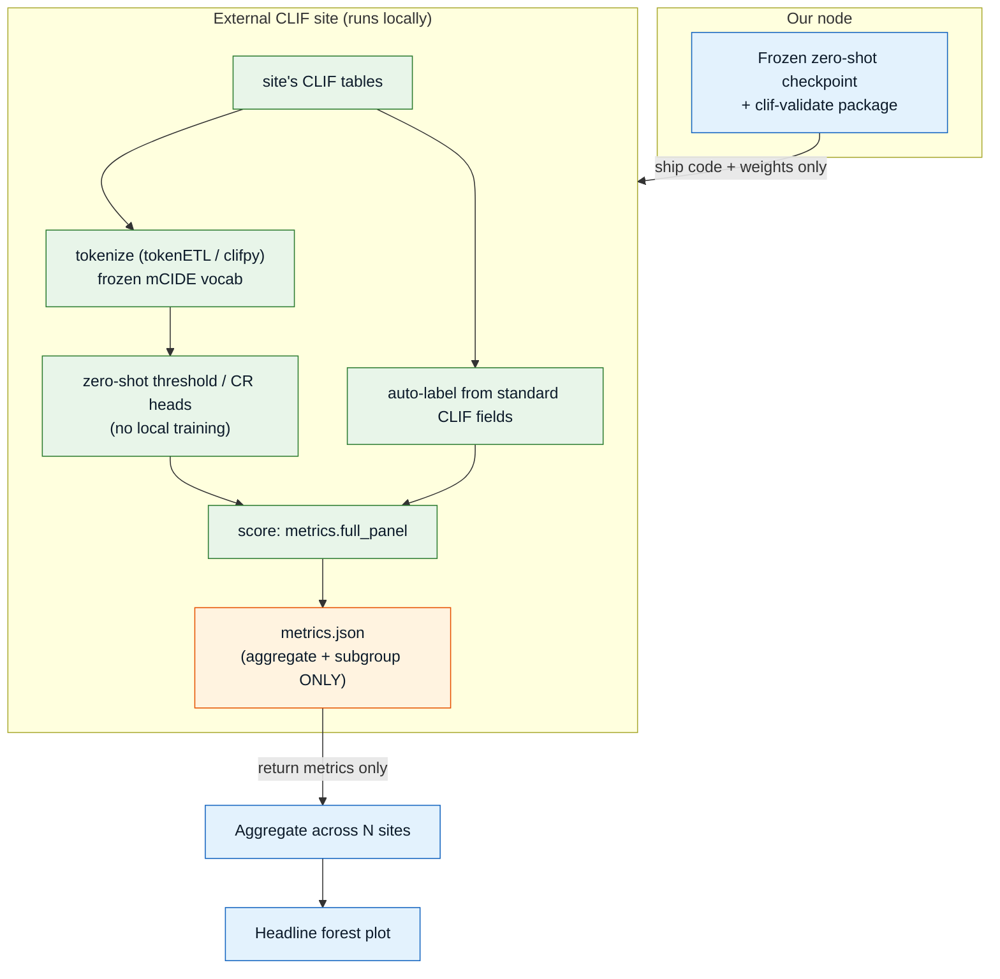
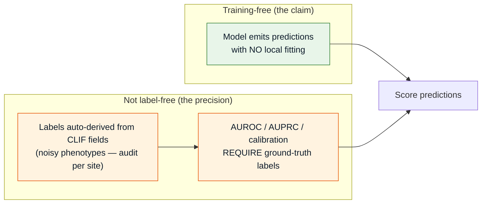
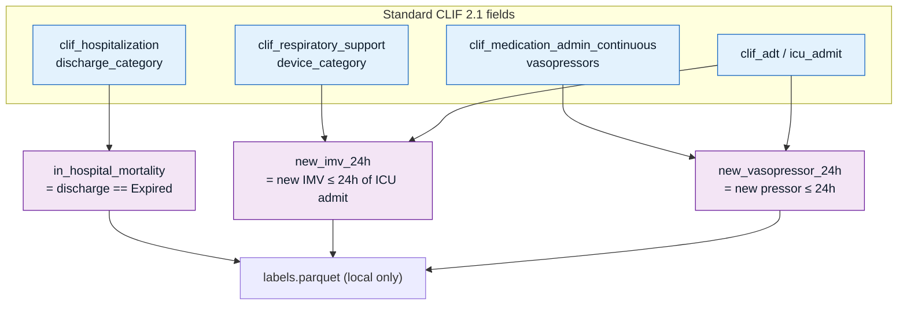
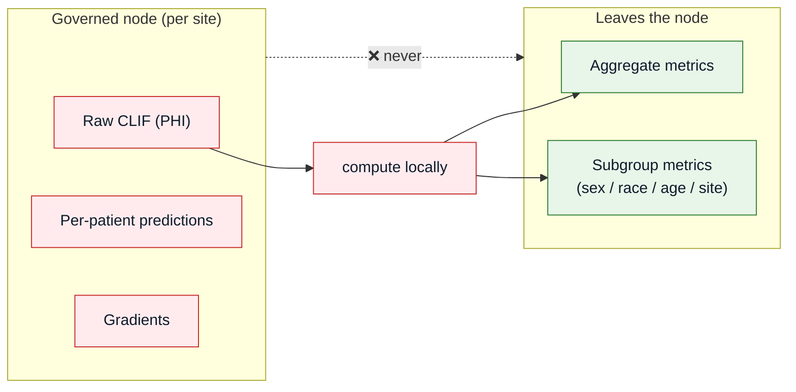
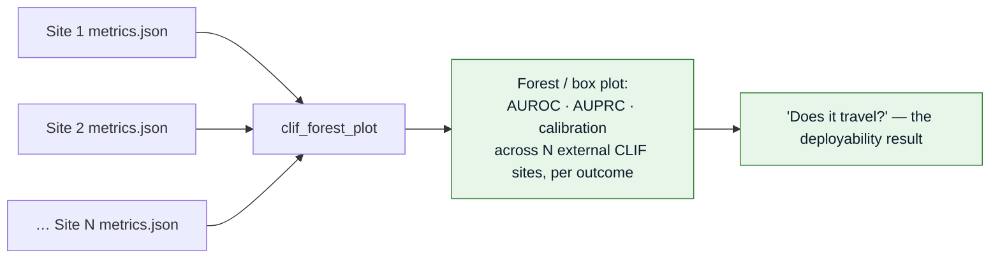

# Federated Validation (model-to-data)

The thesis axis CLIFATRON (single-center) cannot claim: ship a **frozen model + turnkey eval
script** to every other CLIF consortium site; each runs it on its **local** tables and returns
**only aggregate + subgroup metrics**. No raw data, labels, or gradients ever leave a node.
Implemented in `src/eval/clif_validate.py`, `src/eval/clif_auto_labeler.py`,
`src/eval/clif_forest_plot.py`.

---

## The model-to-data flow



:::danger What crosses the node boundary
**Only** an aggregate/subgroup metrics JSON leaves a site. Raw rows, per-patient predictions,
labels, gradients, and identifiers **never** leave. The validator output is checked to contain
no `patient_id`, `hosp_id`, `sequence`, `token`, or `pos_min` fields (see
`tests/test_clif_validate.py`).
:::

---

## "Zero-shot" precisely — model is training-free, eval still needs labels

A common overclaim. The **model** needs no local training and no manual annotation. But
**computing the metrics** still requires ground-truth labels, which each site *auto-derives*
from its own CLIF fields.



---

## Auto-labeler — outcomes derivable from standard CLIF fields

To need no manual annotation, outcomes are restricted to those computable from standard CLIF
tables. Implemented in `src/eval/clif_auto_labeler.py`.



Other CLIF-derivable outcomes on the roadmap: discharge disposition (home/LTACH), IMV on/off,
hypoxia, organ-failure thresholds.

---

## Governance boundary



Fairness is reported aggregate (ICareFM precedent). Small-cell suppression for subgroup metrics
is an open item to specify before shipping.

---

## The headline figure



Run:

```bash
# at each external site (returns aggregate metrics only)
python -m src.eval.clif_validate \
      --checkpoint <ckpt> \
      --data /path/to/clif_parquet \
      --episode-artifact /path/to/episodes.parquet \
      --site-id SITE-07 \
      --release-id 2026-08-28-site07-v0 \
      --signing-key-file /secure/site07.key
# at the hub (metrics JSONs only)
python -m src.eval.clif_forest_plot --results results/SiteA.json results/SiteB.json
```

:::info Open design question — vocabulary transfer
The federation assumes the frozen mCIDE vocab covers each site's concepts. PORTER (arXiv:2606.24102)
shows fixed-vocabulary models can drop a large fraction of events on cross-site transfer. The
**TextCode** tokenization arm (language-grounded event descriptions) is the mitigation to
evaluate before relying on frozen-vocab turnkey transfer.
:::
