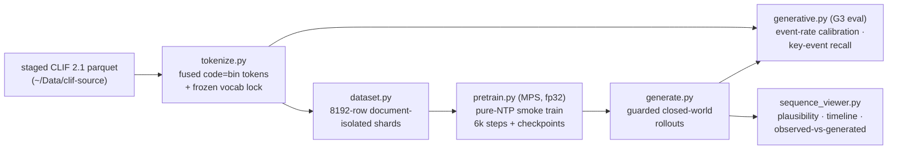

# GEM Local Validation — the stack proven before the L40 run

The whole generative stack was proven end-to-end on a single dev Mac (MPS, fp32) against the
**real staged Site 1 CLIF tables** — 546,028 stays / ~134M events staged on the node, a
50,986-stay dev slice exercised locally — before any code moves to the 2× L40 training box.
The dated evidence trail lives in
[`docs/plans/gem-overnight-log.md`](https://github.com/sajor2000/clifatron2.0/blob/main/docs/plans/gem-overnight-log.md);
this page is the engineering summary.

## The loop that was proven



Every stage ran on real data, every bug it surfaced was fixed and committed, and both test
suites (`tests/` 429 + `clif-validate/` 32) stayed green through the whole track.

## Guarded closed-world generation

`src/model/generate.py` samples rollouts that **cannot leave the frozen vocabulary**:

- **hard candidate-list sampling** — the sampler draws from an explicit allowed-token list
  per step (soft probability masking leaked `<unk>` tokens on MPS; the hard list closes it);
- **observed-transition masks** — per-position candidate sets derived from the real events
  corpus's transition graph, keeping rollouts on clinically observed paths;
- **repetition penalty** — dampens degenerate token loops.

Result across all guarded rollouts: **0 OOV / 0 gen-only tokens / 0 mid-stream EOS**, and
every rollout scores `good` on the plausibility panel below.

## Explainable plausibility

`src/eval/clinical_plausibility.py` scores each sequence with **reasons, not vibes** —
unknown/OOV tokens, invalid numeric bins, special-token placement, post-EOS tokens,
repeated-token runs, concept loops, and missing ICU context / prompt provenance. The
vocab-aware splitter keeps multi-word tokens (`sodium chloride`) intact, and the viewer
renders the score, the warnings, and the offending samples per rollout.

## G3 generative eval — the baselines to beat on L40

| Metric (guarded, 6 × 128 tokens) | Value |
|---|---|
| JS divergence vs real corpus | 0.43 |
| Top-32 token overlap | 0.47 |
| Gen-only tokens / mass | **0 / 0** (closed world) |
| Vitals share (gen vs real) | 0.29 vs 0.54 |
| Labs share (gen vs real) | 0.06 vs 0.03 |
| Categoricals share (gen vs real) | 0.65 vs 0.44 |
| Key-event unigram / categorical recall | 0.30 / 0.28 |
| Mean nearest Jaccard distance to observed | 0.18 |

Guarding narrowed the vitals and categoricals gaps vs the unguarded rollouts at a marginal
JS/overlap cost — the right trade for a provably closed vocabulary.

:::warning The key finding
**Rollout anchoring does not improve with NTP steps.** Key-event recall and
distance-to-observed were flat-to-worse from 3k → 6k steps (the model gets more diverse,
not more locally faithful). That is evidence **for** the plan's sequencing: pure NTP for
the marginal distribution, then **G4 prefix conditioning + G5 RL** for anchoring — more
NTP alone will not make rollouts locally faithful.
:::

## The token-sequence viewer

```bash
python -m src.viewer.sequence_viewer \
  --parquet output/intermediate_phi/mimic/events.parquet \
  --parquet output/intermediate_phi/sims.parquet \
  --vocab-lock output/intermediate_phi/mimic/vocab.json --port 8042
```

`output/intermediate_phi/mimic/` is the Site 1 artifact directory: it is named after the
`--site` value used when tokenizing (see [Data & Tokenization → Run it](./data-tokenization.md#run-it)).

The local inspection surface for the whole track: real and generated sequences side by
side, plausibility score + warning explanations, concept-grouped timelines, fused
`concept=bin` decoding against the frozen numeric edges, and observed-vs-generated
comparison via prompt-prefix matching. Accessibility-audited clean (20/20 — keyboard-
operable records, both themes, desktop and mobile).

## What remains

| Item | Status |
|---|---|
| **L40 G2 base run** | User decision — exact commands, gates, and gotchas frozen in `docs/plans/l40-g2-runbook.md` (reboot-first for the driver mismatch, full restage, `torchrun` with `configs/train.yaml` + `configs/model.gem-ntp.yaml`, MPS guards off on CUDA) |
| **G4 prefix conditioning → G5 RL** | The anchoring levers, on the L40 base (per the key finding above) |
| **Local checkpoint prune** | User decision (local artifacts are git-ignored) |
