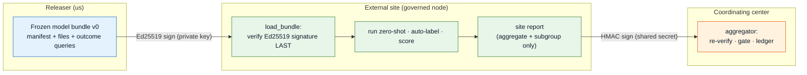
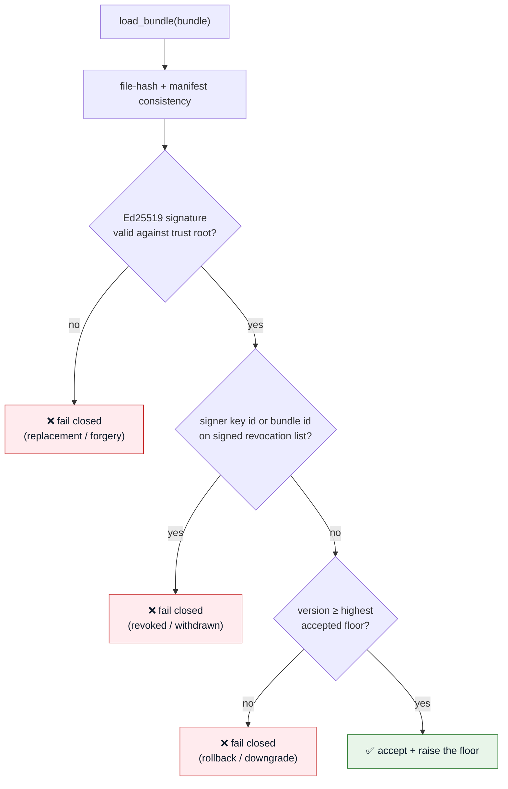
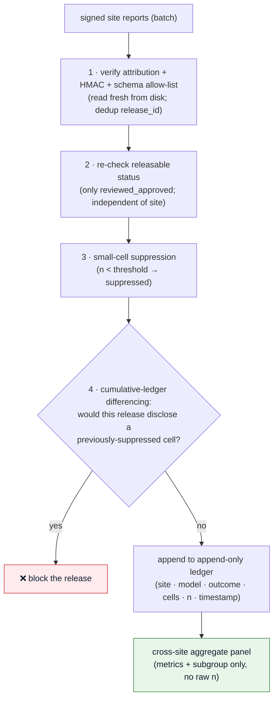
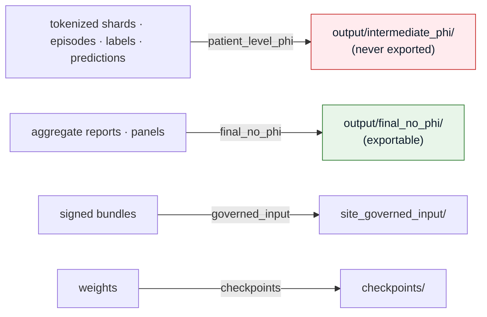
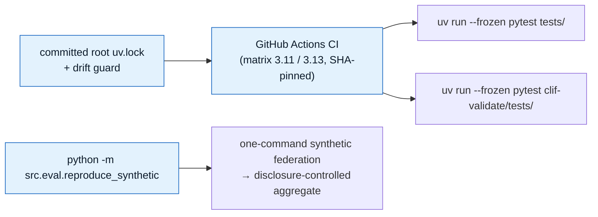

# Governance, Trust & Reproducibility

The machinery that makes the federation **safe to ship** and the results **safe to trust** — the
half of the project a clinical/methods venue judges as hard as the science. All of this has landed
and is CI-enforced. It is why the federation can run *model-to-data* without a coordinating center
ever seeing raw data.

:::info Why this exists
"No raw data leaves a node" is a claim that has to be *enforced*, not promised. Every artifact is
classified, every release is signed, every disclosure is ledgered, and every gate **fails closed** —
an unverified or under-populated result is rejected, never silently passed.
:::

---

## Two trust boundaries, two signing directions

The pipeline crosses two trust boundaries in opposite directions, so it uses two different
cryptographic primitives — a symmetric secret cannot model a trust *root*.

| Direction | Primitive | Why | Code |
|---|---|---|---|
| **Releaser → site** (bundle) | **Ed25519** (asymmetric) | A trust *root*: the releaser holds the private key, every site verifies with the public key distributed out-of-band. A shared secret would let any site forge a bundle. | `src/eval/trust.py` |
| **Site → aggregator** (report) | **HMAC** (symmetric) | Both trusted parties in a consortium share a per-site secret; authenticates the report's origin. | `src/eval/attestation.py` |

---

## Release trust — three fail-closed controls (U11)

The bundle a site runs is only trustworthy if a replacement can't be slipped in. `src/eval/trust.py`
verifies the Ed25519 signature **last** in `load_bundle` (after file-hash checks) and adds:

1. **Signature** — a detached signature over the manifest identity + files map + outcome queries;
   a fully re-hashed replacement bundle is detected.
2. **Revocation** — a signed list of compromised key ids / withdrawn bundle ids; a revoked signer or
   bundle fails closed even with a valid signature.
3. **Anti-rollback** — the site persists the highest accepted release version (atomic `fcntl` floor);
   a validly-signed but *older* bundle (a forced downgrade to a weakened version) fails closed. A
   corrupt state file fails closed rather than resetting the floor.

**Approval-by-content-hash:** approving a release requires binding `--approved` to `--approved-hash`
of the exact reviewed draft — no blanket waiver. Key custody / out-of-band trust-root distribution are
recorded as **pending governance** exit criteria in `configs/trust_roles.yaml`, not silently closed.

---

## Disclosure control — the cumulative ledger (U15)

Returning aggregate metrics is not automatically safe: two releases over the same cohort can
**difference** to reveal a suppressed small cell. The aggregator (`src/eval/aggregator.py`) is an
**independent second line of defence** — it re-checks everything itself rather than trusting the site.

Verification and admission are **separated** so a bad report in a batch is caught before *any* report
touches the ledger. The ledger is created at the **first** release boundary and maintained across
U6/U7/U8 releases — U10 then *verifies* a ledger that has been kept, rather than reconstructing one
after the fact (which is the exact failure the design prevents).

---

## Artifact classification — fail-closed storage policy

Every artifact declares a class, and a guard (`src/data/cohort.py::validate_artifact_destination`)
refuses to write it anywhere but its policy-declared location (`configs/artifact_policy.yaml`).

This is why the smoke test writes under `output/intermediate_phi/` and why an aggregate report can be
exported but a per-patient shard cannot — the policy is enforced at write time, not by convention.

---

## Reproducibility — the methods-paper artifact (U16–U19)

The codebase itself is part of the contribution: a reviewer must be able to trust the tests, recreate
the environment, and reproduce the result.

- **CI** runs both data-free suites on every push/PR, matrix over the Python floor (3.11) and dev
  interpreter (3.13), installing from the committed lock with `--frozen` — a regression can't land unseen.
- **Reproducible lock** — the root `uv.lock` is committed with a consistency guard; the environment is
  recreatable exactly.
- **Vendor-drift guard** — `clif-validate/` vendors a copy of `src/`; a guard fails CI if the shipped
  wheel would run different bytes than the repo (re-synced via `clif-validate/scripts/sync_vendor.py`).
- **One-command reproduction** — `python -m src.eval.reproduce_synthetic` runs the full
  releaser→site→aggregator loop on synthetic fixtures and prints the aggregate, no PHI, no GPU.
- **Model card** — `MODEL_CARD.md` states plainly what is *proven* (synthetic, CPU, data-free) vs
  *pending* (real-data training, GPU qualification, real-site federation, governance).

:::note Honest scope
Every "proven" claim maps to a landed, tested unit. Real-data training, GPU qualification, and
real-site federation are pending — see [Project Status & Roadmap](./project-status.md).
:::
