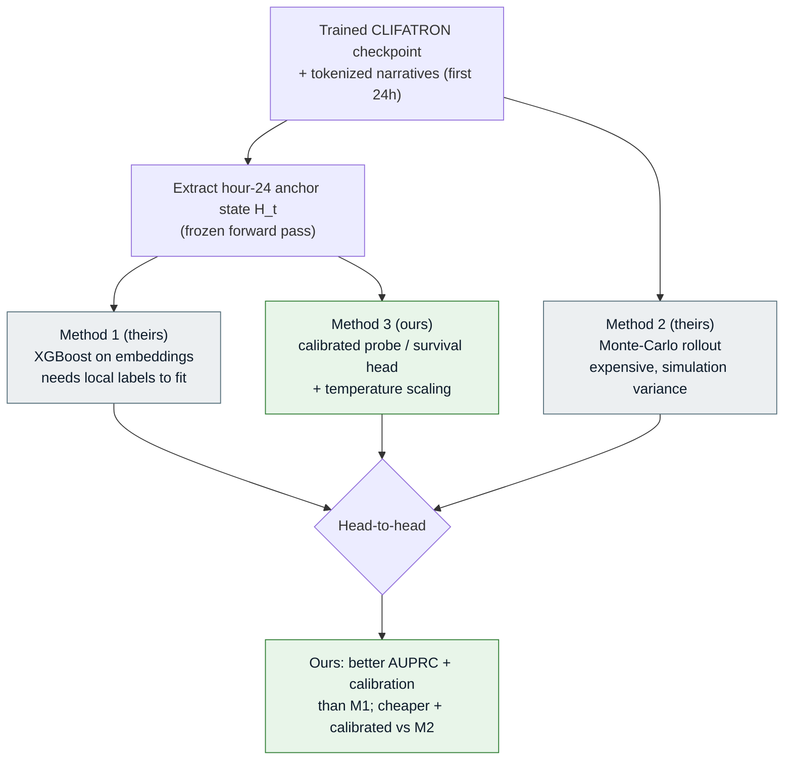
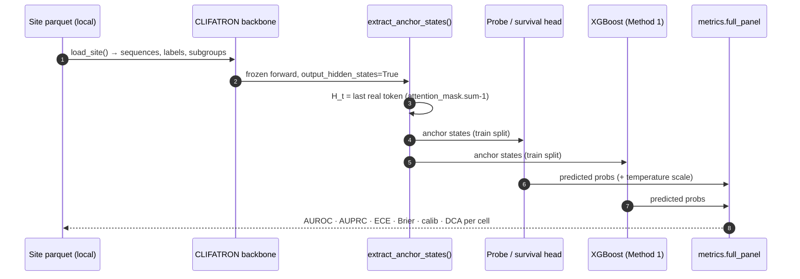
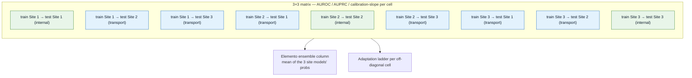
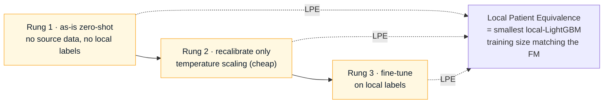

# Method 3 — the wedge (smallest publishable unit)

Attach our calibrated survival/probe heads to a **released CLIFATRON checkpoint's** hour-24
anchor hidden state, and beat their **Method 1** (XGBoost-on-embeddings) on AUPRC/calibration
and **Method 2** (Monte-Carlo rollout) on cost — on CLIFATRON's own 4-task benchmark, across
Site 1 / Site 2 / Site 3. Implemented in `src/eval/method3.py`.

:::tip Why this is the wedge
It runs on **any released checkpoint today** in frozen-probe mode — no retraining, minimal
infra — yet it validates the whole objective thesis. It is the cheapest publishable result.
:::

---

## The three methods compared



---

## Execution sequence



Two head modes:

- **`probe`** — a binary `TaskHead` on the frozen anchor state. Runs on any checkpoint today; the
  fair head-to-head vs XGBoost.
- **`zero_shot`** — `CompetingRiskHead` / `ThresholdHazardHead`. Needs a checkpoint pretrained
  *with* our heads (the joint phase); gives label-free predictions — the mechanism that makes
  external federation validation possible.

---

## The 3×3 transportability matrix

The money figure of the development cohort. Rows = train site, columns = test site. The
diagonal is internal performance; off-diagonal is external transport. **Data never crosses
sites** — each site fits locally and the matrix is assembled from per-site metric JSONs.



---

## The adaptation ladder

For every off-diagonal (transport) cell, report three rungs — from cheapest/most-portable to
most-adapted — plus the Local Patient Equivalence (LPE) at each rung.



*Baseline to beat:* plain ERM + recalibration is hard-to-beat — it is included as a comparator,
not omitted.

---

## Running it

```bash
python -m src.eval.method3 \
  --checkpoint /path/to/clifatron_checkpoint \
  --site MIMIC=/path/mimic_narratives.parquet \
  --site Rush=/path/rush_narratives.parquet \
  --site UChicago=/path/uchicago_narratives.parquet \
  --method both
```

:::warning Verify before running
Confirm CLIFATRON's benchmark parquet column names (`sequence` / `label` / subgroup columns)
against its `build_benchmark.py`, and which sites the released checkpoint was trained on (a
leakage risk for the "external" claim).
:::
