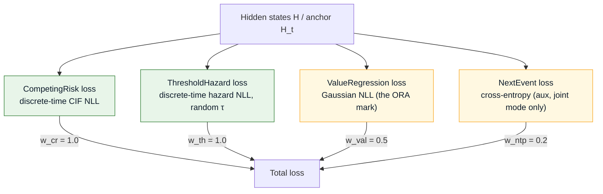
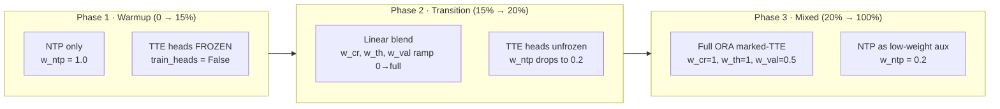
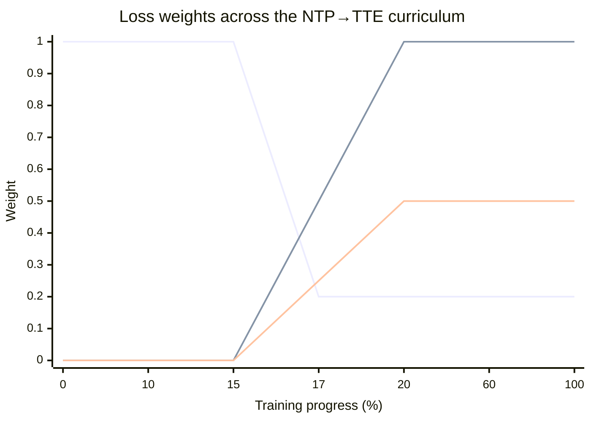
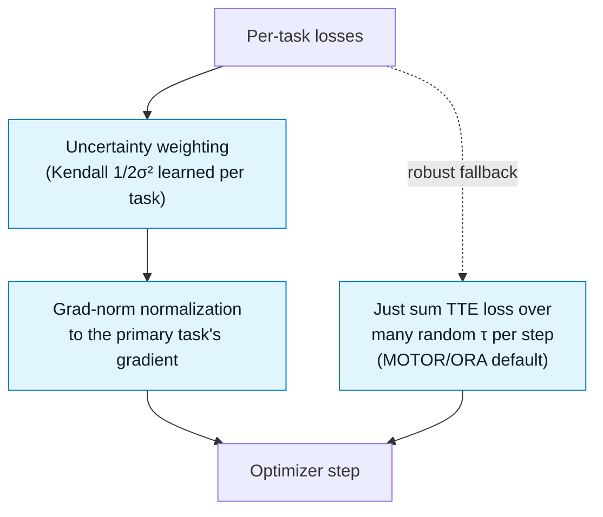
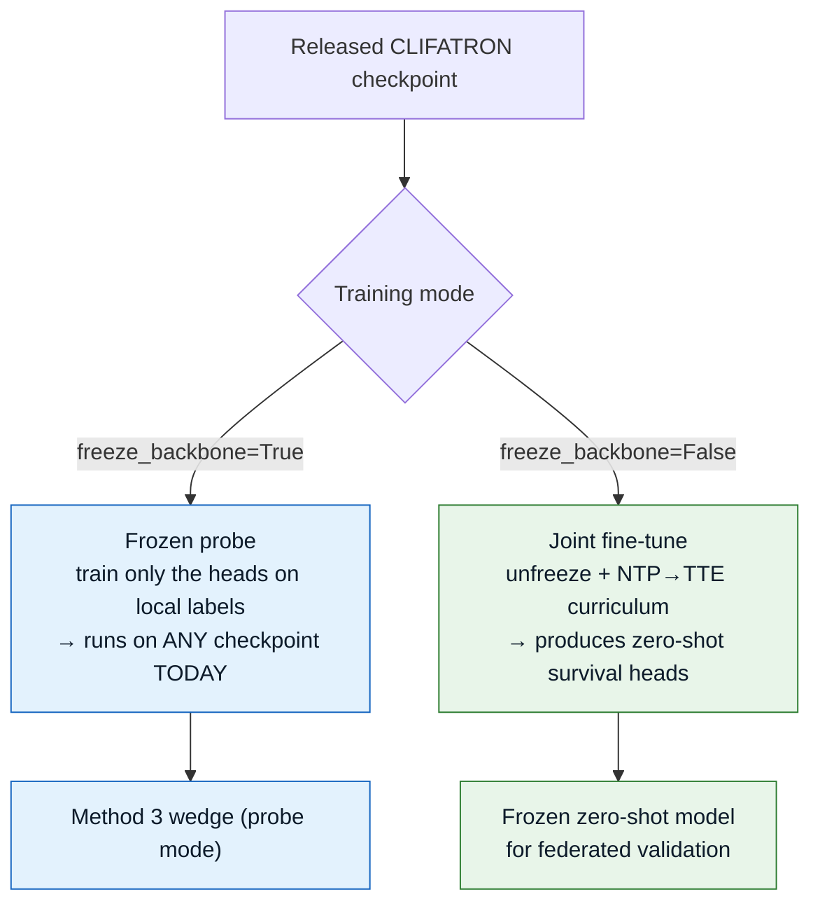

# Objectives & Training

The core methodological upgrade: replace pure next-token prediction (the weakest objective per
ORA/MOTOR/ICareFM) with a **marked time-to-event** stack. Implemented in
`src/model/head_adapter.py → CLIFATRONHeads.loss` and scheduled by
`src/train/curriculum.py`.

---

## The composite loss

| Term | Weight | Rationale |
|------|:------:|-----------|
| Competing-risk CIF | `1.0` | Calibrated time-to-next-event over competing types |
| Threshold hazard | `1.0` | The zero-shot multi-outcome engine (primary) |
| Value regression | `0.5` | The ORA "mark" — lifts physiology tasks |
| Next-event (NTP) | `0.2` | Low-weight aux; retains open-ended zero-shot; **joint mode only** |

:::note NTP only when the backbone trains
`next-event` loss is added only when `freeze_backbone=False` — a frozen probe reads the
backbone's existing representation, so re-fitting a next-token head would be pointless.
:::

---

## The NTP → TTE curriculum

Warm up on next-token prediction to stabilize token embeddings, then phase in the survival
heads. Three phases, exactly as `curriculum_weights(step, total_steps)` returns them.

### Weight schedule over training

*Boundaries:* `warmup_frac = 0.15`, `transition_frac = 0.05`. During transition the TTE weights
scale linearly with `progress`; `w_val` ramps to `0.5·progress`.

---

## Loss balancing — don't let mortality starve the tails

The dense mortality signal can dominate sparse auxiliaries (the "signal-balance problem").
Two mechanisms keep the objective balanced.

---

## Two training entry points

**Systems:** 2× L40 (48GB, no NVLink), bf16, DDP via `torchrun`, per-patient sequence packing.
FSDP is *not* used (only pays off past ~2.3B params and is worse without NVLink).
`src/train/joint_pretrain.py` drives the joint path; `src/train/run_arm.py` drives the ablation
arms.

:::warning Known tuning issue
On real MIMIC the value-regression loss is currently unnormalized and dominates (raw lab
magnitudes — creatinine, platelet counts in the thousands). Per-concept value scaling is needed
before Step-3 joint pretraining. See `notes/TAKEOVER_PROMPT.md`.
:::
