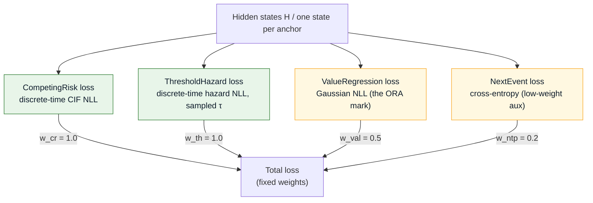
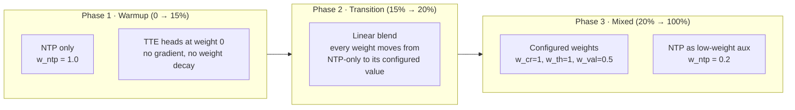
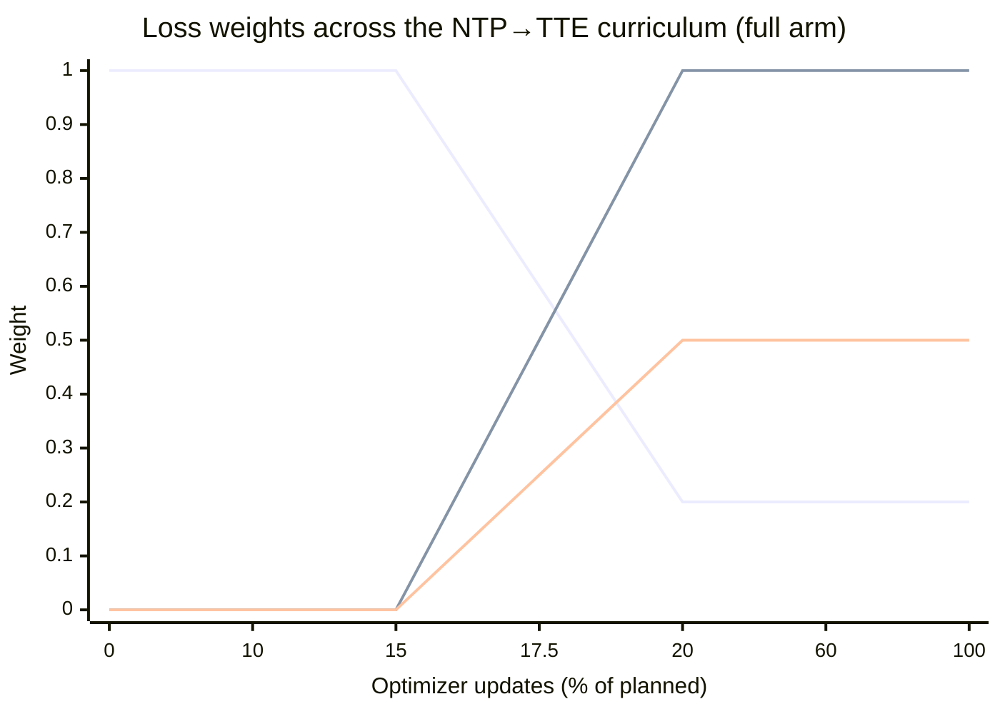
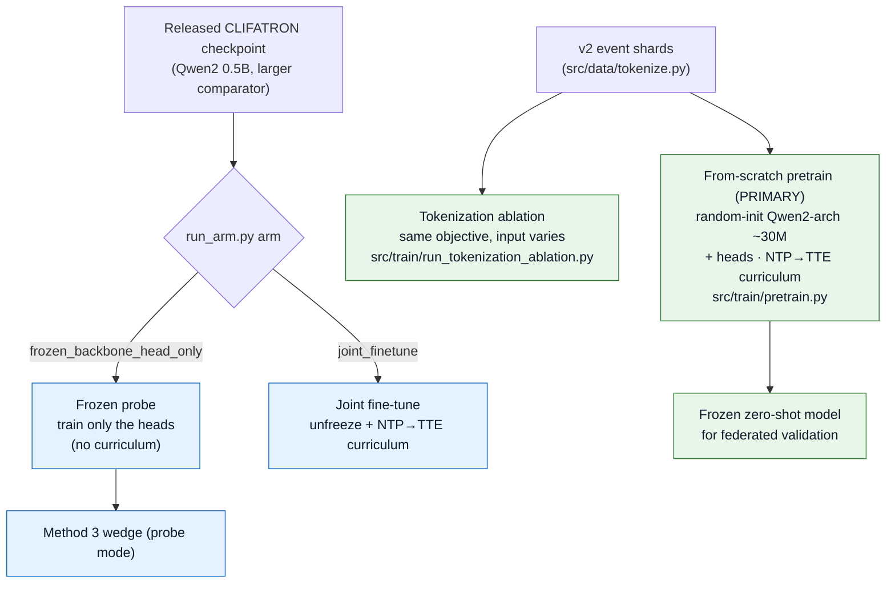

# Objectives & Training

The core methodological upgrade: replace pure next-token prediction (the weakest objective per
ORA/MOTOR/ICareFM) with a **marked time-to-event** stack, trained **in-stream** on the
full-hospitalization token stream. Implemented in `src/train/pretrain.py → Model` (losses and
masks), labelled by `src/data/targets.py`, and scheduled by `src/train/curriculum.py`, which the
training engine (`src/train/engine.py`) drives once per optimizer update.

:::note[Built, not yet trained]
This page describes the objective as implemented and tested on synthetic data. No model has been
trained with it yet, so nothing here is a result.
:::

---

## The composite loss

```mermaid
flowchart TB
    H["Hidden states H / one state per anchor"] --> CR["CompetingRisk loss<br/>discrete-time CIF NLL"]
    H --> TH["ThresholdHazard loss<br/>discrete-time hazard NLL, sampled τ"]
    H --> VR["ValueRegression loss<br/>Gaussian NLL (the ORA mark)"]
    H --> NE["NextEvent loss<br/>cross-entropy (low-weight aux)"]

    CR -->|"w_cr = 1.0"| SUM["Total loss<br/>(fixed weights)"]
    TH -->|"w_th = 1.0"| SUM
    VR -->|"w_val = 0.5"| SUM
    NE -->|"w_ntp = 0.2"| SUM

    classDef primary fill:#e8f5e9,stroke:#2e7d32,color:#0d1b2a;
    classDef aux fill:#fff8e1,stroke:#f9a825,color:#0d1b2a;
    class CR,TH primary;
    class VR,NE aux;
```

| Term | Weight | Rationale |
|------|:------:|-----------|
| Competing-risk CIF | `1.0` | Calibrated time-to-next-event over competing types |
| Threshold hazard | `1.0` | The zero-shot multi-outcome engine (primary) |
| Value regression | `0.5` | The ORA "mark" — the continuous value of the next event |
| Next-event (NTP) | `0.2` | Low-weight aux; retains open-ended rollout |

The weights are `configs/model.yaml → heads.*.weight`, or the weights of the selected
[objective arm](#objective-arms). The total is `w_ntp·NTP + w_cr·CR + w_th·TH + w_val·VAL`.

:::note[A skipped head still touches its parameters]
A head is skipped when its weight is zero or the batch has no supervised label for it. It then
adds a zero-valued term that reaches every one of its parameters (`zero_touch`), so on every rank
and every update the same parameters receive a gradient and DDP can run without
`find_unused_parameters`.
:::

---

## In-stream targets

Supervision comes from the stay's own future, not from a separate 24-hour cohort table. The
labeller is `TargetBuilder(mode="gem_tte")`, built by `pretrain.in_stream_target_builder`.

:::note[Loader still on the 24-hour path]
`pretrain.build_loaders` still feeds the 24-hour representation and its joined outcome labels
(kept as a regression path). Wiring the full-hospitalization loader to the in-stream labeller is
the next training-path unit; the losses below already read both.
:::

- **Anchors along the whole stay.** Each context window of a stay gets up to
  `in_stream.anchors_per_window` anchors (8), drawn per (seed, epoch, stay). An anchor is a
  minute of the stream, read at the last token of that minute; the model's hidden state there is
  the anchor state every head reads.
- **Queries per anchor.** Each anchor carries one competing-risk label and
  `in_stream.queries_per_anchor` threshold queries (4). Training thresholds are drawn from each
  target concept's own frozen bin edges (`tau_sampling: empirical_bins`); evaluation uses
  `configs/thresholds.yaml`.
- **Label states.** Exactly one per query, in this order: `prevalent` (already beyond the
  threshold in the lookback; not supervised), `positive` (first measurement beyond the threshold
  within the horizon), `competing_event` (death within the horizon), `censored` (the stream ends
  first), `not_ascertainable` (no measurement near the horizon; **never** counted as a negative),
  and `negative`. The horizon, lookback and ascertainment window come from
  `configs/thresholds.yaml → label_rule`.
- **Each head's own time grid.** Label times stay in **minutes** since the anchor all the way to
  the model. Each head bins them on its own grid (`heads.time_bin`): the competing-risk head over
  16 bins of its 48 h horizon, the threshold head over 48 hourly bins. An event is credited to the
  bin it fell in; a censored or event-free interval earns survival credit only for **fully**
  observed bins, never for the partial bin it ended in. The CLIFATRON adapter
  (`src/model/head_adapter.py`) uses the same contract.

---

## The NTP → TTE curriculum

Warm up on next-token prediction to stabilize token embeddings, then phase in the survival
heads. Three phases, exactly as `curriculum_weights(step, total_steps, target=...)` returns them,
where `target` is the run's configured weights.

```mermaid
flowchart LR
    subgraph P1["Phase 1 · Warmup (0 → 15%)"]
        direction TB
        A1["NTP only<br/>w_ntp = 1.0"]
        A2["TTE heads at weight 0<br/>no gradient, no weight decay"]
    end
    subgraph P2["Phase 2 · Transition (15% → 20%)"]
        direction TB
        B1["Linear blend<br/>every weight moves from<br/>NTP-only to its configured value"]
    end
    subgraph P3["Phase 3 · Mixed (20% → 100%)"]
        direction TB
        C1["Configured weights<br/>w_cr=1, w_th=1, w_val=0.5"]
        C2["NTP as low-weight aux<br/>w_ntp = 0.2"]
    end
    P1 --> P2 --> P3
```

### Weight schedule over training

```mermaid
xychart-beta
    title "Loss weights across the NTP→TTE curriculum (full arm)"
    x-axis "Optimizer updates (% of planned)" [0, 10, 15, 17.5, 20, 60, 100]
    y-axis "Weight" 0 --> 1
    line "w_ntp" [1, 1, 1, 0.6, 0.2, 0.2, 0.2]
    line "w_cr / w_th" [0, 0, 0, 0.5, 1, 1, 1]
    line "w_val" [0, 0, 0, 0.25, 0.5, 0.5, 0.5]
```

*Boundaries:* `warmup_frac = 0.15`, `transition_frac = 0.05` of the run's **planned optimizer
updates** (`schedule.total_steps`). In the transition each weight is
`start + progress·(configured − start)`, with start `(1, 0, 0, 0)`.

:::info[The step is the optimizer update, restored on resume]
The engine passes its optimizer-update counter to the model before each update
(`Model.set_training_step`). With gradient accumulation the schedule advances once per update,
not once per microbatch, and every rank uses the same weights on the same update. The counter is
saved in each checkpoint, so a run resumed after the transition continues on the configured
weights rather than restarting the warm-up.
:::

:::note[Why a head does not decay during warm-up]
AdamW's decoupled weight decay shrinks a parameter even when its gradient is exactly zero.
`pretrain.build_optimizer` therefore gives each time-to-event and value head its own parameter
group, and the engine sets that group's `weight_decay` to 0 while the head's weight is 0 and back
to the configured value once it trains. With a zero gradient and no decay, a head stays
bit-identical to its initialization through the warm-up. The engine refuses to start when a head
that can sit at zero weight shares a decaying group. `requires_grad` is never toggled: DDP
registers parameters once, at construction.
:::

---

## Objective arms

Claim 2 compares the combined objective with its parts at **equal compute**
(`configs/objective_arms.yaml`). An arm sets the four head weights and whether the curriculum
runs — nothing else. Steps, batch size, gradient accumulation and token budget come from the
train config and are identical for every arm; the loader refuses an arm that sets them, and an
unknown arm name.

| Arm | w_ntp | w_cr | w_th | w_val | Curriculum |
|-----|:-----:|:----:|:----:|:-----:|:----------:|
| `full` (primary) | 0.2 | 1.0 | 1.0 | 0.5 | NTP → TTE |
| `next_token_only` | 1.0 | 0 | 0 | 0 | none |
| `minus_value` | 0.2 | 1.0 | 1.0 | 0 | NTP → TTE |
| `minus_competing_risk` | 0.2 | 0 | 1.0 | 0.5 | NTP → TTE |
| `minus_threshold` | 0.2 | 1.0 | 0 | 0.5 | NTP → TTE |
| `no_curriculum` | 0.2 | 1.0 | 1.0 | 0.5 | none |

Select one with `python -m src.train.pretrain ... --objective-arm minus_value` (the tokenization
ablation runner takes the same option). Every head is constructed in every arm, so parameter
counts and checkpoints match; a removed head stays at its initialization and is not listed among
the run's `trained_heads` in the manifest. The next-token arm has no threshold head in its loss,
so it is scored with a linear probe on its frozen trunk. At start each run logs the schedule it
was configured for, and each logged update shows the weights it applied.

---

## Loss balancing — fixed weights

The objective is the fixed-weight sum above. `loss_balancing` accepts only `fixed`; any other
value is refused when the config is loaded.

:::warning[No uncertainty weighting]
Earlier configs listed `loss_balancing: uncertainty` (learned Kendall 1/2σ² per task plus
grad-norm). It was never implemented, so those runs trained with fixed weights without saying so.
The option has been removed rather than left as a silent no-op. Whether a dense signal starves
the sparse heads is a question for the objective arms, not a hidden re-weighting.
:::

---

## Training entry points

```mermaid
flowchart TB
    SHARDS["v2 event shards<br/>(src/data/tokenize.py)"] --> SCRATCH["From-scratch pretrain (PRIMARY)<br/>random-init Qwen2-arch ~30M<br/>+ heads · NTP→TTE curriculum<br/>src/train/pretrain.py"]
    SHARDS --> TOK["Tokenization ablation<br/>same objective, input varies<br/>src/train/run_tokenization_ablation.py"]
    CKPT["Released CLIFATRON checkpoint<br/>(Qwen2 0.5B, larger comparator)"] --> MODE{run_arm.py arm}

    MODE -->|"frozen_backbone_head_only"| FROZEN["Frozen probe<br/>train only the heads<br/>(no curriculum)"]
    MODE -->|"joint_finetune"| JOINT["Joint fine-tune<br/>unfreeze + NTP→TTE curriculum"]

    FROZEN --> M3["Method 3 wedge (probe mode)"]
    SCRATCH --> FED["Frozen zero-shot model<br/>for federated validation"]

    classDef a fill:#e3f2fd,stroke:#1565c0,color:#0d1b2a;
    classDef b fill:#e8f5e9,stroke:#2e7d32,color:#0d1b2a;
    class FROZEN,M3,JOINT a;
    class SCRATCH,TOK,FED b;
```

The from-scratch model is the primary federation candidate and carries the claims; the CLIFATRON
adapter is the larger comparator. The two use different token streams
([details](./data-tokenization.md#8--two-token-streams-from-scratch-vs-the-wedge)).

**Systems:** 2× L40 (48GB, no NVLink), bf16, DDP via `torchrun`, per-patient sequence packing.
FSDP is *not* used (only pays off past ~2.3B params and is worse without NVLink).
`src/train/pretrain.py` drives the from-scratch path and `src/train/run_arm.py` the
finetune-vs-scratch ablation arms (including the CLIFATRON adapter); both launch through
`engine.setup_ddp` and take `--allow-cpu-ddp` for a CPU rehearsal. The former joint-pretraining
entry point (`src/train/joint_pretrain.py`) never had a data loader and has been removed; the
joint fine-tune is the `joint_finetune` arm of `run_arm.py`.

:::tip[Value-head normalization — resolved]
Value targets are standardized with per-token robust statistics frozen from the reference site's
train partition (`src/data/value_stats.py`, vocab-hash-bound). `pretrain.py` rejects a stats file
whose vocabulary hash or fit partition does not match, and refuses real (non-dry-run) training on
numeric values when no `--value-stats` file is given. Details in
**[Data & Tokenization → training targets](./data-tokenization.md#7--how-the-tokens-become-training-targets)**.
:::
