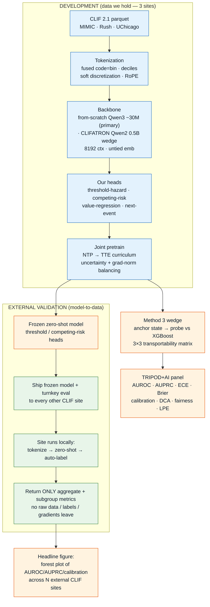
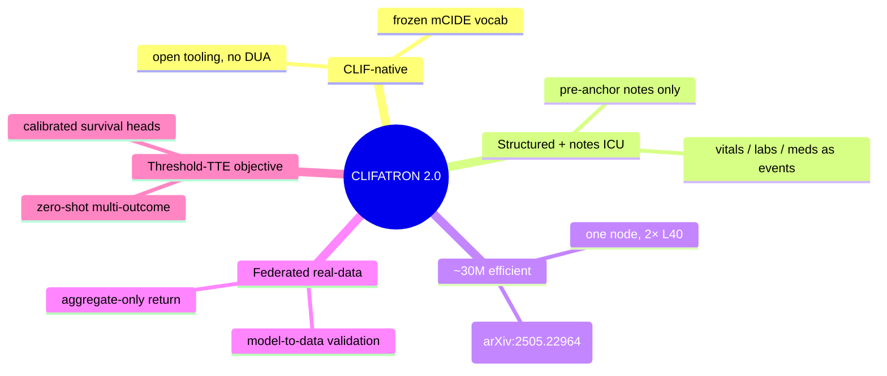
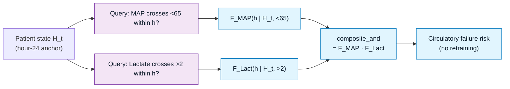
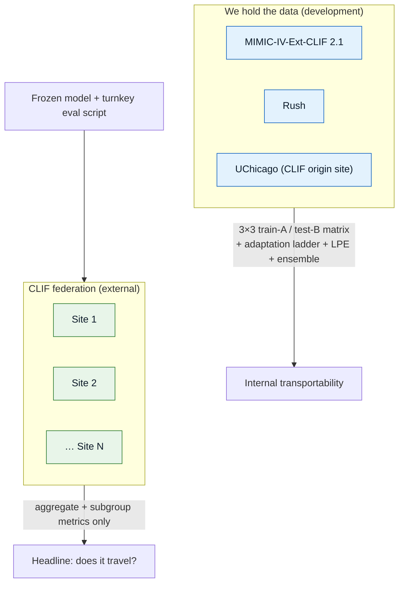

# CLIFATRON 2.0 — Scientific Workflow

CLIFATRON 2.0 is a **methods-upgrade layer** on
[CLIFATRON](https://github.com/Common-Longitudinal-ICU-data-Format/CLIFATRON), the CLIF
consortium's compact (~30M-parameter) CLIF-native ICU foundation model. We keep CLIFATRON's
tokenizer, sequence packing, and trained backbone, and add the pieces that make a small ICU
model **transportable and clinically deployable**.

> **Thesis:** *one small model → many outcomes → many hospitals → one node (2× L40, no cluster).*

This site documents the **full planned scientific workflow** end to end, one stage per page,
with diagrams drawn directly from the implementation in `src/`.

:::note Single source of truth
The finalized design spec lives in `MEMORY.md` and `notes/NEXT_STEPS.md`. `notes/RESEARCH.md`
and `notes/METHODS.md` carry the evidence base but are marked **pre-pivot** — where they
disagree with `MEMORY.md`, `MEMORY.md` wins. These docs mirror the current (post-pivot) spec.
:::

:::tip What's new / where things stand
Every **data-free, unblocked** unit has landed — the codebase is a complete, CI-enforced, reproducible
methods artifact. New since the first docs: per-token **value-head normalization**, the full
**governance / trust / disclosure** machinery (Ed25519 release-trust, cumulative disclosure ledger,
artifact-classification policy), the **synthetic federation harness**, and **CI + one-command
reproduction**. What remains (real-site federation, method experiments, scaling) is gated on data /
GPU / governance, not code. See **[Governance, Trust & Reproducibility](./governance-trust.md)** and
**[Project Status & Roadmap](./project-status.md)**.
:::

---

## The end-to-end pipeline

---

## Why this is novel — the 4-way intersection

No single published model occupies the intersection this project targets. Each axis alone is
contested; the **conjunction**, executed CLIF-native, is the defensible headline.

---

## The mechanism: one model answers many outcomes

The **threshold-hazard head** (ICareFM) is what lets a single trained model answer an
open-ended family of clinical questions with **no retraining**. At inference you query a
target concept, a threshold τ, and a direction; composite events combine univariate failure
probabilities under conditional independence.

*Implemented in `src/model/heads.py`:* `ThresholdHazardHead.cumulative_failure()`,
`composite_or()`, `composite_and()`.

---

## Sites — develop on 3, validate on the whole federation

---

## Non-negotiable rules

These constrain every stage of the pipeline.

| # | Rule | Where it bites |
|---|------|----------------|
| 1 | **Treatments are model inputs, never prediction targets** | Tokenization, target-concept selection |
| 2 | **Vocab = frozen CLIF mCIDE, applied identically to all sites — no cross-site raw pooling** | Tokenization, federation |
| 3 | **Retrospective reports / discharge summaries = label source only; only pre-anchor notes are features** | Notes modality, eval labeling |
| 4 | **`storetime`/availability ordering, not `charttime`** | Tokenization (no look-ahead) |
| 5 | **MIMIC is PhysioNet-credentialed; Rush + UChicago institutional — no data leaves its node** | Federation, compute |

---

## Read next

1. **[Data & Tokenization](./data-tokenization.md)** — CLIF parquet → fused decile tokens
2. **[Architecture](./architecture.md)** — CLIFATRON Qwen2 backbone + our four heads
3. **[Objectives & Training](./objectives-training.md)** — the marked-TTE loss stack + curriculum
4. **[Method 3 Wedge](./method3-wedge.md)** — the smallest publishable unit
5. **[Federated Validation](./federated-validation.md)** — model-to-data across the federation
6. **[Evaluation Panel](./evaluation-panel.md)** — TRIPOD+AI metrics
7. **[Ablations](./ablations.md)** — finetune-vs-scratch and tokenization arms
