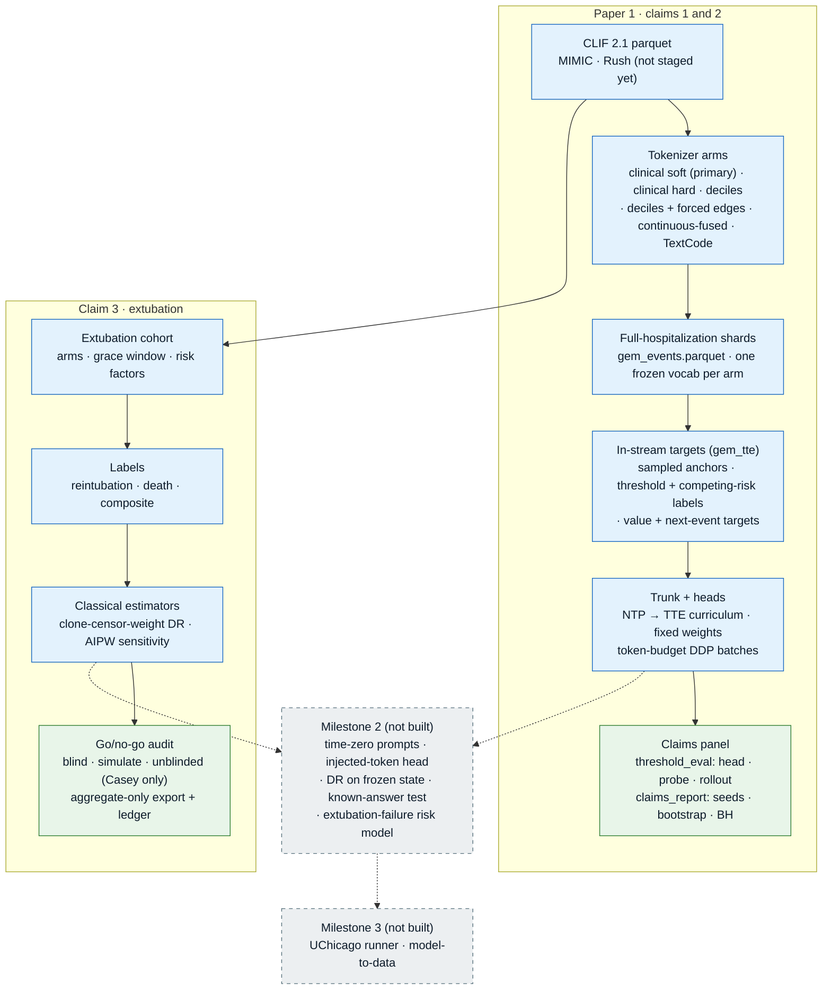
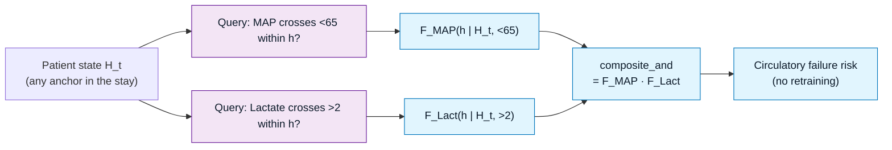
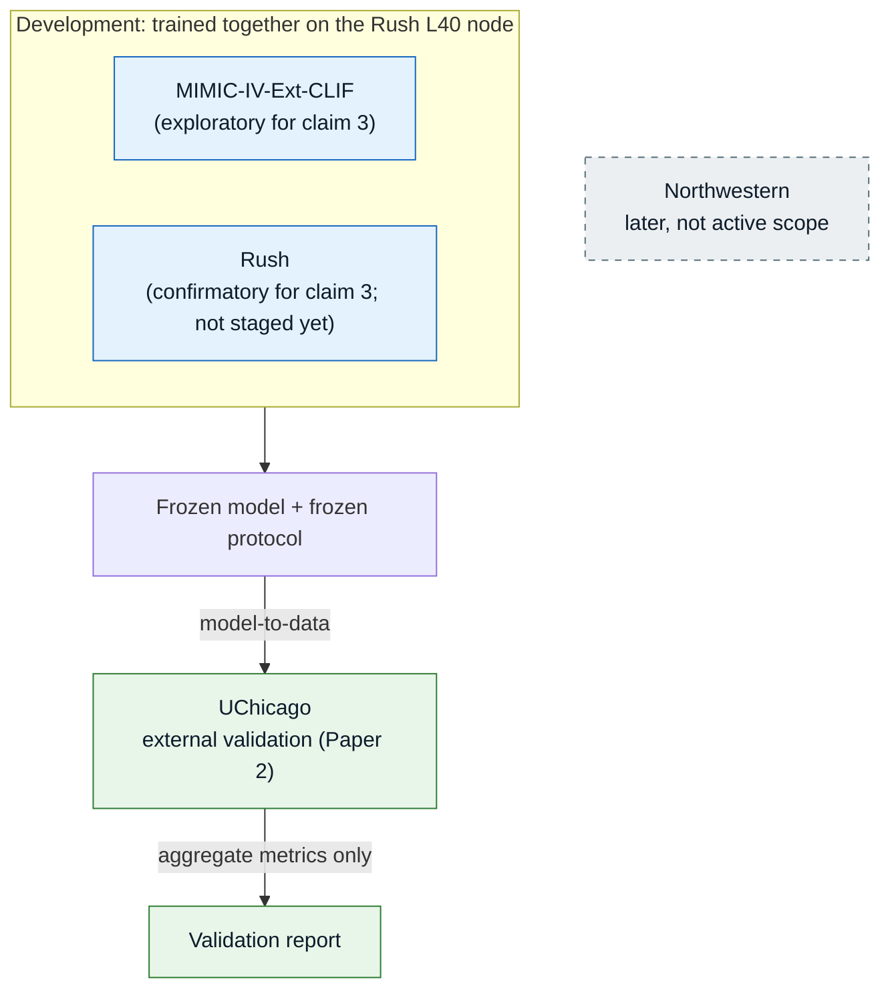

# CLIFATRON 2.0 — Scientific Workflow

CLIFATRON 2.0 is **one from-scratch, CLIF-native ICU foundation model** and two papers built on
it. The model is a Qwen2-architecture decoder (design target about 30M parameters, d512×8L×8H,
standard pre-norm, no QK-Norm) trained with a marked time-to-event objective in place of pure
next-token prediction: threshold hazard, competing-risk incidence, a value-regression mark, and a
low-weight next-event term, with a next-token-to-time-to-event curriculum.

**Paper 1 makes three claims about that one model**, each with a pre-specified test that can
fail ([Paper 1 claims](./paper-claims.md)):

1. **Threshold-aligned tokenization.** Bin edges at clinical decision thresholds, shared with the
   training objective, improve prediction and calibration at those thresholds.
2. **Combined time-to-event objective.** The combined objective beats next-token training at
   equal compute.
3. **Extubation application.** With the post-extubation device token injected at the real
   extubation, the model reproduces the randomized-trial pattern of who benefits from NIV and
   HFNC at least as well as a classical emulation
   ([Extubation application](./extubation-application.md)).

**Paper 2 is an externally validated extubation-failure risk model.** UChicago validation
belongs to Paper 2. Per-device risks are exploratory, and the output makes no device
recommendation.

A null result on any claim is reported as such. Everything is evaluated retrospectively; a
clinician-facing tool is not part of this work. The released CLIFATRON Qwen2 checkpoint (0.5B)
is a larger frozen comparator row and carries none of the claims.

From CLIFATRON we **keep**: the physician-designed clinical-segment CSV (1267 segment rows; the
bin design, not v1's token strings), the one-token-per-event fused idea, the mCIDE vocabulary,
CLIF 2.1 data format, the treatment-as-input rule, and the Qwen2 backbone.

> **Thesis:** *one small model → many outcomes → many hospitals → one node (2× L40, no cluster).*

This site documents the workflow one stage per page, with diagrams drawn from the code in `src/`.

:::note[Single source of truth]
The spec and locked decisions live in `AGENTS.md` and `MEMORY.md`; the current plan is
`docs/plans/2026-10-03-0845-feat-icu-gem-rct-recovery-plan.md`. `notes/NEXT_STEPS.md`,
`notes/RESEARCH.md` and `notes/METHODS.md` are the earlier design record; where they disagree
with `MEMORY.md`, `MEMORY.md` wins.
:::

:::tip[Where things stand]
The training path, the claims panel and the classical extubation audit are built and tested on
synthetic data. **No model has been trained under the three-claim plan, so no claim has a
result.** The MIMIC design audit's blind stage has run, and its precision stop rule fires on
MIMIC, so claim 3 depends on Rush. See **[Project Status & Roadmap](./project-status.md)**.
:::

---

## The pipeline as built

```mermaid
flowchart TB
    subgraph P1["Paper 1 · claims 1 and 2"]
        direction TB
        A["CLIF 2.1 parquet<br/>MIMIC · Rush (not staged yet)"] --> B["Tokenizer arms<br/>clinical soft (primary) · clinical hard · deciles<br/>· deciles + forced edges · continuous-fused · TextCode"]
        B --> C["Full-hospitalization shards<br/>gem_events.parquet · one frozen vocab per arm"]
        C --> D["In-stream targets (gem_tte)<br/>sampled anchors · threshold + competing-risk labels<br/>· value + next-event targets"]
        D --> E["Trunk + heads<br/>NTP → TTE curriculum · fixed weights<br/>token-budget DDP batches"]
        E --> F["Claims panel<br/>threshold_eval: head · probe · rollout<br/>claims_report: seeds · bootstrap · BH"]
    end

    subgraph P3["Claim 3 · extubation"]
        direction TB
        G["Extubation cohort<br/>arms · grace window · risk factors"] --> H["Labels<br/>reintubation · death · composite"]
        H --> I["Classical estimators<br/>clone-censor-weight DR · AIPW sensitivity"]
        I --> J["Go/no-go audit<br/>blind · simulate · unblinded (Casey only)<br/>aggregate-only export + ledger"]
    end

    A --> G
    E -.-> K["Milestone 2 (not built)<br/>time-zero prompts · injected-token head<br/>· DR on frozen state · known-answer test<br/>· extubation-failure risk model"]
    I -.-> K
    K -.-> U["Milestone 3 (not built)<br/>UChicago runner · model-to-data"]

    classDef built fill:#e3f2fd,stroke:#1565c0,color:#0d1b2a;
    classDef out fill:#e8f5e9,stroke:#2e7d32,color:#0d1b2a;
    classDef todo fill:#eceff1,stroke:#546e7a,color:#0d1b2a,stroke-dasharray: 5 5;
    class A,B,C,D,E,G,H,I built;
    class F,J out;
    class K,U todo;
```

---

## What is and is not new

Every method component is published: ORA (marked time-to-event), ICareFM (threshold-conditioned
time-to-event), SurvivEHR (competing risk), Elemento (no-data-sharing ensembling). Generic and
federated CLIF generative models, and a CLIF tokenization benchmark, are published too (Burkhart
2026, arXiv 2608.02939; Lee 2026, arXiv 2604.16775). **This project claims no new method.**

What is ours is the pairing of those components, the three controlled tests that could fail, and
the open, CLIF-native execution: the code, the `clif-validate` site package and its
bundle-compatibility contract are public with no DUA, while trained-weight bundles stay signed
and governed.

---

## The mechanism: one model answers many outcomes

The **threshold-hazard head** (ICareFM) is what lets a single trained model answer an
open-ended family of clinical questions with **no retraining**. At inference you query a
target concept, a threshold τ, and a direction; composite events combine univariate failure
probabilities under conditional independence.

```mermaid
flowchart LR
    Ht["Patient state H_t<br/>(any anchor in the stay)"] --> Q1["Query: MAP crosses &lt;65 within h?"]
    Ht --> Q2["Query: Lactate crosses &gt;2 within h?"]
    Q1 --> F1["F_MAP(h | H_t, &lt;65)"]
    Q2 --> F2["F_Lact(h | H_t, &gt;2)"]
    F1 --> COMP["composite_and<br/>= F_MAP · F_Lact"]
    F2 --> COMP
    COMP --> OUT["Circulatory failure risk<br/>(no retraining)"]

    classDef q fill:#f3e5f5,stroke:#6a1b9a,color:#0d1b2a;
    classDef f fill:#e1f5fe,stroke:#0277bd,color:#0d1b2a;
    class Q1,Q2 q;
    class F1,F2,COMP,OUT f;
```

*Implemented in `src/model/heads.py`:* `ThresholdHazardHead.cumulative_failure()`,
`composite_or()`, `composite_and()`.

---

## Sites

```mermaid
flowchart TB
    subgraph DEV["Development: trained together on the Rush L40 node"]
        M["MIMIC-IV-Ext-CLIF<br/>(exploratory for claim 3)"]
        R["Rush<br/>(confirmatory for claim 3; not staged yet)"]
    end
    DEV --> FROZEN["Frozen model + frozen protocol"]
    FROZEN -->|"model-to-data"| UC["UChicago<br/>external validation (Paper 2)"]
    UC -->|"aggregate metrics only"| OUT["Validation report"]
    NW["Northwestern<br/>later, not active scope"]

    classDef hold fill:#e3f2fd,stroke:#1565c0,color:#0d1b2a;
    classDef fed fill:#e8f5e9,stroke:#2e7d32,color:#0d1b2a;
    classDef later fill:#eceff1,stroke:#546e7a,color:#0d1b2a,stroke-dasharray: 5 5;
    class M,R hold;
    class UC,OUT fed;
    class NW later;
```

Rush data never leave Rush. UChicago runs the frozen model through `clif-validate` and returns
aggregate metrics only.

---

## Non-negotiable rules

These constrain every stage of the pipeline.

| # | Rule | Where it bites |
|---|------|----------------|
| 1 | **Treatments are model inputs, never prediction targets of the trunk.** Scoped amendment (2026-10-03): study heads downstream of the frozen trunk may use endpoints defined by a treatment event (reintubation), declared label-only in `configs/cohort.yaml → study_endpoints` | Tokenization, target-concept selection, extubation labels |
| 2 | **Vocab = frozen CLIF mCIDE, applied identically to all sites — no cross-site raw pooling** | Tokenization, federation |
| 3 | **Retrospective reports / discharge summaries = label source only; only pre-anchor notes are features** | Notes modality, eval labeling |
| 4 | **`storetime`/availability ordering, not `charttime`** (CLIF vitals have no store time; `recorded_dttm` is the proxy) | Tokenization (no look-ahead) |
| 5 | **Development sites are governed-study-credentialed; no data leaves its node** | Federation, compute |

---

## Read next

1. **[Paper 1 — the three claims](./paper-claims.md)** — each claim, its test, and what falsifies it
2. **[Extubation application](./extubation-application.md)** — cohort, labels, estimators, benchmark trials, and the audit
3. **[CLIFATRON v1 → v2](./v1-vs-v2.md)** — what changed and why it matters
4. **[Data & Tokenization](./data-tokenization.md)** — CLIF parquet → fused clinical-segment tokens (canonical tokenizer spec)
5. **[Architecture](./architecture.md)** — the from-scratch Qwen2-arch trunk, the CLIFATRON 0.5B comparator, and the heads
6. **[Objectives & Training](./objectives-training.md)** — the marked time-to-event loss, in-stream targets, curriculum, and the full-hospitalization loader
7. **[Method 3 Wedge](./method3-wedge.md)** — the frozen-probe comparator on a CLIFATRON checkpoint
8. **[Federated Validation](./federated-validation.md)** — model-to-data validation
9. **[Evaluation Panel](./evaluation-panel.md)** — TRIPOD+AI metrics
10. **[Ablations](./ablations.md)** — the experiment matrix, objective and tokenization arms, and comparator rows
11. **[GEM Local Validation](./gem-local-validation.md)** — the generative stack proven on a dev Mac
12. **[Governance, Trust & Reproducibility](./governance-trust.md)** — signing, ledgers, fail-closed gates
13. **[Project Status & Roadmap](./project-status.md)** — what is built, what is not, and the blockers
