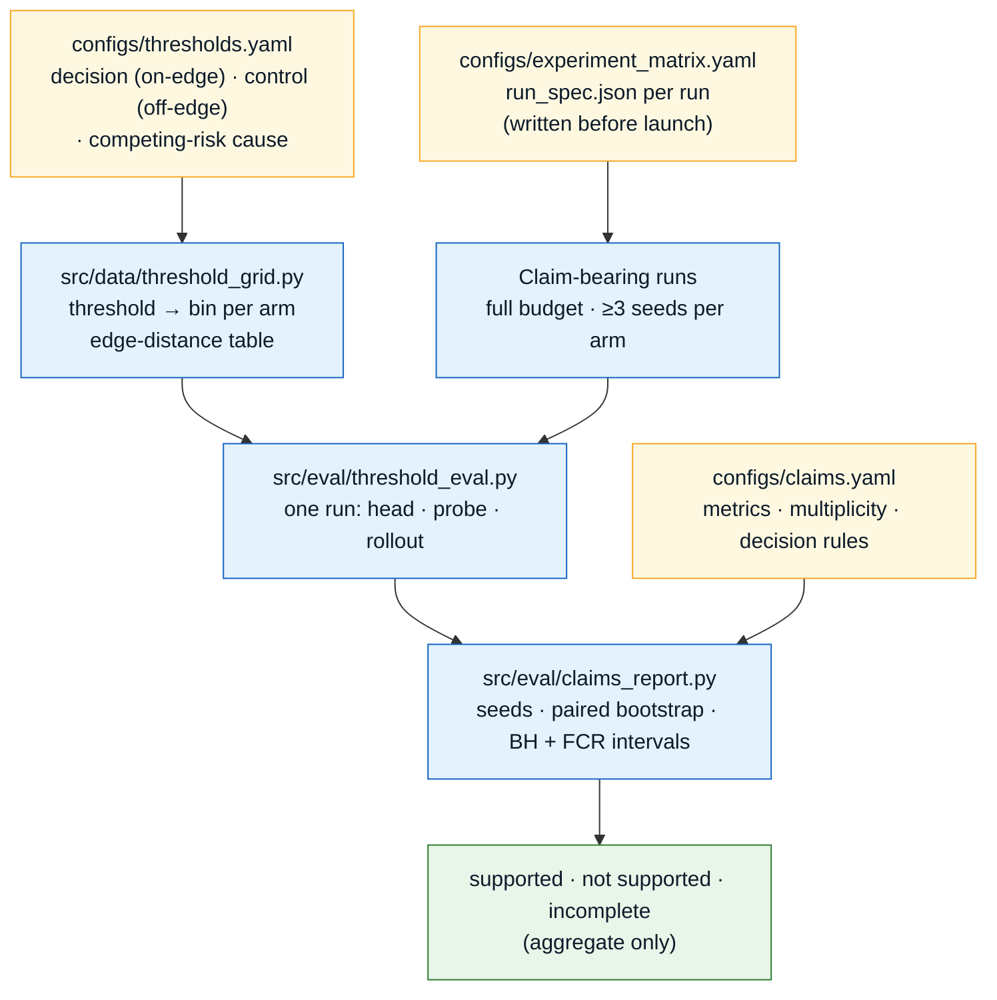

# Paper 1 — the three claims

Paper 1 makes three claims about one from-scratch CLIFATRON 2.0 model. Each claim has a test
that is written down before any claim-bearing run, and each test can fail. A null result is
reported as a null result.

1. **Threshold-aligned tokenization.** Bin edges placed at clinical decision thresholds, and
   shared with the training objective, improve prediction and calibration at those thresholds.
2. **Combined time-to-event objective.** The combined objective beats next-token training at
   equal compute.
3. **Extubation application.** With the post-extubation device token injected at the real
   extubation, the model reproduces the randomized-trial pattern of who benefits from NIV and
   HFNC at least as well as a classical emulation.

Claims 1 and 2 are scored by the claims panel on this page. Claim 3 is the extubation study
([Extubation application](./extubation-application.md)); its model-based half is not built yet.

:::warning[No results]
No claim-bearing run has been trained. Everything below is the test as implemented and
covered by synthetic tests. Nothing on this page is a result.
:::

The plan is `docs/plans/2026-10-03-0845-feat-icu-gem-rct-recovery-plan.md` (requirements R31,
R35, R39; decisions KTD3, KTD12, KTD13). The evidence for why these three claims, and not a
general tokenization claim, is in `notes/ai-novelty-audit.md`.

---

## How a claim is scored



| Piece | File | Role |
|-------|------|------|
| Threshold registry | `configs/thresholds.yaml` | The one list of thresholds: decision (on-edge), control (off-edge candidates), and one competing-risk cause per target concept. Also the in-stream label rule. |
| Threshold grid | `src/data/threshold_grid.py` | Maps a threshold to a bin under one arm's frozen segments, bound to that vocabulary's hash. Computes the edge-distance table. |
| Objective arms | `configs/objective_arms.yaml` | The six arms claim 2 compares ([Objectives & Training](./objectives-training.md#objective-arms)). |
| Claims config | `configs/claims.yaml` | Primary metrics, multiplicity, bootstrap, minimum seeds, evaluation horizons, partitions, and both decision rules. |
| Per-run evaluation | `src/eval/threshold_eval.py` | Builds the evaluation set for one finished run and scores it three ways. |
| Claims report | `src/eval/claims_report.py` | Reads many runs and applies the decision rules. |

### The evaluation set

- **Pairs.** For each held-out stay, up to 2 anchors (`evaluation.anchors_per_stay`) are drawn
  from its event minutes, seeded by the evaluation seed and the stay. Anchors are minutes, not
  token positions, so every tokenization arm gets the same anchors and the same pairs.
- **Labels.** Every registered decision and control threshold is queried at each horizon in
  `evaluation.horizons_hours` (12, 24 and 48 hours). Labels use the in-stream rule at the exact
  threshold value ([In-stream targets](./objectives-training.md#in-stream-targets)), so every arm
  has the same labels.
- **What is scored.** Only `positive` and `negative`. `prevalent`, `censored`,
  `competing_event` and `not_ascertainable` are counted and never scored. In particular a
  missing measurement is never a negative.
- **Partitions.** Probes fit on `train`, choose weight decay on `validation`, calibrate on
  `calibration`, and score `internal_test`. `internal_test` is sealed: `threshold_eval` scores it
  only with `--final-evaluation`.

### Three scorers

| Scorer | What it is |
|--------|------------|
| `head` | The threshold head, zero-shot: the head's cumulative failure probability at the horizon's bin. Nothing is fitted on the evaluation task. An arm that never trained the head (`next_token_only`, `minus_threshold`) has no head row. |
| `probe` | A linear probe on the frozen trunk's anchor state, one per (threshold, horizon), fitted with the same partition roles as the CLIF task suite. Every arm gets one, so the next-token arm is scored on every registered threshold. |
| `rollout` | Sampled futures from the anchor. `src/model/generate.py` advances time on an imposed clock, so a crossing inside a horizon cannot be dated. With that sampler every rollout row reads "not evaluable", with the reason, and stays in the table. |

### Statistics (`configs/claims.yaml`)

- **Primary metrics.** AUROC and AUPRC for discrimination, integrated calibration index (ICI)
  for calibration. Every difference is oriented so a positive value favours the arm the claim
  says should win.
- **Seeds.** An arm needs at least 3 full-budget, claim-bearing seeds. With fewer it is
  `incomplete`: never averaged and never compared.
- **Bootstrap.** 2,000 paired, two-level replicates. Each replicate resamples stays once, shared
  by every arm, threshold and horizon, then resamples each arm's seeds. Replicates where a
  difference is undefined are dropped and counted.
- **Multiplicity.** Benjamini–Hochberg at α = 0.05 within each claim. A comparison is
  significant only when BH rejects it **and** its false-coverage-rate adjusted interval
  (Benjamini–Yekutieli) lies above zero. Descriptive rows sit outside the family and carry
  unadjusted 95% intervals.
- **Which runs count.** The report reads only runs whose `run_spec.json` says `budget: full`
  and `claim_bearing: true`. It refuses, rather than skips, any other run offered as claim
  evidence, and a second run of the same (tokenization arm, objective arm, seed). The
  experiment matrix writes `run_spec.json` before launch ([Ablations](./ablations.md)).
- **Output.** Aggregate only. No pair, stay or patient identifier. Small cells are
  suppressed, and label-state counts are banded.

---

## Claim 1 — threshold-aligned tokenization

**Test (R35).** Compare zero-shot prediction and calibration at thresholds that sit on a forced
bin edge with thresholds that do not, across the tokenization arms. The primary arm is
`clinical_soft` (physician segments with soft inputs); the comparator in the rule is
`global_deciles`. Claim 1 is scored by the threshold head on the `full` objective arm.

### On-edge and off-edge thresholds

- **Decision thresholds (on-edge).** Lactate 2 and 4, MAP 65, SpO₂ 88 and 90, creatinine 1.5,
  2 and 3. Each equals a `forced_edges` entry in `configs/data.yaml`, so it is a bin edge in the
  clinical arm and in the forced-edge decile arm. A test locks this.
- **Control thresholds (off-edge).** One or more per decision threshold of the same concept,
  each strictly inside a physician segment: lactate 2.5 and 3, MAP 63, SpO₂ 85 and 89,
  creatinine 1.3, 2.3 and 3.5. They are registered as `candidate`.
- **Why controls are not chosen by eye.** The physician segments already have edges at MAP 60
  and 61 and at every integer SpO₂ from 88 to 98. So the plan's example control, MAP below 60,
  is itself an edge; MAP 63 replaces it.

:::info[The edge-distance check]
`threshold_grid.edge_distance` computes, for one frozen vocabulary, the distance from every
registered decision and control threshold to the nearest bin edge, and whether it is on an edge.
`threshold_eval.classify_edges` reads that table for every arm and **refuses** a control
threshold that sits on an edge in any arm, naming the arm. Whether a candidate is off-edge in
the decile arms depends on the data, so the table is computed from the frozen vocabularies
before any training. The experiment matrix command prints it for every arm. The table holds
thresholds, edges and hashes only.
:::

### Decision rule (`claims_report.decide_claim_1`)

A decision threshold enters the comparison only if it is on-edge in the primary arm, its concept
has the same bin count in both arms (matched granularity), and it has at least one evaluable
paired control. Two tests run per primary metric:

- **On-edge gain:** the mean over those decision thresholds of (primary − comparator).
- **Edge-specific gain:** that on-edge mean minus the same difference averaged over the paired
  off-edge controls.

| Verdict | When |
|---------|------|
| **Supported** | Against every comparator in the rule, some primary metric has a significant on-edge gain **and** a significant edge-specific gain. |
| **Not supported** | Against some comparator, no metric has a significant on-edge gain (the decile arm matches within the interval); or the gain is not specific to the edges (it does not shrink on the controls); or no concept is at matched bin count. |
| **Incomplete** | An arm the rule needs is missing or has too few seeds, or no on-edge threshold at matched bin count has an evaluable paired control. |

Concepts that are not at matched bin count are listed in the reasons and left out. Other
tokenization arms on the same objective arm appear as descriptive rows.

:::note[Open decision: attribution]
A gain at on-edge thresholds could come from the query grid rather than from the input tokens.
`configs/claims.yaml` names an optional attribution arm, `deciles_clinical_query` (decile input
tokens, threshold head trained and queried on the clinical grid). Its rows are reported whenever
its runs exist. Whether it enters the rejection rule is undecided and belongs to the product
authority: `attribution_in_rule` is `false` today.
:::

---

## Claim 2 — the combined objective

**Test (R31, KTD13).** On one tokenization arm (`clinical_soft`), compare the combined
objective (`full`) with next-token-only training (`next_token_only`) at equal compute. The
next-token arm has no threshold head, so it is scored by the linear probe on its frozen trunk.
The combined arm is scored by its head, zero-shot.

Two evaluations, each pooled as the mean over every evaluable registered threshold (decision and
control):

- `threshold`: the label-rule horizon, 48 hours.
- `time_to_event`: the mean over the 12, 24 and 48 hour horizons.

### Decision rule (`claims_report.decide_claim_2`)

| Verdict | When |
|---------|------|
| **Supported** | On **both** evaluations, the combined head beats the next-token probe on at least one primary metric, and beats the rollout comparator too when the rollout is evaluable. |
| **Not supported** | On either evaluation, the next-token probe matches the combined head on every primary metric, or an evaluable rollout does. |
| **Incomplete** | An arm the rule needs is missing or has too few seeds, or no cell is evaluable. |

When the rollout comparison is not evaluable, which is the case with the current sampler, the
report says that the rollout route of the rejection rule was not tested.

Descriptive rows, outside the family: the combined arm against each ablation
(`minus_value`, `minus_competing_risk`, `minus_threshold`, `no_curriculum`), and
probe-against-probe. All are scored by the probe, so every ablation row is scored the same way.

---

## Claim 3 — the extubation application

Claim 3 is a known-answer test against randomized trials, on patients held out of pretraining:
the predicted advantage of NIV over HFNC should grow with predicted baseline risk, and the
lowest-predicted-risk device in trial-defined groups should match the trials. It is read only
at Rush, the confirmatory site, after the freeze. The classical half (cohort, labels,
estimators, benchmark registry, audit) is built. The model-based half (time-zero prompts, the
injected-token head, doubly robust estimation on the frozen state, the known-answer test) is
Milestone 2 and needs a trained base model. See
**[Extubation application](./extubation-application.md)**.

---

## Run it

```bash
# one finished run: the evaluation set and the three scorers
uv run python -m src.eval.threshold_eval --run-dir <run> --checkpoint <ckpt.pt> \
  --vocab <vocab.json> --shards <gem_events.parquet>

# many runs: the claim 1 and claim 2 tables
uv run python -m src.eval.claims_report --runs <run_dir> [<run_dir> ...] \
  --out output/final_no_phi/claims_report.json
```

`threshold_eval` writes a row-level `scores.parquet` (governed storage only) and an
identifier-free `summary.json` beside the run's `run_spec.json`. Only the claims report leaves
governed storage.
