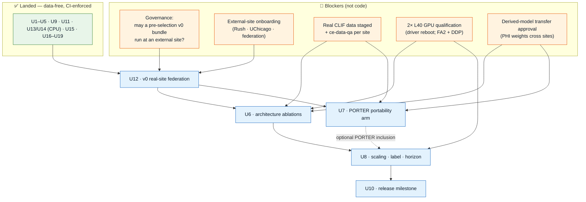
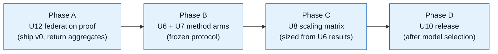

# Project Status & Roadmap

Where the project stands and exactly what is left to finish it. Synced to `main` @ `e7c35b7`
(PR #12 merged). The deep per-unit charter lives in
`docs/plans/2026-08-27-001-feat-evidence-ready-model-experiments-plan.md`; this page is the
finish-line synopsis.

:::tip The headline
**Every data-free, unblocked unit has landed.** The codebase is a complete, tested, CI-enforced,
reproducible methods artifact. What remains is **not code-blocked** — it is gated on **real data,
GPU hardware, and one governance decision.**
:::

---

## What landed vs. what remains

| ✅ Landed (done, CI-enforced) | 🔜 Remaining (gated, not code-blocked) |
|---|---|
| **U1** cohort / anchor / splits / artifact-policy | **U12** v0 real-site federation proof |
| **U2** dataset / targets / collator / document isolation | **U6** core architecture ablations (tied/untied · separate/joint) |
| **U3** objective semantics (threshold / CR / value heads) | **U7** PORTER portability arm (language-grounded vs frozen mCIDE) |
| **U4** training engine / checkpoints / manifest | **U8** scaling · label-efficiency · multi-horizon studies |
| **value-stats** per-concept normalization | **U10** release milestone (after model selection) |
| **U5** evaluation / calibration / validation gate | GPU qualification reports (U13-FA2, U14 on 2× L40) |
| **U9** validator core (`clif-validate/`) | Governance / ops exit criteria |
| **U11** release-trust (Ed25519 · anti-rollback · content-hash approval) | |
| **U13 / U14** varlen attention + resume/DDP (CPU-qualified) | |
| **U15** synthetic federation harness (releaser→site→aggregator) | |
| **U16–U19** CI · reproducible lock · model card · one-command repro | |

---

## The critical path to done

---

## Phased finish

- **Phase A — U12.** Freeze the U5 baseline as a signed **bundle v0** (non-final probe, *not* a
  selection input), ship it through the U11 channel to a real site, return only disclosure-controlled
  aggregates. Runs the federation evidence *before* the expensive method arms.
- **Phase B — U6 + U7 (parallel).** Tied/untied + separate/joint ablations, and the PORTER
  transfer-robustness arm, under a frozen protocol (both selection-rule branches declared up front).
- **Phase C — U8.** The scaling / label-efficiency / multi-horizon matrix, whose cell counts and token
  budgets are set from U6's measured results at the U6 exit review.
- **Phase D — U10.** Release the selected model with a cumulative disclosure ledger maintained across
  all prior releases (the aggregator + ledger are already proven by U15).

---

## The blockers — own these, not the code

| Gate | What it is | Action |
|---|---|---|
| **G1 — pre-selection governance** | May a non-final v0 bundle run at an external site? **Longest-lead item; still unasked.** A "no" reshapes sequencing. | Ask the consortium / IRB **now**. |
| **G2 — site onboarding** | Rush + UChicago + federation running the turnkey `clif-validate` package locally. | Coordinate enrollment + DUAs. |
| **G3 — real data + QA** | Real CLIF tables per site + `ce-data-qa`. MIMIC is staged (546,028 stays / ~134M events); Rush + UChicago are not. | Stage data; run QA. |
| **G4 — GPU qualification** | 2× L40 report: FA2 packed attention, DDP scaling, memory, matrix cost. **`nvidia-smi` driver mismatch — reboot first.** | Reboot; run U13-FA2 + U14. |
| **G5 — transfer approval** | Written approval to reuse PHI-derived weights for transport across sites. | Obtain + record, else U6/U7 run same-site only. |

:::warning The one thing to do first
The **pre-selection governance decision (G1)** is the longest-lead, still-unasked item, and a "no"
reshapes the whole sequence. Ask it before anything else — it gates U12, which gates the method arms.
:::

---

## Definition of done

U12's v0 federation has run at ≥1 real external CLIF site returning disclosure-controlled aggregates;
U6/U7 produced frozen-protocol method evidence; U8 ran the U6-derived scaling matrix on qualified
2× L40 hardware; a model family is selected under U5's frozen rule; U10 released it with a maintained
cumulative disclosure ledger; and every governance/ops exit criterion is recorded closed — with no step
weakening a fail-closed gate or letting raw data leave a node.
