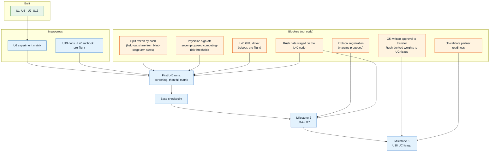

# Project Status & Roadmap

Where the project stands under the three-claim plan
(`docs/plans/2026-10-03-0845-feat-icu-gem-rct-recovery-plan.md`). Synced to the plan's feature
branch at `a63753c` (2026-10-03). The earlier finish-line plan
(`docs/plans/2026-08-27-001-feat-evidence-ready-model-experiments-plan.md`) and its units are
history; its landed infrastructure (release trust, federation harness, CI, reproduction) is
described in [Governance, Trust & Reproducibility](./governance-trust.md).

:::tip[The headline]
**Milestone 1 is nearly code-complete.** The training path, the claims panel and the classical
extubation audit are built and tested on synthetic data. No model has been trained under this
plan, so there is no result for any claim. What remains is the experiment matrix, the L40
runbook and pre-flight, then data, hardware and governance.
:::

---

## What is built vs what is not

Unit numbers are the plan's (U1–U19), not the earlier plan's.

| Built (committed, tested) | Not built yet |
|---|---|
| **U1** three-claim framing; scoped amendment to hard rule 1; corrected citations | **U6** experiment matrix and tokenization arms (in progress) |
| **U2** DDP-safe skipped heads, `no_sync` accumulation, fail-closed CPU guard | **U19** this documentation (in progress), the L40 runbook and the pre-flight command |
| **U3** in-stream time-to-event targets (`gem_tte`) and the threshold registry | **Milestone 2 — U14** time-zero prompts and the leakage probe |
| **U4** curriculum by optimizer update, six objective arms, fixed loss weights | **Milestone 2 — U15** injected-token outcome head |
| **U5** multi-site full-hospitalization training path, rank-aware token-budget sampler, run length in passes, columnar memory-mapped corpus | **Milestone 2 — U16** doubly robust on the frozen state and the known-answer test |
| **U7** CLIF post-24-hour task suite, count and token baselines, frozen probe | **Milestone 2 — U17** extubation-failure risk model (Paper 2) |
| **U8** claims evaluation panel ([Paper 1 claims](./paper-claims.md)) | **Milestone 3 — U18** UChicago site runner |
| **U9** extubation cohort, device arms, trial risk factors | |
| **U10** reintubation, death and composite labels | |
| **U11** clone-censor-weight and doubly robust estimators with diagnostics | |
| **U12** benchmark registry, per-trial emulation, agreement rule, simulation | |
| **U13** go/no-go audit runner with an aggregate-only export | |

Milestone 2 needs a trained base checkpoint. Milestone 3 needs `clif-validate` partner readiness
and the weight-transfer approval.

---

## The critical path

```mermaid
flowchart TB
    subgraph DONE["Built"]
        L["U1–U5 · U7–U13"]
    end
    subgraph NOW["In progress"]
        U6["U6 experiment matrix"]
        U19["U19 docs · L40 runbook · pre-flight"]
    end
    subgraph GATES["Blockers (not code)"]
        G1["Split frozen by hash<br/>(held-out share from blind-stage arm sizes)"]
        G2["Physician sign-off:<br/>seven proposed competing-risk thresholds"]
        G3["Rush data staged on the L40 node"]
        G4["L40 GPU driver<br/>(reboot; pre-flight)"]
        G5["G5: written approval to transfer<br/>Rush-derived weights to UChicago"]
        G6["clif-validate partner readiness"]
        G7["Protocol registration<br/>(margins proposed)"]
    end

    L --> U6 --> RUN["First L40 runs:<br/>screening, then full matrix"]
    U19 --> RUN
    G1 --> RUN
    G2 --> RUN
    G4 --> RUN
    G3 --> RUN
    RUN --> CK["Base checkpoint"]
    CK --> M2["Milestone 2<br/>U14–U17"]
    G7 --> M2
    G3 --> M2
    M2 --> M3["Milestone 3<br/>U18 UChicago"]
    G5 --> M3
    G6 --> M3

    classDef done fill:#e8f5e9,stroke:#2e7d32,color:#0d1b2a;
    classDef gate fill:#fff3e0,stroke:#e65100,color:#0d1b2a;
    classDef work fill:#e3f2fd,stroke:#1565c0,color:#0d1b2a;
    class L done;
    class G1,G2,G3,G4,G5,G6,G7 gate;
    class U6,U19,RUN,CK,M2,M3 work;
```

The first L40 training run needs U1–U8, the audit's blind stage, the frozen split, and the L40
runbook (`docs/plans/l40-runbook.md`) with its pre-flight check.

---

## MIMIC design audit — outcome

The audit's outcome-blind stage has run on local MIMIC
([Extubation application](./extubation-application.md#the-gono-go-audit-srcevalextubation_auditpy)).
It read no outcome by arm.

- **The precision stop rule fires on MIMIC.** Five of the six registered trials fail the
  feasibility screen. Only Casey 2021 is evaluable on all MIMIC patients.
- **Claim 3 therefore depends on Rush.** MIMIC was always exploratory; Rush is the confirmatory
  site, and it is not staged yet.

No outcome rate by device arm appears on this site, and none will before the protocol is
registered.

---

## Known blockers

| Blocker | What it is | Action |
|---------|------------|--------|
| **Rush data not staged** | Only MIMIC is on the L40 node (546,028 stays, about 134M events). Claim 3 is confirmed at Rush, and development needs Rush for power. | Stage under existing governance; point `CLIF_DATA_DIR` at it. |
| **Frozen split and held-out arm sizes** | Model-based extubation estimators use only patients outside the pretraining partition, and the split is baked into every checkpoint. The held-out share (60/15/10/15 today) must be decided from the blind-stage arm sizes and frozen by hash before the first L40 run. | Decide the share; freeze the split. |
| **Competing-risk thresholds** | Three of the ten competing-risk cause thresholds repeat the outcome contract. The other seven in `configs/thresholds.yaml` are proposed defaults. | Physician confirmation before the first L40 run. |
| **Proposed margins** | Every agreement margin, feasibility threshold, stop rule and negative control is `proposed`. | Register the protocol (`docs/protocols/extubation-emulation-protocol.md`). |
| **G5 — weight transfer** | Written approval to transfer Rush-derived weights to UChicago is not obtained. | Obtain and record it. |
| **`clif-validate` partner readiness** | The site package is not ready for the UChicago run, and fitting the classical emulation at a partner site is a new capability that needs its own governance review. | Land the package fixes; review. |
| **MIMIC calendar period** | MIMIC dates are shifted per patient, so the by-period audit table is not evaluable without the MIMIC-IV `anchor_year_group` table. The by-unit table is unaffected. | Stage `anchor_year_group` if the adoption-era contrast is needed on MIMIC. |
| **L40 GPU driver** | `nvidia-smi` fails on a driver/library mismatch; torch CUDA still allocates. | Reboot before long multi-GPU runs; the pre-flight checks it. |
| **No CLIFATRON checkpoint staged** | Needed only for the larger frozen-comparator row. | Does not gate the claims. |

:::warning[Open decisions for the product authority]
- **Claim 1 attribution:** whether the optional attribution arm enters claim 1's rejection rule
  ([Paper 1 claims](./paper-claims.md#claim-1--threshold-aligned-tokenization)).
- **AE6's control value:** MAP below 60 is an edge in the physician segments; the code registers
  MAP 63 as the off-edge control.
- **Discharge rule:** whether `event_free` or `censor` is primary for patients discharged alive
  before day 7.
- **Harmful-side bound:** 1.0 or the equivalence margin.
:::

---

## Definition of done (Milestone 1)

Every Milestone 1 unit's tests pass. A two-process CPU run trains the full objective on the
synthetic site, and a short real-data run trains each tokenization arm on a MIMIC sample. The
experiment matrix prints a launch command for every row, and the edge-distance table shows every
registered control threshold off-edge in every arm. The held-out share is decided and the split
is frozen by hash; the pre-flight refuses to train without it. The audit's blind stage has run on
local MIMIC and produced only suppressed aggregates. The documents describe the code as built,
and no patient-level data, checkpoint or governed artifact is committed.
