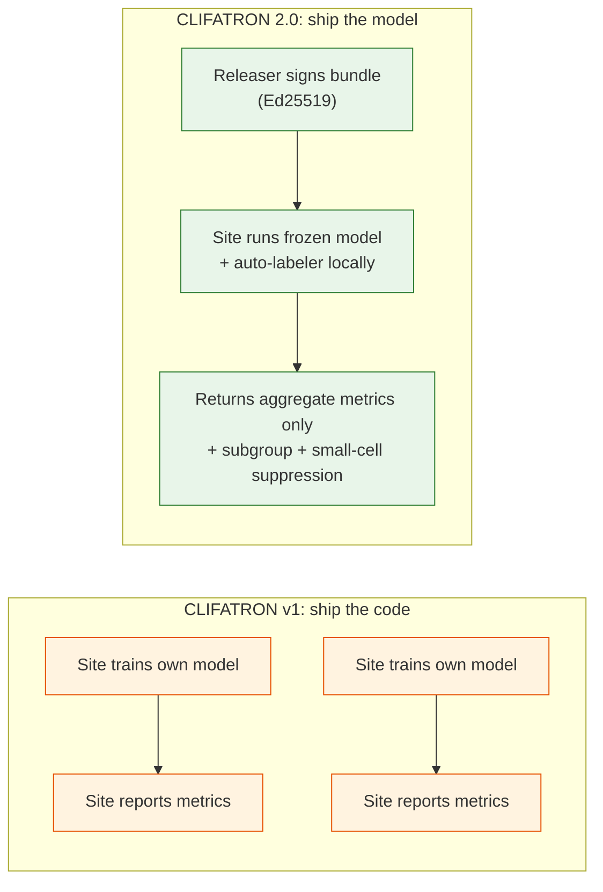

# CLIFATRON v1 → v2 — What changed and why it matters

CLIFATRON v1 (the original CLIF consortium model) and CLIFATRON 2.0 share a vocabulary, a
data format, and the same compact-size thesis. Everything else is different. This page is the
side-by-side.

---

## One-table summary

| Dimension | CLIFATRON v1 | CLIFATRON 2.0 | Why it matters |
|-----------|--------------|---------------|----------------|
| **What it predicts** | Next token (language-model style) | "Will MAP drop below 65 within 48h?" — threshold-conditioned time-to-event | The difference between "this word follows" and "this patient is crashing" |
| **Outcome at inference** | Roll out tokens, then map to a label | Query any (concept, threshold, direction) — answer in one forward pass | Zero-shot: a new hospital asks any clinical question with no retraining |
| **Backbone** | Qwen2-0.5B (fixed) | Qwen3-arch ~30M (primary) OR attach to Qwen2-0.5B (wedge) | Our own ~30M is the compact headline; Qwen2 attach is the cheap first result and an ablation |
| **Architecture** | Qwen2 (RoPE, GQA, RMSNorm) | Qwen3 (same + free QK-Norm) for from-scratch; Qwen2 for attach path | QK-Norm stabilizes pretraining for free — a pure upside swap |
| **Vocabulary** | Clinical-segment-anchored quantile bins | Population **deciles** + **soft discretization** + **forced clinical edges** | Deciles transport across hospitals (0.025 AUROC penalty vs 0.089 for site-specific); soft bins win on the dangerous tails |
| **Tokenization** | `concept` + `value` = two tokens per event | Fused `concept=bin` = one token per event | −34–50% sequence length; mortality AUROC 0.891→0.915 |
| **Time encoding** | Inserted `day_N` / `hour_N` time tokens | Admission-relative **RoPE** (1-minute resolution) | −11% sequence length; matches or beats time tokens on 71/74 tasks; transfers across hospitals |
| **Embeddings** | Tied (input = output weight) | **Untied** (separate input + output) | +4–7% AUPRC, gap **widens under federation** |
| **Training objective** | Next-token prediction (NTP) only | **Marked time-to-event** — competing-risk CIF + threshold hazard + value regression + low-weight NTP | The objective, not the backbone, drives EHR performance (ORA: Transformer +10.7%, Mamba +11.4%) |
| **Curriculum** | None — one objective from step 1 | NTP → TTE (15% warmup, 5% transition) | Stabilizes embeddings before asking survival questions |
| **Loss balancing** | None | Uncertainty weighting (learned per-task 1/2σ²) + grad-norm | Prevents dense mortality signal from starving sparse threshold outcomes |
| **Zero-shot survival** | Not supported — needs local labels | **Training-free** threshold (ICareFM) + competing-risk (SurvivEHR) heads | A consortium hospital runs the frozen model and gets calibrated survival curves with zero local labels |
| **Evaluation** | AUROC / AUPRC on 4 benchmark tasks | **TRIPOD+AI panel**: AUROC, AUPRC, ECE, Brier, calibration slope+intercept, ICI, net benefit (decision-curve analysis), temperature scaling, LPE, subgroup fairness | Journals and regulators demand calibration, net benefit, and fairness — not just discrimination |
| **Competing risks** | Not modeled — death is just "not discharged" | Explicit competing-risk CIF (SurvivEHR discrete-time) | Death is a competing event for discharge, not censoring — treating it as censoring overestimates discharge probability |
| **Value prediction** | Roll out tokens for numeric values | Gaussian mark head (ORA) — predicts continuous value + uncertainty | +33–38% on physiology tasks with calibrated uncertainty |
| **Federation** | Code shipped to site, site runs independently | **Model-to-data**: signed bundle → site runs locally → returns **aggregate + subgroup metrics only** (no raw data, no gradients, no labels) | A CLIF hospital validates the model without sending a single row of PHI anywhere |
| **Governance** | None built in | Ed25519 signed release bundles, revocation, anti-rollback, cumulative disclosure ledger, artifact classification policy, small-cell suppression (n&lt;10) | The trust model, not the encryption, makes multi-site validation feasible with real institutional data |
| **Modality** | Structured events only | Structured events + (v2) **pre-anchor notes** via frozen BioClinical ModernBERT → in-stream soft token | Notes recover 97.1% cross-site AUROC vs 69% drop for frozen-vocab-only models (PORTER 2026) |
| **Selective prediction** | Not supported | Per-outcome deferral confidence — defers uncertain predictions to human review | A safety requirement for clinical deployment |
| **Size** | Qwen2-0.5B (500M params) | **~30M** (d512 × 8L × 8H) with untied embeddings + 4 heads = 33–37M | Fits on one node (2× L40), no cluster — the original compact thesis realized |
| **Data sites** | Developed on MIMIC only | **3-site** (MIMIC, Rush, UChicago) development → **all-CLIF-federation** external validation | External validation across real consortium hospitals, not just a held-out test split |

---

## The real difference: the objective, not the backbone

The single most important difference is **what the model learns to do**.

CLIFATRON v1 is a language model on clinical tokens. It learns "what token follows this
sequence of tokens." To answer a clinical question you either roll out tokens and check the
output (expensive, poorly calibrated) or train a separate classifier on top of the hidden
states (requires per-task labels at every site).

CLIFATRON 2.0 replaces the language-model objective with a **marked time-to-event** stack:

```
Threshold hazard:    P( MAP < 65  within 48h | H_t )   ← zero-shot at inference
Competing-risk CIF:  P( death at bin t | H_t )          ← zero-shot at inference
Value regression:    predict creatinine = μ ± σ          ← calibrated Gaussian mark
Next-event (aux):    P( token_t+1 | H_t )                ← low-weight, 20%
```

The threshold head — ICareFM's core idea — is what makes one small model answer many outcomes
without retraining. At inference you compose:

```
Circulatory failure risk = P(MAP < 65 within h) · P(Lactate > 2 within h)
```

That product, computed from a single forward pass, answers a clinical question that v1 could
only approximate with expensive Monte-Carlo token rollout and per-task classifiers.

---

## Tokenization: fused deciles + soft bins vs clinical segments

**v1** bins each concept by clinical-reference-range segments (e.g. "high K⁺ = 5.5–6.0 mEq/L").
These are intuitively meaningful but **site-specific** — Rush's patient mix produces different
segment occupancies than MIMIC's, so the token distribution shifts and the model degrades on
transfer.

**v2** bins by **population deciles frozen on one reference site** (MIMIC). This is counter-
intuitive — clinically arbitrary cutpoints — but Lee (arXiv:2604.16775) tested both at matched
granularity and found **no consistent advantage for clinical anchoring**. What deciles win on:
they produce balanced token frequencies (every bin gets ~10% of the data), they transport
nearly perfectly across sites (Federated GEMs: 0.025 AUROC cross-site penalty vs 0.089
LightGBM), and the **soft discretization** (Gaussian-weight spread to adjacent bins) makes the
model sensitive on the physiologically dangerous tails — the very bins clinical-reference-range
schemes compress into rare, under-trained edge tokens.

We keep clinical thresholds as **guaranteed bin edges** — lactate 2.0 & 4.0, MAP 65, SpO₂ 88/90,
KDIGO thresholds — so the threshold-hazard head can ask about them. But the overall scheme is
deciles, not segments.

---

## Federation: model-to-data, not ship-the-code

The federation model in v1 is implicit: ship the training code, each site trains its own
model, compare results in a meta-analysis. This works when every site has engineers and labels.

v2's federation is the headline artifact: a **signed, governed package** that any CLIF site can
run without ML expertise, without sharing data, and without producing local labels.



The difference is not technical — it is **organizational**. A v1 multi-site study requires
every site to have a GPU, a Python environment, and someone who can debug a training run.
A v2 validation requires `clifpy` and two `uv run` commands. That is the difference between
"the consortium could do this" and "the consortium actually does this."

---

## What stayed the same

| Thing | v1 | v2 | Why kept |
|-------|----|----|----------|
| Data format | CLIF 2.1 parquet | CLIF 2.1 parquet | The consortium standard |
| Vocabulary | mCIDE | mCIDE | Frozen across sites — the transfer guarantee |
| Backbone family | Qwen2 transformer | Qwen3 (or Qwen2 for attach) | Objective, not backbone, is the lever (ORA) |
| Treatment rule | Treatments are inputs, not targets | Treatments are inputs, not targets | Non-negotiable clinical safety rule |
| Sequence packing | Document isolation via position IDs | Document isolation via position IDs (FA2) | Proven on CLIFATRON's Qwen2 path |
| Open tooling | MIT license, PyPI | MIT license, PyPI | Consortium-wide accessibility |

---

## What the papers will say

> **v1 paper (2025):** "CLIFATRON: a compact CLIF-native ICU foundation model using next-token
> prediction on structured EHR data. We demonstrate competitive AUROC on 4 benchmark tasks."

> **v2 paper (2026):** "CLIFATRON 2.0 replaces next-token prediction with a threshold-conditioned
> time-to-event objective, enabling zero-shot multi-outcome survival queries from a single
> ~30M-parameter model. Validated across 3 development and N external CLIF-consortium hospitals
> via model-to-data federation with full TRIPOD+AI calibration, decision-curve, and fairness
> reporting."

v2 does not claim a better backbone, a bigger model, or a novel loss function. It claims an
**integration** — the first CLIF-native model that answers a clinician's question directly,
without local labels, and validates across real hospitals without sharing data. That is the
difference between a research artifact and a deployable clinical tool.

---

## Read next

1. **[Architecture →](./architecture.md)** — backbone + four heads
2. **[Objectives & Training →](./objectives-training.md)** — the marked-TTE loss stack
3. **[Method 3 Wedge →](./method3-wedge.md)** — the smallest publishable unit
4. **[Federated Validation →](./federated-validation.md)** — model-to-data across the CLIF consortium