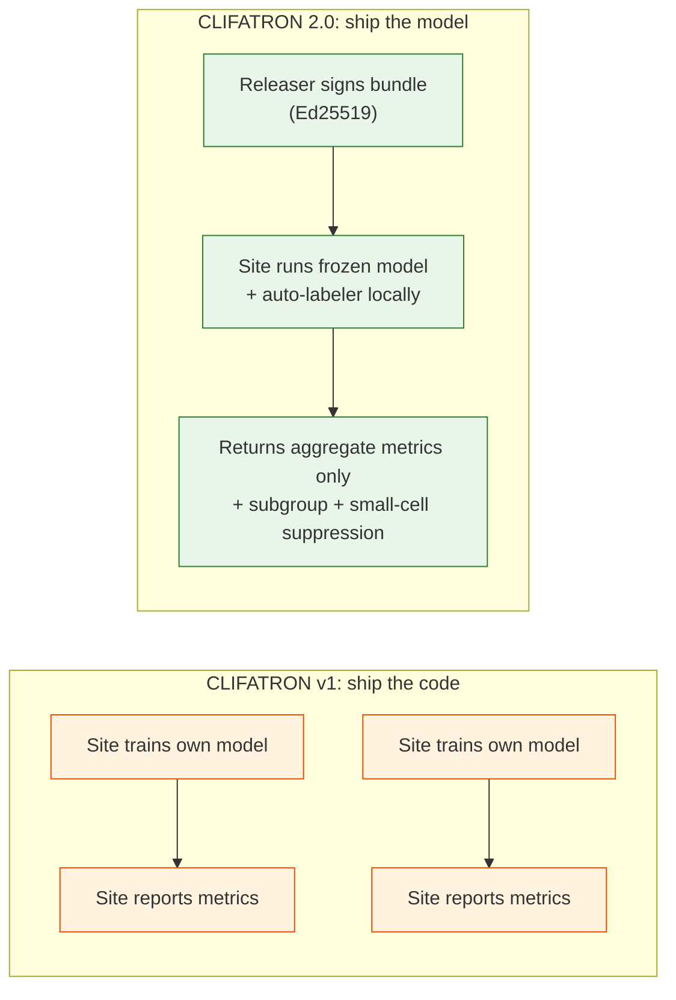

# CLIFATRON v1 → v2 — What changed and why it matters

CLIFATRON v1 (the original CLIF consortium model, a 0.5B Qwen2) and CLIFATRON 2.0 share the
physician-designed bin design, the mCIDE vocabulary, and the CLIF data format. Everything else is
different, including the token strings themselves. This page is the side-by-side; the canonical
tokenizer spec is **[Data & Tokenization](./data-tokenization.md)**.

---

## One-table summary

| Dimension | CLIFATRON v1 | CLIFATRON 2.0 | Why it matters |
|-----------|--------------|---------------|----------------|
| **What it predicts** | Next token (language-model style) | "Will MAP drop below 65 within 48h?" — threshold-conditioned time-to-event | The difference between "this word follows" and "this patient is crashing" |
| **Outcome at inference** | Roll out tokens, then map to a label | Query any (concept, threshold, direction) — answer in one forward pass | Zero-shot: a new hospital asks any clinical question with no retraining |
| **Backbone** | Qwen2-0.5B (fixed) | **Qwen2-arch ~30M from scratch** (primary) OR attach to CLIFATRON's Qwen2-0.5B (wedge, a larger comparator) | Our own ~30M is the compact headline; the Qwen2-0.5B attach is the cheap first result and half of the finetune-vs-scratch ablation |
| **Architecture** | Qwen2 (RoPE, GQA, RMSNorm) | Qwen2-arch from scratch: standard pre-norm, RMSNorm, SwiGLU, time-aware RoPE, plain multi-head attention (no GQA), **no QK-Norm**. Qwen3-arch (QK-Norm) is a measured ablation row only | "Qwen2 vs Qwen3" becomes a quantified finding, not an assertion |
| **Vocabulary / Binning** | Physician-designed clinical segments from the CLIF consortium CSV (1268 segment rows), intervals `(a, b]` | **Same physician-designed CSV KEPT from v1** as the primary scheme, with the CSV's interval flags honored (`(a, b]` stays `(a, b]`) under a published precedence policy, and **every numeric concept binned**: CSV segments where the CSV defines the concept, else one bin per value for ordinal scales (GCS, RASS, Braden), else frozen quantile bins; every dose has a zero bin. Additions: soft discretization (Gaussian weight to adjacent bins), forced clinical-threshold edges with outcome-direction closure (lactate 2/4, MAP 65, SpO₂ 88/90, creatinine 1.5/2/3), and a frozen, hash-verified vocab ([bin assignment rule](./data-tokenization.md#bin-assignment-rule)). Population deciles retained as the `decile_ablation` arm only | The clinical-expert bin design is preserved — it encodes measurement-density domain expertise that data-driven deciles cannot recover. v2 adds soft smoothing and forced edges but does not replace the consortium's bin design |
| **Tokenization** | v1 `tokenETL`: one token per event, with the interval in the string (`labs_lactate_(2.0,2.2]`) via `bin_numeric_values_with_intervals_by_category` | Our own single-file `src/data/tokenize.py` (v1 `tokenETL` is vendored but not executed): one token per event as `concept=bin` (`lactate=6`), plus soft discretization (Gaussian spread to ±1 neighbor bin) and ICU-admission-relative minute RoPE (replacing inserted `day_N`/`hour_N` time tokens) | **Different vocabularies, not interchangeable**: a v2 shard cannot feed the v1 checkpoint, or vice versa ([two token streams](./data-tokenization.md#8--two-token-streams-from-scratch-vs-the-wedge)). What is shared is the bin-design CSV and the one-token-per-event idea |
| **Event coverage** | Labs, vitals, med **doses** (weight-normalized dose bins), ventilator **settings** (FiO₂, PEEP, tidal volume, …), assessments (GCS, RASS), therapies, demographics, comorbidities | Labs, vitals, continuous and intermittent med **doses** (weight-normalized via an availability-safe weight join, zero bin for stops), the 17 ventilator **settings** plus device / mode, assessments (GCS, RASS, Braden, CAM, SBT), CRRT and ECMO/MCS settings, code status, proning, ADT location, and static admission tokens (age decile, sex, race, ethnicity, admission type). Comorbidities and SOFA not yet emitted | v2 now sees *how much* norepinephrine runs, not only *that* it runs ([source tables](./data-tokenization.md#1--source-tables-and-roles)) |
| **Time encoding** | Inserted `day_N` / `hour_N` time tokens | ICU-admission-relative **RoPE** (minutes since ICU admission) | −11% sequence length; matches or beats time tokens on 71/74 tasks; transfers across hospitals |
| **Embeddings** | Tied (input = output weight) | **Untied** (separate input + output) | +4–7% AUPRC, gap **widens under federation** |
| **Training objective** | Next-token prediction (NTP) only | **Marked time-to-event** — competing-risk CIF + threshold hazard + value regression + low-weight NTP | The objective, not the backbone, drives EHR performance (ORA: Transformer +10.7%, Mamba +11.4%) |
| **Curriculum** | None — one objective from step 1 | NTP → TTE (15% warmup, 5% transition) | Stabilizes embeddings before asking survival questions |
| **Loss balancing** | None | Uncertainty weighting (learned per-task 1/2σ²) + grad-norm | Prevents dense mortality signal from starving sparse threshold outcomes |
| **Zero-shot survival** | Not supported — needs local labels | **Training-free** threshold (ICareFM) + competing-risk (SurvivEHR) heads | A consortium hospital runs the frozen model with no local training or manual annotation. Scoring it still uses labels the site auto-derives locally from its CLIF fields |
| **Evaluation** | AUROC / AUPRC on 4 benchmark tasks | **TRIPOD+AI panel**: AUROC, AUPRC, ECE, Brier, calibration slope+intercept, ICI, net benefit (decision-curve analysis), temperature scaling, LPE, subgroup fairness | Journals and regulators demand calibration, net benefit, and fairness — not just discrimination |
| **Competing risks** | Not modeled — death is just "not discharged" | Explicit competing-risk CIF (SurvivEHR discrete-time) | Death is a competing event for discharge, not censoring — treating it as censoring overestimates discharge probability |
| **Value prediction** | Roll out tokens for numeric values | Gaussian mark head (ORA) — predicts continuous value + uncertainty | +33–38% on physiology tasks with calibrated uncertainty |
| **Federation** | Code shipped to site, site runs independently | **Model-to-data**: signed bundle → site runs locally → returns **aggregate + subgroup metrics only** (no raw data, no gradients, no labels) | A CLIF hospital validates the model without sending a single row of PHI anywhere |
| **Governance** | None built in | Ed25519 signed release bundles, revocation, anti-rollback, cumulative disclosure ledger, artifact classification policy, small-cell suppression (n&lt;10) | The trust model, not the encryption, makes multi-site validation feasible with real institutional data |
| **Modality** | Structured events only | Structured events + (v2) **pre-anchor notes** via frozen BioClinical ModernBERT → in-stream soft token | Notes add clinical context the structured stream lacks; only pre-anchor notes are features (Rule 3). Separately, PORTER 2026 shows frozen-vocab models drop ~69% of events cross-site while language-grounded **codes** recover 97.1% AUROC — the motivation for the TextCode tokenization arm, not for notes |
| **Selective prediction** | Not supported | Per-outcome deferral confidence — defers uncertain predictions to human review | A safety requirement for clinical deployment |
| **Size** | Qwen2-0.5B (500M params) | **~30M** (d512 × 8L × 8H) with untied embeddings + 4 heads = 33–37M | Fits on one node (2× L40), no cluster — the compact thesis realized |
| **Data sites** | Developed on Site 1 only | **3-site** (Site 1, Site 2, Site 3) development → **all-CLIF-federation** external validation | External validation across real consortium hospitals, not just a held-out test split |

---

## The real difference: the objective, not the backbone

The single most important difference is **what the model learns to do**.

CLIFATRON v1 is a language model on clinical tokens. It learns "what token follows this
sequence of tokens." To answer a clinical question you either roll out tokens and check the
output (expensive, poorly calibrated) or train a separate classifier on top of the hidden
states (requires per-task labels at every site).

CLIFATRON 2.0 replaces the language-model objective with a **marked time-to-event** stack:

```text
Threshold hazard:    P( MAP < 65  within 48h | H_t )   ← zero-shot at inference
Competing-risk CIF:  P( death at bin t | H_t )          ← zero-shot at inference
Value regression:    predict creatinine = μ ± σ          ← calibrated Gaussian mark
Next-event (aux):    P( token_t+1 | H_t )                ← low-weight, 20%
```

The threshold head — ICareFM's core idea — is what makes one small model answer many outcomes
without retraining. At inference you compose:

```text
Circulatory failure risk = P(MAP < 65 within h) · P(Lactate > 2 within h)
```

That product, computed from a single forward pass, answers a clinical question that v1 could
only approximate with expensive Monte-Carlo token rollout and per-task classifiers.

---

## Tokenization: clinical segments preserved as the primary scheme

This is the single most important detail that distinguishes CLIFATRON 2.0 from generic EHR
foundation models — and the reason the v1 clinical team's work was not discarded.

**v1** bins each concept by clinician-designed segments: normal range subdivided into
measurement-density-aware intervals, above/below ranges with progressively wider intervals,
and extreme-value quintiles at the tails. For lactate, this is 15 bins — not 10 — with
tighter intervals around the 2.0 decision threshold and five extreme-value bins above 5.4
(v2 forces an extra edge at 4.0, giving 16). This binning encodes domain expertise that data-driven methods cannot recover.

**v2 binning — primary scheme and the ablation that tests it.** The primary scheme (revised
2026-09-02) is physician-designed clinical segments
(`configs/data.yaml → value_binning.scheme: clinical_segment`), built from the CSV of 1268
physician-designed segment rows (`critical_illness_tokenization_final_with_intervals.csv`). Since
tokenizer v2 (2026-10-02) every numeric concept is binned; the 10 target concepts carry 186
numeric tokens. Population **deciles** are the `decile_ablation` arm over the same concept set:
Lee 2026 found reference-range anchoring buys no consistent gain over deciles *at matched
granularity*, so the arm measures this on CLIF data rather than asserting it. The ablation runs
end to end, but no result exists yet
([§9](./data-tokenization.md#9--tokenization-ablation)). On top of the bin
design, v2 adds:

- **Soft discretization** (Gaussian-weight spread to adjacent bins), so a lactate of 2.1 puts most
  of its mass on its own `(2, 2.2]` bin and some on the neighboring `(1.6, 2]` and `(2.2, 2.7]`
  bins, rather than quantizing to exactly one. This makes the model **most sensitive at the
  boundaries clinicians care about** — the very place hard bin edges lose information.
- **Forced clinical thresholds as guaranteed bin edges** — the CSV already has lactate 2.0, MAP 65
  and SpO₂ 88/90 as boundaries; v2 adds lactate 4.0 and creatinine 1.5/2.0/3.0, so the
  threshold-hazard head's query thresholds always align with real bin edges.

Kept from v1 rather than added: **one token per event** (fused concept + bin), which cuts sequence
length ~34–50% versus separate concept and value tokens.

Clinical-segment binning is the default. Population deciles — which trade domain structure for
balanced token frequency — are kept as an **ablation arm only** to measure what the clinical
expertise buys. We expect the clinical-segment scheme to win on the outcomes that matter:
calibrated threshold queries at exactly the decision points doctors use.

---

## Federation: model-to-data, not ship-the-code

The federation model in v1 is implicit: ship the training code, each site trains its own
model, compare results in a meta-analysis. This works when every site has engineers and labels.

v2's federation is the headline artifact: a **signed, governed package** that any CLIF site can
run without ML expertise, without sharing data, and without manual annotation (evaluation labels
are auto-derived locally from standard CLIF fields).


```mermaid
flowchart LR
    subgraph v1 ["CLIFATRON v1: ship the code"]
        S1_code["Site trains own model"] --> S1_res["Site reports metrics"]
        S2_code["Site trains own model"] --> S2_res["Site reports metrics"]
    end

    subgraph v2 ["CLIFATRON 2.0: ship the model"]
        REL["Releaser signs bundle<br/>(Ed25519)"] --> SITE["Site runs frozen model<br/>+ auto-labeler locally"]
        SITE --> AGG["Returns aggregate metrics only<br/>+ subgroup + small-cell suppression"]
    end

    classDef old fill:#fff3e0,stroke:#e65100;
    classDef new fill:#e8f5e9,stroke:#2e7d32;
    class S1_code,S2_code,S1_res,S2_res old;
    class REL,SITE,AGG new;
```

The difference is not technical — it is **organizational**. A v1 multi-site study requires
every site to have a GPU, a Python environment, and someone who can debug a training run.
A v2 validation requires the `clif-validate` package and two runs (a draft, then the approved release). That is the difference between
"the consortium could do this" and "the consortium actually does this."

---

## What stayed the same

| Thing | v1 | v2 | Why kept |
|-------|----|----|----------|
| Data format | CLIF 2.1 parquet | CLIF 2.1 parquet | The consortium standard |
| Vocabulary | mCIDE | mCIDE | Frozen across sites — the transfer guarantee |
| Backbone family | Qwen2 transformer (0.5B) | Qwen2-arch (~30M from scratch; Qwen2-0.5B for attach); Qwen3-arch as an ablation row | Objective, not backbone, is the lever (ORA) |
| Treatment rule | Treatments are inputs, not targets | Treatments are inputs, not targets | Non-negotiable clinical safety rule |
| Sequence packing | Document isolation via position IDs | Document isolation via position IDs (FA2) | Proven on CLIFATRON's Qwen2 path |
| Open tooling | MIT license, PyPI | MIT license, PyPI | Consortium-wide accessibility |

---

## What the papers will say

> **v1 paper (2025):** "CLIFATRON: a CLIF-native ICU foundation model (Qwen2-0.5B) using next-token
> prediction on structured EHR data. We demonstrate competitive AUROC on 4 benchmark tasks."

> **v2 paper (2026):** "CLIFATRON 2.0 replaces next-token prediction with a threshold-conditioned
> time-to-event objective, enabling zero-shot multi-outcome survival queries from a single
> ~30M-parameter model. Validated across 3 development and N external CLIF-consortium hospitals
> via model-to-data federation with full TRIPOD+AI calibration, decision-curve, and fairness
> reporting."

v2 does not claim a better backbone, a bigger model, or a novel loss function. It claims an
**integration** — the first CLIF-native model that answers a clinician's question directly,
without local training labels, and validates across real hospitals without sharing data. That is the
difference between a research artifact and a deployable clinical tool.

---

## Read next

1. **[Data & Tokenization →](./data-tokenization.md)** — the canonical tokenizer spec
2. **[Architecture →](./architecture.md)** — backbone + four heads
3. **[Objectives & Training →](./objectives-training.md)** — the marked-TTE loss stack
4. **[Method 3 Wedge →](./method3-wedge.md)** — the smallest publishable unit
5. **[Federated Validation →](./federated-validation.md)** — model-to-data across the CLIF consortium